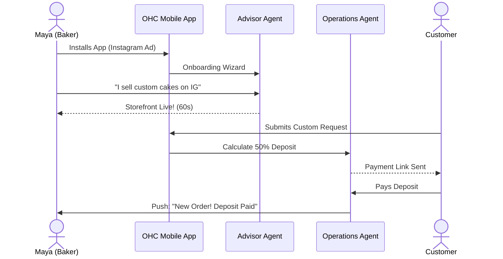
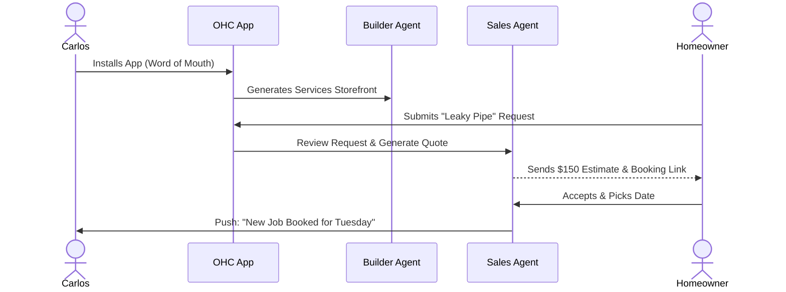
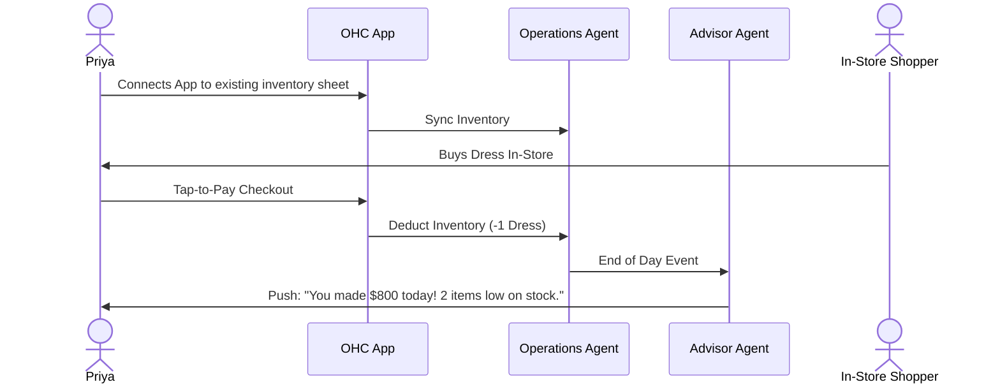
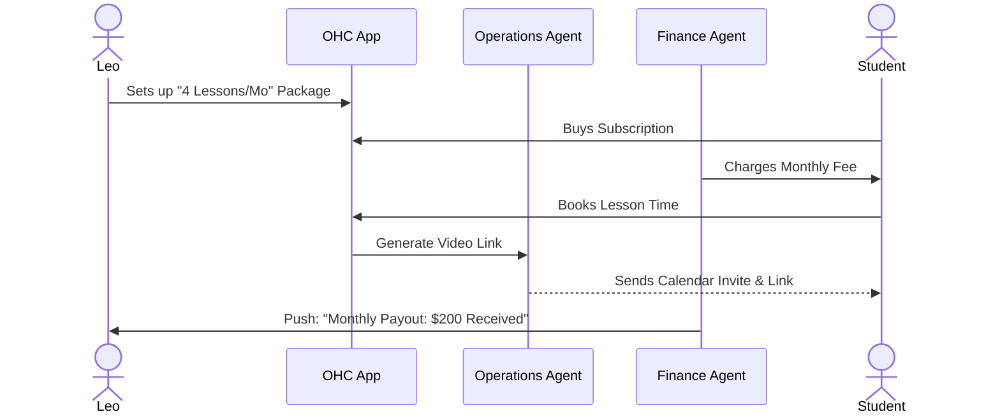
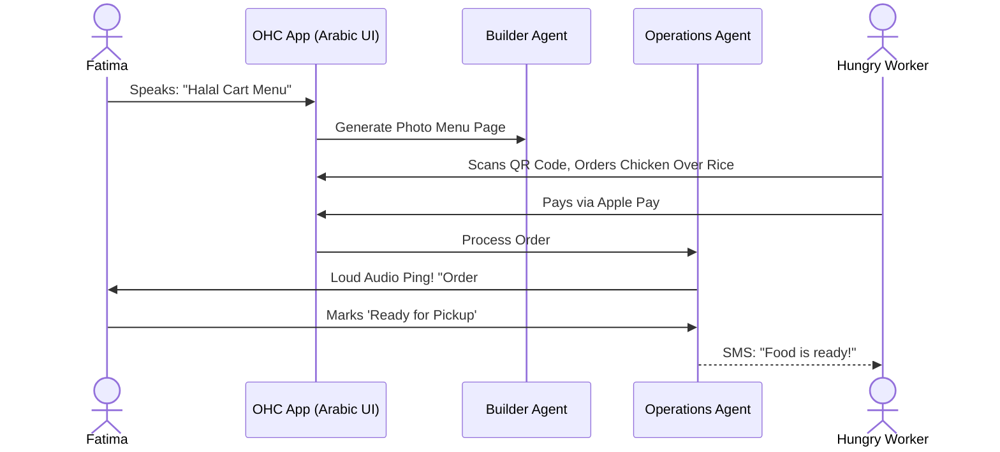

# OHC "One Path" Business Journey Architecture

## Title
Architectural Mapping of the End-to-End Business Journey for OHC Personas

## Problem Statement
Small business owners (Maya, Carlos, Priya, Leo, Fatima) have vastly different physical operations but share a common digital goal: they need their online business to run itself so they can focus on their craft. Currently, the overarching business journeys—from initial acquisition to sustainable revenue generation and referral loops—are fragmented. If Maya is stuck linking a domain name during setup, she drops out. If Carlos has to manually copy-paste booking links to his clients, OHC has failed. We need a unified architectural map of the end-to-end user journeys to ensure the system naturally supports their progression through Acquisition, Onboarding, Activation, Retention, Revenue generation, and Referral, minimizing friction and relying on invisible AI agents to handle the complexity.

## Research Report
### Context and Personas
The business journey must support the following core personas seamlessly:
1.  **Maya (Home Baker, 28)**: Needs a mobile-first storefront, Instagram integration, order management with deposit payments, and AI handling direct messages.
2.  **Carlos (Handyman, 42)**: Requires clean service listings, a robust booking system with deposits, a unified customer inbox, and an AI quote generator.
3.  **Priya (Boutique Owner, 35)**: Wants omnichannel support (in-store/online), POS integration (tap-to-pay), inventory sync, and actionable daily analytics.
4.  **Leo (Music Tutor, 22)**: Needs subscription-based packages, schedule syncing, automated meeting links, and a strong public profile (link-in-bio).
5.  **Fatima (Food Cart Operator, 50)**: Prioritizes extreme simplicity, pre-order management, multi-language UI, and fast low-data mobile performance.

### Competitor Analysis
- **Shopify**: Excellent activation, but high cognitive load during onboarding (too many settings, confusing app ecosystem). Requires desktop for deep configuration.
- **Wix/Squarespace**: Good for building static portfolios, but poor for mobile-first operational management (booking, invoicing, inventory).
- **Square**: Strong point-of-sale, but weak "link-in-bio" or online booking features unless navigating complex dashboards.
- **OHC Unfair Advantage**: We offer *zero* cognitive load. Onboarding asks "What do you do?" and generates the storefront, configures the payment gateway, and sets up the AI agents in under 10 minutes, all from a mobile phone.

## Design Doc

### Journey Mapping (Mermaid.js Sequence Diagrams)

#### Journey 1: Maya (Home Baker) - The Product Pre-Order Flow

#### Journey 2: Carlos (Handyman) - The Quote & Booking Flow

#### Journey 3: Priya (Boutique Owner) - The Omnichannel Flow

#### Journey 4: Leo (Music Tutor) - The Subscription Flow

#### Journey 5: Fatima (Food Cart) - The Fast Pre-Order Flow

### UI Wireframes Description (Mobile-First 375px)
- **Onboarding (Screen 1):** Large text, friendly greeting. "Let's get your business online." One large text input box: "Describe your business in one sentence." Microphone icon for voice input. Soft blurred background (Glassmorphism).
- **Activation (Screen 2 - "The Reveal"):** A skeleton loading screen transitions into a fully populated mobile storefront. Confetti animation. Prominent CTA: "Connect Bank to Go Live."
- **Dashboard (Screen 3 - Retention):** Clean card layout. "Today's Agenda" generated by the Advisory Agent. "1 New Message", "2 Orders to Fulfill". Minimal navigation bar (Home, Store, Inbox, Settings).

### Mobile UX Flow
1. **Acquisition**: User taps Instagram Ad -> Lands on App Store -> Installs.
2. **Onboarding**: "Smart Builder" chat interface instead of a traditional form. Voice-to-text enabled.
3. **Activation**: The user experiences a "Wow" moment seeing their fully branded store instantly. The only friction point introduced is KYC/Bank connection, handled via a seamless Stripe modal.
4. **Retention**: The app becomes a daily habit via the "Daily Briefing" push notification (e.g., "Good morning Maya, you have 2 cake pickups today").

### AI Agent Integration Points
- **The Advisor (Onboarding & Revenue):** Analyzes the initial input to categorize the business and select the right template/features. Monitors revenue and suggests upgrades naturally.
- **The Builder (Acquisition & Activation):** Dynamically generates the storefront layout, copy, and placeholder images based on the Advisor's categorization.
- **The Operations Agent (Retention):** Handles the grunt work: calculating deposits, sending payment links, updating inventory, and sending fulfillment notifications to customers.
- **The Ambassador (Referral):** Automatically sends a follow-up email/SMS to the customer 24 hours after an order is fulfilled, asking for a review or offering a discount code for referrals.

### Key Design Decisions
1. **Chat-Based Onboarding:** We replace complex forms with a conversational interface. Non-technical users are comfortable messaging; they are intimidated by settings dashboards.
2. **"Born Live" Stores:** The storefront is generated and published instantly to an OHC subdomain. We defer custom domain configuration until the user is already generating revenue and wants to upgrade.
3. **Proactive Mobile Notifications:** Users do not need to open the app to check for orders. The Operations Agent pushes actionable notifications (e.g., "Accept Order") directly to the lock screen.

## Implementation Prompt
**Task**: Implement the conversational onboarding flow ("The Smart Builder Wizard").
**Outcome**: A mobile-first (375px) chat UI where a user describes their business in a single text/voice input, and the app instantly provisions a basic tenant environment, selects a template, and displays a preview of their live storefront.
**CUJ (Critical User Journey)**:
1. User opens app for the first time.
2. User enters: "I sell vegan cupcakes from my home."
3. App displays a loading animation ("Analyzing... Building...").
4. App presents a pre-filled storefront with a "Food & Beverage" layout.
5. User taps "Looks Good" and is prompted to connect their bank.
**Acceptance Criteria**:
- Must use existing Slint UI components.
- Must implement Glassmorphism aesthetic.
- Must handle network loading states gracefully.
- Do not prescribe the exact backend AI routing or database schema; focus on the frontend wizard and orchestrator trigger.

## Priority
`P0`

## Estimated Scope
`Medium`
