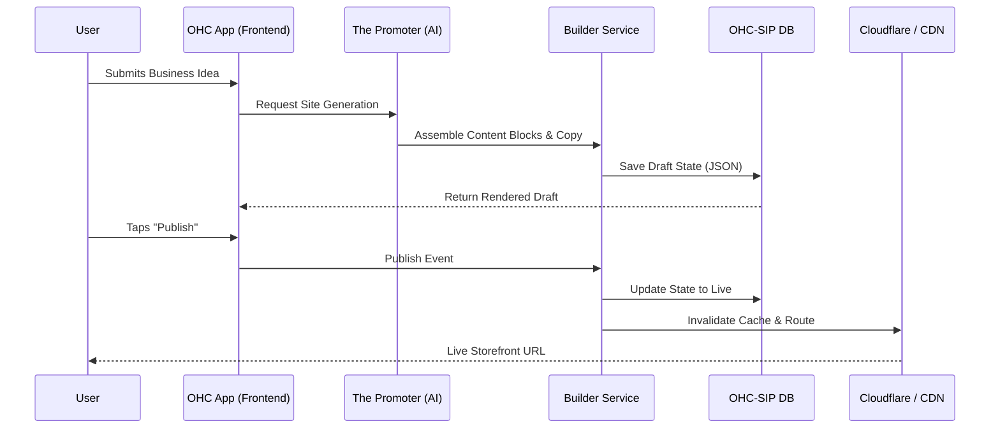

# Issue Brief: Drag-and-Drop Website & Storefront Builder Architecture

## Title
Website & Storefront Builder Architecture

## Problem Statement
Small business owners (like Maya the Baker or Carlos the Handyman) need a beautiful, functional online presence but lack technical skills. Existing platforms (Shopify, Wix, Squarespace) require a steep learning curve, technical jargon, and time-consuming manual setup. Users need a mobile-first, zero-code storefront builder where AI handles the heavy lifting of design, content generation, and layout, allowing them to go from idea to live business in under 10 minutes.

## Research Report
- **Competitive Landscape**:
  - **Shopify**: Powerful but complex. Geared towards semi-technical users or larger SMBs. Requires 30-60 mins of setup.
  - **Wix/Squarespace**: Offers AI tools but still demands manual tweaking and relies on complex desktop editors. Not truly mobile-first.
  - **GoDaddy**: Basic templates, faster setup, but limited functionality and aesthetic appeal.
- **Pain Points**: Non-technical users struggle with responsive design, image optimization, SEO, and organizing content effectively.
- **Opportunity**: OHC's builder will be distinct by being radically simple, natively mobile-first (375px baseline), and leveraging "The Promoter" AI agent to generate the initial site, write copy, and continuously optimize for SEO.

## Design Doc
### Key Architectural Decisions
- **Mobile-First Editing**: The builder must be fully functional on a 375px screen. The desktop view is an additive experience.
- **Component-Based Model**: Pages are composed of semantic content blocks (Hero, Product Grid, Testimonials, Booking Calendar, Contact Form).
- **AI-Driven Generation**: "The Promoter" agent pre-fills content based on initial onboarding answers (business type, target audience, tone).
- **Zero-Friction Publishing**: 1-click publish from draft to live. Automatic SSL provisioning and OHC subdomain assignment (custom domains on higher tiers).
- **Automated SEO**: Meta tags, sitemap generation, and schema markup are handled invisibly by the backend.

### UI Wireframes & Screen Flow (375px)
- **Step 1: AI Prompt**: "Describe your business in one sentence" (e.g., "I bake custom vegan cakes in Austin").
- **Step 2: Generating State**: Loading screen with subtle motion showing AI assembling blocks.
- **Step 3: Preview & Edit**: Mobile view of the generated site. Users can tap a block to edit text, swap images, or reorder sections via a simple up/down control.
- **Step 4: Live**: "Publish" button triggers deployment and shows the live URL.

### Architecture Diagram

### AI Agent Integration
- **The Promoter** (Marketing & Advertising) acts as the primary driver here. It interprets the user's intent, selects the best template structure, writes initial copy, and selects relevant stock imagery (or prompts for user uploads).

## Implementation Prompt
"Implement the foundational data model and API endpoints for the Website & Storefront Builder. Create the backend service to store page structures as semantic JSON blocks, supporting drafts and live versions. Build the API contract for 'The Promoter' AI agent to inject initial site structures. Develop the mobile-first Flutter UI components for viewing and basic reordering of these blocks on a 375px screen. Ensure 1-click publishing updates the site state and triggers the necessary routing updates."

## Priority
P0

## Estimated Scope
Large
