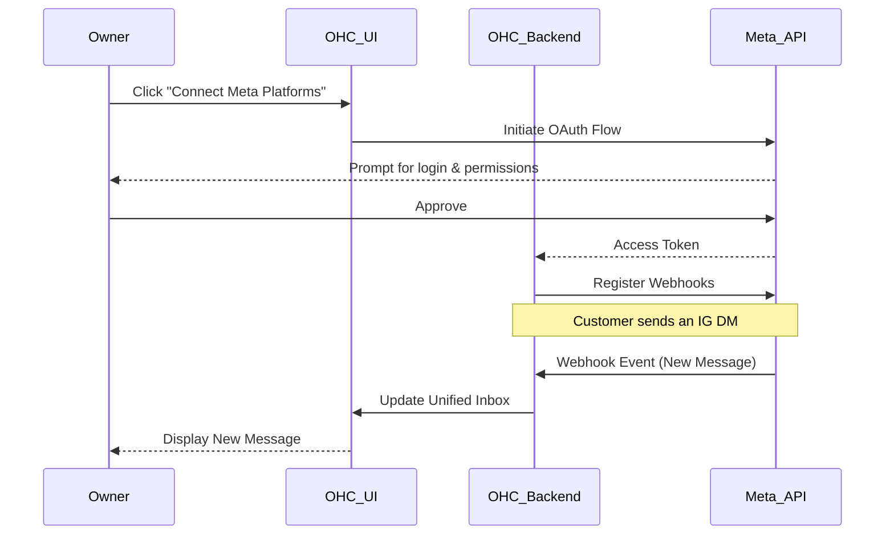
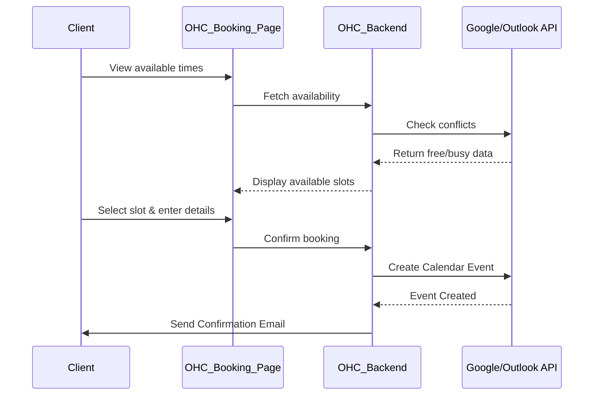
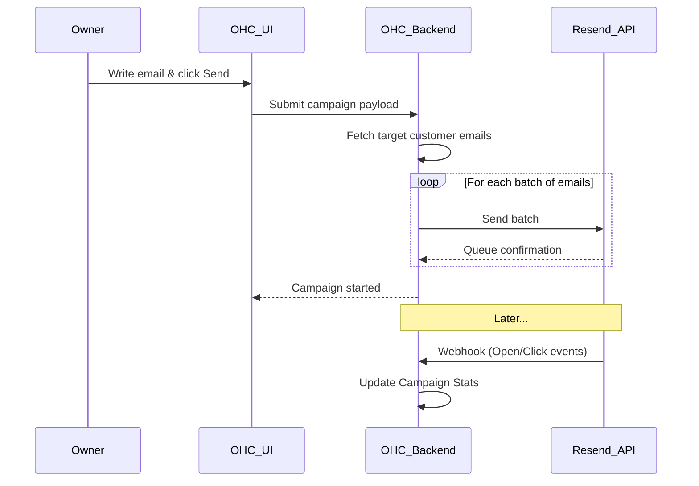
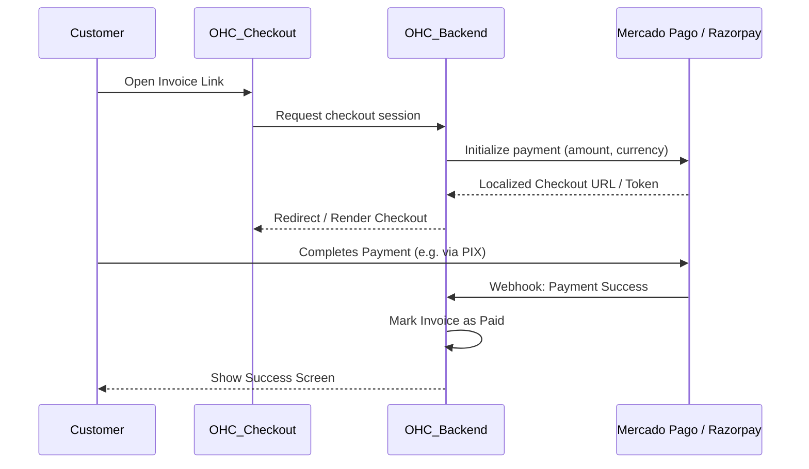
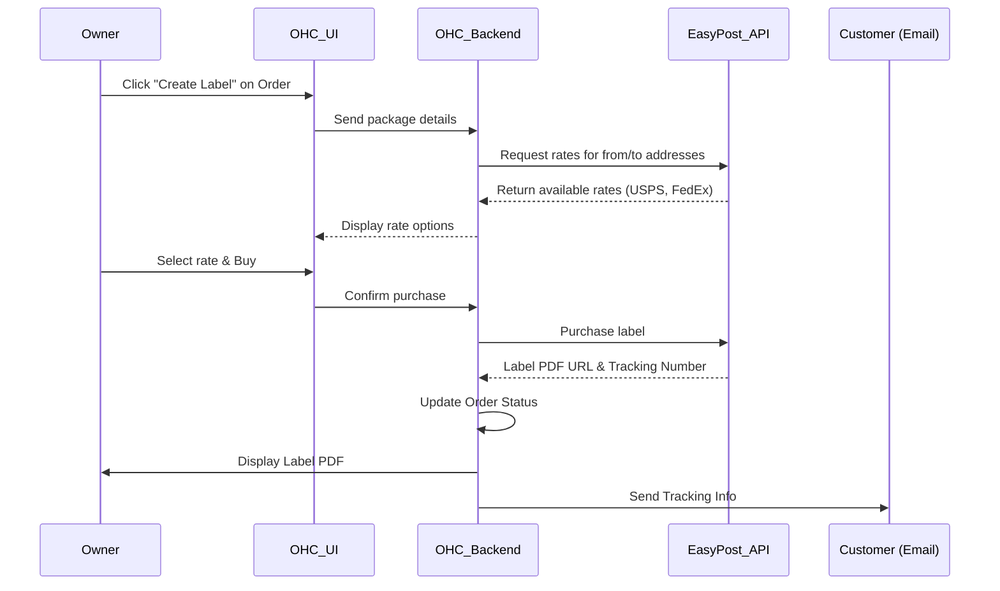
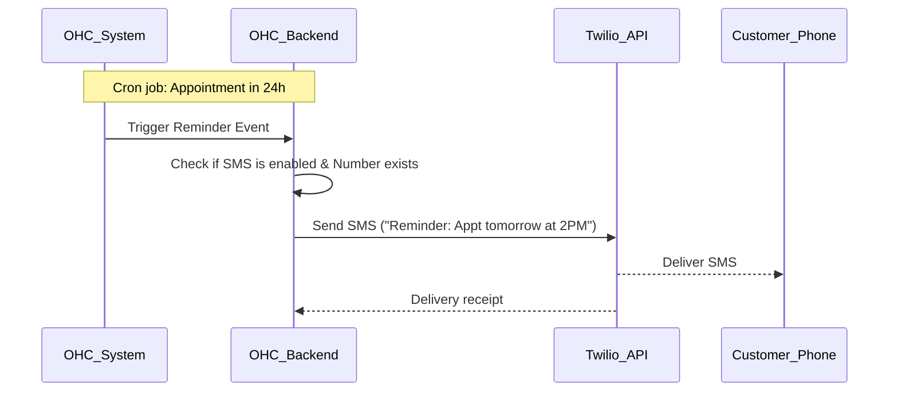
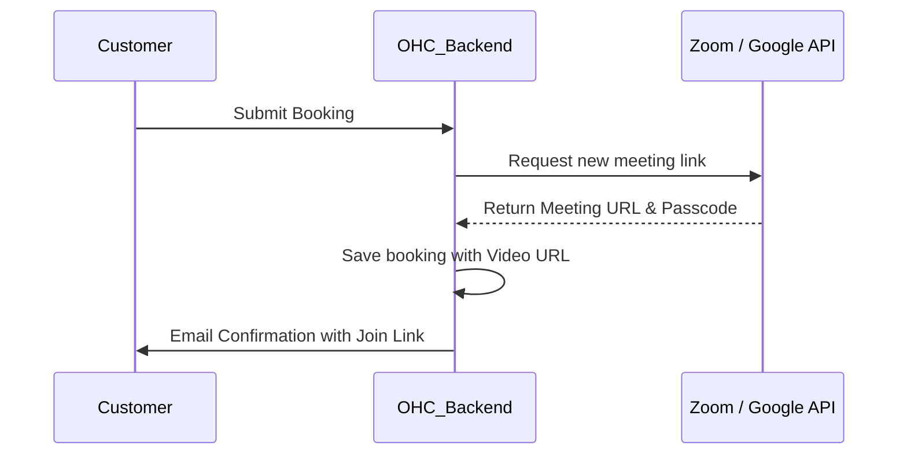

# [Social Media] Unified Inbox Integration

## Title
Connect Meta Platforms (Instagram, Facebook, WhatsApp) to Unified Inbox

## Problem Statement
As a small business owner, keeping up with customer messages across Instagram DMs, Facebook comments, and WhatsApp is overwhelming. I often miss inquiries or take too long to reply because I have to check multiple apps on my phone constantly. I need a single place where I can see and reply to all my customer messages without switching apps, so I can focus on running my business and never lose a lead.

## Research Report
**Tools Evaluated:** Meta Graph API (Direct integration), Twilio (Conversations API), ManyChat.

- **Meta Graph API (Direct):** Direct integration allows us to pull messages directly from Facebook Pages, Instagram Professional accounts, and WhatsApp Business accounts.
  - *Ease of Use for Non-Technical Users:* Requires an OAuth flow ("Log in with Facebook") which is very familiar to most users. They just click a button, log in, and select the pages they want to connect.
  - *Pricing:* Free to use for Instagram and Facebook DMs. WhatsApp Business API has per-conversation costs, but the first 1,000 service conversations are free per month, which covers most small businesses.
  - *Reputation:* Official, highly reliable.
  - *Cloud vs Standalone:* Works in both. In Cloud, we manage the OAuth app centrally. In Standalone, users might need a proxy or provide their own credentials, though a central proxy for OAuth is preferred for ease of use.
- **Twilio / ManyChat:** Act as aggregators. Twilio requires significant developer setup and phone number porting for WhatsApp. ManyChat is great but is an external tool, meaning the user still has to leave OHC.
- **Recommendation:** Integrate directly using Meta Graph API via an OAuth flow. It's the most seamless experience for the business owner.

## Design Doc
The integration will add a "Connect Channels" section in the OHC settings.
- **Trigger:** The business owner clicks "Connect my Instagram/Facebook".
- **Action:** A standard OAuth popup appears. The user authorizes the OHC app. OHC receives an access token and registers webhooks for incoming messages.
- **User View:** Incoming messages from these platforms appear in the OHC Unified Inbox, clearly badged with the source (e.g., a small Instagram icon). When the owner types a reply and hits send, the message is routed back to the correct platform natively.

## Implementation Prompt
Implement a secure OAuth flow that allows users to connect their Meta Business accounts (Facebook Pages, Instagram Professional). The outcome should be that users see a simple "Connect" button in their settings. Once connected, incoming direct messages and comments from these platforms should automatically populate the existing Unified Inbox. Replies sent from the Unified Inbox must be delivered back to the customer on the original platform. Ensure the UI clearly indicates the source of the message (e.g., IG, FB) using intuitive icons.

## Priority
P1

## Estimated Scope
Large
# [Calendar] Smart Scheduling & Sync

## Title
Enable Google Calendar and Outlook Integration for Automated Booking

## Problem Statement
As a small business owner offering services or consultations, I spend way too much time going back and forth with clients trying to find a time that works. When I do book something, I sometimes forget to add it to my personal calendar, leading to embarrassing double-bookings. I need a way for clients to just pick an available time themselves, which automatically blocks out time on my actual daily calendar without me doing anything.

## Research Report
**Tools Evaluated:** Cronofy, Nylas, Cal.com API, Direct Google/Microsoft APIs.

- **Cal.com API:** Open-source scheduling infrastructure.
  - *Ease of Use:* Very high for the end user. They just share a link.
  - *Pricing:* Generous free tier for individuals; API pricing is reasonable for platforms.
  - *Reputation:* Excellent, modern, developer-friendly.
  - *Cloud vs Standalone:* Strong support for both. Standalone users can even self-host the Cal.com instance if desired, or use the public API.
- **Nylas / Cronofy:** Enterprise-grade email/calendar aggregators. Powerful but expensive, and their UIs are more geared towards enterprise tools rather than simple SMB needs.
- **Direct APIs (Google/Microsoft):** Free, but handling the complexity of recurring events, timezones, and conflict resolution across different calendar providers is extremely high overhead to maintain.
- **Recommendation:** Use Cal.com's infrastructure or direct Google Workspace API for a simpler V1. Given the requirement for simplicity, building a native "Booking Page" powered by Google Calendar OAuth might be the fastest path to value for the majority of our users.

## Design Doc
A new "Scheduling" tab in the OHC dashboard.
- **Trigger:** The business owner connects their Google or Outlook account.
- **Action:** OHC creates a unique, public-facing booking URL (e.g., `ohc.app/book/my-business`).
- **User View:** The owner sees a calendar view showing their existing events (greyed out) and can set their "Working Hours". Clients visiting the link see available slots converted to their local timezone. When booked, an event is instantly added to the owner's Google/Outlook calendar and a confirmation email is sent to both.

## Implementation Prompt
Create a "Scheduling" feature that allows users to link their Google Calendar via a simple "Connect my Calendar" button. Once connected, generate a shareable public booking page. The booking page must read the user's availability in real-time to prevent double-booking and handle timezone conversions automatically for the viewer. When a client books a slot, the system must create an event on the owner's connected calendar and trigger confirmation notifications. Keep the settings simple: just working hours and meeting duration.

## Priority
P0

## Estimated Scope
Medium
# [Email] Seamless Marketing Campaigns

## Title
Integrated Email Marketing and Customer List Sync

## Problem Statement
As a small business owner, I have a list of customer emails from past sales and inquiries, but doing anything with them is hard. Exporting CSVs, uploading them to clunky tools like Mailchimp, and trying to design a decent-looking newsletter takes hours I don't have. I just want to write a simple update about a new product or a holiday sale and send it to everyone who has bought from me, directly from the tool where my customer data already lives.

## Research Report
**Tools Evaluated:** Mailchimp API, SendGrid/Twilio, Resend, Direct SMTP.

- **Resend:** Developer-first email API built for modern apps.
  - *Ease of Use:* We would build the UI in OHC; the user never sees Resend. They just see a "Send Email Broadcast" button in OHC.
  - *Pricing:* Very cheap. Free tier up to 3,000 emails/month, then $20 for 50,000. Perfect for SMB scale.
  - *Reputation:* Excellent deliverability and modern architecture.
  - *Cloud vs Standalone:* Works flawlessly via API in Cloud mode. Standalone users can either use a centralized OHC proxy or provide their own Resend API key for ultimate privacy.
- **Mailchimp:** Very famous, but their API is notoriously complex and they force users into their ecosystem. High friction for seamless integration.
- **SendGrid:** Solid, but slightly older and more complex templating systems compared to Resend's React Email approach.
- **Recommendation:** Use Resend for underlying delivery. Build a lightweight block-based email editor inside OHC that connects natively to the OHC CRM/Customer list.

## Design Doc
A "Broadcasts" or "Campaigns" tab integrated with the CRM view.
- **Trigger:** The owner selects a group of customers (or "All") and clicks "Create Campaign".
- **Action:** A clean, distraction-free text editor opens (like writing a regular email, but with options to add images or a big button).
- **User View:** The owner types their message, previews it, and hits "Send". OHC handles chunking the list, sending via Resend, and then displays simple stats (Sent, Opened, Clicked) on the dashboard without overwhelming the user with analytics.

## Implementation Prompt
Build a "Broadcast" feature that lets users send bulk emails to their contact list. Provide a very simple, rich-text editor (bold, italics, add image, add link) rather than a complex drag-and-drop builder. The system must automatically handle unsubscription links and opt-out management to ensure spam compliance. Integrate with an API like Resend to handle the actual delivery. Show basic metrics (open rate, click rate) on the campaign's detail page after sending.

## Priority
P2

## Estimated Scope
Medium
# [Payments] Global Payment Gateways

## Title
Alternative Payment Providers Integration (Mercado Pago, Razorpay, Alipay)

## Problem Statement
As a small business owner outside the US/EU, Stripe is either unavailable, too expensive, or doesn't support the local payment methods my customers actually use (like PIX in Brazil, UPI in India, or WeChat Pay in China). If I can't offer local payment methods, my customers abandon their purchases. I need a way to easily accept payments using the tools that are popular in my specific country, seamlessly tied into my OHC invoicing or store.

## Research Report
**Tools Evaluated:** Mercado Pago (LATAM), Razorpay (India), Alipay/WeChat Pay integrations.

- **Mercado Pago:** Dominant in LATAM.
  - *Ease of Use:* Moderate. Requires business verification locally, but the API integration for checkout is smooth.
  - *Pricing:* Varies by country, generally competitive locally. High settlement speed.
  - *Cloud vs Standalone:* Works in both. In Cloud, payments are processed via webhook callbacks. In Standalone, users will need to ensure their OHC instance is reachable via a public URL for callbacks, or we provide a polling fallback.
- **Razorpay:** Dominant in India.
  - *Ease of Use:* Excellent developer API, supports UPI out of the box which is critical for Indian SMBs.
  - *Pricing:* Low percentage + flat fee per transaction.
  - *Cloud vs Standalone:* Similar to Mercado Pago, works well in Cloud. Standalone requires publicly reachable endpoints or polling for final payment confirmation.
- **Global Alternatives:** Tools like dLocal or Adyen aggregate these, but are built for enterprise. For SMBs, direct integration with the regional leader is best.
- **Recommendation:** Implement a plugin-like payment architecture in OHC. Start by adding Mercado Pago (for LATAM) and Razorpay (for India) alongside the existing Stripe integration, allowing the user to toggle which gateway processes their invoices/checkouts.

## Design Doc
A "Payments" settings page where users select their region and connect the appropriate gateway.
- **Trigger:** Business owner generates an invoice or a checkout link in OHC.
- **Action:** OHC dynamically routes the payment request to the active payment gateway based on the owner's configuration.
- **User View:** The owner sees a unified "Payments Received" dashboard. The customer sees a familiar, localized checkout screen (e.g., a QR code for PIX or UPI) instead of a generic credit card form.

## Implementation Prompt
Design an abstract payment provider interface in the backend so we aren't hardcoded to Stripe. Implement integrations for Mercado Pago and Razorpay to support our LATAM and Indian users. The user interface should allow the business owner to select their preferred payment provider and enter their API keys/credentials. Ensure the checkout experience presented to the end-customer automatically surfaces the local payment methods supported by that provider.

## Priority
P1

## Estimated Scope
Large
# [Shipping] Automated Fulfillment & Tracking

## Title
Automated Shipping Label Generation and Tracking Integration

## Problem Statement
As a small business owner selling physical products, fulfillment is a nightmare. I have to manually copy customer addresses from my store into a carrier's website (like USPS or FedEx), pay for a label, print it out, and then manually email the tracking number back to the customer. This takes hours every week and I make mistakes typing addresses. I need a way to hit one button to buy and print a shipping label, and automatically tell the customer their package is on the way.

## Research Report
**Tools Evaluated:** Shippo, EasyPost, ShipEngine.

- **Shippo:**
  - *Ease of Use:* Very high. Good dashboard, but more importantly, their API is very clean.
  - *Pricing:* Pay as you go ($0.05 per label) or $10/mo. Very affordable for SMBs. Provides deeply discounted USPS rates.
  - *Cloud vs Standalone:* Works identically in both since it relies purely on outbound API calls.
- **EasyPost:**
  - *Ease of Use:* Developer-focused. Very powerful, but less focus on the end-merchant UI if they need to log into the dashboard.
  - *Pricing:* First 120,000 shipments free per year. Unbeatable price.
  - *Cloud vs Standalone:* Fully functional in both modes via direct outbound API integration.
- **ShipEngine:** Powering ShipStation. Very robust, slightly more complex API.
- **Recommendation:** Use EasyPost due to the generous free tier for developers/platforms, which keeps costs zero for our smaller users. We will build the label generation UI natively within OHC so the user never leaves our app.

## Design Doc
A "Fulfillment" section integrated directly into the "Orders" view in OHC.
- **Trigger:** Business owner views a paid order and clicks "Create Shipping Label".
- **Action:** OHC prompts for package weight/dimensions (or uses saved defaults). OHC fetches live rates from EasyPost.
- **User View:** The owner selects the cheapest or fastest rate, clicks "Buy Label", and a printable PDF of the label appears. Simultaneously, the system emails the tracking number to the customer.

## Implementation Prompt
Integrate with the EasyPost API to allow business owners to generate shipping labels directly from an Order detail page. The UI should allow them to input package weight/dimensions, fetch live carrier rates, and purchase the label. Once purchased, provide a button to print the PDF label and automatically transition the Order status to "Shipped", which should trigger an automated email to the customer containing their tracking link.

## Priority
P2

## Estimated Scope
Medium
# [SMS] Direct Customer Notifications

## Title
SMS Order Updates and Appointment Reminders

## Problem Statement
As a small business owner, I know that my customers often don't check their email. When they book an appointment, they forget to show up. When I ship an order, they call me asking where it is because they missed the email. I need a simple way to automatically text my customers when an appointment is coming up or when their order ships, so I don't have to deal with no-shows and "where is my order" questions.

## Research Report
**Tools Evaluated:** Twilio, MessageBird, Vonage.

- **Twilio:** The industry standard.
  - *Ease of Use:* High developer effort, but invisible to the user.
  - *Pricing:* Very cheap per SMS ($0.0079 in US), but compliance (A2P 10DLC) is a massive headache for small businesses in the US.
  - *Cloud vs Standalone:* Best in Cloud via a master brand. Standalone users must bring their own Twilio credentials and handle their own A2P 10DLC compliance, which is a major hurdle.
- **MessageBird:** Strong international coverage.
  - *Pricing:* Good, but also requires strict compliance in various regions.
  - *Cloud vs Standalone:* Similar to Twilio, Standalone users face high friction to set up their own compliant account.
- **Recommendation:** Use Twilio for the backend delivery. To shield the non-technical small business owner from A2P 10DLC registration nightmares, OHC should ideally register a master brand and send messages on behalf of the users (e.g., "From OHC: Your order with [Business Name] has shipped"). If they want a dedicated number, they must go through the compliance flow.

## Design Doc
A new toggle in the "Settings -> Notifications" area.
- **Trigger:** System events (Order Shipped, Appointment in 24 hours).
- **Action:** If the business owner has enabled SMS notifications and the customer provided a phone number, OHC sends a brief text.
- **User View:** The business owner just flips a switch: "Send SMS Reminders to Customers". The customer receives a standard text message with the update.

## Implementation Prompt
Implement automated SMS notifications for critical customer events (Order Shipped, Appointment Reminders). Add a simple toggle in the user settings to enable/disable this feature. Use Twilio as the SMS provider. The implementation must handle automatic formatting of phone numbers (E.164 format) and gracefully handle failures (e.g., invalid numbers) without crashing the primary business logic. Ensure all messages include standard "Reply STOP to opt out" compliance footers.

## Priority
P1

## Estimated Scope
Small
# [Video] Auto-Generated Meeting Links

## Title
Automatic Zoom and Google Meet Link Generation for Bookings

## Problem Statement
As a small business owner offering online consultations, tutoring, or coaching, every time a client books a session, I have to manually go into Zoom, create a meeting, copy the link, and email it to the client. Sometimes I forget or I copy the wrong link, and we waste the first 10 minutes of the session trying to connect. I need a unique video link to be generated automatically the second someone books, and I want it to be right there on my calendar and their calendar.

## Research Report
**Tools Evaluated:** Zoom API, Google Meet (via Google Calendar API), Whereby.

- **Google Meet:**
  - *Ease of Use:* Practically invisible if tied to the Google Calendar sync. It auto-generates a link when an event is created.
  - *Pricing:* Free for basic use.
  - *Cloud vs Standalone:* Works seamlessly in both via standard OAuth/API requests.
- **Zoom API:**
  - *Ease of Use:* High familiarity for users. Requires an OAuth connection to Zoom.
  - *Pricing:* Requires a Pro Zoom account to avoid the 40-minute limit.
  - *Cloud vs Standalone:* Fully supported in both modes via user-level OAuth.
- **Whereby:**
  - *Ease of Use:* Great embedded API, but less brand recognition for the end client compared to Zoom.
  - *Cloud vs Standalone:* Supported in both modes.
- **Recommendation:** If the user connects their Google Calendar (see Calendar Sync issue), automatically attach a Google Meet link. As an additive feature, allow them to connect their Zoom account via OAuth so that OHC automatically creates a Zoom meeting for every new booking.

## Design Doc
A location dropdown in the new Scheduling/Booking setup.
- **Trigger:** A customer completes a booking on the OHC Scheduling page.
- **Action:** If the owner has selected "Zoom" or "Google Meet" as the location, OHC calls the respective API to generate a unique meeting room.
- **User View:** The owner sees a "Location: Online" setting in their Service setup. When booked, the customer's confirmation email and calendar invite automatically contain a big "Join Meeting" button with the correct, unique link.

## Implementation Prompt
Enhance the Scheduling feature to support online locations. Add OAuth integrations for Zoom. When a user creates a Service, they should be able to set the location to "Zoom" or "Google Meet". Upon a successful booking, the system must call the selected provider's API to generate a unique meeting link, inject that link into the calendar event, and include it prominently in the customer's confirmation email.

## Priority
P2

## Estimated Scope
Medium
