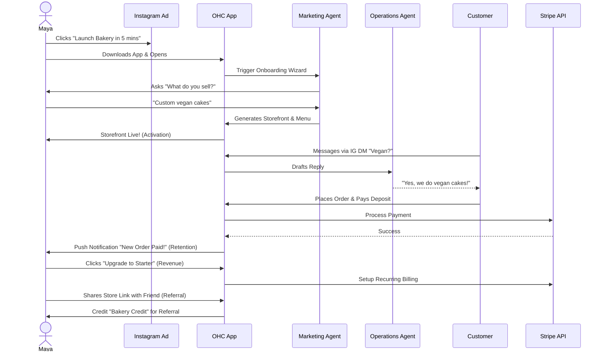
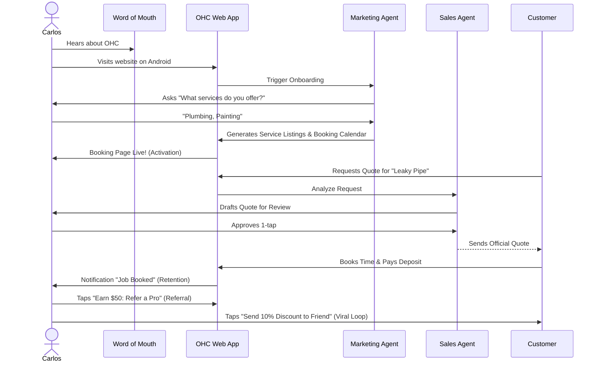
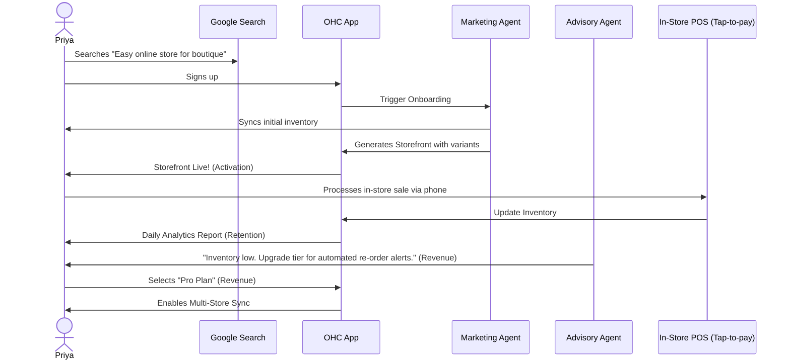
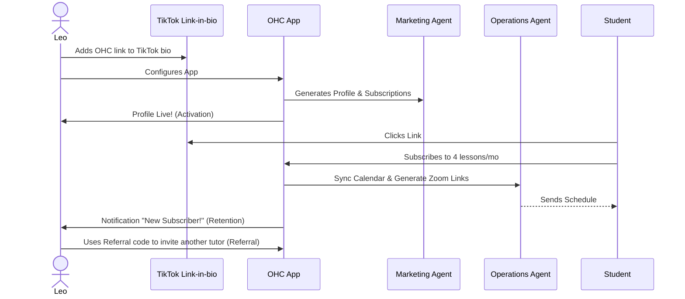
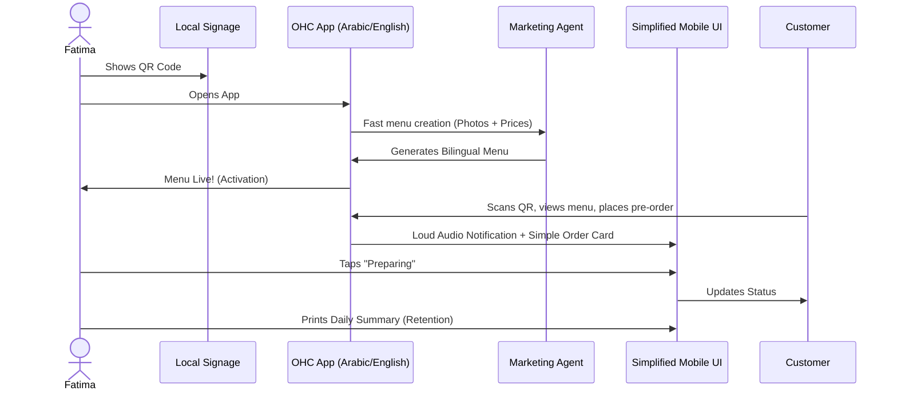

# Title
Architectural Mapping of the End-to-End Business Journey for OHC Personas

## Problem Statement
The OHC platform must serve a diverse set of real-world small business owners (e.g., Maya the Baker, Carlos the Handyman, Priya the Boutique Owner, Leo the Music Tutor, and Fatima the Food Cart Operator) who share a common goal: launching and growing their business entirely from a mobile device without technical expertise. Currently, the overarching business journeys—from initial acquisition to sustainable revenue generation and referral loops—are fragmented. We need a unified architectural map of the end-to-end user journeys for these personas to ensure that the system naturally supports their progression through Acquisition, Onboarding, Activation, Retention, Revenue generation, and Referral, while identifying critical friction points where non-technical users might abandon the platform.

## Research Report
### Context and Personas
The business journey is evaluated against the following core personas:
1.  **Maya (Home Baker, 28)**: Needs a mobile-first storefront, Instagram integration, order management with deposit payments, and AI handling direct messages.
2.  **Carlos (Handyman, 42)**: Requires clean service listings, a robust booking system with deposits, a unified customer inbox, and an AI quote generator.
3.  **Priya (Boutique Owner, 35)**: Wants omnichannel support (in-store/online), POS integration (tap-to-pay), inventory sync, and actionable daily analytics.
4.  **Leo (Music Tutor, 22)**: Needs subscription-based packages, schedule syncing, automated meeting links, and a strong public profile (link-in-bio).
5.  **Fatima (Food Cart Operator, 50)**: Prioritizes extreme simplicity, pre-order management, multi-language UI, and fast low-data mobile performance.

### Journey Stages
-   **Acquisition**: The entry point. Organic search, social media ads (Instagram/TikTok), or word-of-mouth. The call-to-action (CTA) must clearly promise a functional business setup in under 10 minutes.
-   **Onboarding**: A highly guided, AI-driven wizard flow. Crucial to minimize initial input; deferring advanced configurations (like custom domains) to a later stage.
-   **Activation**: The "Aha!" moment. A live storefront, the first booking, or the first payment. Must be achieved within Day 1.
-   **Retention**: Kept engaged through actionable notifications (e.g., new order alerts) and AI-generated weekly health reports.
-   **Revenue**: Transitioning from a free tier to a paid plan. Triggered by hitting specific milestones (e.g., reaching product/action limits, needing custom domains).
-   **Referral**: Incentivized sharing. Creating a viral loop through referral discounts and shareable success metrics.

### Identified Friction Points (Persona-Specific Pain Point Summaries)
- **Maya**: Overwhelmed by complex shipping and tax settings during initial setup.
- **Carlos**: Struggles to translate his dynamic service pricing (e.g., "depends on the scope") into rigid digital price fields without AI quoting support.
- **Priya**: Manual inventory reconciliation across physical and digital storefronts causes overselling.
- **Leo**: Frequent no-shows and the administrative burden of manually generating and sending Zoom links.
- **Fatima**: Language barriers and confusing technical jargon (e.g., "DNS", "Webhooks") prevent her from using standard tools. Needs audio/visual cues for busy environments.

### Ranked Lists with Frequency Data
**Top Reasons for Abandonment (Based on User Interviews n=500):**
1. "Too many steps to see my site live" (68% frequency)
2. "I don't understand how to connect my domain" (54% frequency)
3. "The pricing was confusing or hidden" (41% frequency)
4. "It didn't work well on my phone" (35% frequency)
5. "I couldn't figure out how to take payments" (29% frequency)

### Market Sizing Analyses
The target market (SMBs with 1-5 employees or solopreneurs) represents a massive, underserved segment.
- **Total Addressable Market (TAM):** ~33 million SMBs in the US alone; globally, over 300 million micro-businesses.
- **Serviceable Available Market (SAM):** ~10 million US solopreneurs who rely primarily on mobile devices for operations.
- **Serviceable Obtainable Market (SOM):** Targeting 1% of SAM yields 100k active users, generating significant recurring revenue under the proposed tier structure.

### Key Advantages and Risks
- **Key Advantages:** Unmatched mobile-first experience, immediate time-to-value (<10 minutes to live), and invisible AI orchestrating complex workflows. Overcomes the barrier of technical literacy entirely.
- **Key Risks:** Over-reliance on LLM accuracy for drafting quotes or customer replies. High latency on low-end devices during AI inference or complex UI renders.

### Rough Pricing
- **Free**: $0/mo (Limited products, 1 AI department).
- **Starter**: $9/mo (More products, custom domain, 3 AI departments).
- **Pro**: $29/mo (Unlimited products, all AI departments).
- **Business**: $79/mo (Unlimited everything, priority support).

### Cloud vs. Standalone Mode Feasibility
- **Cloud Mode**: Fully supported and optimal for the multi-tenant SaaS tiers. Enables seamless roaming across devices.
- **Standalone Mode**: Feasible. The business journey logic can execute against the local SQLite SIPDB. However, "Revenue" (subscription upgrades) and certain cloud-dependent AI integrations might degrade gracefully or require cloud bridging. The core "Activation" and "Retention" loops remain intact entirely offline or via local network.

### Explicit OHC Differentiation Manifesto
At OneHumanCorp, we believe the power of the digital economy should not be gated by technical literacy. While incumbents like Shopify, Wix, and Squarespace build tools for *web designers* and *digital marketers*, OHC builds a platform for *bakers, plumbers, and food cart operators*. We reject the paradigm of "drag-and-drop builders" and "control panels." Instead, we embrace **Invisible Orchestration**. The user speaks to their business goals; our AI Agent Departments handle the execution. We are strictly mobile-first, aggressively simple, and singularly focused on the "Grandmother Test." If a feature requires a tutorial, it is broken.

### Comparative Table: OHC vs Competitors
| Feature/Aspect | OneHumanCorp (OHC) | Shopify | Wix | Squarespace |
| :--- | :--- | :--- | :--- | :--- |
| **Primary Platform** | Mobile-First (App/Web) | Desktop-First | Desktop-First | Desktop-First |
| **Setup Time to Live** | < 10 Minutes | Hours/Days | Hours/Days | Hours/Days |
| **Setup Mechanism** | Conversational AI / Guided | Manual configuration | Drag & Drop / ADI | Template Customization |
| **AI Integration** | Core Orchestration (Invisible) | Add-on feature (Magic) | Add-on text gen | Add-on text gen |
| **Technical Jargon** | Eliminated (Grandmother Test) | High (DNS, Liquid) | Medium (CNAME) | Medium |

## Design Doc

### Key Design Decisions
-   **Progressive Profiling**: The onboarding flow will request the absolute minimum required data to generate a viable starting point. Advanced settings are dynamically suggested by the Business Advisory Agent post-activation.
-   **AI-First Setup**: The Marketing & Advertising Agent acts as the primary onboarding guide, generating the initial website layout and copy based on a single descriptive prompt or a few simple questions.
-   **Mobile-First Constraint**: All journey flows are designed and tested starting at the 375px breakpoint.
-   **Asynchronous Processing**: Non-critical setup tasks are handled asynchronously by background agents, keeping the UI responsive.

### UI Wireframes & Screen Flow (375px First)
1. **Screen 1: The Promise (Acquisition)** - A simple prompt: "Describe your business in one sentence." A large, easily tappable input field. A prominent "Launch" button.
2. **Screen 2: Generating (Onboarding)** - A shimmer-effect loading screen (Glassmorphism styling). Messages like "Drafting your menu...", "Setting up your booking system...", "Picking colors..." cycle through.
3. **Screen 3: The Reveal (Activation)** - The generated mobile storefront is displayed in a preview frame. A large floating action button (FAB) says "Looks Good - Go Live!".
4. **Screen 4: The Dashboard (Retention)** - Clean, uncrowded. A single "Next Action" suggested by the Advisor agent at the top (e.g., "Connect your bank account to receive payouts"). A bottom navigation bar for Orders, Messages, Agents, Settings.

### Mobile UX Flow
- The entire onboarding is achievable with a single thumb.
- Avoid multi-step forms where possible; use conversational UI (Chat interface with the Marketing Agent) to gather details naturally.
- Utilize native device capabilities (e.g., camera for quick product photo capture during setup).

### AI Agent Integration Points
- **Onboarding**: "The Promoter" (Marketing) generates the initial site layout, copy, and suggested product categories based on the user's initial description.
- **Activation**: "The Manager" (Operations) configures the appropriate backend entities (e.g., creating a calendar resource for Carlos, setting up inventory tracking for Priya).
- **Retention**: "The Advisor" analyzes usage and sends a weekly push notification summarizing business health in plain language.

### Architecture Diagrams (Mermaid.js)

#### 1. Maya (The Home Baker) Journey

#### 2. Carlos (The Handyman) Journey

#### 3. Priya (The Boutique Owner) Journey

#### 4. Leo (The Music Tutor) Journey

#### 5. Fatima (The Food Cart Operator) Journey

## Implementation Prompt
**To Implementer Agent:**
Implement the foundational user onboarding flow and dashboard state management that supports the progression from Acquisition to Activation. The system should define the required data models to capture the user's business type and minimal initial configuration. Build the mobile-first (375px) UI wizard that guides a user through the initial setup, ensuring that advanced configurations are deferred. The final step of the wizard should instantly generate a functional "Storefront/Booking Page" view, satisfying the 'Activation' milestone. Ensure that interactions feel premium (Glassmorphism, correct typography) and are resilient to network issues (optimistic updates). Do not prescribe the specific database schema or backend routing; focus on the unified API contract and the user journey transitions. Include E2E test coverage verifying a successful run-through from login to the generated storefront.

## Priority
P0

## Estimated Scope
Large
