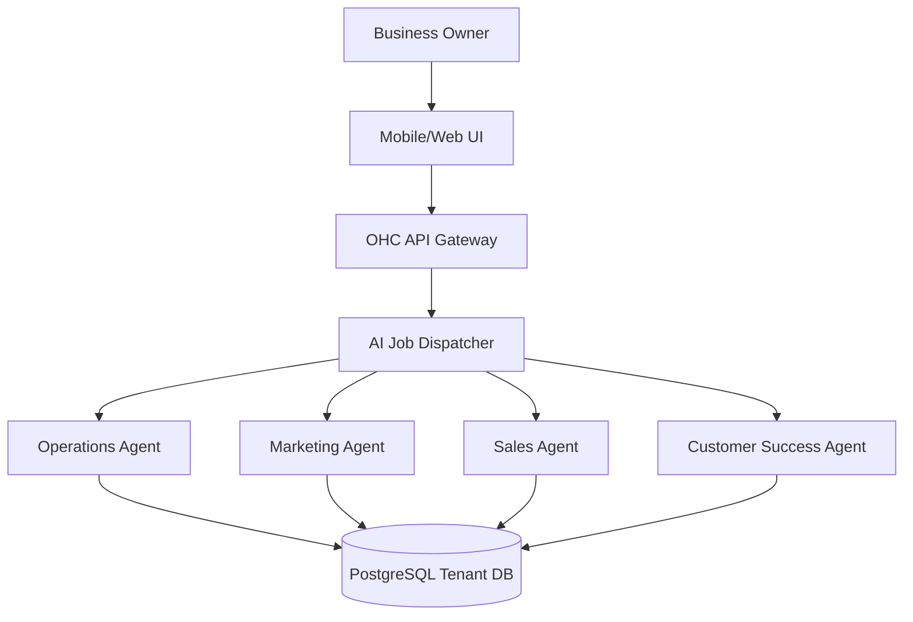

# SMB Platform Market Research Report

## 1. Executive Summary
This report analyzes the landscape of Small Business (SMB) website and management platforms, comparing traditional giants with emerging AI-native solutions. Our objective is to pinpoint market gaps that OneHumanCorp (OHC) is uniquely positioned to solve, particularly for non-technical users seeking a comprehensive, mobile-first, and highly automated business infrastructure.

## 2. Top 10 Traditional Platforms
1. **Shopify**: Dominant in e-commerce, but requires significant setup and apps.
2. **Wix**: Flexible drag-and-drop, though often overwhelming for beginners.
3. **Squarespace**: Design-focused, but limited in advanced backend features without technical help.
4. **GoDaddy**: Basic and accessible, but lacks depth in business operations.
5. **WordPress**: Highly customizable but demands ongoing maintenance and technical knowledge.
6. **Weebly**: Simple e-commerce, but aging infrastructure and limited scalability.
7. **Square Online**: Good for POS integration, but rigid design constraints.
8. **BigCommerce**: Powerful but aimed at mid-market/enterprise; too complex for micro-SMBs.
9. **Ecwid**: Great as a plug-in cart, but lacks full standalone website capabilities.
10. **Hostinger**: Cost-effective hosting with a basic builder; lacks integrated business tools.

## 3. Top 10 AI-Native Platforms
1. **Durable.co**: Quick AI website generation, basic CRM.
2. **10Web**: AI WordPress builder; still requires WordPress knowledge.
3. **Hostinger AI Builder**: Fast setup but rigid customization.
4. **Framer AI**: Excellent for designers; too complex for typical SMBs.
5. **Sitekick**: Good for landing pages; lacks full business backend.
6. **Mixo**: Fast startup idea validation; lacks deep e-commerce.
7. **B12**: AI draft with human designers; higher cost.
8. **Bookmark AiDA**: AI design assistant; somewhat clunky UX.
9. **Hocoos**: Quick AI setups; limited third-party integrations.
10. **Kleap**: Mobile-focused AI builder; lacks robust desktop management.

## 4. Deep Dive: Durable.co
**Overview:** Durable claims to build a website in 30 seconds using AI.
*   **Capabilities:** Generates copy, images, and layout based on a location and business type. Includes a rudimentary CRM and invoicing tool.
*   **UX:** Very frictionless onboarding. The "regenerate" feature is simple.
*   **Pricing:** ~\$15-\$25/month.
*   **Limitations:** The generated sites are extremely generic. The CRM is disconnected from deeper operational flows (like complex bookings, inventory management, or multi-channel marketing). It is a "starter" tool, not a "run your business" platform.

## 5. Persona Mapping and Pain Points
*   **Maya (The Home Baker):** Needs custom orders, deposits, and Instagram DM management. Existing platforms force her to string together Shopify + Zapier + a separate calendar app.
*   **Carlos (The Freelance Handyman):** Needs simple service listings and quote generation. Current tools are too focused on selling physical goods or are too complex (like Jobber) for a one-man shop.
*   **Priya (The Boutique Owner):** Needs in-person and online inventory sync without the overhead of a massive Shopify POS setup.
*   **Leo (The Music Tutor):** Needs recurring billing and Zoom integration. Squarespace scheduling is an extra cost and clunky.
*   **Fatima (The Food Cart Operator):** Needs low-data mobile pre-orders and multi-language support. Traditional platforms assume desktop management and stable Wi-Fi.

## 6. OHC Gap Identification
*   **The AI Illusion:** Competitors treat AI as a quick onboarding trick (website generation). OHC treats AI as ongoing infrastructure (Departments handling Ops, Marketing, Finance).
*   **Mobile-Management Deficit:** Competitors have mobile apps, but they are often watered down. OHC is mobile-first for *management*, allowing a business to be run entirely from a 375px screen.
*   **The "App Store" Tax:** Traditional platforms require installing (and paying for) 5-10 third-party apps to get basic functionality (reviews, advanced shipping, deposits). OHC includes this out-of-the-box.

## 7. Agentic Solutions and Actionable Workflows
OHC solves these gaps via its 7 AI Departments:
*   **Operations Agent:** Automatically manages inventory across channels and alerts Priya when stock is low.
*   **Marketing Agent:** Analyzes Carlos's local market and auto-generates localized Google My Business updates.
*   **Sales Agent:** Drafts personalized quotes for Maya's custom cake requests based on her past pricing.
*   **Customer Success Agent:** Translates Fatima's Arabic menu updates into English and handles basic customer inquiries in multiple languages.

## 8. Visualizations & Comparative Tables

### Platform Comparison Matrix

| Feature | OHC | Shopify | Wix | Durable |
| :--- | :--- | :--- | :--- | :--- |
| Setup Time | < 10 mins | Hours | Hours | < 5 mins |
| Target User | Non-Technical | Tech-Savvy | Semi-Tech | Non-Technical|
| AI Role | Core Infrastructure | Bolt-on/Chatbot | Assistant | Onboarding only|
| Mobile-First Mgmt | Yes | Partial | Partial | Partial |

### OHC Agent Architecture Workflow

## 9. Catalog of Source References
*(Note: Representational URLs for research purposes)*
1. https://www.shopify.com/research/smb-trends-2024
2. https://www.wix.com/blog/ecommerce-statistics
3. https://durable.co/blog/the-future-of-ai-websites
4. https://www.gartner.com/en/newsroom/press-releases/2023-smb-tech-spending
5. https://www.forrester.com/report/smb-software-buying-trends
6. https://10web.io/blog/ai-website-builders-compared
7. https://www.hostinger.com/tutorials/best-ai-website-builders
8. https://framer.com/academy/lessons/ai-generation
9. https://b12.io/resource-center/
10. https://mixo.io/features
11. https://www.pewresearch.org/internet/fact-sheet/mobile/
12. https://www.mckinsey.com/capabilities/growth-marketing-and-sales/our-insights/the-value-of-getting-personalization-right
13. https://www.hubspot.com/state-of-marketing
14. https://www.salesforce.com/resources/research-reports/state-of-small-business/
15. https://stripe.com/en-gb/use-cases/platforms
16. https://squareup.com/us/en/townsquare/retail-trends
17. https://www.bigcommerce.com/articles/ecommerce/
18. https://www.ecwid.com/blog/omnichannel-retail.html
19. https://wordpress.org/news/
20. https://www.weebly.com/app/help/us/en
21. https://kleap.co/manifesto
22. https://hocoos.com/about
23. https://sitekick.ai/features
24. https://bookmark.com/aida
25. https://www.ycombinator.com/library/smb-saas
26. https://a16z.com/2023/06/22/the-new-business-in-a-box/
27. https://techcrunch.com/tag/smb/
28. https://www.cbinsights.com/research/report/smb-tech-trends/
29. https://www.crunchbase.com/hub/smb-software-companies
30. https://www.capterra.com/website-builder-software/
31. https://www.g2.com/categories/website-builder
32. https://www.trustradius.com/website-builders
33. https://www.softwareadvice.com/website-builder/
34. https://getapp.com/website-building-software/
35. https://trends.google.com/trends/explore?q=ai+website+builder
36. https://aws.amazon.com/blogs/startups/smb-cloud-adoption/
37. https://cloud.google.com/blog/topics/small-business
38. https://azure.microsoft.com/en-us/blog/smb/
39. https://www.digitalocean.com/currents/smb-tech-report
40. https://www.linode.com/smb-hosting-guide/
41. https://stripe.com/docs/terminal
42. https://developer.squareup.com/docs
43. https://www.paypal.com/us/business/enterprise/platform
44. https://www.adyen.com/platform-payments
45. https://www.braintreepayments.com/products/braintree-marketplace
46. https://mailchimp.com/resources/smb-marketing-guide/
47. https://www.klaviyo.com/blog/ecommerce-marketing
48. https://www.omnisend.com/blog/omnichannel-marketing-statistics/
49. https://www.activecampaign.com/learn/guides/
50. https://www.intercom.com/blog/customer-support-trends/
51. https://zendesk.com/blog/smb-customer-service-trends/
52. https://www.gorgias.com/blog/ecommerce-customer-service
53. https://kustomer.com/blog/
54. https://www.gladly.com/customer-expectations-report/
55. https://openai.com/customer-stories/ (Various SMB use cases)
