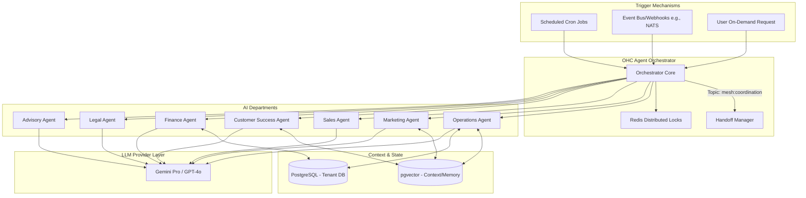

# Architecture Design Brief: AI Agent Department Architecture

## Problem Statement
Small business owners (like Maya the baker, Carlos the handyman, and Fatima the food cart operator) lack the time, expertise, and resources to manage every aspect of their operations — from customer support to marketing to financial tracking. Traditional platforms bolt on AI as an afterthought (e.g., a simple chatbot), which still requires the owner to manage the underlying workflows. We need an architectural framework where AI acts invisibly in the background, organized into understandable "Departments" that mirror real business functions, automating the heavy lifting.

## Research Report

### Competitive Analysis
- **Shopify:** Features "Sidekick," an AI assistant primarily acting as a chatbot for merchants to query data or write descriptions. It doesn't autonomously orchestrate business processes.
- **Wix:** Offers "Wix AI" for site generation and content creation, but lacks persistent, autonomous operational agents.
- **GoDaddy:** "Airo" helps with initial setup and marketing content, but does not provide ongoing, multi-departmental business management.
- **Squarespace:** AI is mostly limited to text generation and basic design suggestions.

### Findings
- Non-technical users understand roles (e.g., "The Manager", "The Accountant") much better than they understand software features.
- AI must be proactive, not just reactive.
- Coordination between different functional areas (e.g., an order triggers a customer success action and an inventory update) requires a robust state handoff mechanism.
- AI agents need contextual memory (past customer interactions, previous successful marketing campaigns) to improve over time.

## Design Doc

### 1. High-Level Architecture Overview

The AI Agent Department architecture acts as an orchestration layer sitting atop the OHC API and Core Database. It consists of seven distinct "Departments", each backed by its own specialized system prompt, defined set of tools, and isolated memory layer.

#### The Seven Departments:
1. **Operations ("The Manager"):** Order fulfillment, bookings, inventory.
2. **Marketing & Advertising ("The Promoter"):** Web design, SEO, social media, promos.
3. **Sales & Acquisition ("The Salesperson"):** Quotes, lead follow-up, referrals.
4. **Customer Success ("The Ambassador"):** Communications, review requests, re-engagement.
5. **Finance & Payments ("The Accountant"):** Payments, reports, subscriptions.
6. **Legal & Compliance ("The Protector"):** Policies, contracts, compliance.
7. **Business Advisory ("The Advisor"):** Analytics, health reports, strategic suggestions.

### 2. Architecture Diagram (Mermaid)

### 3. Key Design Decisions

- **Event-Driven Execution:** Departments are primarily triggered via a distributed Event Bus (e.g., NATS JetStream). For example, `order.created` triggers Operations (for fulfillment) and Finance (for accounting).
- **Handoff Management:** To enable departments to collaborate, the `HandoffManager` coordinates tasks over `mesh:coordination:handoff` topics, ensuring an agent can delegate tasks to another department without blocking.
- **Contextual Memory (pgvector):** Each tenant has partitioned vector storage. Agents store interactions here. Before an agent executes a task, it queries this memory to establish context (e.g., "Has this customer complained before?").
- **Optimistic Concurrency & Redlock:** Agents use distributed Redis locks (`ohc:lock:{tenant_id}:{resource_type}:{resource_id}`) to prevent race conditions when two agents try to modify the same entity.
- **Approval Workflows:** Agents classify actions into `AUTO_EXECUTE` or `DRAFT_FOR_REVIEW`. High-risk actions (e.g., issuing refunds, sending legal contracts) require human approval via a mobile push notification.
- **Usage Metering:** Every LLM invocation is logged against the tenant's tier limits. The orchestrator checks the quota before dispatching jobs.

### 4. Mobile UX Flow Integration

- **Dashboard:** The primary UI is a unified Inbox/Feed. Instead of a complex menu, the user sees a feed of agent activity: "The Ambassador drafted a reply to Maya", "The Manager updated inventory".
- **Approval Screen (375px):** A simple swipe-to-approve interface for actions categorized as `DRAFT_FOR_REVIEW`.
- **Agent Profiles:** Users can tap on an agent's avatar to adjust its "System Prompt" via a wizard (e.g., changing the tone from "Professional" to "Friendly").

## Implementation Prompt

**To the Implementer Agent:**

Please implement the foundational orchestration for the **AI Agent Departments**.

**Objective:**
Build the core `AgentOrchestrator` and `HandoffManager` that allows defining Department structs (e.g., `OperationsAgent`, `CustomerSuccessAgent`), each with a specific role, system prompt, and tool registry.

**Requirements:**
1. **Agent Trait/Interface:** Define an abstraction for a Department Agent that requires a `system_prompt`, `tools` list, and `handle_event` method.
2. **Handoff Mechanism:** Implement a messaging bridge (using the existing `TeammateMesh` / Event Bus) so one agent can send a structured request to another agent.
3. **Memory Integration Mock:** Integrate basic context retrieval by defining the interface for fetching from pgvector (you can mock the actual DB query for now).
4. **Approval State:** Define an `AgentAction` struct that includes a status (`PendingApproval`, `Executed`, `Failed`).

**Acceptance Criteria:**
- An E2E test (or integration test) must demonstrate an event (e.g., `OrderPlaced`) triggering the Operations agent, which then uses the Handoff Manager to notify the Customer Success agent to draft an email.
- The system must compile and pass all `bazelisk test //...` checks.
- Do NOT hardcode provider APIs directly in the orchestration logic; use the existing LLM provider abstractions.

**Priority:** P0 (Critical)
**Estimated Scope:** Large
