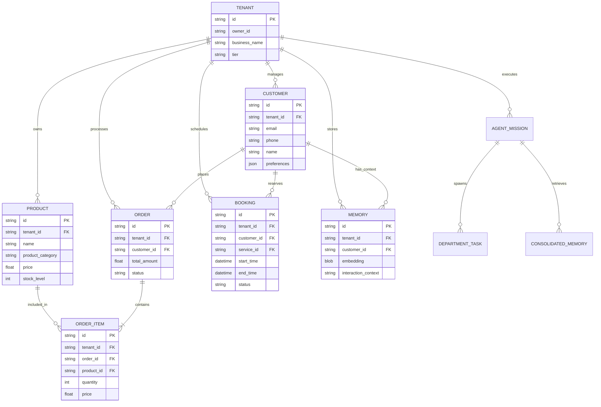

# [architecture] Data Model Architecture

## Problem Statement

As a small business owner like Maya the baker or Carlos the handyman, I rely on OneHumanCorp to manage everything—from my customers and their orders to my calendar bookings. Right now, it feels like my business's memory is a bit scattered. If a customer sends an Instagram DM, then buys a cake, and later books a consultation, my AI Assistant sometimes doesn't realize it's the same person. Additionally, as my business grows from selling physical products to offering subscriptions, I worry that my data might accidentally mix with another business, or that the system won't be able to handle my new offerings smoothly. I need a unified, bulletproof "brain" for my business that securely keeps my data separate from everyone else's, instantly recognizes my customers across all their interactions, and supports any type of product or service I decide to sell.

## Research Report & Context

### Competitive Analysis
- **Shopify:** Offers strong customer profiles but struggles natively with services, bookings, and recurring subscriptions without heavy third-party apps.
- **Wix:** Highly flexible for UI, but the underlying data connections can be loose, making it harder for an AI to reliably connect a chat message to a specific booking history.
- **Squarespace:** Good for portfolios and basic stores, but less adaptable when a business owner wants to pivot from digital downloads to physical catering pre-orders in the same system.

### OHC Requirements
- **Strict Data Isolation:** A business owner's data is their own. There can be zero risk of data bleeding between different businesses using the platform.
- **Unified Customer Memory:** AI agents need a single, holistic view of a customer to provide excellent support and intelligent recommendations.
- **Universal Commerce Support:** The system must natively understand and process physical goods, digital products, services, and subscriptions without requiring the owner to stitch together different tools.

## Design Doc: Data Model Architecture

### Entity-Relationship Diagram (ERD)

### Key Invariants

1. **Absolute Tenant Isolation (The Golden Rule):**
   - Every operational entity must be inextricably linked to a specific business (Tenant). Access patterns must always validate this link before reading or writing data, ensuring a business owner only ever sees their own data.

2. **The Unified Customer Record:**
   - The Customer entity is the central hub. Every transaction (Order), scheduling event (Booking), and AI context snippet (Memory) must tie back to a single Customer. This enables the Customer Success Agent to query one profile and instantly understand the entire relationship history.

3. **Universal Product Taxonomy:**
   - Products must be categorized abstractly (e.g., physical, digital, service, subscription) to allow Operations Agents to route fulfillment logic correctly (e.g., shipping a box vs. sending an email link) while maintaining a clean, unified inventory system.

4. **Agent Reasoning Segregation:**
   - Day-to-day operational transactions (like processing a payment) should not compete for resources with heavy AI reasoning tasks (like vector similarity searches for memory retrieval).

### Access Patterns

1. **The Business Dashboard (Carlos checking his daily schedule):**
   - **Pattern:** High-frequency, low-latency reads filtered strictly by his business ID to display pending orders and upcoming bookings.

2. **The Operations Agent (Fulfilling Maya's cake order):**
   - **Pattern:** Transactional writes that secure inventory, process the payment, and confirm the order simultaneously, ensuring no double-booking or overselling.

3. **The Customer Success Agent (Replying to Priya's VIP customer):**
   - **Pattern:** Complex read operations spanning order history and semantic memory search to draft a highly personalized, context-aware response based on the unified customer record.

### Schema Migration Strategy

1. **Audit and Align:** Review the existing entities to ensure every single one correctly links back to the business owner (Tenant).
2. **Consolidate the Customer Hub:** Update existing disparate records so that interactions uniformly point to a central Customer entity.
3. **Abstract Commerce:** Ensure the product catalog natively supports the universal taxonomy (physical, digital, service, subscription) without relying on fragile workarounds.

## Implementation Prompt

**Title:** Unify the Customer Data Model and Enforce Tenant Isolation

**Problem:** We need to ensure that our AI agents have a flawless, unified view of a customer's entire history (orders, bookings, messages) while guaranteeing absolute data isolation between different businesses. Currently, the relationships between these entities and the overarching business tenant need to be solidified.

**User-Facing Outcome:** Business owners will trust that their AI assistants instantly recognize returning customers across any channel or purchase type. They will also have total confidence that their business data is completely isolated and secure.

**Acceptance Criteria:**
1. Update the data models to ensure every operational entity is securely linked to the business tenant.
2. Establish a unified relationship where orders, bookings, and agent memories all tie back to a central customer entity.
3. Ensure the product catalog supports a polymorphic classification (e.g., physical, digital, service, subscription) to route fulfillment correctly.
4. Update the related backend services (Go + Bazel, PostgreSQL) to respect these unified relationships and isolation guarantees.
5. Provide comprehensive E2E tests covering the complete user journey from order creation to agent memory retrieval, asserting that the unified customer view is correct.
6. All tests via `bazelisk test //...` must pass.

**Priority:** P0
**Estimated Scope:** Large
