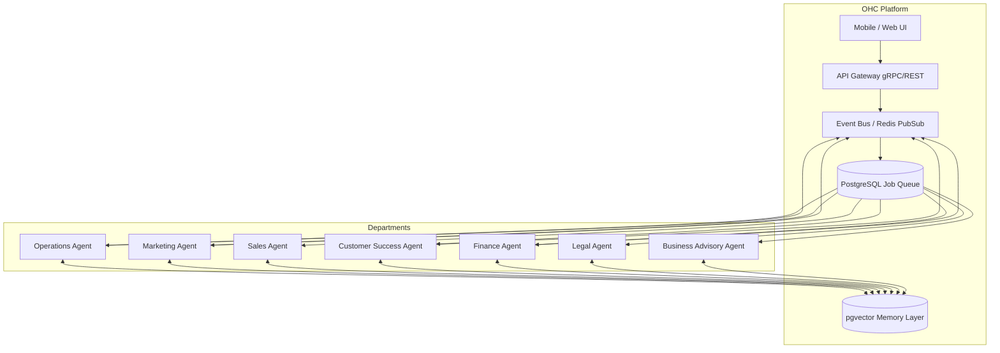

# Title
AI Agent Department Architecture for Invisible Operations

# Problem Statement
Small business owners (like Maya the baker, Carlos the handyman, Priya the boutique owner) are overwhelmed by the cognitive load of running a business. They have to juggle multiple tools for operations, marketing, sales, customer support, and finance. Existing solutions like Shopify or Wix provide tools, but the user still has to do the work. The problem is that non-technical founders need an autonomous platform where "AI does the work" invisibly in the background. The complexity of orchestrating multiple AI agents to act cohesively across different business domains (departments) without overwhelming the user is a significant gap in the market.

# Research Report
Competitive analysis shows that platforms like Shopify use AI primarily as a bolt-on chatbot (Sidekick) to assist the user, while Wix uses it for initial website generation. None treat AI as the fundamental infrastructure of the business.
To achieve "Radical Simplicity," OHC's agents must be organized into functional "Departments" (Operations, Marketing, Sales, Customer Success, Finance, Legal, Advisory) that map directly to real business functions.
- **Operations ("The Manager")**: Processing orders, managing inventory.
- **Marketing & Advertising ("The Promoter")**: Web design, SEO, social posting.
- **Sales & Acquisition ("The Salesperson")**: Quotes, lead follow-up.
- **Customer Success ("The Ambassador")**: Replies, review requests.
- **Finance & Payments ("The Accountant")**: Payments, financial reporting.
- **Legal & Compliance ("The Protector")**: Contracts, policies.
- **Business Advisory ("The Advisor")**: Insights, recommendations.

These agents need to coordinate events seamlessly. For example, when a custom cake order is placed, Operations handles the order, Finance processes the deposit, Customer Success confirms the order, and the Advisor notes the transaction for weekly reporting. The architecture must support this cross-agent coordination safely and transparently to the user, running in the background while adhering to usage quotas.

# Design Doc

The architecture utilizes an event-driven pub/sub model for cross-department coordination and a unified pgvector memory layer for shared context.

## AI Agent Department Integration Architecture

## Mobile UX Flow (375px First)
1. **Home Dashboard**: Displays a minimalist feed of agent activities. Example: "The Manager confirmed 3 new orders", "The Accountant processed $150".
2. **Action Review Center**: Some actions require approval (e.g., custom quotes, refund issuance). Users swipe right to approve, left to reject.
3. **Department Views**: Each department has a simple settings page to tune the `system_prompt` (e.g., "Always be polite and use emojis" for Customer Success).
4. **Insights Screen**: A plain-language weekly summary from the Advisor agent.

## Key Design Decisions
- **Event-Driven Coordination**: Departments communicate asynchronously via domain events (e.g., `order.created`, `payment.received`). This prevents tightly coupled dependencies between agents.
- **Shared Memory Layer**: All interactions and events are embedded into a pgvector index. When an agent wakes up, it retrieves relevant context (e.g., the Customer Success agent can see the customer's previous chat history and order history before replying).
- **Approval Workflows**: Critical actions (like modifying a refund policy or sending a custom invoice over $500) are routed to a "Draft-for-Review" state, notifying the user via the app for approval.
- **Usage Throttling**: Agent executions are metered per tenant via the Job Queue to enforce tier limits (e.g., Free tier = 100 AI actions/mo).

# Implementation Prompt
Implement the AI Agent Department backend framework. Define the core Go interfaces for an AI Department, including methods for handling incoming events, retrieving memory context from pgvector, and emitting draft actions for user review. Ensure that each department (Operations, Marketing, Sales, Customer Success, Finance, Legal, Advisory) is registered in the main orchestration loop. Provide an E2E test where an `order.created` event triggers the Operations agent to process the order, and the Customer Success agent to draft a confirmation message for review. The test must start from the UI login, trigger the order creation, and verify the drafted message appears in the Action Review Center.

# Priority
P0

# Estimated Scope
Large

