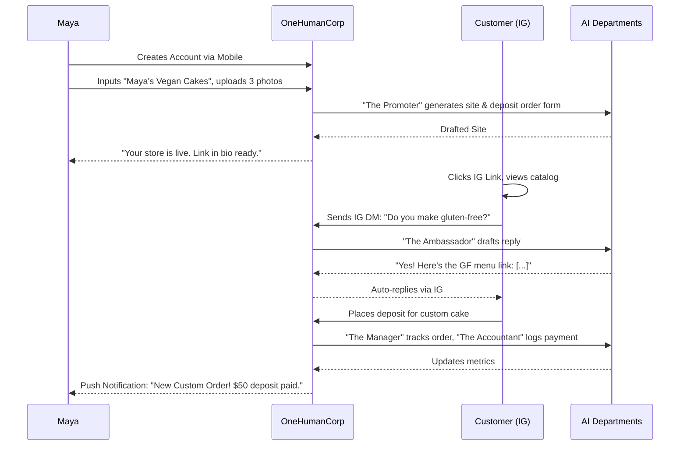
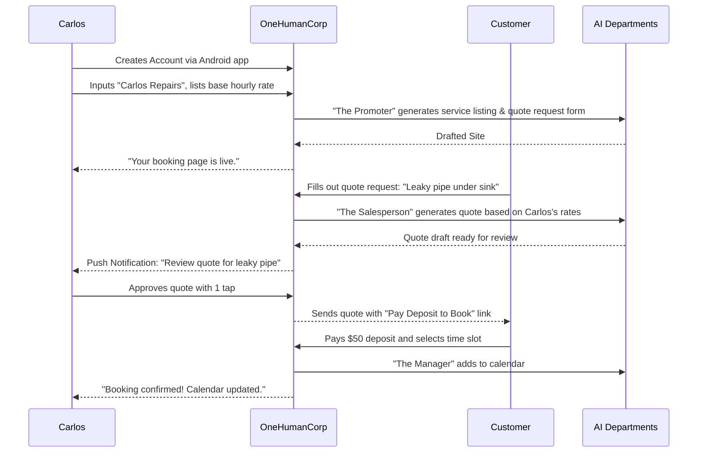
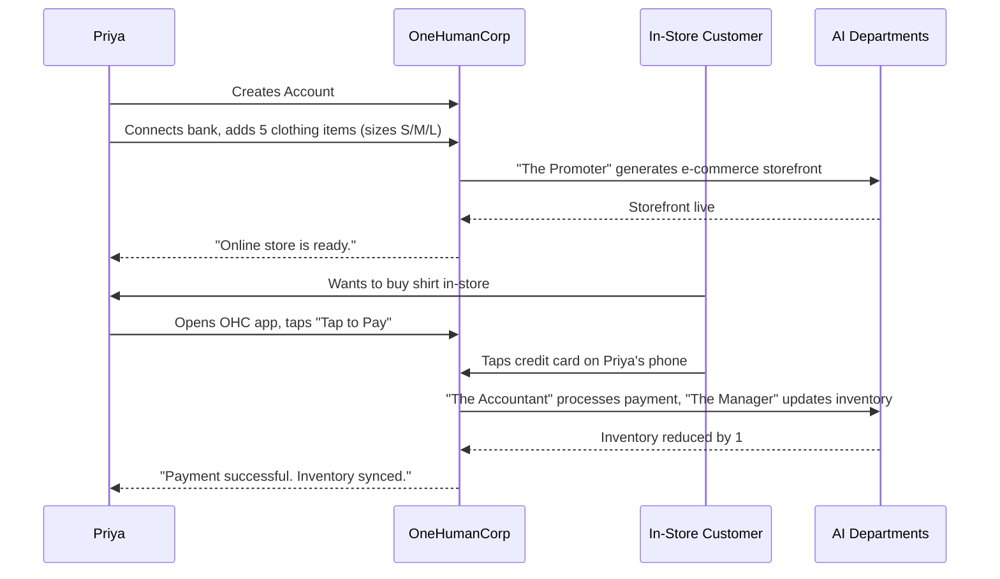
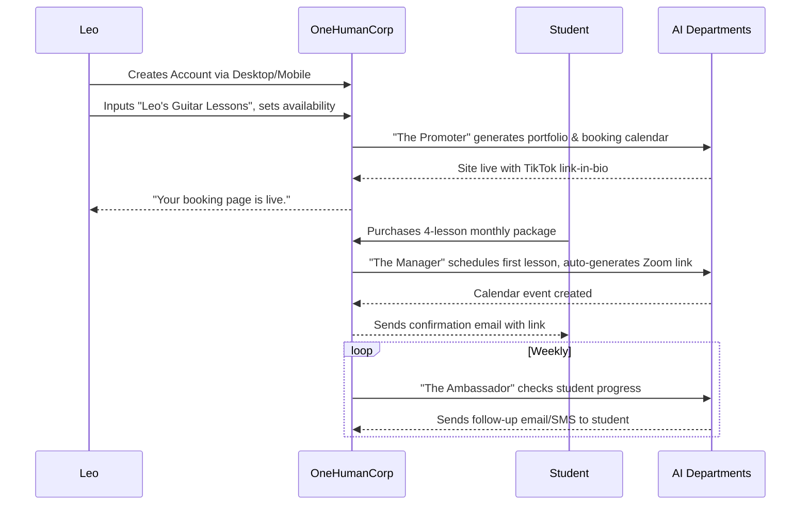
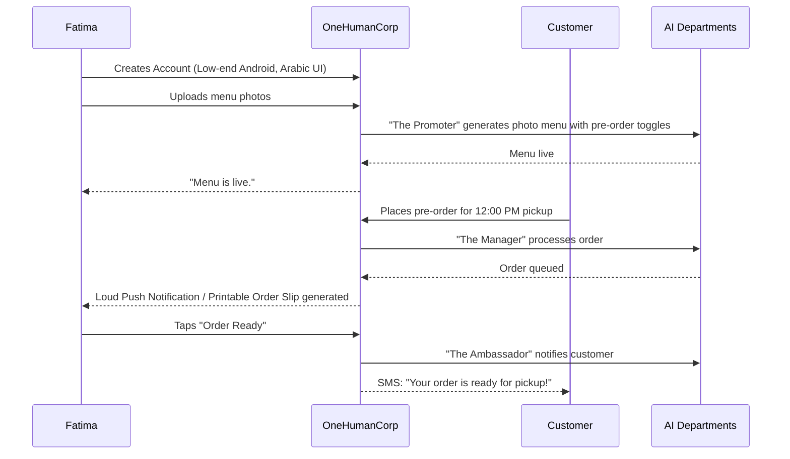

# Business Journey Architecture Research Report

## Problem Statement
Small business owners—Maya (baker), Carlos (handyman), Priya (boutique owner), Leo (music tutor), and Fatima (food cart operator)—currently face extreme friction when trying to launch and run their businesses online. They are forced to cobble together multiple disconnected tools for website building, scheduling, inventory management, point-of-sale, and customer communication. Setting up a functional digital presence often takes weeks and requires a steep learning curve, technical knowledge, or hiring expensive professionals.

The key pain points are:
* **Tool Sprawl & Fragmentation:** Users manage separate subscriptions and interfaces for their website (e.g., Wix, Squarespace), booking calendar (e.g., Calendly), point of sale (e.g., Square), and customer support (e.g., Zendesk).
* **High Technical Barrier:** Building an e-commerce site or a functional booking system requires understanding domain registration, SEO, payment gateways, and integrations.
* **Operational Overwhelm:** Managing customer inquiries across Instagram, email, and SMS while running a business leads to missed opportunities and burnout.
* **High Initial Investment:** Before making their first sale, users must invest significant time and money into software stack setup.

## Research Report
* **Competitive Analysis:**
  * **Shopify:** Excellent for complex e-commerce and physical goods, but complex to set up. Requires third-party apps for service bookings, subscriptions, and custom flows, leading to high monthly costs and integration headaches. Not intuitive for pure service businesses (e.g., tutors, handymen).
  * **Wix / Squarespace:** Good website builders, but often lack deep, specialized operational tools (like a robust, specialized booking system or an integrated conversational AI agent that handles SMS/Instagram DMs natively).
  * **GoDaddy:** Easy domain setup but very basic site building; operational tools are an afterthought.
* **Key Findings:**
  * **Time-to-Value is Critical:** The probability of a user churning drops significantly if they receive a booking or an order within the first 24 hours. The platform must guide them from zero to a live, functional business in under 10 minutes.
  * **Mobile-First is Non-Negotiable:** Many target users (like Maya the baker or Carlos the handyman) operate entirely from their phones. The entire platform (setup, daily operations, analytics) must be fully functional and optimized for mobile devices (375px screens).
  * **AI as an Invisible Enabler:** Users do not want to "prompt" or configure AI. They want an assistant that automatically handles repetitive tasks (answering FAQs, generating quotes, writing product descriptions) out of the box.

## Design Doc

### Persona Sequence Diagrams

#### 1. Maya (Baker) - Custom Orders & IG DM Auto-Replies

#### 2. Carlos (Handyman) - Service Quotes & Deposits

#### 3. Priya (Boutique Owner) - Inventory Sync & In-Person Sales

#### 4. Leo (Music Tutor) - Subscription Packages & Follow-ups

#### 5. Fatima (Food Cart) - Pre-Orders & Pickup

### Key Design Decisions
* **Progressive Profiling:** We will not ask for a custom domain, detailed tax info, or deep catalog setup upfront. The "Day One" onboarding asks only for Business Name, Business Type, and a primary goal. The AI infers the rest and creates a functional baseline.
* **Invisible AI Integration:** AI departments act via an event-driven architecture (e.g., webhooks from external channels or internal state changes). They run in the background and either execute autonomously or propose "Draft Actions" for the user to approve via push notification.
* **Mobile-First Data Architecture:** The client apps will fetch tailored, pre-aggregated "Dashboard Views" (e.g., Daily Summary) rather than raw entities, ensuring low latency on poor mobile connections.

### Mobile UX Flow (375px Baseline)
1. **Welcome Screen:** Large typography, simple input field: "What are you building today?"
2. **Setup Wizard (2-3 screens max):** Tap to select Business Type (Services, Products, Food). Upload one photo or let AI generate one.
3. **The "Tada" Moment:** A fully functional, responsive preview of their new site/booking page.
4. **The Daily Dashboard:** The primary interface post-launch. A single feed showing:
   * "New Order from Sarah ($45)" (Action: Fulfill)
   * "AI replied to 3 Instagram DMs while you slept" (Action: View Log)
   * "Your weekly revenue is up 12%!" (Action: View Report)

## Implementation Prompt
**Task for Implementer:**
Implement the complete "Day One" onboarding business setup wizard and auto-routing logic.
* **User Journey:** When a new user signs up, if their business profile is incomplete, they must be automatically routed to the Setup Wizard. The wizard should collect basic information (Business Name, Business Type) and then present a generated baseline configuration (e.g., a default product or booking link).
* **Acceptance Criteria:**
  1. The application must intercept authentication/login and automatically route new/incomplete users to the onboarding wizard. Do NOT rely on manual UI buttons for this redirection; it must be enforced by backend/client state checks.
  2. The wizard must be fully responsive, starting from a 375px mobile baseline.
  3. Upon completion, the user must be routed to their personalized daily dashboard, and their configuration must be persisted.
  4. The implementation must include both the UI components (e.g., in Slint) and the corresponding backend integration (e.g., Rust handlers/state updates).

## Priority
`P0`

## Estimated Scope
Large
