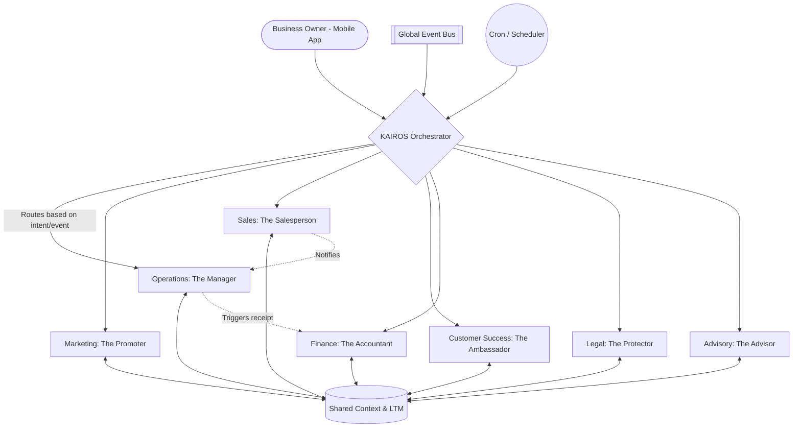
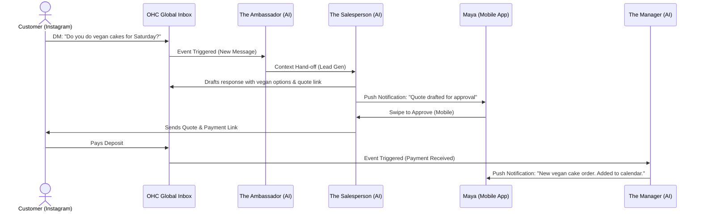

# Title: AI Agent Department Architecture

## Problem Statement

Running a small business is exhausting. As a business owner, I don't just create products or provide services—I also have to be the accountant, the marketing manager, the customer service representative, the salesperson, and the legal expert. I don't know how to code, I don't understand complex software platforms, and I don't have the budget to hire a full team.

When a customer messages me at 2 AM asking if my cakes are vegan, I miss the sale because I am asleep. When a client needs a quote, it takes me two days to manually draft it, and they've already hired someone else. I am drowning in administrative tasks, missing out on growth, and burning out. I just want a platform that runs my business invisibly for me from my phone, so I can focus on my actual craft.

## Research Report

### Persona Pain Point Summaries

- **Maya (Baker, 28):** Overwhelmed by Instagram DM inquiries about custom cake orders (e.g., "do you do vegan cakes?"). Misses sales because she cannot reply 24/7. Needs an autonomous responder and seamless deposit-based custom order pipeline.
- **Carlos (Handyman, 42):** Relies solely on word of mouth with no website. Constantly loses leads because he lacks an instant quoting system and a professional booking calendar with deposit capabilities.
- **Priya (Boutique Owner, 35):** Struggles to sync in-store inventory with online sales. Finds it impossible to manage email newsletters and daily analytics manually across multiple tools. Needs automated marketing and inventory reconciliation.
- **Leo (Music Tutor, 22):** Spends too much time scheduling lessons, generating meeting links, and chasing inactive students. Needs auto-generated links and follow-up sequences for student retention.
- **Fatima (Food Cart, 50, limited English):** Dealing with chaotic pre-orders during rush hours. Needs localized (Arabic/English) automated pre-order notifications and a simple printable daily list to organize fulfillment without manual tracking.

### Competitive Analysis

| Platform | Strengths | Weaknesses for Small Businesses | OHC "Agent Department" Advantage |
|---|---|---|---|
| **Shopify** | Deep e-commerce ecosystem, huge app store. | Requires technical setup, multiple expensive apps to do basic automation, desktop-heavy. | Built-in AI agents replace expensive apps. Mobile-first workflow natively designed for non-technical users. |
| **Wix** | Simple drag-and-drop builder, versatile templates. | Bloated, slow performance on mobile. AI is limited to site generation, not business operations. | True hybrid AI agent platform that runs the business invisibly, not just a static site builder. |
| **Squarespace** | Beautiful design, great for portfolios. | Rigid structures, poor support for complex custom services (like quoting or pre-orders). | Agents handle dynamic pricing and quotes naturally, adapting to any business type seamlessly. |
| **GoDaddy** | Easy domain setup, simple interface. | Lacks robust e-commerce and automated marketing capabilities. High hidden costs for add-ons. | Comprehensive out-of-the-box departments (marketing, operations, legal) without nickel-and-diming. |

### Recommendations

- OHC should implement a unified "Department" abstraction because non-technical users intuitively understand hiring a "Manager" or "Promoter" rather than configuring webhooks and job queues.
- OHC should adopt a draft-for-review approval model for high-risk actions (e.g., sending refunds, signing contracts) because business owners need to build trust with the AI before enabling full auto-execution.
- OHC should enforce strict AI usage budgeting per tenant based on tier because unpredictable LLM token costs can severely erode SaaS margins for the Free and Starter tiers.

## Design Doc

### Key Design Decisions & Why

1. **Department Abstraction**: AI agents are grouped into intuitive departments: Operations ("The Manager"), Marketing ("The Promoter"), Sales ("The Salesperson"), Customer Success ("The Ambassador"), Finance ("The Accountant"), Legal ("The Protector"), and Advisory ("The Advisor"). *Why: Matches the real-world mental model of business owners.*
2. **Trigger Mechanisms**: Departments act via three triggers: **On Schedule** (e.g., weekly health report by Advisor), **On Event** (e.g., order placed triggers Manager), and **On Demand** (e.g., user requests a social media post from Promoter). *Why: Allows both proactive business management and reactive assistance.*
3. **Approval Workflows**: Actions are classified by risk. Low risk (answering basic FAQs) auto-executes. High risk (sending quotes, processing refunds) requires an explicit swipe-to-approve on mobile. *Why: Builds trust and prevents catastrophic business mistakes.*
4. **Shared Memory Context**: All departments read from a consolidated Long-Term Memory (LTM) vector store containing business context, past orders, and customer history. *Why: Prevents "amnesia" between departments (e.g., Customer Success knows if Operations just delayed an order).*
5. **Throttled Budgets**: Each tenant has a predefined action/token budget based on their tier. *Why: Ensures financial sustainability and prevents abuse.*

### Architecture Diagrams

#### Department Orchestration Diagram

#### User Journey: Maya's Custom Cake Order

### UI Wireframes & Mobile UX Flow (375px)

**Screen 1: The Dashboard (The Advisor Overview)**
- **Header:** "Good Morning, Maya. Here's your daily briefing." (Glassmorphism card, #0D0D1A to #1A1A33 gradient).
- **KPI Row:** Today's Sales, Open Inquiries.
- **Action Required List:**
  - "The Salesperson drafted 2 quotes. Review?" (Actionable button)
  - "The Promoter suggests an Instagram post for your new cupcakes."
- **Bottom Nav:** Home, Inbox, Calendar, Departments.

**Screen 2: Department Approval Flow**
- **Header:** "Review Quote for Alex (Vegan Cake)"
- **Body:** Beautifully formatted quote preview.
- **Action Buttons:** "Approve & Send" (Primary, wide button), "Edit Details" (Secondary).

**Screen 3: Department Settings**
- **List:** Toggles for each department's autonomy.
  - "The Ambassador: Reply to FAQs (Auto-Execute)" -> ON
  - "The Salesperson: Send Quotes" -> SET TO DRAFT-ONLY

### AI Agent Integration Points

- **Inbox Integration:** Intercepts DMs/Emails, routes to Customer Success or Sales.
- **Checkout/Order Integration:** Order placement triggers Operations to update inventory and Finance to log revenue.
- **Calendar Integration:** Operations automatically allocates time blocks based on confirmed bookings.
- **Push Notification Service:** Agents request human approval via actionable mobile push notifications.

## Implementation Prompt

**Role:** Principal Software Engineer (L7) & Implementer
**Context:** We are introducing the "AI Department" architecture to the OHC platform. The goal is to provide non-technical business owners with a suite of AI "employees" (Manager, Promoter, Salesperson, Ambassador, Accountant, Protector, Advisor) that handle their backend operations.
**Outcome:** Implement the core KAIROS Orchestrator routing mechanism and the Department abstraction layer. Create the approval workflow interface that allows business owners to review, approve, or auto-execute AI-generated actions from their mobile devices.
**Acceptance Criteria:**
1. **Routing:** Incoming events (webhooks, scheduled tasks, user messages) must route to the appropriate logical Department based on context.
2. **Approval Model:** High-risk actions generated by a Department must be placed in a "Draft" state, pending user approval via an API endpoint suitable for mobile consumption. Low-risk actions must execute autonomously.
3. **Shared Memory Access:** Departments must be able to read and write to the tenant's shared Long-Term Memory context to maintain continuity across interactions.
4. **Budgeting Enforcement:** Every agent action must increment the tenant's token/action budget, failing gracefully if the soft limit is reached by alerting the user.
5. **Mobile Parity:** All endpoints and data structures must support a flawless, immediate 375px mobile viewport experience (sub-second response times).

## Priority
P0

## Estimated Scope
Large
