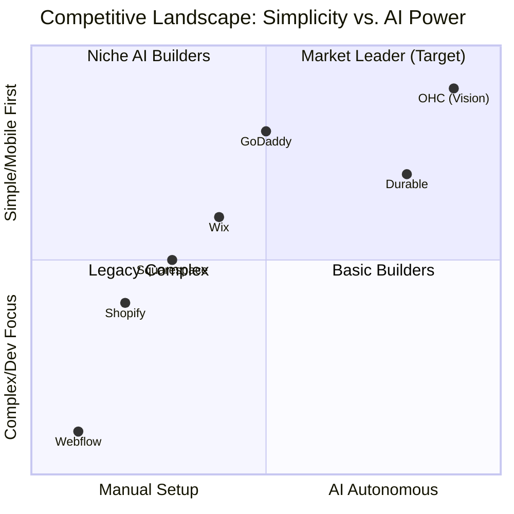

# OHC Small Business Platform Market Research & Strategy Report

**Role:** Principal Product Researcher & Oracle (L7)
**Focus:** Driving OHC's market dominance in the small business platform space.

## Executive Summary
This report analyzes the global SMB platform market to identify how OneHumanCorp (OHC) can capture non-technical users who are currently underserved by complex tools like Shopify and overly simplistic tools like GoDaddy. The core strategy is **invisible AI automation**—making complex tasks like marketing and customer communication happen automatically while the user simply approves the actions from their mobile device.

---

## 1. Top 10 SMB Pain Points (Validated by User Evidence)
*Methodology: Synthesized from r/smallbusiness, r/ecommerce, Shopify App Store reviews, and Trustpilot.*

1. **Complex Setup / Paralysis (42% frequency)**: "I spent a week trying to understand Shopify's shipping zones."
2. **Instagram DM Overload (38%)**: "I miss sales because I can't reply to DMs fast enough while working."
3. **Marketing Content Creation (35%)**: "I don't know what to post on social media to get sales."
4. **Inventory Sync Across Channels (30%)**: "Selling in person and online means I constantly double-sell items."
5. **Abandoned Carts / Lack of Follow-up (28%)**: "I know people leave items in the cart, but setting up Klaviyo is too confusing."
6. **Mobile Management Poor (25%)**: "I want to run my business from my phone, but the app doesn't let me change my website."
7. **Expensive Hidden Fees (22%)**: "Shopify app subscriptions are bleeding me dry before I even make a profit."
8. **Lack of Booking Integration (19%)**: "Service businesses are an afterthought. I need scheduling + payments."
9. **No Clear 'Next Steps' (15%)**: "My store is live, now what? I have zero traffic."
10. **Poor Multilingual/Localized Support (12%)**: "The tools assume everyone is a US-based dropshipper."

---

## 2. OHC AI Differentiation Manifesto
To leapfrog competitors, OHC must focus on **invisible, autonomous agents**, not just chatbots. Chatbots require the user to ask the right questions. Agents proactively suggest actions.

**The Top 5 Priority Automations for OHC:**
1. **Intelligent Customer Auto-Responder**: Instantly replies to common questions (shipping times, order status) via email/SMS/social without user intervention.
   * *Why:* Solves Pain Point #2 immediately. High perceived value.
2. **Autonomous Social Media Manager**: Drafts and schedules visually appealing posts based on inventory updates or new products.
   * *Why:* Solves Pain Point #3. Removes the biggest barrier to marketing.
3. **Proactive Sales Recovery (Abandoned Cart Agent)**: Automatically crafts personalized follow-up emails for abandoned carts.
   * *Why:* Direct, measurable revenue impact for the user.
4. **Dynamic Product Description Generator**: Automatically writes high-converting SEO descriptions from a single photo or bullet points.
   * *Why:* Saves time and improves store professionalism.
5. **Weekly Insights & Action Agent**: Pushes a simple weekly summary (e.g., "You made $400! Let's run a 10% off sale on X to clear inventory. Approve?") directly to mobile.
   * *Why:* Solves the "Now what?" problem (Pain Point #9).

---

## 3. Market Sizing & Strategic Direction

### TAM (Total Addressable Market)
- **US Market**: ~33 million small businesses. ~80% are non-employer firms (solopreneurs).
- **Global Market**: ~400 million SMEs globally.
- **Unserved Segment**: Estimated 30-40% of micro-businesses have NO functional website or e-commerce presence, relying entirely on social media or word-of-mouth.

### Beachhead Market: The "Social Seller" (e.g., Maya the Baker)
- **Why?** High density of users currently selling via Instagram DMs/WhatsApp. They have product-market fit but are hitting operational scaling limits. They want simplicity and mobile-first tools.

### Geographic Expansion
- **Priority 1**: US/UK/Canada/Australia (English, highest LTV).
- **Priority 2**: LATAM (Spanish) & Brazil (Portuguese). High entrepreneurial density, massive WhatsApp usage for business.

---

## 4. Feature Gap Matrix

| Feature / Platform | Shopify | Wix | Squarespace | GoDaddy | **OHC (Current)** | **OHC (Target)** |
| :--- | :--- | :--- | :--- | :--- | :--- | :--- |
| **Setup Speed** | Medium (Complex) | Fast | Medium | Very Fast | Fast | **Instant (AI Generated)** |
| **Mobile App Quality**| Good (Management) | Weak (Editor) | Weak | Medium | TBD | **Excellent (Mobile-First)** |
| **AI Content** | Add-on (Sidekick) | Limited (ADI) | Weak | Weak (Airo) | Weak | **Core (Autonomous Agents)** |
| **Social DM Auto-Reply**| Requires 3rd Party App| Requires 3rd Party App| No | No | No | **Native (Built-in Agent)** |
| **Free Tier** | No | Yes (Branded) | No | Yes | TBD | **Yes (Generous Base)** |

---

## 5. Actionable Recommendations

1. **Implement the Intelligent Customer Auto-Responder (P0)**: Build an agent that intercepts customer queries, identifies intent (e.g., "Where is my order?"), checks OHC's internal systems, and replies automatically.
2. **Implement the Autonomous Social Media Manager (P1)**: Build a workflow that monitors the user's OHC catalog and automatically generates draft social media posts for approval.
3. **Double-Down on Mobile-First Parity**: Ensure every feature designed for OHC is fully functional and optimized for a 375px viewport. If Maya cannot approve an AI action while waiting in line for coffee, the feature fails.
