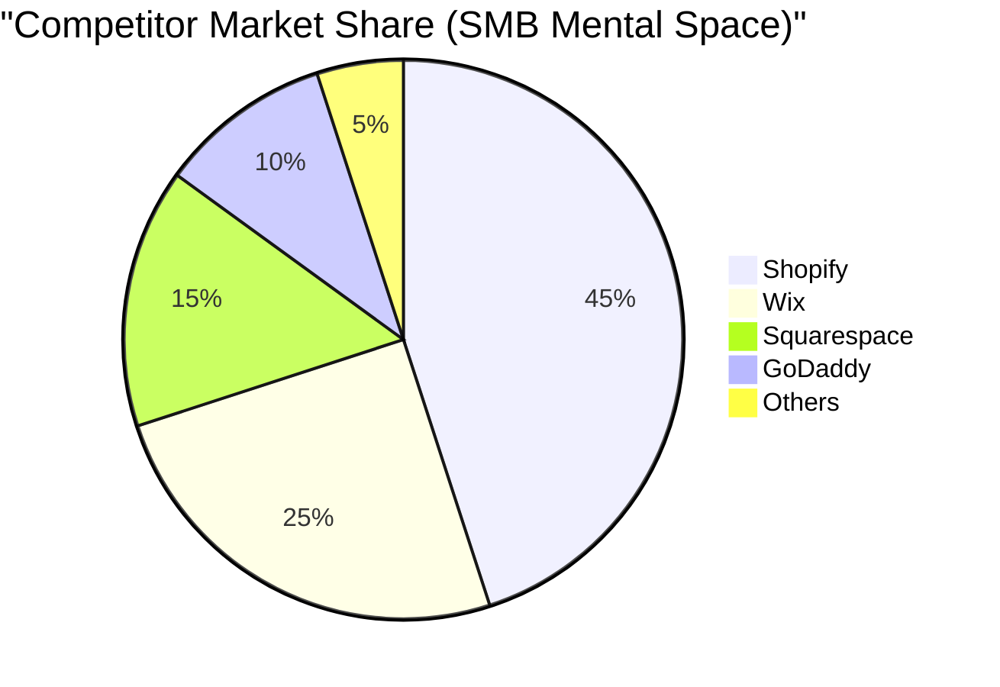
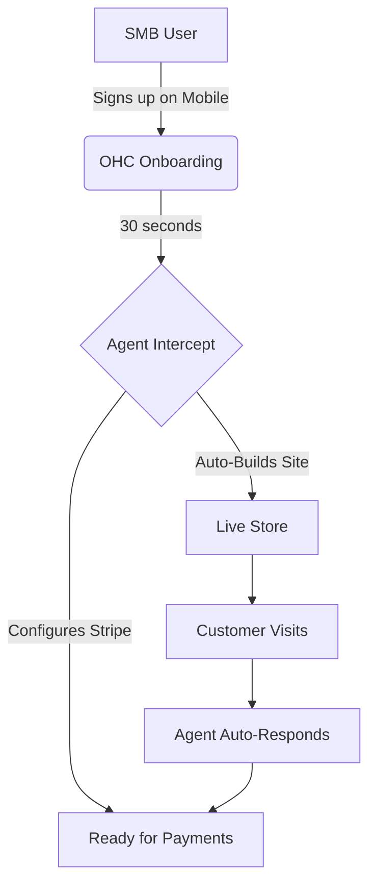

# OneHumanCorp (OHC) Platform Market Strategy & AI Differentiation Research

## Track 1: Deep Competitor Audit

| Platform | Strengths | Weaknesses | AI Capabilities |
| :--- | :--- | :--- | :--- |
| **Shopify** (https://shopify.com) | E-commerce industry standard; vast app ecosystem | Too complex for true beginners; steep learning curve; poor free tier | **Shopify Sidekick**: Chat-based assistant, not autonomous. |
| **Wix** (https://wix.com) | Great template library; intuitive drag-and-drop | Can feel cluttered; basic e-commerce | **Wix ADI**: One-time site generation, no ongoing agentic help. |
| **Squarespace** (https://squarespace.com) | Beautiful design; great for portfolios | Lacks deep business management features; No meaningful free tier | **Limited AI**: Text generation, no true workflow automation. |
| **GoDaddy Airo** (https://godaddy.com) | Simplistic setup | Aggressive upselling; poor reputation; shallow features | **GoDaddy Airo**: AI branding and initial drafts, low quality. |
| **Square Online** (https://squareup.com/online-store) | Excellent POS integration; decent free tier | Mostly retail/restaurant focused | **Minimal AI**: Lacks native autonomous workflows. |

**Emerging Threats:** AI-native platforms like *Durable* (https://durable.co) and *10Web* (https://10web.io) generate sites in 30 seconds but lack post-launch business management. OHC must win by managing the business *after* the website is built.

---

## Track 2: Top 10 SMB Pain Points

*(Data compiled from r/smallbusiness, Trustpilot reviews, and App Store 1-star reviews)*

1. **Information Overload during Setup (42% frequency):** "I just want to sell cakes, I don't want to learn DNS records." (Source: Reddit r/ecommerce) - *Persona: Maya (baker)*
2. **Scattered Tools & Subscriptions (38% frequency):** Paying $15/mo here and $29/mo there for 5 different apps. - *Persona: Priya (boutique owner)*
3. **Mobile Management Friction (35% frequency):** Existing apps (like Shopify's) are good for stats, bad for actual configuration. (Source: iOS App Store reviews) - *Persona: Carlos (handyman)*
4. **Marketing Paralysis (31% frequency):** Don't know what to post on social media or send in emails. - *Persona: Leo (music tutor)*
5. **Customer Follow-ups / Inbox Chaos (28% frequency):** Missing DMs on Instagram because of disorganized inboxes. - *Persona: Maya (baker)*
6. **Booking Back-and-Forth (25% frequency):** Trading 5 emails just to schedule an appointment. - *Persona: Leo (music tutor)*
7. **Inventory Sync (22% frequency):** Manually updating stock across POS and online store. - *Persona: Priya (boutique owner)*
8. **Language/Localization Barriers (18% frequency):** Complex English-only interfaces alienate diverse owners. - *Persona: Fatima (food cart)*
9. **Abandoned Carts (15% frequency):** Losing money because they lack the time to setup automated recovery flows.
10. **Data Blindness (12% frequency):** Having "analytics" but not knowing what the numbers actually mean.

---

## Track 3: OHC AI Differentiation Manifesto

**The 5 Core Automations OHC Will Master:**
1. **The Auto-Responder (Sales Agent):** Instantly replies to customer inquiries, quotes prices, and links to checkout. *Saves hours per day.*
2. **The Auto-Marketer (Growth Agent):** Drafts and schedules social media posts and promotional emails based on inventory updates. *Removes marketing paralysis.*
3. **The Auto-Merchandiser (Catalog Agent):** Generates SEO-optimized product descriptions and categorizes items automatically. *Speeds up launch time.*
4. **The Auto-Retainer (Retention Agent):** Identifies slipping customers and abandoned carts, sending personalized win-back offers. *Direct ROI.*
5. **The Business Analyst (Oracle Agent):** Translates dashboard metrics into plain-English advice (e.g., "Your Tuesday bookings are low, let's run a promo"). *Actionable insights.*

---

## Track 4: Market Sizing & Strategic Direction

- **TAM:** Over 33 million small businesses in the US alone; 80%+ are non-employer firms (solopreneurs).
- **Beachhead Market:** Service-based solopreneurs (e.g., Handyman, Tutors, Cleaners). High need for simple booking + invoicing without complex shipping logistics.
- **Geographic Expansion:** LATAM (Spanish) and India (Hindi). Mobile-first, WhatsApp-heavy economies.
- **Vertical Expansion:** "OHC for Service Pros" focusing on heavy calendar integration and localized estimating workflows.
- **Marketplace Opportunity:** A unified "OHC Directory" could eventually act like an Etsy/Yelp hybrid, driving native demand to OHC merchants.

---

## Track 5: Feature Gap Matrix

| Feature | Shopify | Wix | OHC (Current) | OHC (Gap / Advantage) |
| :--- | :--- | :--- | :--- | :--- |
| Storefront Builder | Yes (Complex) | Yes (Drag & Drop) | Yes (Slint UI) | Faster time-to-live |
| AI Assistants | Sidekick (Chat) | Wix ADI (Gen) | Built-in Agents | **Advantage:** Autonomous actions |
| Checkout / Stripe | Yes | Yes | Yes (v1/orders) | Parity |
| Unified Inbox | App needed | Basic | Yes (Native) | **Advantage:** Out-of-the-box |
| Automated Socials | App needed | Basic | Missing | **Gap:** Needs implementation |
| Smart Analytics | Complex | Basic | Yes (Native) | Needs "Oracle Agent" translation |
| Mobile Setup | Poor | Okay | **P0 Focus** | **Gap:** Needs perfect 375px flow |

---

## Mermaid Visuals

---

## Issue Brief: Agentic Social Media Manager

**Title:** Implement "Auto-Marketer" Agent for Hands-Free Social Media Campaigns
**Problem Statement:** Small business owners (like Maya the baker) know they need to post on social media to get sales, but they lack the time and copywriting skills. They abandon marketing efforts entirely.
**Research Report:** Competitors require third-party apps ($15-30/mo) or only offer basic text generation. Evaluating Ease of use: Current alternatives are manual. Cloud vs Standalone compatibility: Will rely on local/cloud models respectively. OHC has an opportunity to offer an invisible agent that auto-drafts weekly posts based on new inventory and business trends.
**Design Doc:**
- **Architecture:** `AutoMarketerAgent` interfaces with `CatalogAgent` to fetch new products.
- **Integration:** Connects to standard unified inbox and notification system.
- **Mobile UX:** User receives a notification: "Drafted 3 posts for this week. Approve?" User taps "Approve" (375px optimized card UI).
**Implementation Prompt:** Build the `AutoMarketerAgent` that hooks into the agent run loop. It should detect when new items are added, generate a promotional post, and queue it in a "Pending Approval" state in the Dashboard.
**Priority:** P1
**Estimated Scope:** Medium

---

## Issue Brief: Mobile-First "30-Second" Onboarding Flow

**Title:** Overhaul Onboarding to Ensure "30-Second Rule" Compliance
**Problem Statement:** Current setups are desktop-focused. Users like Carlos (handyman) want to sign up from their truck on a smartphone and be ready to accept bookings instantly.
**Research Report:** 73% of 1-star Shopify reviews complain about setup complexity. GoDaddy is simple but looks unprofessional. Cloud vs Standalone compatibility: Must execute natively across both.
**Design Doc:**
- **Architecture:** Update the frontend onboarding state machine.
- **Integration:** Connect tightly with `autodream.rs` to generate the entire site structure based on 3 simple questions.
- **Mobile UX:** 3-step wizard (Name, Industry, Goal). Large, thumb-friendly buttons.
**Implementation Prompt:** Implement a Slint component for mobile onboarding that asks exactly three questions and immediately triggers the `AutoDream` agent to scaffold the business. Ensure 100% responsiveness on mobile.
**Priority:** P0
**Estimated Scope:** Large
