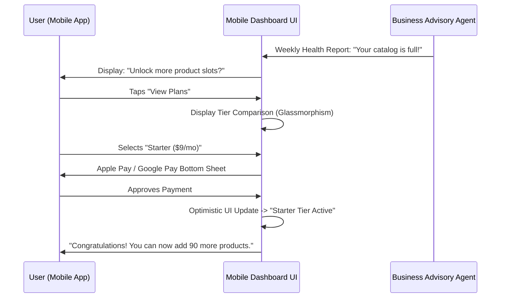

# [architecture] Multi-Tenant SaaS Tier Architecture & Upgrade UX

## Title
Implement Transparent SaaS Tier Upgrades and Mobile-First Entitlement UX

## Problem Statement
Small business owners (like Maya the baker or Carlos the handyman) are often confused by technical jargon in pricing plans like "API rate limits," "bandwidth caps," or "storage GBs." When they hit a limit on their current plan, they feel penalized and frustrated, rather than seeing it as a sign of business growth. They need simple, plain-language indicators of their usage (e.g., "You've added 10 products! Ready to expand your catalog?") and seamless, 1-tap upgrade paths directly from their phone, without needing a desktop or understanding the technical mechanics of the platform.

## Research Report
### Findings & Competitive Analysis
Most competitors fail to contextualize limits for non-technical users:
- **Shopify**: Opaque limits on staff accounts and POS locations. Upgrades feel punitive rather than growth-oriented.
- **Wix/Squarespace**: Focus heavily on storage/bandwidth caps, which users cannot visualize or predict.
- **GoDaddy**: Limits features (like SEO) but doesn't proactively explain *why* the user needs them until they are blocked.

**OHC Strategy**: We tie limits to tangible business actions (Products, AI Actions). We frame upgrades as unlocking new teammates or capabilities to support their growing business.

### OHC SaaS Tiers

| Tier | Price | Products | AI Departments | AI Actions/mo | Storage | Custom Domain |
|---|---|---|---|---|---|---|
| Free | $0 | 10 | 1 | 100 | 500MB | No (OHC subdomain) |
| Starter | $9/mo | 100 | 3 | 1,000 | 5GB | Yes |
| Pro | $29/mo | Unlimited | 10 | Unlimited | 50GB | Yes + SSL |
| Business | $79/mo | Unlimited | Unlimited | Unlimited | 500GB | Yes + multi-domain |

## Design Doc

### Architecture Diagram

### UI Wireframes & Mobile UX Flow (375px)
1. **Contextual Limit Warnings (In-Flow)**:
   - When Carlos tries to add his 11th product on the Free tier, a glassmorphic bottom sheet slides up: "You've reached your 10 product limit on the Free plan. Upgrade to Starter to add 90 more and unlock 2 new AI Teammates!"
2. **Dashboard Usage Indicators**:
   - A simple, visual progress ring on the main dashboard showing "AI Actions This Month" (e.g., 85/100).
   - Turns amber at 80%, red at 100%.
3. **1-Tap Upgrade Flow**:
   - Selecting an upgrade opens a native payment sheet (Apple Pay / Google Pay) for frictionless checkout. No tedious credit card forms.

### AI Agent Integration Points
- **Business Advisory Agent**: Monitors usage metrics. If Maya is approaching her 100 AI actions limit midway through the month, the Advisor proactively sends a plain-language suggestion: "Your business is booming! You're using a lot of AI actions to reply to customers. Consider upgrading to the Starter plan so your Ambassador agent doesn't pause."
- **Customer Success Agent**: Upon a successful upgrade, sends a celebratory message explaining the new capabilities unlocked.

### Key Design Decisions
- **Limits as Milestones**: Hitting a limit is framed as a milestone of success and growth, not an error.
- **No Technical Jargon**: We never show raw byte counts for storage unless absolutely necessary. We translate it to "Photos uploaded."
- **Optimistic UI for Upgrades**: Once the native payment is authorized, the UI immediately reflects the new tier, while backend provisioning happens asynchronously.

## Implementation Prompt
**For the Implementer Agent:**
Implement the user-facing mobile UX for the SaaS Tier system and upgrade flow.
- **CUJ**: A Free tier user attempts to perform an action that exceeds their current limit (e.g., adding an 11th product). They are presented with a clear, jargon-free explanation and an option to upgrade. They tap "Upgrade," complete the native payment flow, and are immediately able to complete their original action.
- **Acceptance Criteria**:
  - The UI accurately reflects the limits defined in the Tier table.
  - Contextual "limit reached" bottom sheets are implemented using the OHC Premium Token library (glassmorphism, outfit font).
  - The upgrade screen clearly compares the current tier with the next logical tier, emphasizing business benefits.
  - The Business Advisory Agent can push usage warnings to the dashboard feed.
  - All screens must be fully functional and tested at a 375px width.

## Priority
P1

## Estimated Scope
Medium
