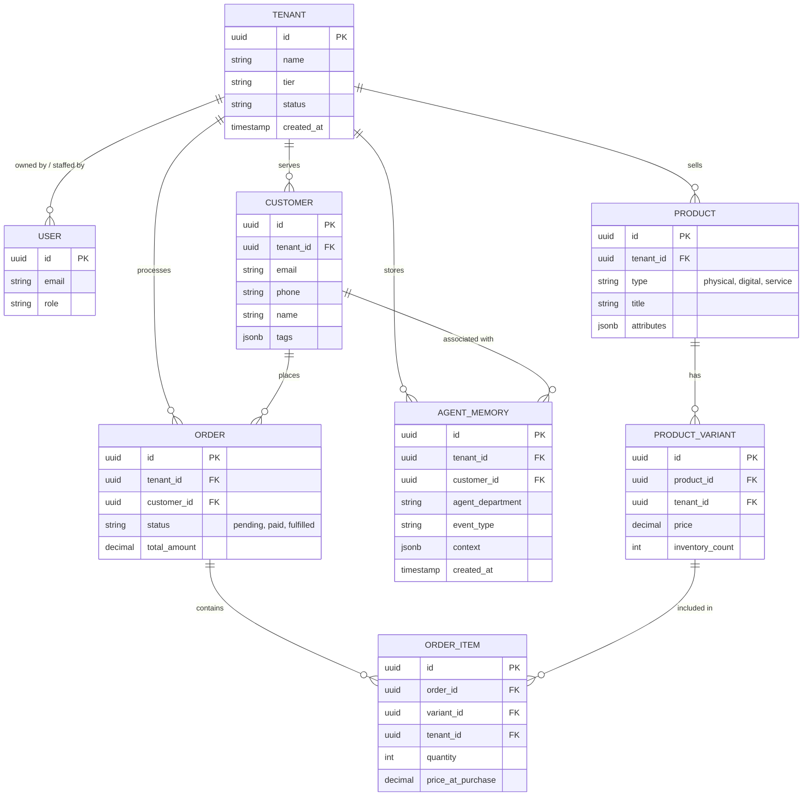

# Data Model Architecture Report

## Problem Statement
The OneHumanCorp (OHC) platform requires a robust, scalable, and secure data model to support its multi-tenant SaaS architecture. With non-technical users launching small businesses effortlessly, the platform must handle diverse entity types—spanning physical products, digital services, and bookings—while guaranteeing strict data isolation, high performance for AI agent access, and mobile-first responsiveness. Currently, the multi-tenant SaaS requires row-level security and explicit invariants to ensure business owners and their AI agents only interact with their own tenant's data safely and efficiently.

## Research Report
- **Competitive Landscape**: Traditional e-commerce (e.g., Shopify) provides rigid schema definitions customized heavily via extensions. Website builders (e.g., Wix) employ NoSQL-like structures for flexibility but struggle with complex transactional integrity. OHC differentiates by adopting a unified PostgreSQL-based core data model with Row-Level Security (RLS) to provide robust multi-tenancy.
- **AI Integration Needs**: AI agents (e.g., The Ambassador, The Manager) need fast access to business history, current states, and aggregated metrics without querying heavy joins constantly.
- **Scalability**: A normalized core combined with JSONB for flexible attributes (e.g., product variants) provides the optimal balance between strict typing and small-business customizability.

## Design Doc

### Key Entities & Relationships
- **Tenant (Business)**: The foundational entity. Every data point in the system belongs to a Tenant.
- **User (Owner/Staff)**: Associated with one or more Tenants.
- **Product/Service**: An offering, whether physical (inventory tracked), digital, or service (booking slots).
- **Order/Booking**: Transactional records for purchases or service scheduling.
- **Customer**: End-users who interact with the business (purchasers, leads).
- **AgentInteraction (Memory)**: Context and history for AI agent decision-making.

### Entity-Relationship Diagram

### Key Invariants
1. **Strict Multi-Tenancy (RLS)**: Every operational table (e.g., `products`, `orders`, `customers`) MUST have a `tenant_id` column. PostgreSQL Row-Level Security (RLS) policies must guarantee that queries only ever return data where `tenant_id = current_setting('app.current_tenant')`. A business owner or an AI agent operating on behalf of a tenant can ONLY access their own tenant's data.
2. **Immutable Transaction History**: Once an `Order` reaches a terminal state (e.g., `paid`, `refunded`), it and its associated `OrderItems` become immutable. Modifications require compensatory records (e.g., creating a refund record rather than altering the original total).
3. **Agent Scope Restriction**: Agents operating on the event mesh must only process events containing a valid `tenant_id`. AI memory retrievals must be scoped strictly to the current `tenant_id`.

### Key Access Patterns
- **AI Agent Querying Customer History**: Agents query `AGENT_MEMORY` joined with `CUSTOMER` filtered by `tenant_id` and `customer_id`. Indexes on `(tenant_id, customer_id, created_at)` ensure low latency for real-time drafting.
- **Mobile App Fetching Orders**: The mobile dashboard queries `ORDER` filtered by `tenant_id` and `status`, sorted by `created_at DESC`. `ORDER` aggregates total counts quickly.
- **Inventory Check**: Operations Agent checks `PRODUCT_VARIANT.inventory_count` where `product_id` matches the current order context. Updates utilize `SKIP LOCKED` or atomic decrement.

### Migration Strategy
To evolve the schema over time without downtime:
1. **Additive Changes First**: Add new tables or columns initially allowing `NULL` or with default values.
2. **Dual-Write Pattern**: When modifying a core relationship (e.g., migrating from single-product to product-variant model), application logic writes to both old and new structures simultaneously.
3. **Backfill**: Run background jobs to populate new columns/tables from existing data in small batches.
4. **Transition**: Update application read paths to use the new structure.
5. **Cleanup**: Drop old columns/tables after verifying stability and verifying no stale reads occur.
6. **Zero-Downtime DDL**: Use `CREATE INDEX CONCURRENTLY` for index additions to avoid locking tables during production use.

## Implementation Prompt
Implement the foundational PostgreSQL database migrations and corresponding Go/Rust ORM entity models for the `Tenant`, `Product`, `Customer`, and `Order` domains.
- Ensure that Row-Level Security (RLS) is applied to all tenant-scoped tables using a `tenant_id` column.
- Provide connection pool configuration that safely sets the tenant context before query execution (e.g., using `current_setting`).
- Write unit tests demonstrating that an entity from `Tenant A` cannot be accessed when the context is set to `Tenant B`.
- Create the `AgentMemory` schema with indexing optimized for the AI agent history retrieval pattern.

## Priority
P0

## Estimated Scope
Medium
