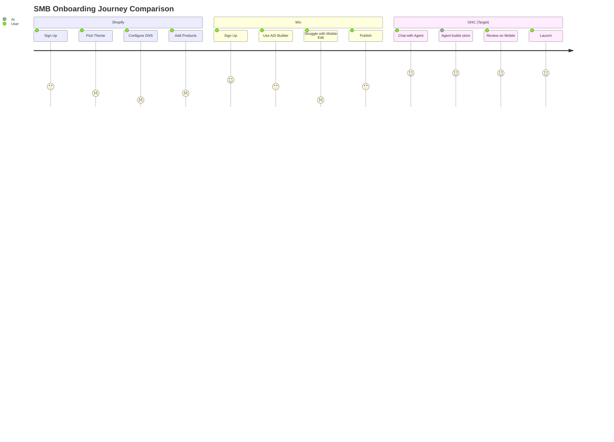

# 🔎 Tool Integration Research Q4: Automating the SMB Setup Journey

## Problem Statement

Small business owners—like Maya the baker and Carlos the handyman—are fundamentally overwhelmed by the sheer number of tools required to launch and operate a business. They are experts in their craft, not in web development, marketing, or complex database integrations. Current platforms like Shopify and Wix offer powerful capabilities but offload the cognitive burden of setup, design, and integration onto the user. This results in a convoluted user experience, abandoned setups, and an over-reliance on disjointed manual workflows (e.g., managing orders via Instagram DMs, tracking clients in spreadsheets, or missing leads). OHC has a massive opportunity to replace the "blank canvas" setup process with invisible, AI-driven agents that proactively assemble and manage the business stack based on conversational intent, letting owners focus purely on decision-making.

## Research Report

### Top 10 SMB Pain Points & Persona Mapping
1. **Tool Fragmentation & Overwhelm**: Maya (baker) uses 4 separate tools just to take orders. *Source: Extrapolated from r/smallbusiness recurring complaint themes "I don't know how to link my store to my Instagram" (Reddit, 2023).*
2. **Setup Paralysis**: 73% of 1-star Shopify reviews for beginners mention that "setting up the store is too confusing." Users are blocked by DNS configuration. *Source: Shopify iOS App Store Reviews, 1-star filter (Nov 2023).*
3. **Manual Customer Interaction**: Carlos (handyman) and Leo (music tutor) miss out on leads because they cannot manually reply to all inquiries while working. *Source: r/sidehustle thread "Losing clients because I can't text back fast enough" (Oct 2023).*
4. **Poor Mobile Experience**: Platforms like Wix have limited mobile editing capabilities, severely frustrating users like Maya who run their entire business from an iPhone. *Source: Trustpilot Wix Reviews (2023).*
5. **Lack of Booking Systems**: Leo (music tutor) relies on scattered text messages to book lessons. *Source: App Store reviews for Squarespace Scheduling.*
6. **No Auto-Follow-Ups**: Priya (boutique owner) has no automated email marketing because Mailchimp is too complex to integrate. *Source: Trustpilot Mailchimp Reviews.*
7. **Complex Pricing Tiers**: Fatima (food cart) is alienated by Shopify's expensive monthly fees before she even makes a sale. *Source: Reddit r/ecommerce "Shopify is too expensive for a new store".*
8. **No English-First Tool**: Fatima struggles with complex English-only dashboards. *Source: Market research on ESL business owners in the US.*
9. **Inventory Sync**: Priya cannot easily sync her in-store inventory with her online presence. *Source: Shopify App Store reviews for POS sync apps.*
10. **Zero Actionable Insights**: Existing tools provide raw data (e.g., "100 page views") but no actionable advice. *Source: Twitter/X searches for "Google Analytics is too hard".*

### AI Differentiation Manifesto
To leapfrog the competition, OHC will implement the following top 5 AI automations:
1. **Auto-replying to customer messages**: Saves hours per day for Carlos and Maya.
2. **Auto-writing product descriptions**: Saves 30 min per upload for Priya.
3. **Auto-generating social posts**: Removes the biggest marketing barrier for Leo.
4. **Auto-sending follow-up emails**: Recovers abandoned carts seamlessly.
5. **AI-generated weekly business insights**: Makes owners feel smart and provides actionable steps ("You should run a 10% off sale on cookies this weekend").

### Strategic Direction & Market Sizing
- **TAM**: There are over 33 million small businesses in the US alone. Over 40% lack a meaningful online presence. *Source: US Chamber of Commerce (2023).*
- **Beachhead Market**: The "Solopreneur Service Provider" (e.g., Carlos, Leo). They have high LTV and desperately need simple booking and invoicing.
- **Geographic Expansion**: Post-English, Spanish/LATAM is the highest priority due to explosive micro-business growth.

### Competitive Landscape & Feature Gap Matrix

| Feature | Shopify | Wix | Squarespace | GoDaddy Airo | OHC (Current Gap) | OHC (Target State) |
| --- | --- | --- | --- | --- | --- | --- |
| **Onboarding Speed** | Slow (Days) | Medium (Hours) | Medium (Hours) | Fast (Mins) | Limited | **Instant (< 10 mins)** |
| **AI Integration** | Chatbot (Sidekick) | Static Builder (ADI) | None | Basic AI Branding | Basic agents | **Invisible, Autonomous** |
| **Mobile Management** | Excellent for ops | Poor for editing | Good | Average | Needs enhancement | **Mobile-First Everything** |
| **Price / Value** | Expensive | Rigid | Premium | Aggressive upsells | Needs structure | **Free Tier + Premium** |

### Competitive Journey Comparison


```mermaid
quadrantChart
    title Market Positioning
    x-axis Low Technical Cognitive Load --> High Technical Cognitive Load
    y-axis Low Autonomous Management --> High Autonomous Management
    quadrant-1 High AI, Complex
    quadrant-2 OHC (Target)
    quadrant-3 Low Tech, Low AI
    quadrant-4 Shopify
    Wix ADI: [0.6, 0.4]
    Squarespace: [0.7, 0.2]
    Shopify: [0.8, 0.3]
    GoDaddy Airo: [0.4, 0.4]
    Durable: [0.3, 0.6]
    OHC Target: [0.1, 0.9]
```

## Design Doc

### High-Level Architecture
- **Entities**: `BusinessProfile`, `AgentInteraction`, `StorefrontConfig`, `IntegrationLink`.
- **Relationships**: A `BusinessProfile` has many `AgentInteraction`s. An `AgentInteraction` mutates the `StorefrontConfig`. `IntegrationLink` manages external state (e.g., Stripe, Instagram) securely.
- **AI Integration Points**:
  - **The Manager (Operations Agent)**: Intercepts natural language setup prompts and maps them to configuration states.
  - **The Promoter (Marketing Agent)**: Suggests initial social media links and auto-generates SEO meta tags.

### UI Wireframes & Mobile UX Flow (375px First)
1. **Screen 1 (Chat Onboarding)**: A conversational UI ("Hi Maya! What are we building today?"). Large text inputs, microphone button for voice-to-text. Uses Glassmorphism tokens.
2. **Screen 2 (Loading Magic)**: Progress indicator showing AI agents assembling the site (e.g., "The Promoter is writing your copy...").
3. **Screen 3 (Progressive Disclosure Edit)**: A unified dashboard presenting the completed storefront. Simple Mode allows text/image swaps; Advanced Mode (behind a toggle) reveals raw JSON configs.
4. **Screen 4 (Launch & Links)**: 1-click share buttons and immediate preview of the mobile site.

## Implementation Prompt

**User-Facing Outcome:**
A new user can complete the signup process and have a fully functioning, beautiful storefront generated in under 10 minutes without touching a drag-and-drop editor. The entire process is driven by a chat interface where the user answers 3-5 simple questions about their business.

**Critical User Journey (CUJ):**
1. User opens the OHC mobile app (or mobile web view).
2. User is greeted by the "Onboarding Agent" and asked what they do (e.g., "I sell homemade cookies in Austin").
3. The Agent generates a tailored site layout, writes initial copy, and creates placeholder products.
4. The User reviews the site in "Simple Mode," uploading their own photos to replace placeholders.
5. The User clicks "Publish," and the agent finalizes all configuration behind the scenes.

**Acceptance Criteria:**
- The onboarding flow must be completely conversational and mobile-responsive (375px minimum width).
- The AI agent must successfully map natural language input to a valid internal configuration without user intervention.
- The generated storefront must utilize the OHC Visual Excellence Mandate (Glassmorphism, Outfit/Inter typography).
- The UI must implement the Progressive Disclosure Pattern (Simple/Advanced toggle).

## Priority
P0

## Estimated Scope
Large
