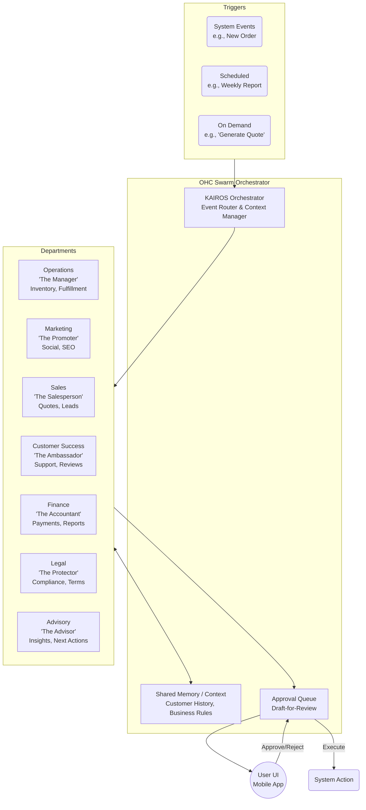

# [Research] AI Agent Department Architecture

## Title
AI Agent Department Architecture for OneHumanCorp

## Problem Statement
Small business owners—whether a baker like Maya or a handyman like Carlos—often juggle multiple operational roles: managing orders, responding to inquiries, doing marketing, handling finances, and ensuring legal compliance. They don't have the time or expertise to manage these areas effectively. They need a system that invisibly handles this complexity, so they can focus on their core business. They understand "departments" (e.g., Sales, Marketing, Finance) but not "agents", "LLMs", or "vector databases". OHC needs an architecture that abstracts AI capabilities into familiar business departments that seamlessly coordinate with each other and operate autonomously or semi-autonomously.

## Research Report
The current market offerings (Shopify, Wix, Squarespace) often require manual setup of workflows, separate apps for different functions (e.g., a separate email marketing app, a separate booking app), and lack deep, unified AI automation. AI tools on these platforms are often treated as distinct "features" (e.g., an AI copywriter button) rather than a cohesive "workforce".
Our target users need a unified experience.
Key Findings:
1.  **Familiar Abstractions are Crucial:** Users understand "The Manager" handling orders and "The Ambassador" handling customer success. Technical terms alienate them.
2.  **Coordination over Silos:** If a customer asks "The Ambassador" (Customer Success) for a refund, it must coordinate with "The Accountant" (Finance) and "The Manager" (Operations) to process it and update inventory.
3.  **Trust via Approvals:** New users need a "draft-for-review" mode before trusting agents to execute actions (like sending emails or issuing refunds). Over time, they transition to "auto-execute".
4.  **Context is King:** Agents need shared memory (customer history, past interactions) to sound coherent.

## Design Doc

### Architecture Diagram

### UI Wireframes / Mobile UX Flow
**Flow: Agent Action Approval (Mobile First)**
1.  **Push Notification:** "The Ambassador has drafted a reply to Maya regarding her cake order."
2.  **Action Screen (375px):**
    *   **Top:** Context (Customer message: "Can I change the pickup time?").
    *   **Middle:** Drafted reply from The Ambassador (approving the time change, coordinating with The Manager).
    *   **Bottom Actions:** Large, thumb-friendly buttons: "Approve & Send", "Edit", "Reject".
    *   **Toggle:** "Always auto-approve similar requests" (Trust building).
3.  **Confirmation:** Subtle motion/haptic feedback. "Reply sent."

### AI Agent Integration Points
*   **Event-Driven:** Orders placed trigger Operations. Payments failed trigger Finance.
*   **Scheduled:** Advisory generates a Sunday evening "Week Ahead" health report.
*   **On-Demand:** User clicks "Promote this product" -> triggers Marketing.
*   **Inter-Departmental:** Customer Success receives a complex query -> hands off to Sales or Operations via the KAIROS Orchestrator.

### Key Design Decisions & Rationale
1.  **Department Abstraction:** Using personas (e.g., 'The Accountant') instead of generic AI agents lowers the cognitive load for business owners.
2.  **Central Orchestrator (KAIROS):** Departments don't talk directly to each other ad-hoc; they route through KAIROS to ensure context sharing and prevent conflicting actions.
3.  **Draft-First Execution:** By default, critical actions go to an Approval Queue. This builds user trust before enabling full autonomy.
4.  **Shared Memory Pool:** All departments access the same customer context to avoid the "amnesiac AI" problem common in disjointed tools.

## Implementation Prompt
**Task:** Implement the "Department" abstraction layer within the KAIROS Orchestrator and the user-facing Approval Queue.
**User-Facing Outcome:** The business owner should see AI actions categorized by "Department" (e.g., "Operations has an update"). When an agent proposes an action (like a draft email), the user receives a notification and can review it in a simple "Approve/Reject" queue on their mobile app.
**CUJ (Complete User Journey):**
1. System event occurs (e.g., customer inquiry).
2. KAIROS routes the event to the "Customer Success" department.
3. The department generates a proposed response and places it in the Approval Queue.
4. The user opens the mobile app, sees the pending item in their "Inbox", reviews the context, and clicks "Approve".
5. The system executes the action.
**Acceptance Criteria:**
*   Agent configurations are logically grouped by Department personas.
*   An Approval Queue exists to hold pending agent actions.
*   The API supports fetching pending actions, approving them, and rejecting them.
*   The architecture supports seamless handoff between at least two departments (e.g., Customer Success to Operations).

## Priority
P0

## Estimated Scope
Large
