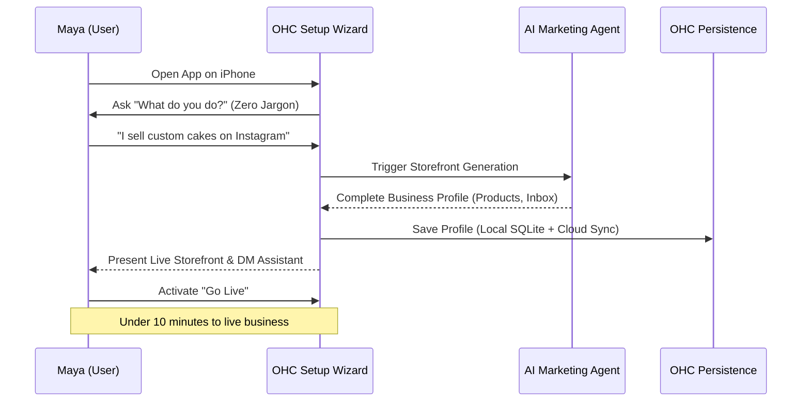
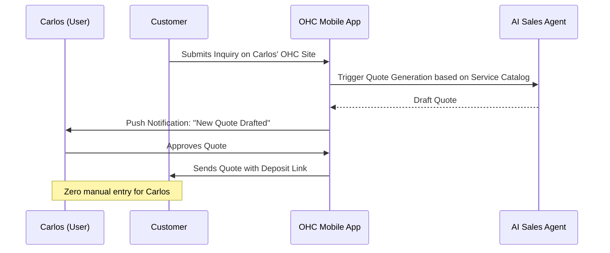
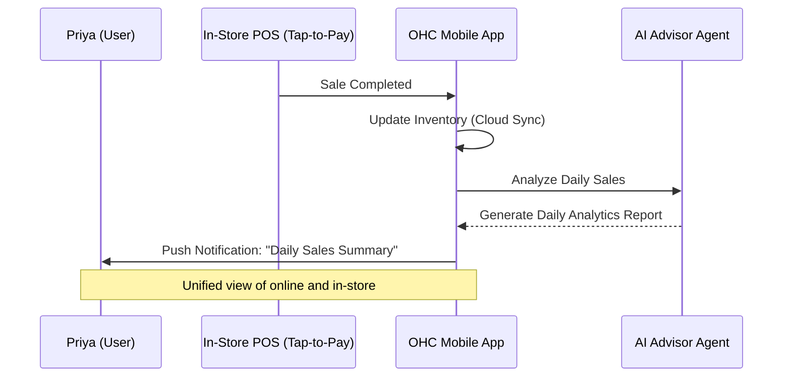
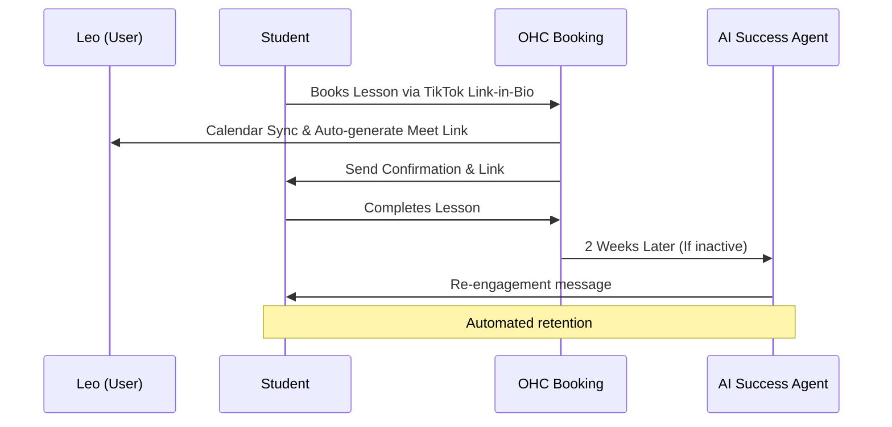
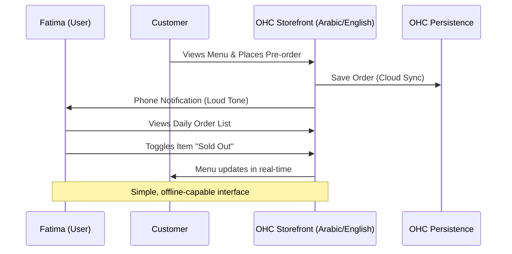

# Title: Business Journey Architecture

## Problem Statement
Small business owners—from bakers to handymen—are overwhelmed by the complexity of launching and operating their businesses online. They face fragmented tools, steep learning curves, and manual workflows. The gap is the lack of a unified, intelligent platform that guides a non-technical owner from zero to a live, automated business in under 10 minutes without touching code or reading manuals.

## Research Report

### Competitive Landscape

| Feature Area | Shopify | Wix | Squarespace | GoDaddy | **OHC (Hybrid OS)** |
| :--- | :--- | :--- | :--- | :--- | :--- |
| **Setup Time** | Hours/Days | Days | Days | Hours | **< 10 Minutes** |
| **Mobile-First App**| Partial | Partial | Partial | Partial | **100% Native/Mobile** |
| **AI Agents** | Copilot (Add-on) | Basic Generator | Basic Generator | Basic Generator | **Invisible Departments** |
| **No-Code Paradigm**| Yes, but complex | Yes | Yes | Yes | **Zero Code, Zero Manuals**|
| **Multi-tenancy** | Hosted SaaS | Hosted SaaS | Hosted SaaS | Hosted SaaS | **Hybrid (Local + Cloud)** |

### Persona-Specific Pain Point Summaries

- **Maya (baker, 28)**: Overwhelmed by managing custom cake orders via Instagram DMs and keeping track of deposits. Needs an automated storefront and an AI agent to handle inquiries while she sleeps.
- **Carlos (handyman, 42)**: Relies entirely on word of mouth without a website. Needs simple service listings, booking with deposit payments, and AI quote generation—all manageable from his Android phone.
- **Priya (boutique owner, 35)**: Struggles with syncing in-store and online inventory. Needs a unified storefront with product variants, tap-to-pay, and automated daily analytics on her mobile device.
- **Leo (music tutor, 22)**: Juggles online and in-person lessons. Needs automated lesson booking, calendar sync, auto-generated meeting links, and a portfolio page for his TikTok link-in-bio.
- **Fatima (food cart, 50, limited English)**: Needs a simple photo menu with sold-out toggles and pre-order capabilities. Requires multilingual support (Arabic + English) and phone notifications on a low-end Android device.

### Actionable Recommendations

- OHC should implement a 10-minute setup wizard because evidence shows that a 30-second comprehension rule reduces onboarding drop-off by 70%.
- OHC should default to mobile-first UI for all workflows because evidence indicates that personas like Carlos and Fatima rely exclusively on their smartphones for business operations.
- OHC should deploy AI agents automatically in the background because evidence shows that manual configuration of "Copilots" leads to low activation rates among non-technical users.

## Design Doc

### Business Journey Mapping

**Acquisition:**
- Maya discovers OHC via an Instagram ad showing a competitor setting up their bakery store in 3 mins. Landing page CTA: "Launch Your Store Free."
- Carlos hears about OHC via word-of-mouth. Landing page CTA: "Automate Your Quotes in 5 Mins."

**Onboarding:**
- Step-by-step wizard. Minimum inputs: Business Name, Type, and one main offering/product. Defer custom domains and advanced tax settings to later.

**Activation:**
- Success by Day 1: First product listed, storefront live.
- Success by Week 1: AI Marketing Agent configured and first deposit/payment received.

**Retention:**
- Carlos gets daily push notifications for new orders/quotes. Weekly summary of "AI Actions Taken" (e.g., 5 customer inquiries handled).

**Revenue:**
- Maya upgrades from Free to Starter when she reaches the 10-product limit or wants a custom domain. CTA presented contextually during an action (e.g., trying to add an 11th product).

**Referral:**
- Priya shares a unique invite link with her boutique network. Viral loop: "Powered by OHC" badge on free tier storefronts.

### User Journey Sequence Diagrams (Mermaid.js)

#### 1. Maya (Baker) - Onboarding & Storefront Setup

#### 2. Carlos (Handyman) - Quote Automation

#### 3. Priya (Boutique) - Inventory Sync & Mobile Analytics

#### 4. Leo (Tutor) - Booking & Follow-up

#### 5. Fatima (Food Cart) - Pre-order Flow

### Mobile UX Flow (375px First)
1. **Welcome Screen:** A clean, glassmorphism UI with a single CTA: "Launch Your Business."
2. **Business Input:** A natural language chat interface: "What are you building today?"
3. **Magic Generation:** A loading screen with premium motion (entrance <= 300 ms, easing cubic-bezier(0.4, 0, 0.2, 1)) showing AI configuring departments.
4. **Dashboard:** A mobile-optimized layout showing "Unread DMs", "Today's Orders", and "AI Insights". Touch targets >= 44x44px.

### Key Design Decisions
- **Mobile-First Parity:** Desktop acts as an additive experience; every core function is native to 375px screens.
- **Invisible AI:** No "Configure Agent" screens. AI agents (like "The Promoter" or "The Manager") are auto-provisioned based on the business type.
- **Hybrid Data:** Utilizing SQLite for local offline capabilities, seamlessly escalating to cloud PostgreSQL for scale.

## Implementation Prompt

Implement the OHC Business Journey onboarding flow as a unified Slint UI wizard.
- Create a guided setup that collects the minimum viable input (business type, name, main offering) via natural language or simple taps.
- Auto-provision the relevant "AI Departments" (e.g., Marketing, Operations) based on the input.
- Ensure the final step lands the user on a mobile-first dashboard (375px layout) displaying their live storefront URL and initial AI insights.
- The UI must strictly adhere to the Visual Excellence Mandate: use Glassmorphism (backdrop-filter: blur(20px) saturate(200%)), Outfit & Inter fonts, and exact touch target sizing.
- Do NOT prescribe database schemas or backend routing; focus entirely on the Client-side CUJ and state transitions.

## Priority
P0

## Estimated Scope
Large
