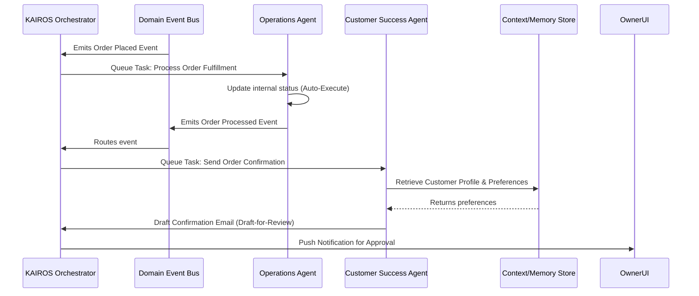

# Issue Brief: Autonomous AI Background Agents for Operations

## Problem Statement
Small business owners (like Carlos the Handyman or Maya the Baker) are overwhelmed by manual tasks: answering repetitive questions, writing product descriptions, and following up on incomplete bookings. Competitor platforms (Shopify, Wix) treat AI as a reactive chatbot or a one-time setup tool. Users need AI that operates autonomously in the background, acting as true functional departments (Customer Success, Operations, Marketing) rather than mere prompt-and-response tools.

## Research Report
Based on an analysis of Shopify, Wix, Squarespace, and GoDaddy, as well as Reddit/App Store user complaints:
- **Shopify & Wix** offer AI (Sidekick, ADI), but they require the user to initiate actions.
- **Top User Complaints** highlight the burden of constant customer communication and the fatigue of managing inventory descriptions.
- **Opportunity:** OHC can leapfrog competitors by implementing autonomous, background AI agents that continuously monitor the business state and take action on behalf of the owner, thereby fulfilling the promise of "AI does the heavy lifting invisibly."

## Design Doc
### High-Level Architecture
- **Agent Roles:** Implement specific agent personas corresponding to business departments (e.g., "The Ambassador" for Customer Success, "The Operations Manager" for Operations, "The Promoter" for Marketing & Advertising).
- **Event-Driven Triggers:** Agents must be triggered by domain events (e.g., `MessageReceived`, `CartAbandoned`, `InventoryAdded`, `OrderPlaced`) rather than direct user prompts.
- **Department Coordination:** When one agent completes a task, it must emit a standardized event so the Orchestrator can trigger downstream agents (e.g., Operations finishes an order -> Customer Success sends a confirmation -> Finance tracks the payment).
- **State & Job Management:** Utilize a robust job queue to ensure reliable processing of background tasks, with built-in retry mechanisms and dead-letter handling. Do not prescribe specific queue technologies.
- **Context & Memory:** Agents must maintain short-term context (the current task payload) and access a persistent, tenant-isolated memory layer (e.g., past interactions, preferences) to provide personalized responses.
- **Usage Budgets & Throttling:** The orchestrator must track and limit AI actions according to the multi-tenant SaaS tier limits (e.g., Free vs. Starter vs. Pro), ensuring no single tenant degrades platform performance.
- **Approval Workflows:** High-risk external actions (like sending an email to a customer) must enter a "Draft-for-Review" state, requiring 1-tap owner approval. Low-risk internal actions can auto-execute.

### Architecture Diagram

### UI Wireframes (375px First)
- **Home Screen:** A prominent, non-intrusive feed titled "Agent Actions Today" (e.g., "The Ambassador drafted 3 replies to Instagram DMs", "The Promoter scheduled a post for the new Vegan Cake").
- **Detail View:** Tapping an action allows the owner to read the draft and click "Approve & Send" or "Edit".
- **Settings:** A simple toggle screen to enable/disable specific autonomous behaviors (e.g., "Auto-reply to common questions", "Auto-draft social posts").

## Implementation Prompt
Implement the backend event processing loop and orchestrator logic to enable autonomous AI actions across the functional departments. The system must listen for standard business events (e.g., incoming messages, order placement) and queue tasks for the appropriate AI agent. Ensure the orchestrator handles tier-based budgeting, memory retrieval, and approval states (draft-for-review vs. auto-execute). Create the Flutter mobile UI (ensuring perfect rendering at 375px) to display the "Agent Activity Feed" on the home dashboard, allowing users to review and approve drafted actions.

## Priority
P0

## Estimated Scope
Large
