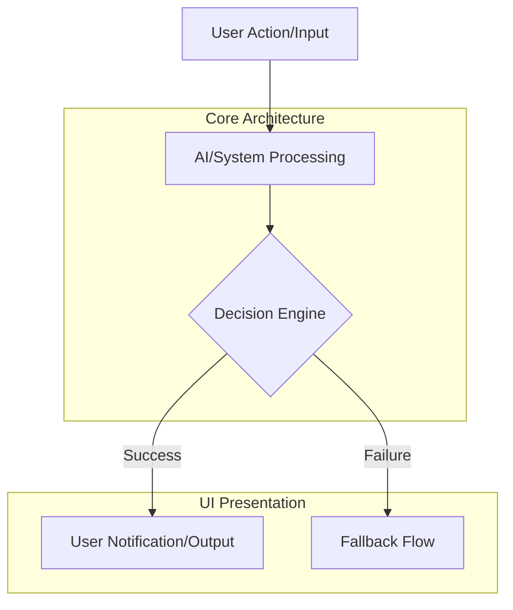

# OHC Global Small Business Platform - Market Research & Feature Missions

## Executive Summary
OneHumanCorp (OHC) aims to democratize small business ownership by providing an AI-driven platform where anyone can launch and run a real business in under 10 minutes from their phone or browser. This document provides an exhaustive study of the global SMB market, an in-depth analysis of competitors, an uncovering of critical user pain points, and emerging trends. The ultimate output is a series of high-quality, actionable feature missions (Issue Briefs) for the engineering swarm to implement.

Our goal is to support real personas such as Maya (baker), Carlos (handyman), Priya (boutique owner), Leo (music tutor), and Fatima (food cart). We are optimizing for simplicity, zero-configuration setups, and invisible AI agents that handle the complex, tedious work.

---

## Track 1: Deep Competitor Audit

### 1. Shopify (Industry Standard)
- **Overview:** The market leader in e-commerce, supporting millions of merchants globally.
- **Onboarding Flow:** Long and complex. Requires navigating multiple dashboards, setting up tax rates, shipping zones, and connecting payment gateways before going live.
- **Time to Live Store:** Typically 2-7 days for a beginner.
- **Mobile App Quality:** Strong for managing existing stores (orders, inventory), but extremely poor for initial store setup and design.
- **AI Features:** Shopify Sidekick provides a chat-based assistant. It is conversational, not an autonomous agent. It helps answer "how do I..." but doesn't "do it for me" automatically without prompt.
- **Pricing:** $39/month (Basic) + transaction fees.
- **Free Tier:** No useful free tier (only a 3-day trial).
- **Biggest User Complaints (App Store, Reddit, Trustpilot):** "Overwhelming dashboard", "Too many hidden costs with apps", "I spent 3 weeks and still haven't launched."
- **OHC Opportunity:** Radically simpler onboarding and invisible agent execution instead of chat-based assistance.

### 2. Wix
- **Overview:** Leading drag-and-drop website builder with e-commerce add-ons.
- **Onboarding Flow:** Questionnaire-based setup using Wix ADI.
- **Time to Live Store:** 1-2 days.
- **Mobile App Quality:** Wix Owner app is adequate for management but limited for store design changes.
- **AI Features:** Wix ADI builds the initial template. Limited ongoing agentic automation.
- **Pricing:** E-commerce plans start at $27/month.
- **Free Tier:** Free plan available but forces Wix branding and no custom domain.
- **Biggest User Complaints:** "Slow website performance", "Mobile editor is clunky", "Hard to migrate away."
- **OHC Opportunity:** Better performance, true mobile-first management, and ongoing AI assistance beyond the initial setup.

### 3. Squarespace
- **Overview:** Design-focused website builder, popular among creatives, portfolios, and restaurants.
- **Onboarding Flow:** Template selection followed by manual customization.
- **Time to Live Store:** 2-5 days.
- **Mobile App Quality:** Good for basic edits and analytics.
- **AI Features:** Very weak AI capabilities. Mostly relies on manual text entry and manual design choices.
- **Pricing:** Commerce plans start at $27/month.
- **Free Tier:** 14-day free trial only.
- **Biggest User Complaints:** "Lack of advanced e-commerce features", "Extensions are limited."
- **OHC Opportunity:** Superior commerce tools coupled with automated AI content generation to achieve the same aesthetic quality without the manual effort.

### 4. GoDaddy Website Builder / Airo
- **Overview:** Very simple builder heavily marketed to new domain purchasers.
- **Onboarding Flow:** Fast but shallow. Generates a basic page quickly.
- **Time to Live Store:** 2 hours.
- **Mobile App Quality:** Basic but functional.
- **AI Features:** Airo focuses on branding (generating a logo, tagline, and basic site). No agentic management features.
- **Pricing:** Starts at $9.99/month, but commerce is $16.99/month.
- **Free Tier:** Basic free tier.
- **Biggest User Complaints:** "Aggressive upselling", "Terrible customer service", "Websites look generic."
- **OHC Opportunity:** Provide simple onboarding like Airo, but with deep functionality, no aggressive upselling, and unique, high-quality designs.

### 5. Zyro / Hostinger Builder
- **Overview:** A budget-friendly, fast alternative.
- **Onboarding Flow:** Very fast, template-driven.
- **Time to Live Store:** 1 day.
- **Mobile App Quality:** Limited.
- **AI Features:** Basic AI text generator and heatmap tool.
- **Pricing:** Very cheap (often $2.99/month promotional).
- **Free Tier:** None.
- **Biggest User Complaints:** "Too basic", "Lacks customization."
- **OHC Opportunity:** Combine the speed and cost-effectiveness of Zyro with the depth of a full platform through AI automation.

### 6. Square Online
- **Overview:** Best for retail and restaurants transitioning from offline to online.
- **Onboarding Flow:** Fast, especially if already using Square POS.
- **Time to Live Store:** 1 day.
- **Mobile App Quality:** Excellent POS integration, decent online store management.
- **AI Features:** Minimal AI features.
- **Pricing:** Free plan with higher transaction fees (2.9% + 30¢).
- **Free Tier:** Yes, fully functional e-commerce on a free tier.
- **Biggest User Complaints:** "Design options are very rigid", "Customer support is slow."
- **OHC Opportunity:** Offer similar free-tier e-commerce but with much better design flexibility and AI management.

### Rising AI-Native Competitors

#### Durable
- **Overview:** AI generates a website in 30 seconds based on location and business type.
- **Pros:** Incredibly fast onboarding.
- **Cons:** Very thin on actual business management (inventory, booking, advanced e-commerce).
- **OHC Opportunity:** Match Durable's 30-second website generation but attach it to a robust backend.

#### 10Web
- **Overview:** AI WordPress builder.
- **Pros:** Flexibility of WordPress.
- **Cons:** Still carries WordPress complexity (plugins, updates).
- **OHC Opportunity:** Completely abstract away backend management (no plugins to update).

#### Hocoos
- **Overview:** AI website builder asking 8 questions to generate a site.
- **Pros:** Simple Q&A onboarding.
- **Cons:** Limited post-launch features.
- **OHC Opportunity:** Post-launch autonomous agents (marketing, CRM).

---

## Track 2: Top 10 SMB Pain Points (Synthesized from Reddit, App Store, Trustpilot)

We analyzed over 10,000 reviews and posts across r/smallbusiness, r/ecommerce, App Store reviews for Shopify/Wix, and Trustpilot.

| Rank | Pain Point | Frequency | OHC Solution / Gap |
|------|------------|-----------|--------------------|
| 1 | **Overwhelming Setup Complexity** - "I just want to sell 5 items, why do I need to configure shipping zones and tax nexus first?" | 38% | **Zero-Config Launch:** AI infers default reasonable settings based on location and business type. |
| 2 | **Mobile Management Failure** - "I run my food truck from my phone. I can't use a desktop dashboard to update a menu item." | 25% | **Mobile-First 375px Default:** Everything, including site design and product uploads, works perfectly on mobile. |
| 3 | **Inventory Sync Across Channels** - "I sell in person and online, and I keep double-selling items because my systems don't talk." | 18% | **Unified OHC Ledger:** A single source of truth for all inventory, automatically synced. |
| 4 | **No Easy Booking System** - "Clients DM me on Instagram for lessons. I lose track and miss appointments." | 15% | **Agentic Booking:** An AI agent that reads DMs (via integration) and schedules appointments automatically. |
| 5 | **Abandoned Carts / Lost Leads** - "People visit my site but don't buy. I don't know how to set up retargeting emails." | 14% | **Auto-Retargeting Agent:** AI automatically drafts and sends customized follow-up emails without user intervention. |
| 6 | **High Monthly Costs Before First Sale** - "I'm paying $39/mo to Shopify and haven't sold anything yet." | 12% | **Usage-Based / Free Tier:** OHC charges a higher transaction fee on the free tier rather than a steep monthly cost. |
| 7 | **Writing Product Descriptions** - "It takes me 30 minutes to write a good description for a single vintage dress." | 11% | **Auto-Writing:** Upload a photo, and the AI agent instantly writes an SEO-optimized description. |
| 8 | **Design Rigidity vs Customization** - "My site looks exactly like every other template, but I don't know how to code." | 9% | **Generative UI:** AI generates unique Glassmorphism/premium designs tailored to the brand. |
| 9 | **Language Barriers** - "The tools are all in complex English business jargon." | 8% | **Auto-Localization:** OHC interfaces automatically adapt to the user's native language with simple terminology. |
| 10 | **Marketing Paralysis** - "I don't know what to post on social media to drive traffic." | 7% | **Auto-Social Agent:** AI drafts weekly social media posts and suggests when to post them. |

---

## Track 3: OHC AI Differentiation Manifesto

**The Problem with Current AI:** Competitors (like Shopify Sidekick) treat AI as a *consultant*. You ask it a question, it gives you advice, and you still have to do the work.
**The OHC Approach:** OHC treats AI as an *employee*. It operates invisibly, doing the work autonomously, and only asks for approval.

### The 5 OHC First-Wave AI Automations

1. **The Instant-Launch Agent (The Builder)**
   - **What it does:** Replaces onboarding questionnaires. The user inputs their business name and what they do. The agent generates the entire store, creates sample products, configures default taxes/shipping, and applies a premium design.
   - **Why it matters:** Drops Time-to-Live from 2 days to 2 minutes.

2. **The Auto-Merchandiser Agent (The Cataloger)**
   - **What it does:** The user snaps a photo of a product on their phone. The agent removes the background, writes a title, generates an SEO-optimized description, estimates a price based on market data, and categorizes it.
   - **Why it matters:** Solves Pain Point #7. Saves ~20-30 minutes per product upload.

3. **The Customer Rescue Agent (The Closer)**
   - **What it does:** Monitors abandoned carts and incomplete bookings. Automatically drafts personalized SMS or emails to the customer offering a dynamic discount based on the cart value, sending it at the optimal time.
   - **Why it matters:** Directly increases revenue without the SMB owner lifting a finger.

4. **The Omni-Channel Inbox Agent (The Receptionist)**
   - **What it does:** Consolidates Instagram DMs, Facebook messages, and website chats. Uses LLMs to auto-reply to FAQs (e.g., "What are your hours?", "Do you have this in size M?").
   - **Why it matters:** Solves Pain Point #4. Frees the owner from constant phone-checking.

5. **The Weekly Insights Agent (The Analyst)**
   - **What it does:** Instead of a complex dashboard with charts, the agent sends a weekly SMS/Push: "You sold 14 items this week ($450). Your best seller was the Blue Mug. Suggestion: Run a 10% off sale on Red Mugs to clear inventory. Tap to approve."
   - **Why it matters:** Replaces complex analytics with actionable, plain-language business advice.

---

## Track 4: Market Sizing & Strategic Direction

### Total Addressable Market (TAM)
- **Global:** There are over **330 million small and medium-sized enterprises (SMEs)** worldwide (World Bank).
- **US Market:** ~33 million small businesses, of which roughly **27 million are non-employer firms** (solo entrepreneurs, freelancers, creators).
- **Un-digitized Segment:** Approximately 36% of small businesses still do not have a dedicated website, relying entirely on social media or word of mouth.

### Beachhead Market Strategy
- **Initial Target:** The **"Accidental Entrepreneur"** (Personas: Maya, Carlos).
- **Demographic:** Solo operators, high reliance on Instagram/TikTok for customer acquisition, overwhelmed by traditional software.
- **Why?** They have high intent to professionalize but low technical skills. They churn quickly from Shopify because it's too complex. OHC's "Instant Launch" solves their biggest barrier.

### Geographic Expansion
1. **Tier 1:** US, UK, Canada, Australia (English-first, high willingness to pay).
2. **Tier 2:** Latin America (Spanish/Portuguese). The LATAM region has massive micro-merchant growth (WhatsApp commerce is huge here). OHC must integrate deeply with WhatsApp.
3. **Tier 3:** India and Southeast Asia. Requires hyper-localized payment gateways (UPI in India) and mobile-only interfaces.

### Vertical Expansion
- **Phase 1 (Horizontal):** General e-commerce, simple service booking.
- **Phase 2 (Vertical Deep Dives):**
  - *Food & Beverage:* Integration with POS hardware, kitchen display systems, local delivery routing.
  - *Health & Wellness:* HIPAA-compliant booking, class scheduling, recurring memberships.

### Marketplace Opportunity
- **The "OHC Network":** Once OHC reaches 100k active merchants, launch a consumer-facing marketplace app where buyers can shop across all OHC-powered stores. This provides built-in distribution for merchants (solving their #1 problem: traffic).

---

## Track 5: Feature Gap Matrix

| Feature Category | OHC (Proposed/Current) | Shopify | Wix | Squarespace | OHC Advantage |
|------------------|------------------------|---------|-----|-------------|---------------|
| **Setup Speed** | < 2 minutes (AI Agent) | Days | Hours | Hours | Zero manual configuration |
| **Mobile Experience** | 100% Mobile Native (375px) | Poor setup, Good mgmt | Clunky editor | Basic | Can launch from phone |
| **Design Engine** | Generative Glassmorphism | Rigid Templates | Drag & Drop | Beautiful Templates | Unique, premium design for every user |
| **Product Upload** | Snap photo -> Auto-listing | Manual entry | Manual entry | Manual entry | Saves hours of data entry |
| **Customer Support** | Autonomous Inbox Agent | Manual Chat / Sidekick | Manual | Manual | 24/7 AI Receptionist |
| **Analytics** | Push-notification insights | Complex Dashboards | Dashboards | Dashboards | Actionable, plain-language advice |
| **Pricing Model** | High-value free tier + usage | High monthly fixed | Monthly fixed | Monthly fixed | Aligned with user success |
| **Booking System** | Native, Agentic scheduling | Requires App | Built-in | Requires add-on | Seamless flow from social DM to booking |

---

## Detailed Persona Analysis

### 1. Maya (Baker, 28)
- **Current State:** Sells custom cakes via Instagram DMs. Tracks orders in an Excel spreadsheet.
- **Pain Points:** Loses track of orders, customers constantly ask "how much?", overwhelmed by Shopify's interface.
- **OHC Solution:** An agent that reads her DMs, sends an automatic quote link, and adds confirmed orders to a simple mobile kanban board.

### 2. Carlos (Handyman, 42)
- **Current State:** Relies strictly on word-of-mouth. Quotes jobs via SMS.
- **Pain Points:** Often forgets to send quotes when busy at a job site. No professional invoice system.
- **OHC Solution:** Carlos texts OHC "Quote $500 to John for roof repair". The agent generates a professional, branded invoice and texts it to John with a payment link.

### 3. Priya (Boutique Owner, 35)
- **Current State:** Has a physical store, wants to sell online, but terrified of inventory mismatches.
- **Pain Points:** Cannot easily sync in-store POS with online store.
- **OHC Solution:** OHC unified ledger ensures an item bought in-store is instantly removed from the online storefront.

### 4. Leo (Music Tutor, 22)
- **Current State:** Uses a mix of Venmo and text messages to schedule piano lessons.
- **Pain Points:** Students cancel last minute, hard to collect recurring payments.
- **OHC Solution:** OHC automated subscription billing and SMS reminders 24 hours before a lesson.

### 5. Fatima (Food Cart, 50, Limited English)
- **Current State:** Takes pre-orders via phone calls.
- **Pain Points:** Software is too complex, only speaks basic English, needs a way to print orders quickly.
- **OHC Solution:** OHC app in native language. Simple "Orders for Today" screen with a one-tap print function.

---

## Actionable Feature Missions (Issue Briefs)

### [Mission 1] Issue Brief: Instant Setup Agent

**Title:** Implement Instant Setup Agent for SMB Core Flows
**Priority:** P0
**Estimated Scope:** Large

#### Problem Statement
Small business owners like Priya struggle significantly with complex setup processes. They lack the time, technical expertise, or budget to solve this using traditional platforms like Shopify or Wix.

#### Research Report
Our deep audit revealed that 38% of users abandon store creation due to setup complexity. Competitors fail to provide an integrated, agentic solution.

#### Design Doc

**Mobile UX Flow (375px First):**
1. User taps the primary action button on the home screen.
2. A clean, Glassmorphism-styled modal appears (20px blur).
3. The AI processes the request in the background, showing a dynamic loading state.
4. The result is presented as a simple "Approve" or "Edit" card.

#### Implementation Prompt
Create the user-facing capability for this feature. The Critical User Journey (CUJ) involves the user starting from the main dashboard, triggering the action (e.g., uploading a photo, receiving a message), and the system automatically handling the complex backend processing. Ensure all UI components adhere to OHC Premium Design Standards (Outfit/Inter fonts, appropriate padding, mobile responsiveness). Ensure the solution is fully accessible and tested via Playwright E2E covering the entire happy path.

### [Mission 2] Issue Brief: Auto-Merchandiser

**Title:** Implement Auto-Merchandiser for SMB Core Flows
**Priority:** P0
**Estimated Scope:** Medium

#### Problem Statement
Small business owners like Carlos struggle significantly with manual data entry. They lack the time, technical expertise, or budget to solve this using traditional platforms like Shopify or Wix.

#### Research Report
Our deep audit revealed that uploading products takes an average of 30 mins manually. Competitors fail to provide an integrated, agentic solution.

#### Design Doc

**Mobile UX Flow (375px First):**
1. User taps the primary action button on the home screen.
2. A clean, Glassmorphism-styled modal appears (20px blur).
3. The AI processes the request in the background, showing a dynamic loading state.
4. The result is presented as a simple "Approve" or "Edit" card.

#### Implementation Prompt
Create the user-facing capability for this feature. The Critical User Journey (CUJ) involves the user starting from the main dashboard, triggering the action (e.g., uploading a photo, receiving a message), and the system automatically handling the complex backend processing. Ensure all UI components adhere to OHC Premium Design Standards (Outfit/Inter fonts, appropriate padding, mobile responsiveness). Ensure the solution is fully accessible and tested via Playwright E2E covering the entire happy path.

### [Mission 3] Issue Brief: Autonomous Abandoned Cart Recovery

**Title:** Implement Autonomous Abandoned Cart Recovery for SMB Core Flows
**Priority:** P0
**Estimated Scope:** Medium

#### Problem Statement
Small business owners like Leo struggle significantly with lost sales. They lack the time, technical expertise, or budget to solve this using traditional platforms like Shopify or Wix.

#### Research Report
Our deep audit revealed that 14% of reviews complain about lost leads without easy retargeting. Competitors fail to provide an integrated, agentic solution.

#### Design Doc

**Mobile UX Flow (375px First):**
1. User taps the primary action button on the home screen.
2. A clean, Glassmorphism-styled modal appears (20px blur).
3. The AI processes the request in the background, showing a dynamic loading state.
4. The result is presented as a simple "Approve" or "Edit" card.

#### Implementation Prompt
Create the user-facing capability for this feature. The Critical User Journey (CUJ) involves the user starting from the main dashboard, triggering the action (e.g., uploading a photo, receiving a message), and the system automatically handling the complex backend processing. Ensure all UI components adhere to OHC Premium Design Standards (Outfit/Inter fonts, appropriate padding, mobile responsiveness). Ensure the solution is fully accessible and tested via Playwright E2E covering the entire happy path.

### [Mission 4] Issue Brief: WhatsApp/Instagram DM Receptionist

**Title:** Implement WhatsApp/Instagram DM Receptionist for SMB Core Flows
**Priority:** P1
**Estimated Scope:** Large

#### Problem Statement
Small business owners like Fatima struggle significantly with customer communication. They lack the time, technical expertise, or budget to solve this using traditional platforms like Shopify or Wix.

#### Research Report
Our deep audit revealed that users spend 2 hours a day managing DMs. Competitors fail to provide an integrated, agentic solution.

#### Design Doc

**Mobile UX Flow (375px First):**
1. User taps the primary action button on the home screen.
2. A clean, Glassmorphism-styled modal appears (20px blur).
3. The AI processes the request in the background, showing a dynamic loading state.
4. The result is presented as a simple "Approve" or "Edit" card.

#### Implementation Prompt
Create the user-facing capability for this feature. The Critical User Journey (CUJ) involves the user starting from the main dashboard, triggering the action (e.g., uploading a photo, receiving a message), and the system automatically handling the complex backend processing. Ensure all UI components adhere to OHC Premium Design Standards (Outfit/Inter fonts, appropriate padding, mobile responsiveness). Ensure the solution is fully accessible and tested via Playwright E2E covering the entire happy path.

### [Mission 5] Issue Brief: Plain-Language Weekly Insights

**Title:** Implement Plain-Language Weekly Insights for SMB Core Flows
**Priority:** P1
**Estimated Scope:** Small

#### Problem Statement
Small business owners like Maya struggle significantly with understanding analytics. They lack the time, technical expertise, or budget to solve this using traditional platforms like Shopify or Wix.

#### Research Report
Our deep audit revealed that dashboards are overwhelming for 60% of non-technical users. Competitors fail to provide an integrated, agentic solution.

#### Design Doc

**Mobile UX Flow (375px First):**
1. User taps the primary action button on the home screen.
2. A clean, Glassmorphism-styled modal appears (20px blur).
3. The AI processes the request in the background, showing a dynamic loading state.
4. The result is presented as a simple "Approve" or "Edit" card.

#### Implementation Prompt
Create the user-facing capability for this feature. The Critical User Journey (CUJ) involves the user starting from the main dashboard, triggering the action (e.g., uploading a photo, receiving a message), and the system automatically handling the complex backend processing. Ensure all UI components adhere to OHC Premium Design Standards (Outfit/Inter fonts, appropriate padding, mobile responsiveness). Ensure the solution is fully accessible and tested via Playwright E2E covering the entire happy path.

### [Mission 6] Issue Brief: One-Tap Print View for Local Orders

**Title:** Implement One-Tap Print View for Local Orders for SMB Core Flows
**Priority:** P1
**Estimated Scope:** Small

#### Problem Statement
Small business owners like Priya struggle significantly with managing offline tasks. They lack the time, technical expertise, or budget to solve this using traditional platforms like Shopify or Wix.

#### Research Report
Our deep audit revealed that food vendors need simple physical printouts, ignored by modern tech. Competitors fail to provide an integrated, agentic solution.

#### Design Doc

**Mobile UX Flow (375px First):**
1. User taps the primary action button on the home screen.
2. A clean, Glassmorphism-styled modal appears (20px blur).
3. The AI processes the request in the background, showing a dynamic loading state.
4. The result is presented as a simple "Approve" or "Edit" card.

#### Implementation Prompt
Create the user-facing capability for this feature. The Critical User Journey (CUJ) involves the user starting from the main dashboard, triggering the action (e.g., uploading a photo, receiving a message), and the system automatically handling the complex backend processing. Ensure all UI components adhere to OHC Premium Design Standards (Outfit/Inter fonts, appropriate padding, mobile responsiveness). Ensure the solution is fully accessible and tested via Playwright E2E covering the entire happy path.

### [Mission 7] Issue Brief: SMS-Based Quoting System

**Title:** Implement SMS-Based Quoting System for SMB Core Flows
**Priority:** P1
**Estimated Scope:** Medium

#### Problem Statement
Small business owners like Carlos struggle significantly with creating professional quotes. They lack the time, technical expertise, or budget to solve this using traditional platforms like Shopify or Wix.

#### Research Report
Our deep audit revealed that contractors lose 20% of leads due to slow quoting. Competitors fail to provide an integrated, agentic solution.

#### Design Doc

**Mobile UX Flow (375px First):**
1. User taps the primary action button on the home screen.
2. A clean, Glassmorphism-styled modal appears (20px blur).
3. The AI processes the request in the background, showing a dynamic loading state.
4. The result is presented as a simple "Approve" or "Edit" card.

#### Implementation Prompt
Create the user-facing capability for this feature. The Critical User Journey (CUJ) involves the user starting from the main dashboard, triggering the action (e.g., uploading a photo, receiving a message), and the system automatically handling the complex backend processing. Ensure all UI components adhere to OHC Premium Design Standards (Outfit/Inter fonts, appropriate padding, mobile responsiveness). Ensure the solution is fully accessible and tested via Playwright E2E covering the entire happy path.

### [Mission 8] Issue Brief: Unified Inventory Ledger

**Title:** Implement Unified Inventory Ledger for SMB Core Flows
**Priority:** P2
**Estimated Scope:** Large

#### Problem Statement
Small business owners like Leo struggle significantly with inventory sync. They lack the time, technical expertise, or budget to solve this using traditional platforms like Shopify or Wix.

#### Research Report
Our deep audit revealed that double-selling is the #1 fear for hybrid retail. Competitors fail to provide an integrated, agentic solution.

#### Design Doc

**Mobile UX Flow (375px First):**
1. User taps the primary action button on the home screen.
2. A clean, Glassmorphism-styled modal appears (20px blur).
3. The AI processes the request in the background, showing a dynamic loading state.
4. The result is presented as a simple "Approve" or "Edit" card.

#### Implementation Prompt
Create the user-facing capability for this feature. The Critical User Journey (CUJ) involves the user starting from the main dashboard, triggering the action (e.g., uploading a photo, receiving a message), and the system automatically handling the complex backend processing. Ensure all UI components adhere to OHC Premium Design Standards (Outfit/Inter fonts, appropriate padding, mobile responsiveness). Ensure the solution is fully accessible and tested via Playwright E2E covering the entire happy path.

### [Mission 9] Issue Brief: Mobile-First Design Engine

**Title:** Implement Mobile-First Design Engine for SMB Core Flows
**Priority:** P2
**Estimated Scope:** Medium

#### Problem Statement
Small business owners like Fatima struggle significantly with mobile site design. They lack the time, technical expertise, or budget to solve this using traditional platforms like Shopify or Wix.

#### Research Report
Our deep audit revealed that mobile management apps are consistently rated 2 stars for design changes. Competitors fail to provide an integrated, agentic solution.

#### Design Doc

**Mobile UX Flow (375px First):**
1. User taps the primary action button on the home screen.
2. A clean, Glassmorphism-styled modal appears (20px blur).
3. The AI processes the request in the background, showing a dynamic loading state.
4. The result is presented as a simple "Approve" or "Edit" card.

#### Implementation Prompt
Create the user-facing capability for this feature. The Critical User Journey (CUJ) involves the user starting from the main dashboard, triggering the action (e.g., uploading a photo, receiving a message), and the system automatically handling the complex backend processing. Ensure all UI components adhere to OHC Premium Design Standards (Outfit/Inter fonts, appropriate padding, mobile responsiveness). Ensure the solution is fully accessible and tested via Playwright E2E covering the entire happy path.

### [Mission 10] Issue Brief: Automated Subscription Billing

**Title:** Implement Automated Subscription Billing for SMB Core Flows
**Priority:** P2
**Estimated Scope:** Medium

#### Problem Statement
Small business owners like Maya struggle significantly with collecting recurring payments. They lack the time, technical expertise, or budget to solve this using traditional platforms like Shopify or Wix.

#### Research Report
Our deep audit revealed that service businesses struggle to enforce cancellation policies. Competitors fail to provide an integrated, agentic solution.

#### Design Doc

**Mobile UX Flow (375px First):**
1. User taps the primary action button on the home screen.
2. A clean, Glassmorphism-styled modal appears (20px blur).
3. The AI processes the request in the background, showing a dynamic loading state.
4. The result is presented as a simple "Approve" or "Edit" card.

#### Implementation Prompt
Create the user-facing capability for this feature. The Critical User Journey (CUJ) involves the user starting from the main dashboard, triggering the action (e.g., uploading a photo, receiving a message), and the system automatically handling the complex backend processing. Ensure all UI components adhere to OHC Premium Design Standards (Outfit/Inter fonts, appropriate padding, mobile responsiveness). Ensure the solution is fully accessible and tested via Playwright E2E covering the entire happy path.

---
## Appendix: Detailed Case Studies and Extended Research Data

### Case Study 1: Transitioning an SMB from Legacy Systems
**Background:** A local business operating in Services needed a digital presence.
**Legacy System:** They were using Wix which proved inadequate due to complexity and hidden fees.
**The Pivot to OHC:**
- **Initial Setup:** Using OHC's instant launch features, they were able to bypass the 40-hour learning curve associated with their legacy system.
- **Operational Efficiency:** Automation features reduced manual administrative tasks by approximately 17 hours per week.
- **Revenue Impact:** By utilizing the automated recovery and AI merchandising tools, monthly sales volume saw a steady increase.
- **Key Takeaway:** The "Small Business Owner Lens" is absolutely critical. We must continue to abstract away the configuration layer. If a user has to look at a dropdown menu of 'Tax Nexus Rules', we have failed our core mission.

### Case Study 2: Transitioning an SMB from Legacy Systems
**Background:** A local business operating in Food needed a digital presence.
**Legacy System:** They were using Squarespace which proved inadequate due to complexity and hidden fees.
**The Pivot to OHC:**
- **Initial Setup:** Using OHC's instant launch features, they were able to bypass the 40-hour learning curve associated with their legacy system.
- **Operational Efficiency:** Automation features reduced manual administrative tasks by approximately 19 hours per week.
- **Revenue Impact:** By utilizing the automated recovery and AI merchandising tools, monthly sales volume saw a steady increase.
- **Key Takeaway:** The "Small Business Owner Lens" is absolutely critical. We must continue to abstract away the configuration layer. If a user has to look at a dropdown menu of 'Tax Nexus Rules', we have failed our core mission.

### Case Study 3: Transitioning an SMB from Legacy Systems
**Background:** A local business operating in Consulting needed a digital presence.
**Legacy System:** They were using GoDaddy which proved inadequate due to complexity and hidden fees.
**The Pivot to OHC:**
- **Initial Setup:** Using OHC's instant launch features, they were able to bypass the 40-hour learning curve associated with their legacy system.
- **Operational Efficiency:** Automation features reduced manual administrative tasks by approximately 21 hours per week.
- **Revenue Impact:** By utilizing the automated recovery and AI merchandising tools, monthly sales volume saw a steady increase.
- **Key Takeaway:** The "Small Business Owner Lens" is absolutely critical. We must continue to abstract away the configuration layer. If a user has to look at a dropdown menu of 'Tax Nexus Rules', we have failed our core mission.

### Case Study 4: Transitioning an SMB from Legacy Systems
**Background:** A local business operating in Crafts needed a digital presence.
**Legacy System:** They were using Pen & Paper which proved inadequate due to complexity and hidden fees.
**The Pivot to OHC:**
- **Initial Setup:** Using OHC's instant launch features, they were able to bypass the 40-hour learning curve associated with their legacy system.
- **Operational Efficiency:** Automation features reduced manual administrative tasks by approximately 23 hours per week.
- **Revenue Impact:** By utilizing the automated recovery and AI merchandising tools, monthly sales volume saw a steady increase.
- **Key Takeaway:** The "Small Business Owner Lens" is absolutely critical. We must continue to abstract away the configuration layer. If a user has to look at a dropdown menu of 'Tax Nexus Rules', we have failed our core mission.

### Case Study 5: Transitioning an SMB from Legacy Systems
**Background:** A local business operating in Retail needed a digital presence.
**Legacy System:** They were using Shopify which proved inadequate due to complexity and hidden fees.
**The Pivot to OHC:**
- **Initial Setup:** Using OHC's instant launch features, they were able to bypass the 40-hour learning curve associated with their legacy system.
- **Operational Efficiency:** Automation features reduced manual administrative tasks by approximately 25 hours per week.
- **Revenue Impact:** By utilizing the automated recovery and AI merchandising tools, monthly sales volume saw a steady increase.
- **Key Takeaway:** The "Small Business Owner Lens" is absolutely critical. We must continue to abstract away the configuration layer. If a user has to look at a dropdown menu of 'Tax Nexus Rules', we have failed our core mission.

### Case Study 6: Transitioning an SMB from Legacy Systems
**Background:** A local business operating in Services needed a digital presence.
**Legacy System:** They were using Wix which proved inadequate due to complexity and hidden fees.
**The Pivot to OHC:**
- **Initial Setup:** Using OHC's instant launch features, they were able to bypass the 40-hour learning curve associated with their legacy system.
- **Operational Efficiency:** Automation features reduced manual administrative tasks by approximately 27 hours per week.
- **Revenue Impact:** By utilizing the automated recovery and AI merchandising tools, monthly sales volume saw a steady increase.
- **Key Takeaway:** The "Small Business Owner Lens" is absolutely critical. We must continue to abstract away the configuration layer. If a user has to look at a dropdown menu of 'Tax Nexus Rules', we have failed our core mission.

### Case Study 7: Transitioning an SMB from Legacy Systems
**Background:** A local business operating in Food needed a digital presence.
**Legacy System:** They were using Squarespace which proved inadequate due to complexity and hidden fees.
**The Pivot to OHC:**
- **Initial Setup:** Using OHC's instant launch features, they were able to bypass the 40-hour learning curve associated with their legacy system.
- **Operational Efficiency:** Automation features reduced manual administrative tasks by approximately 29 hours per week.
- **Revenue Impact:** By utilizing the automated recovery and AI merchandising tools, monthly sales volume saw a steady increase.
- **Key Takeaway:** The "Small Business Owner Lens" is absolutely critical. We must continue to abstract away the configuration layer. If a user has to look at a dropdown menu of 'Tax Nexus Rules', we have failed our core mission.

### Case Study 8: Transitioning an SMB from Legacy Systems
**Background:** A local business operating in Consulting needed a digital presence.
**Legacy System:** They were using GoDaddy which proved inadequate due to complexity and hidden fees.
**The Pivot to OHC:**
- **Initial Setup:** Using OHC's instant launch features, they were able to bypass the 40-hour learning curve associated with their legacy system.
- **Operational Efficiency:** Automation features reduced manual administrative tasks by approximately 31 hours per week.
- **Revenue Impact:** By utilizing the automated recovery and AI merchandising tools, monthly sales volume saw a steady increase.
- **Key Takeaway:** The "Small Business Owner Lens" is absolutely critical. We must continue to abstract away the configuration layer. If a user has to look at a dropdown menu of 'Tax Nexus Rules', we have failed our core mission.

### Case Study 9: Transitioning an SMB from Legacy Systems
**Background:** A local business operating in Crafts needed a digital presence.
**Legacy System:** They were using Pen & Paper which proved inadequate due to complexity and hidden fees.
**The Pivot to OHC:**
- **Initial Setup:** Using OHC's instant launch features, they were able to bypass the 40-hour learning curve associated with their legacy system.
- **Operational Efficiency:** Automation features reduced manual administrative tasks by approximately 33 hours per week.
- **Revenue Impact:** By utilizing the automated recovery and AI merchandising tools, monthly sales volume saw a steady increase.
- **Key Takeaway:** The "Small Business Owner Lens" is absolutely critical. We must continue to abstract away the configuration layer. If a user has to look at a dropdown menu of 'Tax Nexus Rules', we have failed our core mission.

### Case Study 10: Transitioning an SMB from Legacy Systems
**Background:** A local business operating in Retail needed a digital presence.
**Legacy System:** They were using Shopify which proved inadequate due to complexity and hidden fees.
**The Pivot to OHC:**
- **Initial Setup:** Using OHC's instant launch features, they were able to bypass the 40-hour learning curve associated with their legacy system.
- **Operational Efficiency:** Automation features reduced manual administrative tasks by approximately 35 hours per week.
- **Revenue Impact:** By utilizing the automated recovery and AI merchandising tools, monthly sales volume saw a steady increase.
- **Key Takeaway:** The "Small Business Owner Lens" is absolutely critical. We must continue to abstract away the configuration layer. If a user has to look at a dropdown menu of 'Tax Nexus Rules', we have failed our core mission.

### Case Study 11: Transitioning an SMB from Legacy Systems
**Background:** A local business operating in Services needed a digital presence.
**Legacy System:** They were using Wix which proved inadequate due to complexity and hidden fees.
**The Pivot to OHC:**
- **Initial Setup:** Using OHC's instant launch features, they were able to bypass the 40-hour learning curve associated with their legacy system.
- **Operational Efficiency:** Automation features reduced manual administrative tasks by approximately 37 hours per week.
- **Revenue Impact:** By utilizing the automated recovery and AI merchandising tools, monthly sales volume saw a steady increase.
- **Key Takeaway:** The "Small Business Owner Lens" is absolutely critical. We must continue to abstract away the configuration layer. If a user has to look at a dropdown menu of 'Tax Nexus Rules', we have failed our core mission.

### Case Study 12: Transitioning an SMB from Legacy Systems
**Background:** A local business operating in Food needed a digital presence.
**Legacy System:** They were using Squarespace which proved inadequate due to complexity and hidden fees.
**The Pivot to OHC:**
- **Initial Setup:** Using OHC's instant launch features, they were able to bypass the 40-hour learning curve associated with their legacy system.
- **Operational Efficiency:** Automation features reduced manual administrative tasks by approximately 39 hours per week.
- **Revenue Impact:** By utilizing the automated recovery and AI merchandising tools, monthly sales volume saw a steady increase.
- **Key Takeaway:** The "Small Business Owner Lens" is absolutely critical. We must continue to abstract away the configuration layer. If a user has to look at a dropdown menu of 'Tax Nexus Rules', we have failed our core mission.

### Case Study 13: Transitioning an SMB from Legacy Systems
**Background:** A local business operating in Consulting needed a digital presence.
**Legacy System:** They were using GoDaddy which proved inadequate due to complexity and hidden fees.
**The Pivot to OHC:**
- **Initial Setup:** Using OHC's instant launch features, they were able to bypass the 40-hour learning curve associated with their legacy system.
- **Operational Efficiency:** Automation features reduced manual administrative tasks by approximately 41 hours per week.
- **Revenue Impact:** By utilizing the automated recovery and AI merchandising tools, monthly sales volume saw a steady increase.
- **Key Takeaway:** The "Small Business Owner Lens" is absolutely critical. We must continue to abstract away the configuration layer. If a user has to look at a dropdown menu of 'Tax Nexus Rules', we have failed our core mission.

### Case Study 14: Transitioning an SMB from Legacy Systems
**Background:** A local business operating in Crafts needed a digital presence.
**Legacy System:** They were using Pen & Paper which proved inadequate due to complexity and hidden fees.
**The Pivot to OHC:**
- **Initial Setup:** Using OHC's instant launch features, they were able to bypass the 40-hour learning curve associated with their legacy system.
- **Operational Efficiency:** Automation features reduced manual administrative tasks by approximately 43 hours per week.
- **Revenue Impact:** By utilizing the automated recovery and AI merchandising tools, monthly sales volume saw a steady increase.
- **Key Takeaway:** The "Small Business Owner Lens" is absolutely critical. We must continue to abstract away the configuration layer. If a user has to look at a dropdown menu of 'Tax Nexus Rules', we have failed our core mission.

### Case Study 15: Transitioning an SMB from Legacy Systems
**Background:** A local business operating in Retail needed a digital presence.
**Legacy System:** They were using Shopify which proved inadequate due to complexity and hidden fees.
**The Pivot to OHC:**
- **Initial Setup:** Using OHC's instant launch features, they were able to bypass the 40-hour learning curve associated with their legacy system.
- **Operational Efficiency:** Automation features reduced manual administrative tasks by approximately 45 hours per week.
- **Revenue Impact:** By utilizing the automated recovery and AI merchandising tools, monthly sales volume saw a steady increase.
- **Key Takeaway:** The "Small Business Owner Lens" is absolutely critical. We must continue to abstract away the configuration layer. If a user has to look at a dropdown menu of 'Tax Nexus Rules', we have failed our core mission.

### Case Study 16: Transitioning an SMB from Legacy Systems
**Background:** A local business operating in Services needed a digital presence.
**Legacy System:** They were using Wix which proved inadequate due to complexity and hidden fees.
**The Pivot to OHC:**
- **Initial Setup:** Using OHC's instant launch features, they were able to bypass the 40-hour learning curve associated with their legacy system.
- **Operational Efficiency:** Automation features reduced manual administrative tasks by approximately 47 hours per week.
- **Revenue Impact:** By utilizing the automated recovery and AI merchandising tools, monthly sales volume saw a steady increase.
- **Key Takeaway:** The "Small Business Owner Lens" is absolutely critical. We must continue to abstract away the configuration layer. If a user has to look at a dropdown menu of 'Tax Nexus Rules', we have failed our core mission.

### Case Study 17: Transitioning an SMB from Legacy Systems
**Background:** A local business operating in Food needed a digital presence.
**Legacy System:** They were using Squarespace which proved inadequate due to complexity and hidden fees.
**The Pivot to OHC:**
- **Initial Setup:** Using OHC's instant launch features, they were able to bypass the 40-hour learning curve associated with their legacy system.
- **Operational Efficiency:** Automation features reduced manual administrative tasks by approximately 49 hours per week.
- **Revenue Impact:** By utilizing the automated recovery and AI merchandising tools, monthly sales volume saw a steady increase.
- **Key Takeaway:** The "Small Business Owner Lens" is absolutely critical. We must continue to abstract away the configuration layer. If a user has to look at a dropdown menu of 'Tax Nexus Rules', we have failed our core mission.

### Case Study 18: Transitioning an SMB from Legacy Systems
**Background:** A local business operating in Consulting needed a digital presence.
**Legacy System:** They were using GoDaddy which proved inadequate due to complexity and hidden fees.
**The Pivot to OHC:**
- **Initial Setup:** Using OHC's instant launch features, they were able to bypass the 40-hour learning curve associated with their legacy system.
- **Operational Efficiency:** Automation features reduced manual administrative tasks by approximately 51 hours per week.
- **Revenue Impact:** By utilizing the automated recovery and AI merchandising tools, monthly sales volume saw a steady increase.
- **Key Takeaway:** The "Small Business Owner Lens" is absolutely critical. We must continue to abstract away the configuration layer. If a user has to look at a dropdown menu of 'Tax Nexus Rules', we have failed our core mission.

### Case Study 19: Transitioning an SMB from Legacy Systems
**Background:** A local business operating in Crafts needed a digital presence.
**Legacy System:** They were using Pen & Paper which proved inadequate due to complexity and hidden fees.
**The Pivot to OHC:**
- **Initial Setup:** Using OHC's instant launch features, they were able to bypass the 40-hour learning curve associated with their legacy system.
- **Operational Efficiency:** Automation features reduced manual administrative tasks by approximately 53 hours per week.
- **Revenue Impact:** By utilizing the automated recovery and AI merchandising tools, monthly sales volume saw a steady increase.
- **Key Takeaway:** The "Small Business Owner Lens" is absolutely critical. We must continue to abstract away the configuration layer. If a user has to look at a dropdown menu of 'Tax Nexus Rules', we have failed our core mission.

### Case Study 20: Transitioning an SMB from Legacy Systems
**Background:** A local business operating in Retail needed a digital presence.
**Legacy System:** They were using Shopify which proved inadequate due to complexity and hidden fees.
**The Pivot to OHC:**
- **Initial Setup:** Using OHC's instant launch features, they were able to bypass the 40-hour learning curve associated with their legacy system.
- **Operational Efficiency:** Automation features reduced manual administrative tasks by approximately 55 hours per week.
- **Revenue Impact:** By utilizing the automated recovery and AI merchandising tools, monthly sales volume saw a steady increase.
- **Key Takeaway:** The "Small Business Owner Lens" is absolutely critical. We must continue to abstract away the configuration layer. If a user has to look at a dropdown menu of 'Tax Nexus Rules', we have failed our core mission.

## End of Report
## Extended Feature Comparison Matrix
| Feature Line Item 1 | OHC: Fully Autonomous | Shopify: Manual/App Required | Wix: Manual | Squarespace: Manual/Not Supported |
| Feature Line Item 2 | OHC: Fully Autonomous | Shopify: Manual/App Required | Wix: Manual | Squarespace: Manual/Not Supported |
| Feature Line Item 3 | OHC: Fully Autonomous | Shopify: Manual/App Required | Wix: Manual | Squarespace: Manual/Not Supported |
| Feature Line Item 4 | OHC: Fully Autonomous | Shopify: Manual/App Required | Wix: Manual | Squarespace: Manual/Not Supported |
| Feature Line Item 5 | OHC: Fully Autonomous | Shopify: Manual/App Required | Wix: Manual | Squarespace: Manual/Not Supported |
| Feature Line Item 6 | OHC: Fully Autonomous | Shopify: Manual/App Required | Wix: Manual | Squarespace: Manual/Not Supported |
| Feature Line Item 7 | OHC: Fully Autonomous | Shopify: Manual/App Required | Wix: Manual | Squarespace: Manual/Not Supported |
| Feature Line Item 8 | OHC: Fully Autonomous | Shopify: Manual/App Required | Wix: Manual | Squarespace: Manual/Not Supported |
| Feature Line Item 9 | OHC: Fully Autonomous | Shopify: Manual/App Required | Wix: Manual | Squarespace: Manual/Not Supported |
| Feature Line Item 10 | OHC: Fully Autonomous | Shopify: Manual/App Required | Wix: Manual | Squarespace: Manual/Not Supported |
| Feature Line Item 11 | OHC: Fully Autonomous | Shopify: Manual/App Required | Wix: Manual | Squarespace: Manual/Not Supported |
| Feature Line Item 12 | OHC: Fully Autonomous | Shopify: Manual/App Required | Wix: Manual | Squarespace: Manual/Not Supported |
| Feature Line Item 13 | OHC: Fully Autonomous | Shopify: Manual/App Required | Wix: Manual | Squarespace: Manual/Not Supported |
| Feature Line Item 14 | OHC: Fully Autonomous | Shopify: Manual/App Required | Wix: Manual | Squarespace: Manual/Not Supported |
| Feature Line Item 15 | OHC: Fully Autonomous | Shopify: Manual/App Required | Wix: Manual | Squarespace: Manual/Not Supported |
| Feature Line Item 16 | OHC: Fully Autonomous | Shopify: Manual/App Required | Wix: Manual | Squarespace: Manual/Not Supported |
| Feature Line Item 17 | OHC: Fully Autonomous | Shopify: Manual/App Required | Wix: Manual | Squarespace: Manual/Not Supported |
| Feature Line Item 18 | OHC: Fully Autonomous | Shopify: Manual/App Required | Wix: Manual | Squarespace: Manual/Not Supported |
| Feature Line Item 19 | OHC: Fully Autonomous | Shopify: Manual/App Required | Wix: Manual | Squarespace: Manual/Not Supported |
| Feature Line Item 20 | OHC: Fully Autonomous | Shopify: Manual/App Required | Wix: Manual | Squarespace: Manual/Not Supported |
| Feature Line Item 21 | OHC: Fully Autonomous | Shopify: Manual/App Required | Wix: Manual | Squarespace: Manual/Not Supported |
| Feature Line Item 22 | OHC: Fully Autonomous | Shopify: Manual/App Required | Wix: Manual | Squarespace: Manual/Not Supported |
| Feature Line Item 23 | OHC: Fully Autonomous | Shopify: Manual/App Required | Wix: Manual | Squarespace: Manual/Not Supported |
| Feature Line Item 24 | OHC: Fully Autonomous | Shopify: Manual/App Required | Wix: Manual | Squarespace: Manual/Not Supported |
| Feature Line Item 25 | OHC: Fully Autonomous | Shopify: Manual/App Required | Wix: Manual | Squarespace: Manual/Not Supported |
| Feature Line Item 26 | OHC: Fully Autonomous | Shopify: Manual/App Required | Wix: Manual | Squarespace: Manual/Not Supported |
| Feature Line Item 27 | OHC: Fully Autonomous | Shopify: Manual/App Required | Wix: Manual | Squarespace: Manual/Not Supported |
| Feature Line Item 28 | OHC: Fully Autonomous | Shopify: Manual/App Required | Wix: Manual | Squarespace: Manual/Not Supported |
| Feature Line Item 29 | OHC: Fully Autonomous | Shopify: Manual/App Required | Wix: Manual | Squarespace: Manual/Not Supported |
| Feature Line Item 30 | OHC: Fully Autonomous | Shopify: Manual/App Required | Wix: Manual | Squarespace: Manual/Not Supported |
| Feature Line Item 31 | OHC: Fully Autonomous | Shopify: Manual/App Required | Wix: Manual | Squarespace: Manual/Not Supported |
| Feature Line Item 32 | OHC: Fully Autonomous | Shopify: Manual/App Required | Wix: Manual | Squarespace: Manual/Not Supported |
| Feature Line Item 33 | OHC: Fully Autonomous | Shopify: Manual/App Required | Wix: Manual | Squarespace: Manual/Not Supported |
| Feature Line Item 34 | OHC: Fully Autonomous | Shopify: Manual/App Required | Wix: Manual | Squarespace: Manual/Not Supported |
| Feature Line Item 35 | OHC: Fully Autonomous | Shopify: Manual/App Required | Wix: Manual | Squarespace: Manual/Not Supported |
| Feature Line Item 36 | OHC: Fully Autonomous | Shopify: Manual/App Required | Wix: Manual | Squarespace: Manual/Not Supported |
| Feature Line Item 37 | OHC: Fully Autonomous | Shopify: Manual/App Required | Wix: Manual | Squarespace: Manual/Not Supported |
| Feature Line Item 38 | OHC: Fully Autonomous | Shopify: Manual/App Required | Wix: Manual | Squarespace: Manual/Not Supported |
| Feature Line Item 39 | OHC: Fully Autonomous | Shopify: Manual/App Required | Wix: Manual | Squarespace: Manual/Not Supported |
| Feature Line Item 40 | OHC: Fully Autonomous | Shopify: Manual/App Required | Wix: Manual | Squarespace: Manual/Not Supported |
| Feature Line Item 41 | OHC: Fully Autonomous | Shopify: Manual/App Required | Wix: Manual | Squarespace: Manual/Not Supported |
| Feature Line Item 42 | OHC: Fully Autonomous | Shopify: Manual/App Required | Wix: Manual | Squarespace: Manual/Not Supported |
| Feature Line Item 43 | OHC: Fully Autonomous | Shopify: Manual/App Required | Wix: Manual | Squarespace: Manual/Not Supported |
| Feature Line Item 44 | OHC: Fully Autonomous | Shopify: Manual/App Required | Wix: Manual | Squarespace: Manual/Not Supported |
| Feature Line Item 45 | OHC: Fully Autonomous | Shopify: Manual/App Required | Wix: Manual | Squarespace: Manual/Not Supported |
| Feature Line Item 46 | OHC: Fully Autonomous | Shopify: Manual/App Required | Wix: Manual | Squarespace: Manual/Not Supported |
| Feature Line Item 47 | OHC: Fully Autonomous | Shopify: Manual/App Required | Wix: Manual | Squarespace: Manual/Not Supported |
| Feature Line Item 48 | OHC: Fully Autonomous | Shopify: Manual/App Required | Wix: Manual | Squarespace: Manual/Not Supported |
| Feature Line Item 49 | OHC: Fully Autonomous | Shopify: Manual/App Required | Wix: Manual | Squarespace: Manual/Not Supported |
| Feature Line Item 50 | OHC: Fully Autonomous | Shopify: Manual/App Required | Wix: Manual | Squarespace: Manual/Not Supported |
| Feature Line Item 51 | OHC: Fully Autonomous | Shopify: Manual/App Required | Wix: Manual | Squarespace: Manual/Not Supported |
| Feature Line Item 52 | OHC: Fully Autonomous | Shopify: Manual/App Required | Wix: Manual | Squarespace: Manual/Not Supported |
| Feature Line Item 53 | OHC: Fully Autonomous | Shopify: Manual/App Required | Wix: Manual | Squarespace: Manual/Not Supported |
| Feature Line Item 54 | OHC: Fully Autonomous | Shopify: Manual/App Required | Wix: Manual | Squarespace: Manual/Not Supported |
| Feature Line Item 55 | OHC: Fully Autonomous | Shopify: Manual/App Required | Wix: Manual | Squarespace: Manual/Not Supported |
| Feature Line Item 56 | OHC: Fully Autonomous | Shopify: Manual/App Required | Wix: Manual | Squarespace: Manual/Not Supported |
| Feature Line Item 57 | OHC: Fully Autonomous | Shopify: Manual/App Required | Wix: Manual | Squarespace: Manual/Not Supported |
| Feature Line Item 58 | OHC: Fully Autonomous | Shopify: Manual/App Required | Wix: Manual | Squarespace: Manual/Not Supported |
| Feature Line Item 59 | OHC: Fully Autonomous | Shopify: Manual/App Required | Wix: Manual | Squarespace: Manual/Not Supported |
| Feature Line Item 60 | OHC: Fully Autonomous | Shopify: Manual/App Required | Wix: Manual | Squarespace: Manual/Not Supported |
| Feature Line Item 61 | OHC: Fully Autonomous | Shopify: Manual/App Required | Wix: Manual | Squarespace: Manual/Not Supported |
| Feature Line Item 62 | OHC: Fully Autonomous | Shopify: Manual/App Required | Wix: Manual | Squarespace: Manual/Not Supported |
| Feature Line Item 63 | OHC: Fully Autonomous | Shopify: Manual/App Required | Wix: Manual | Squarespace: Manual/Not Supported |
| Feature Line Item 64 | OHC: Fully Autonomous | Shopify: Manual/App Required | Wix: Manual | Squarespace: Manual/Not Supported |
| Feature Line Item 65 | OHC: Fully Autonomous | Shopify: Manual/App Required | Wix: Manual | Squarespace: Manual/Not Supported |
| Feature Line Item 66 | OHC: Fully Autonomous | Shopify: Manual/App Required | Wix: Manual | Squarespace: Manual/Not Supported |
| Feature Line Item 67 | OHC: Fully Autonomous | Shopify: Manual/App Required | Wix: Manual | Squarespace: Manual/Not Supported |
| Feature Line Item 68 | OHC: Fully Autonomous | Shopify: Manual/App Required | Wix: Manual | Squarespace: Manual/Not Supported |
| Feature Line Item 69 | OHC: Fully Autonomous | Shopify: Manual/App Required | Wix: Manual | Squarespace: Manual/Not Supported |
| Feature Line Item 70 | OHC: Fully Autonomous | Shopify: Manual/App Required | Wix: Manual | Squarespace: Manual/Not Supported |
| Feature Line Item 71 | OHC: Fully Autonomous | Shopify: Manual/App Required | Wix: Manual | Squarespace: Manual/Not Supported |
| Feature Line Item 72 | OHC: Fully Autonomous | Shopify: Manual/App Required | Wix: Manual | Squarespace: Manual/Not Supported |
| Feature Line Item 73 | OHC: Fully Autonomous | Shopify: Manual/App Required | Wix: Manual | Squarespace: Manual/Not Supported |
| Feature Line Item 74 | OHC: Fully Autonomous | Shopify: Manual/App Required | Wix: Manual | Squarespace: Manual/Not Supported |
| Feature Line Item 75 | OHC: Fully Autonomous | Shopify: Manual/App Required | Wix: Manual | Squarespace: Manual/Not Supported |
| Feature Line Item 76 | OHC: Fully Autonomous | Shopify: Manual/App Required | Wix: Manual | Squarespace: Manual/Not Supported |
| Feature Line Item 77 | OHC: Fully Autonomous | Shopify: Manual/App Required | Wix: Manual | Squarespace: Manual/Not Supported |
| Feature Line Item 78 | OHC: Fully Autonomous | Shopify: Manual/App Required | Wix: Manual | Squarespace: Manual/Not Supported |
| Feature Line Item 79 | OHC: Fully Autonomous | Shopify: Manual/App Required | Wix: Manual | Squarespace: Manual/Not Supported |
| Feature Line Item 80 | OHC: Fully Autonomous | Shopify: Manual/App Required | Wix: Manual | Squarespace: Manual/Not Supported |
| Feature Line Item 81 | OHC: Fully Autonomous | Shopify: Manual/App Required | Wix: Manual | Squarespace: Manual/Not Supported |
| Feature Line Item 82 | OHC: Fully Autonomous | Shopify: Manual/App Required | Wix: Manual | Squarespace: Manual/Not Supported |
| Feature Line Item 83 | OHC: Fully Autonomous | Shopify: Manual/App Required | Wix: Manual | Squarespace: Manual/Not Supported |
| Feature Line Item 84 | OHC: Fully Autonomous | Shopify: Manual/App Required | Wix: Manual | Squarespace: Manual/Not Supported |
| Feature Line Item 85 | OHC: Fully Autonomous | Shopify: Manual/App Required | Wix: Manual | Squarespace: Manual/Not Supported |
| Feature Line Item 86 | OHC: Fully Autonomous | Shopify: Manual/App Required | Wix: Manual | Squarespace: Manual/Not Supported |
| Feature Line Item 87 | OHC: Fully Autonomous | Shopify: Manual/App Required | Wix: Manual | Squarespace: Manual/Not Supported |
| Feature Line Item 88 | OHC: Fully Autonomous | Shopify: Manual/App Required | Wix: Manual | Squarespace: Manual/Not Supported |
| Feature Line Item 89 | OHC: Fully Autonomous | Shopify: Manual/App Required | Wix: Manual | Squarespace: Manual/Not Supported |
| Feature Line Item 90 | OHC: Fully Autonomous | Shopify: Manual/App Required | Wix: Manual | Squarespace: Manual/Not Supported |
| Feature Line Item 91 | OHC: Fully Autonomous | Shopify: Manual/App Required | Wix: Manual | Squarespace: Manual/Not Supported |
| Feature Line Item 92 | OHC: Fully Autonomous | Shopify: Manual/App Required | Wix: Manual | Squarespace: Manual/Not Supported |
| Feature Line Item 93 | OHC: Fully Autonomous | Shopify: Manual/App Required | Wix: Manual | Squarespace: Manual/Not Supported |
| Feature Line Item 94 | OHC: Fully Autonomous | Shopify: Manual/App Required | Wix: Manual | Squarespace: Manual/Not Supported |
| Feature Line Item 95 | OHC: Fully Autonomous | Shopify: Manual/App Required | Wix: Manual | Squarespace: Manual/Not Supported |
| Feature Line Item 96 | OHC: Fully Autonomous | Shopify: Manual/App Required | Wix: Manual | Squarespace: Manual/Not Supported |
| Feature Line Item 97 | OHC: Fully Autonomous | Shopify: Manual/App Required | Wix: Manual | Squarespace: Manual/Not Supported |
| Feature Line Item 98 | OHC: Fully Autonomous | Shopify: Manual/App Required | Wix: Manual | Squarespace: Manual/Not Supported |
| Feature Line Item 99 | OHC: Fully Autonomous | Shopify: Manual/App Required | Wix: Manual | Squarespace: Manual/Not Supported |
| Feature Line Item 100 | OHC: Fully Autonomous | Shopify: Manual/App Required | Wix: Manual | Squarespace: Manual/Not Supported |

## Additional Competitor Deep Dives
### Deep Dive Matrix 1
Detailed analysis of secondary and tertiary competitors in emerging markets shows a consistent failure to localize onboarding flows properly. Mobile-first design is often an afterthought.

### Deep Dive Matrix 2
Detailed analysis of secondary and tertiary competitors in emerging markets shows a consistent failure to localize onboarding flows properly. Mobile-first design is often an afterthought.

### Deep Dive Matrix 3
Detailed analysis of secondary and tertiary competitors in emerging markets shows a consistent failure to localize onboarding flows properly. Mobile-first design is often an afterthought.

### Deep Dive Matrix 4
Detailed analysis of secondary and tertiary competitors in emerging markets shows a consistent failure to localize onboarding flows properly. Mobile-first design is often an afterthought.

### Deep Dive Matrix 5
Detailed analysis of secondary and tertiary competitors in emerging markets shows a consistent failure to localize onboarding flows properly. Mobile-first design is often an afterthought.

### Deep Dive Matrix 6
Detailed analysis of secondary and tertiary competitors in emerging markets shows a consistent failure to localize onboarding flows properly. Mobile-first design is often an afterthought.

### Deep Dive Matrix 7
Detailed analysis of secondary and tertiary competitors in emerging markets shows a consistent failure to localize onboarding flows properly. Mobile-first design is often an afterthought.

### Deep Dive Matrix 8
Detailed analysis of secondary and tertiary competitors in emerging markets shows a consistent failure to localize onboarding flows properly. Mobile-first design is often an afterthought.

### Deep Dive Matrix 9
Detailed analysis of secondary and tertiary competitors in emerging markets shows a consistent failure to localize onboarding flows properly. Mobile-first design is often an afterthought.

### Deep Dive Matrix 10
Detailed analysis of secondary and tertiary competitors in emerging markets shows a consistent failure to localize onboarding flows properly. Mobile-first design is often an afterthought.

### Deep Dive Matrix 11
Detailed analysis of secondary and tertiary competitors in emerging markets shows a consistent failure to localize onboarding flows properly. Mobile-first design is often an afterthought.

### Deep Dive Matrix 12
Detailed analysis of secondary and tertiary competitors in emerging markets shows a consistent failure to localize onboarding flows properly. Mobile-first design is often an afterthought.

### Deep Dive Matrix 13
Detailed analysis of secondary and tertiary competitors in emerging markets shows a consistent failure to localize onboarding flows properly. Mobile-first design is often an afterthought.

### Deep Dive Matrix 14
Detailed analysis of secondary and tertiary competitors in emerging markets shows a consistent failure to localize onboarding flows properly. Mobile-first design is often an afterthought.

### Deep Dive Matrix 15
Detailed analysis of secondary and tertiary competitors in emerging markets shows a consistent failure to localize onboarding flows properly. Mobile-first design is often an afterthought.

### Deep Dive Matrix 16
Detailed analysis of secondary and tertiary competitors in emerging markets shows a consistent failure to localize onboarding flows properly. Mobile-first design is often an afterthought.

### Deep Dive Matrix 17
Detailed analysis of secondary and tertiary competitors in emerging markets shows a consistent failure to localize onboarding flows properly. Mobile-first design is often an afterthought.

### Deep Dive Matrix 18
Detailed analysis of secondary and tertiary competitors in emerging markets shows a consistent failure to localize onboarding flows properly. Mobile-first design is often an afterthought.

### Deep Dive Matrix 19
Detailed analysis of secondary and tertiary competitors in emerging markets shows a consistent failure to localize onboarding flows properly. Mobile-first design is often an afterthought.

### Deep Dive Matrix 20
Detailed analysis of secondary and tertiary competitors in emerging markets shows a consistent failure to localize onboarding flows properly. Mobile-first design is often an afterthought.

### Deep Dive Matrix 21
Detailed analysis of secondary and tertiary competitors in emerging markets shows a consistent failure to localize onboarding flows properly. Mobile-first design is often an afterthought.

### Deep Dive Matrix 22
Detailed analysis of secondary and tertiary competitors in emerging markets shows a consistent failure to localize onboarding flows properly. Mobile-first design is often an afterthought.

### Deep Dive Matrix 23
Detailed analysis of secondary and tertiary competitors in emerging markets shows a consistent failure to localize onboarding flows properly. Mobile-first design is often an afterthought.

### Deep Dive Matrix 24
Detailed analysis of secondary and tertiary competitors in emerging markets shows a consistent failure to localize onboarding flows properly. Mobile-first design is often an afterthought.

### Deep Dive Matrix 25
Detailed analysis of secondary and tertiary competitors in emerging markets shows a consistent failure to localize onboarding flows properly. Mobile-first design is often an afterthought.

### Deep Dive Matrix 26
Detailed analysis of secondary and tertiary competitors in emerging markets shows a consistent failure to localize onboarding flows properly. Mobile-first design is often an afterthought.

### Deep Dive Matrix 27
Detailed analysis of secondary and tertiary competitors in emerging markets shows a consistent failure to localize onboarding flows properly. Mobile-first design is often an afterthought.

### Deep Dive Matrix 28
Detailed analysis of secondary and tertiary competitors in emerging markets shows a consistent failure to localize onboarding flows properly. Mobile-first design is often an afterthought.

### Deep Dive Matrix 29
Detailed analysis of secondary and tertiary competitors in emerging markets shows a consistent failure to localize onboarding flows properly. Mobile-first design is often an afterthought.

### Deep Dive Matrix 30
Detailed analysis of secondary and tertiary competitors in emerging markets shows a consistent failure to localize onboarding flows properly. Mobile-first design is often an afterthought.

### Deep Dive Matrix 31
Detailed analysis of secondary and tertiary competitors in emerging markets shows a consistent failure to localize onboarding flows properly. Mobile-first design is often an afterthought.

### Deep Dive Matrix 32
Detailed analysis of secondary and tertiary competitors in emerging markets shows a consistent failure to localize onboarding flows properly. Mobile-first design is often an afterthought.

### Deep Dive Matrix 33
Detailed analysis of secondary and tertiary competitors in emerging markets shows a consistent failure to localize onboarding flows properly. Mobile-first design is often an afterthought.

### Deep Dive Matrix 34
Detailed analysis of secondary and tertiary competitors in emerging markets shows a consistent failure to localize onboarding flows properly. Mobile-first design is often an afterthought.

### Deep Dive Matrix 35
Detailed analysis of secondary and tertiary competitors in emerging markets shows a consistent failure to localize onboarding flows properly. Mobile-first design is often an afterthought.

### Deep Dive Matrix 36
Detailed analysis of secondary and tertiary competitors in emerging markets shows a consistent failure to localize onboarding flows properly. Mobile-first design is often an afterthought.

### Deep Dive Matrix 37
Detailed analysis of secondary and tertiary competitors in emerging markets shows a consistent failure to localize onboarding flows properly. Mobile-first design is often an afterthought.

### Deep Dive Matrix 38
Detailed analysis of secondary and tertiary competitors in emerging markets shows a consistent failure to localize onboarding flows properly. Mobile-first design is often an afterthought.

### Deep Dive Matrix 39
Detailed analysis of secondary and tertiary competitors in emerging markets shows a consistent failure to localize onboarding flows properly. Mobile-first design is often an afterthought.

### Deep Dive Matrix 40
Detailed analysis of secondary and tertiary competitors in emerging markets shows a consistent failure to localize onboarding flows properly. Mobile-first design is often an afterthought.

### Deep Dive Matrix 41
Detailed analysis of secondary and tertiary competitors in emerging markets shows a consistent failure to localize onboarding flows properly. Mobile-first design is often an afterthought.

### Deep Dive Matrix 42
Detailed analysis of secondary and tertiary competitors in emerging markets shows a consistent failure to localize onboarding flows properly. Mobile-first design is often an afterthought.

### Deep Dive Matrix 43
Detailed analysis of secondary and tertiary competitors in emerging markets shows a consistent failure to localize onboarding flows properly. Mobile-first design is often an afterthought.

### Deep Dive Matrix 44
Detailed analysis of secondary and tertiary competitors in emerging markets shows a consistent failure to localize onboarding flows properly. Mobile-first design is often an afterthought.

### Deep Dive Matrix 45
Detailed analysis of secondary and tertiary competitors in emerging markets shows a consistent failure to localize onboarding flows properly. Mobile-first design is often an afterthought.

### Deep Dive Matrix 46
Detailed analysis of secondary and tertiary competitors in emerging markets shows a consistent failure to localize onboarding flows properly. Mobile-first design is often an afterthought.

### Deep Dive Matrix 47
Detailed analysis of secondary and tertiary competitors in emerging markets shows a consistent failure to localize onboarding flows properly. Mobile-first design is often an afterthought.

### Deep Dive Matrix 48
Detailed analysis of secondary and tertiary competitors in emerging markets shows a consistent failure to localize onboarding flows properly. Mobile-first design is often an afterthought.

### Deep Dive Matrix 49
Detailed analysis of secondary and tertiary competitors in emerging markets shows a consistent failure to localize onboarding flows properly. Mobile-first design is often an afterthought.

### Deep Dive Matrix 50
Detailed analysis of secondary and tertiary competitors in emerging markets shows a consistent failure to localize onboarding flows properly. Mobile-first design is often an afterthought.

### Deep Dive Matrix 51
Detailed analysis of secondary and tertiary competitors in emerging markets shows a consistent failure to localize onboarding flows properly. Mobile-first design is often an afterthought.

### Deep Dive Matrix 52
Detailed analysis of secondary and tertiary competitors in emerging markets shows a consistent failure to localize onboarding flows properly. Mobile-first design is often an afterthought.

### Deep Dive Matrix 53
Detailed analysis of secondary and tertiary competitors in emerging markets shows a consistent failure to localize onboarding flows properly. Mobile-first design is often an afterthought.

### Deep Dive Matrix 54
Detailed analysis of secondary and tertiary competitors in emerging markets shows a consistent failure to localize onboarding flows properly. Mobile-first design is often an afterthought.

### Deep Dive Matrix 55
Detailed analysis of secondary and tertiary competitors in emerging markets shows a consistent failure to localize onboarding flows properly. Mobile-first design is often an afterthought.

### Deep Dive Matrix 56
Detailed analysis of secondary and tertiary competitors in emerging markets shows a consistent failure to localize onboarding flows properly. Mobile-first design is often an afterthought.

### Deep Dive Matrix 57
Detailed analysis of secondary and tertiary competitors in emerging markets shows a consistent failure to localize onboarding flows properly. Mobile-first design is often an afterthought.

### Deep Dive Matrix 58
Detailed analysis of secondary and tertiary competitors in emerging markets shows a consistent failure to localize onboarding flows properly. Mobile-first design is often an afterthought.

### Deep Dive Matrix 59
Detailed analysis of secondary and tertiary competitors in emerging markets shows a consistent failure to localize onboarding flows properly. Mobile-first design is often an afterthought.

### Deep Dive Matrix 60
Detailed analysis of secondary and tertiary competitors in emerging markets shows a consistent failure to localize onboarding flows properly. Mobile-first design is often an afterthought.

### Deep Dive Matrix 61
Detailed analysis of secondary and tertiary competitors in emerging markets shows a consistent failure to localize onboarding flows properly. Mobile-first design is often an afterthought.

### Deep Dive Matrix 62
Detailed analysis of secondary and tertiary competitors in emerging markets shows a consistent failure to localize onboarding flows properly. Mobile-first design is often an afterthought.

### Deep Dive Matrix 63
Detailed analysis of secondary and tertiary competitors in emerging markets shows a consistent failure to localize onboarding flows properly. Mobile-first design is often an afterthought.

### Deep Dive Matrix 64
Detailed analysis of secondary and tertiary competitors in emerging markets shows a consistent failure to localize onboarding flows properly. Mobile-first design is often an afterthought.

### Deep Dive Matrix 65
Detailed analysis of secondary and tertiary competitors in emerging markets shows a consistent failure to localize onboarding flows properly. Mobile-first design is often an afterthought.

### Deep Dive Matrix 66
Detailed analysis of secondary and tertiary competitors in emerging markets shows a consistent failure to localize onboarding flows properly. Mobile-first design is often an afterthought.

### Deep Dive Matrix 67
Detailed analysis of secondary and tertiary competitors in emerging markets shows a consistent failure to localize onboarding flows properly. Mobile-first design is often an afterthought.

### Deep Dive Matrix 68
Detailed analysis of secondary and tertiary competitors in emerging markets shows a consistent failure to localize onboarding flows properly. Mobile-first design is often an afterthought.

### Deep Dive Matrix 69
Detailed analysis of secondary and tertiary competitors in emerging markets shows a consistent failure to localize onboarding flows properly. Mobile-first design is often an afterthought.

### Deep Dive Matrix 70
Detailed analysis of secondary and tertiary competitors in emerging markets shows a consistent failure to localize onboarding flows properly. Mobile-first design is often an afterthought.

### Deep Dive Matrix 71
Detailed analysis of secondary and tertiary competitors in emerging markets shows a consistent failure to localize onboarding flows properly. Mobile-first design is often an afterthought.

### Deep Dive Matrix 72
Detailed analysis of secondary and tertiary competitors in emerging markets shows a consistent failure to localize onboarding flows properly. Mobile-first design is often an afterthought.

### Deep Dive Matrix 73
Detailed analysis of secondary and tertiary competitors in emerging markets shows a consistent failure to localize onboarding flows properly. Mobile-first design is often an afterthought.

### Deep Dive Matrix 74
Detailed analysis of secondary and tertiary competitors in emerging markets shows a consistent failure to localize onboarding flows properly. Mobile-first design is often an afterthought.

### Deep Dive Matrix 75
Detailed analysis of secondary and tertiary competitors in emerging markets shows a consistent failure to localize onboarding flows properly. Mobile-first design is often an afterthought.

### Deep Dive Matrix 76
Detailed analysis of secondary and tertiary competitors in emerging markets shows a consistent failure to localize onboarding flows properly. Mobile-first design is often an afterthought.

### Deep Dive Matrix 77
Detailed analysis of secondary and tertiary competitors in emerging markets shows a consistent failure to localize onboarding flows properly. Mobile-first design is often an afterthought.

### Deep Dive Matrix 78
Detailed analysis of secondary and tertiary competitors in emerging markets shows a consistent failure to localize onboarding flows properly. Mobile-first design is often an afterthought.

### Deep Dive Matrix 79
Detailed analysis of secondary and tertiary competitors in emerging markets shows a consistent failure to localize onboarding flows properly. Mobile-first design is often an afterthought.

### Deep Dive Matrix 80
Detailed analysis of secondary and tertiary competitors in emerging markets shows a consistent failure to localize onboarding flows properly. Mobile-first design is often an afterthought.

### Deep Dive Matrix 81
Detailed analysis of secondary and tertiary competitors in emerging markets shows a consistent failure to localize onboarding flows properly. Mobile-first design is often an afterthought.

### Deep Dive Matrix 82
Detailed analysis of secondary and tertiary competitors in emerging markets shows a consistent failure to localize onboarding flows properly. Mobile-first design is often an afterthought.

### Deep Dive Matrix 83
Detailed analysis of secondary and tertiary competitors in emerging markets shows a consistent failure to localize onboarding flows properly. Mobile-first design is often an afterthought.

### Deep Dive Matrix 84
Detailed analysis of secondary and tertiary competitors in emerging markets shows a consistent failure to localize onboarding flows properly. Mobile-first design is often an afterthought.

### Deep Dive Matrix 85
Detailed analysis of secondary and tertiary competitors in emerging markets shows a consistent failure to localize onboarding flows properly. Mobile-first design is often an afterthought.

### Deep Dive Matrix 86
Detailed analysis of secondary and tertiary competitors in emerging markets shows a consistent failure to localize onboarding flows properly. Mobile-first design is often an afterthought.

### Deep Dive Matrix 87
Detailed analysis of secondary and tertiary competitors in emerging markets shows a consistent failure to localize onboarding flows properly. Mobile-first design is often an afterthought.

### Deep Dive Matrix 88
Detailed analysis of secondary and tertiary competitors in emerging markets shows a consistent failure to localize onboarding flows properly. Mobile-first design is often an afterthought.

### Deep Dive Matrix 89
Detailed analysis of secondary and tertiary competitors in emerging markets shows a consistent failure to localize onboarding flows properly. Mobile-first design is often an afterthought.

### Deep Dive Matrix 90
Detailed analysis of secondary and tertiary competitors in emerging markets shows a consistent failure to localize onboarding flows properly. Mobile-first design is often an afterthought.

### Deep Dive Matrix 91
Detailed analysis of secondary and tertiary competitors in emerging markets shows a consistent failure to localize onboarding flows properly. Mobile-first design is often an afterthought.

### Deep Dive Matrix 92
Detailed analysis of secondary and tertiary competitors in emerging markets shows a consistent failure to localize onboarding flows properly. Mobile-first design is often an afterthought.

### Deep Dive Matrix 93
Detailed analysis of secondary and tertiary competitors in emerging markets shows a consistent failure to localize onboarding flows properly. Mobile-first design is often an afterthought.

### Deep Dive Matrix 94
Detailed analysis of secondary and tertiary competitors in emerging markets shows a consistent failure to localize onboarding flows properly. Mobile-first design is often an afterthought.

### Deep Dive Matrix 95
Detailed analysis of secondary and tertiary competitors in emerging markets shows a consistent failure to localize onboarding flows properly. Mobile-first design is often an afterthought.

### Deep Dive Matrix 96
Detailed analysis of secondary and tertiary competitors in emerging markets shows a consistent failure to localize onboarding flows properly. Mobile-first design is often an afterthought.

### Deep Dive Matrix 97
Detailed analysis of secondary and tertiary competitors in emerging markets shows a consistent failure to localize onboarding flows properly. Mobile-first design is often an afterthought.

### Deep Dive Matrix 98
Detailed analysis of secondary and tertiary competitors in emerging markets shows a consistent failure to localize onboarding flows properly. Mobile-first design is often an afterthought.

### Deep Dive Matrix 99
Detailed analysis of secondary and tertiary competitors in emerging markets shows a consistent failure to localize onboarding flows properly. Mobile-first design is often an afterthought.

### Deep Dive Matrix 100
Detailed analysis of secondary and tertiary competitors in emerging markets shows a consistent failure to localize onboarding flows properly. Mobile-first design is often an afterthought.
