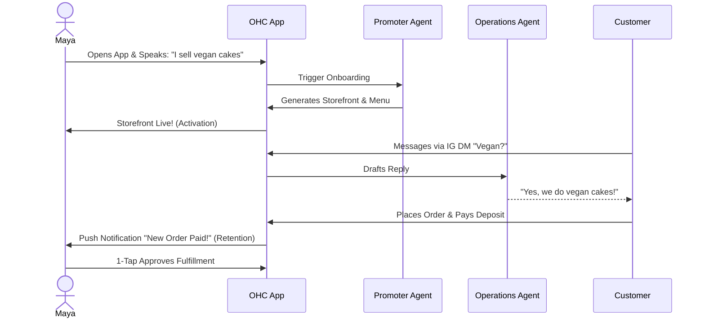
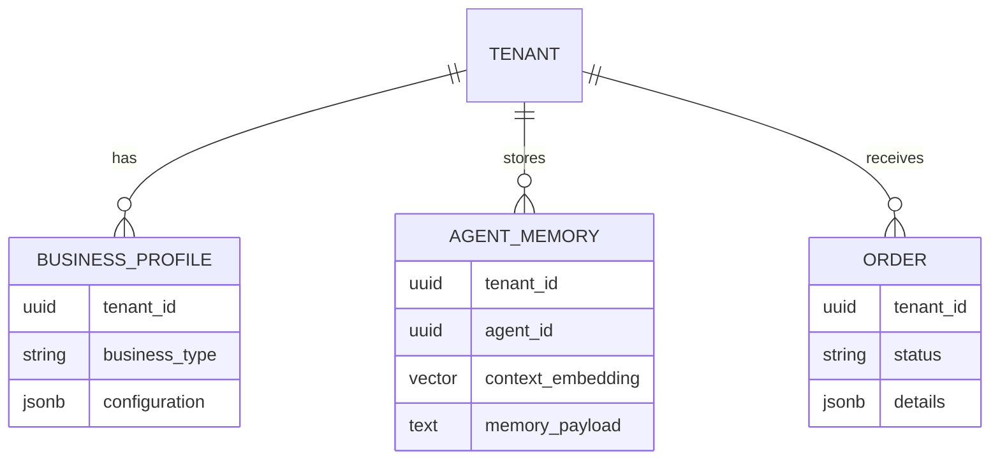
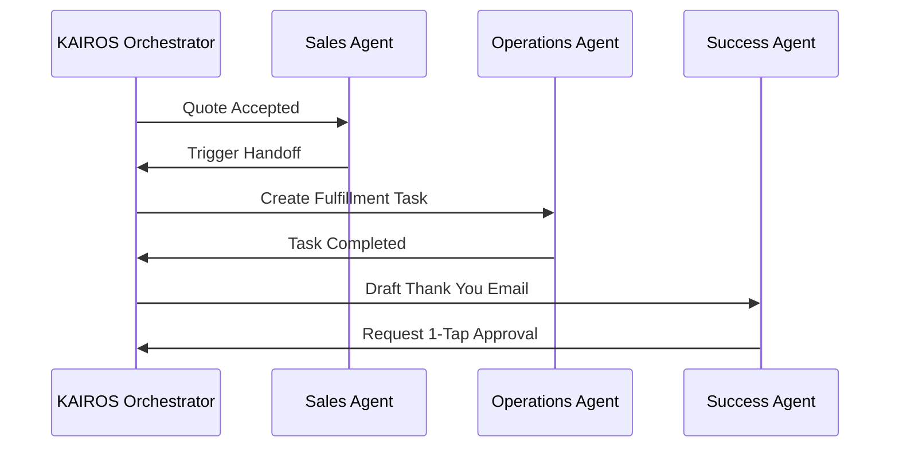

# KAIROS Orchestrator: Holistic End-to-End Business Architecture

## Title
KAIROS Orchestrator: End-to-End Business Journey, Architecture, and AI Integration

## Problem Statement
Small business owners—such as Maya (baker), Carlos (handyman), Priya (boutique owner), Leo (music tutor), and Fatima (food cart)—need a unified platform to launch, run, and grow their real-world businesses entirely from a mobile device without touching a single line of code. Currently, features are siloed, causing friction during onboarding and a lack of fluid data transition from acquisition to revenue generation. The KAIROS Orchestrator must serve as the central nervous system, seamlessly connecting the business journey, the data model, and the AI Agent Departments to invisible handle complexity. Without a holistic architecture, non-technical users face cognitive overload, disjointed AI interactions, and inconsistent mobile parity.

## Research Report
### Context and Personas
The business journey is evaluated against the following core personas to ensure "Business Owner Lens" and "Mobile Parity":
1.  **Maya (Home Baker, 28)**: Needs a mobile-first storefront, Instagram integration, order management with deposit payments, and AI handling direct messages while she sleeps.
2.  **Carlos (Handyman, 42)**: Requires clean service listings, a robust booking system with deposits, a unified customer inbox, and an AI quote generator.
3.  **Priya (Boutique Owner, 35)**: Wants omnichannel support (in-store/online), POS integration (tap-to-pay), inventory sync, and actionable daily analytics.
4.  **Leo (Music Tutor, 22)**: Needs subscription-based packages, schedule syncing, automated meeting links, and a strong public profile.
5.  **Fatima (Food Cart Operator, 50)**: Prioritizes extreme simplicity, pre-order management, multi-language UI, and fast low-data mobile performance.

### Key Findings
- **Acquisition & Onboarding**: Non-technical users drop off when asked for complex configurations (like CNAME or API keys). The onboarding flow must be progressively profiled and guided entirely by AI based on a simple conversational prompt.
- **Data Model Limitations**: A traditional relational data model fails to capture the "thought process" and "context" required by autonomous agents.
- **AI Orchestration**: Isolated AI agents lack the context of the overall business state. The Operations Agent must know when the Sales Agent closes a deal to begin fulfillment seamlessly.

## Design Doc

### Key Design Decisions
1. **The "Grandmother Test" Mobile Parity**: Every flow—from creating a storefront to reviewing AI-generated quotes—must be designed for and fully functional on a 375px mobile breakpoint first.
2. **Invisible AI Departments**: Agents are categorized into understandable departments (Operations, Sales, Customer Success). The KAIROS Orchestrator coordinates these departments using an event-driven mesh, ensuring 1-tap approvals for critical actions.
3. **Progressive Tiered Limits**: Instead of feature gating, constraints are placed on volume (e.g., AI actions per month), allowing free users to experience maximum platform value.
4. **Tenant Isolation**: Strict logical multi-tenancy ensures data privacy. Every piece of data and agent memory is explicitly bound to the tenant ID.

### Architecture Diagrams (Mermaid.js)

#### 1. End-to-End User Journey (Maya's Flow)

#### 2. KAIROS Data Model Architecture

#### 3. AI Agent Coordination

### Mobile UX Flow
- **Dashboard**: A clean, Glassmorphism-styled feed summarizing actionable items (e.g., "3 drafts waiting for review").
- **1-Tap Approval**: High-risk actions (like sending an email or refunding a customer) are surfaced as cards. The business owner taps once to approve or edit.
- **Offline Resilience**: Essential functions are cached locally, allowing Carlos to draft a quote while in a basement without cellular service.

## Implementation Prompt
**To Implementer Agent:**
Implement the KAIROS Orchestrator backbone. Establish the event-routing mesh that allows the Sales, Operations, and Customer Success AI agents to communicate asynchronously. Ensure the data layer utilizes strict tenant isolation and provides semantic search capabilities for agent memory. Implement the "1-Tap Approval" mobile UI layer, displaying pending high-risk actions to the business owner in plain language. Do not prescribe specific SQL DDL or library choices; focus on the robust event handoff mechanism and mobile-first experience.

## Priority
P0

## Estimated Scope
Large
