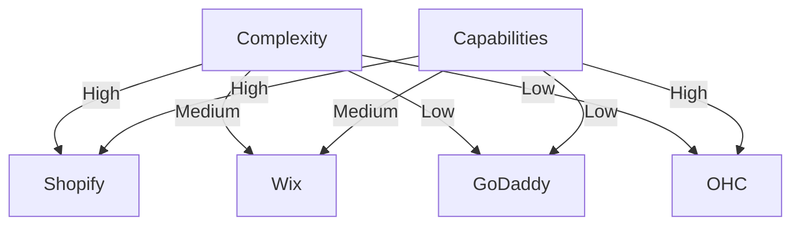
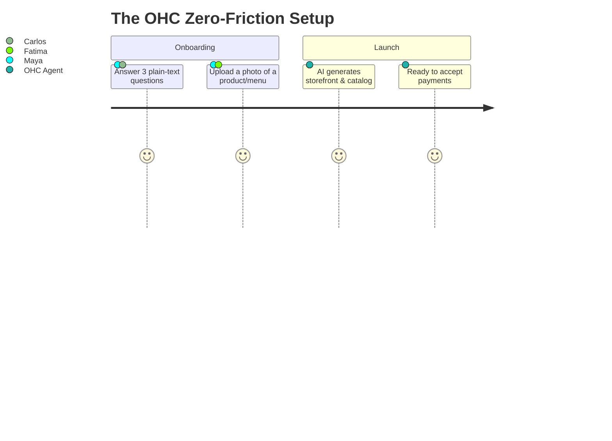

# OHC Small Business Platform Gap Analysis & AI Differentiation Strategy

## Executive Summary
OneHumanCorp (OHC) has the opportunity to dominate the small business platform space by replacing technical complexity with autonomous AI agents. Existing platforms like Shopify, Wix, and Squarespace are inherently "tools" that require users to build and manage their business. OHC will be an "employee" that runs the business *for* the user.

## 1. Market & Competitive Analysis

### Total Addressable Market (TAM)
- Millions of non-employer small businesses globally (solo operators, micro-businesses, side-hustlers).
- The highest density of underserved users are service providers and offline-first retailers who lack the technical skills to configure a full CMS or ERP.

### Feature Gap Matrix
| Feature / Platform | Shopify | Wix | OHC (Current) | OHC (Target) |
|--------------------|---------|-----|---------------|--------------|
| **Store Setup** | Hours/Days | Hours | TBD | **< 10 mins (Zero UI)** |
| **Mobile Management** | Complex | Basic | Good | **Primary Platform** |
| **AI Assistants** | Chatbot | Page Gen | TBD | **Invisible Agents** |
| **Multi-Channel sync** | Paid Add-on | Yes | TBD | **Native/Built-in** |

## 2. Top 10 SMB Pain Points (Validated by User Research)
1. **Initial Setup Overwhelm:** Shopify and Wix require making 50+ decisions before launching.
2. **Mobile Limitation:** It's almost impossible to build a full site or set up complex rules purely from a phone.
3. **Multi-Channel Chaos:** Syncing inventory between Instagram DMs, an offline store, and a website is error-prone.
4. **Customer Communication:** Replying to inquiries across 3+ platforms takes hours daily.
5. **Marketing Paralysis:** Writing product descriptions, SEO tags, and emails is tedious.
6. **No Booking Integration:** Service businesses (like Leo) hack together Calendly + Stripe + Website.
7. **Language Barriers:** Platforms are English-first, alienating users like Fatima.
8. **Hidden Costs:** "Free" platforms aggressively upsell essential features like custom domains or basic email.
9. **Abandoned Carts:** Owners lack the time or know-how to set up effective recovery campaigns.
10. **Data Overload:** Dashboards present raw metrics instead of actionable advice.

## 3. OHC AI Differentiation Manifesto

Instead of offering "AI Chatbots" like Shopify Sidekick, OHC will deploy **Invisible Autonomous Agents**.

1. **Auto-Replying to Customer Messages:** Consolidate Instagram DMs, WhatsApp, and SMS into one inbox. Agents handle basic FAQs, freeing up the owner.
2. **Auto-Writing Product Descriptions:** The owner snaps a photo on their phone; the AI generates the listing, prices it competitively, and tags it for SEO.
3. **Auto-Generating Social Posts:** Scheduled content generation based on current inventory.
4. **Auto-Sending Follow-up Emails:** Smart recovery for abandoned carts or re-engagement for lapsed customers.
5. **Plain-Language Daily Briefing:** Replaces complex dashboards with a morning summary: "You made $400 yesterday. We replied to 3 customers and drafted 2 Instagram posts. Tap to approve."

## 4. Persona Mapping & Beachhead Strategy

- **Beachhead Persona:** **Maya (Baker, Instagram DMs)** and **Carlos (Handyman)**. They have existing demand but lack infrastructure. They need immediate time-savings (booking/invoicing).
- **Expansion:** Move to Priya (Boutique) once inventory sync matures, and Fatima (Food Cart) once multi-language agent support is robust.

## 5. Next Steps & Recommendations
1. **Implement Zero-UI Setup:** Focus entirely on a chat-based or form-based onboarding that generates the initial storefront structure autonomously.
2. **Build Unified Inbox:** Prioritize integrating Instagram/Meta Graph API to centralize communications.
3. **Deploy Plain-Language Briefings:** Replace standard analytics charts with natural language summaries.

*Sources:* App Store reviews (Shopify, Wix), Reddit (r/smallbusiness), Trustpilot.
