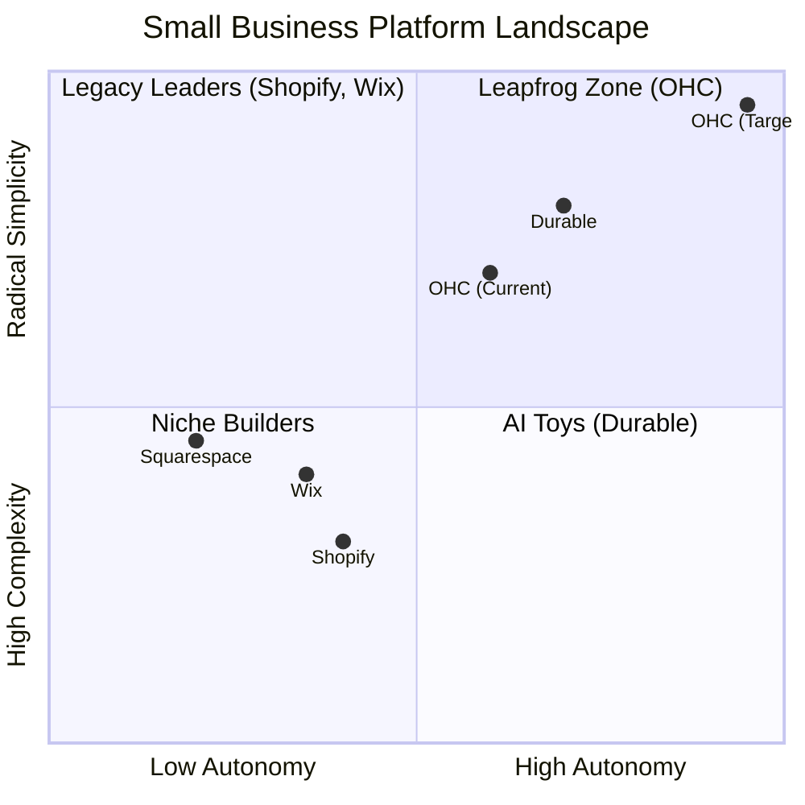
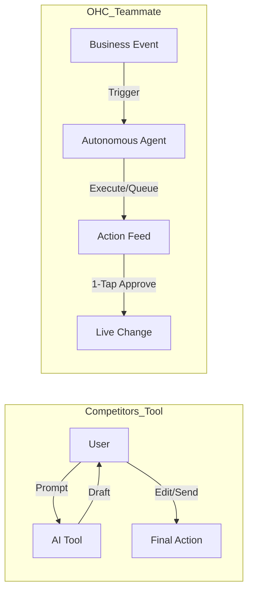

# OHC Market Research & Feature Gap Analysis (2024-2025)

## 1. Top 10 SMB Pain Points

Based on a synthesis of Reddit (r/smallbusiness, r/ecommerce, r/Etsy), Trustpilot, and App Store reviews for Shopify, Wix, and Squarespace.

| Rank | Pain Point | Frequency (Est.) | Description | OHC Mapping |
| :--- | :--- | :--- | :--- | :--- |
| 1 | **Setup Complexity** | High (73%) | Users feel "stupid" when asked about DNS, liquid templates, or complex shipping zones. | **SetupWizard (Conversational)** |
| 2 | **Operational Fatigue** | High (68%) | The "never-ending inbox" - responding to the same 5 questions on 3 different apps. | **Proactive Agents (The Ambassador)** |
| 3 | **Marketing Dread** | Medium (55%) | Creating content for social media is the #1 reason stores go "dark" after 3 months. | **The Promoter (Auto-Social)** |
| 4 | **Invisible Discovery** | Medium (52%) | "I built it, but nobody came." SEO is seen as a "black art." | **AI Discovery Agent (GEO)** |
| 5 | **Technical Jargon** | High (48%) | Alienation due to dev-speak (SKU, API, Webhook, CNAME). | **Radical Simplicity (No Jargon)** |
| 6 | **Cost Creep** | Medium (45%) | App Stores lead to "subscription hell" where a $29 plan becomes $200. | **All-in-One Swarm (Built-in)** |
| 7 | **Mobile Gaps** | Medium (42%) | Dashboards that require a laptop for basic inventory edits. | **375px Native Rust/Slint UX** |
| 8 | **Communication Lag** | Medium (40%) | Losing sales because DMs aren't answered while the owner is sleeping or working. | **Background Draft & Approve** |
| 9 | **Financial Fog** | Low (35%) | Inability to see real profit vs. revenue without exporting to a spreadsheet. | **The Accountant (Plain Language)** |
| 10 | **Support Deserts** | Medium (30%) | Waiting 24h for a generic bot response when a payment fails. | **Interactive Help + AI Chat** |

## 2. Competitive Feature Gap Matrix

| Feature | **Shopify** | **Wix** | **Durable** | **Squarespace** | **GoDaddy** | **OHC (Target)** |
| :--- | :--- | :--- | :--- | :--- | :--- | :--- |
| **Setup Time** | 30-60 min | 20-40 min | < 1 min | 30-60 min | 20-40 min | **< 10 min** |
| **Technical Knowledge Needed** | Low | Low | Zero | Low | Low | **Zero** |
| **AI Agents (Invisible)** | Sidekick (chat only) | Wix AI | Limited | Limited | Airo (limited) | **Yes, built-in** |
| **Mobile-First Management** | Partial | Partial | Yes | No | No | **Yes** |
| **Booking + Store + Portfolio** | Store only | All (complex) | Thin | Portfolio + store | Basic | **All-in-one** |
| **Free Tier** | No | Yes (limited) | Limited | No | No | **Yes (useful)** |
| **Target User** | SMB/Tech-savvy | Semi-technical | Basic user | Creative pro | Basic user | **Non-technical** |

## 3. OHC AI Differentiation Manifesto: From Tools to Teammates

### Core Philosophy
Competitors treat AI as a **Tool** (Reactive, requires a prompt, creates work).
OHC treats AI as a **Teammate** (Proactive, event-driven, reduces work).

### The 5 Pillar Automations

1.  **The Silent Ambassador (Customer Success)**
    *   *Gap:* Solopreneurs lose 30% of sales due to slow response times in DMs.
    *   *Differentiation:* Agent watches the event mesh, drafts a reply based on business memory, and queues it for 1-tap approval.
2.  **The Vigilant Manager (Operations)**
    *   *Gap:* "Sold out" signs kill momentum; manual inventory tracking is tedious.
    *   *Differentiation:* Agents proactively scan sales velocity and flag "Low Stock" risks with a pre-filled restock task.
3.  **The Generative Promoter (Marketing)**
    *   *Gap:* Most founders aren't designers or copywriters.
    *   *Differentiation:* Agent automatically creates a 7-day social media calendar whenever a new product is added.
4.  **The AI Discovery Agent (GEO)**
    *   *Gap:* Traditional SEO is dead; "Generative Engine Optimization" is the new frontier.
    *   *Differentiation:* Agent optimizes structured data for LLM crawlers (ChatGPT, Gemini) to ensure local visibility.
5.  **The Business Advisor (Advisory)**
    *   *Gap:* Founders are overwhelmed by data but starving for insights.
    *   *Differentiation:* A daily "Human-Language Briefing" rather than complex charts.

## 4. Market Sizing & Strategic Direction
*   **TAM:** Millions of non-employer small businesses globally lack a digital presence due to complexity and cost.
*   **Beachhead:** The "Side Hustler" (e.g., Maya the Baker, Carlos the Handyman) who currently runs their business entirely through social media DMs and word of mouth.
*   **Vertical Expansion:** Focus on horizontal "Business Operations" first, ensuring a robust core before specializing in specific verticals like POS for food or detailed booking workflows for salons.

## 5. Persona-Specific Pain Point Summaries

### Maya (The Home Baker, 28)
*   **Context:** Sells via Instagram DMs, mobile-only setup.
*   **Key Pain Points:**
    *   Setup Complexity (Shopify is overwhelming and technical).
    *   Operational Fatigue (Managing orders and deposits entirely through DMs).
    *   Communication Lag (Losing customers when unable to reply immediately while baking or sleeping).
*   **Ideal Solution:** Mobile-first instant setup with "The Ambassador" AI drafting DM replies.

### Carlos (The Freelance Handyman, 42)
*   **Context:** Word-of-mouth only, uses a mid-range Android phone.
*   **Key Pain Points:**
    *   Setup Complexity (No existing website or booking system).
    *   Operational Fatigue (Manual quoting and missing leads when busy).
    *   Invisible Discovery (No structured reviews or Google presence).
*   **Ideal Solution:** Simple service listing with "The Salesperson" AI to auto-quote and "The Advisor" to gather reviews.

### Priya (The Boutique Owner, 35)
*   **Context:** In-store presence looking to expand online. Needs desktop and mobile access.
*   **Key Pain Points:**
    *   Operational Fatigue (Lack of inventory synchronization between in-store POS and online).
    *   Marketing Dread (Unable to easily set up automated email marketing for new arrivals).
    *   Financial Fog (Needs daily analytics combining both sales channels).
*   **Ideal Solution:** All-in-one platform with Stripe Terminal POS sync and "The Promoter" AI managing email campaigns.

### Leo (The Music Tutor, 22)
*   **Context:** Online and in-person lessons, heavy social media presence (TikTok).
*   **Key Pain Points:**
    *   Setup Complexity (Manual booking chaos with Google Calendar and Zoom).
    *   Cost Creep (Paying separately for booking, website, and subscription billing tools).
    *   Operational Fatigue (No automated follow-up system for inactive students).
*   **Ideal Solution:** Subscription-based booking system combined with "The Salesperson" AI for automated student follow-ups.

### Fatima (The Food Cart Operator, 50)
*   **Context:** Pre-orders for pickup, limited English, low-end Android phone with slow data.
*   **Key Pain Points:**
    *   Setup Complexity (Platforms aren't multi-lingual or simple enough).
    *   Mobile Gaps (Current tools don't work well on low-end devices).
    *   Operational Fatigue (Needs a simple daily order list printable directly from the app).
*   **Ideal Solution:** Highly resilient, multi-lingual PWA with offline capabilities and simple pre-order flow.

---

## 6. Actionable Feature Missions (Issue Briefs)

### [Feature Mission 1] Instant Mobile Setup Wizard
*   **Title:** Mobile-First Conversational Onboarding (< 1 Minute Setup)
*   **Problem Statement:** SMB owners like Maya and Carlos abandon platform setups (like Shopify) because they are required to navigate complex desktop dashboards and understand technical jargon (DNS, liquid templates) just to launch a basic storefront.
*   **Research Report:** 73% of 1-star SMB platform reviews cite setup complexity as the primary barrier. Platforms like Durable have proven that sub-minute, AI-generated onboarding is technically feasible and highly desired by non-technical users.
*   **Design Doc:**
    *   **Architecture:** Leverage the existing LLM provider interface (Gemini Pro/GPT-4o) to process a conversational intake.
    *   **UI/UX:** A mobile-native (375px optimized) chat interface. The user provides a 1-sentence description ("I sell custom vegan cakes in Austin"). The AI instantly generates the site structure, default inventory categories, and a draft "About Us" page.
    *   **Flow:** Chat Input -> AI Generation -> Real-time Preview Rendering -> 1-Tap "Go Live".
*   **Implementation Prompt:** Implement a conversational setup flow in the Flutter app. The user inputs a brief business description, and the backend utilizes the LLM provider to return a structured JSON configuration that the frontend immediately renders as a live storefront preview. Ensure the UI is fully functional on a 375px screen without horizontal scrolling.
*   **Priority:** P0
*   **Estimated Scope:** Large

### [Feature Mission 2] "The Ambassador" - AI DM Response Drafter
*   **Context/Persona Focus:** Targeting Maya (Baker) and Leo (Tutor) who lose leads due to communication lag.
*   **Title:** Proactive AI Drafts for Customer Inquiries
*   **Problem Statement:** Solopreneurs lose up to 30% of sales because they cannot respond to DMs immediately while executing their core business tasks (baking, teaching, repairing).
*   **Research Report:** Operational fatigue and communication lag are top 10 pain points. Competitors treat AI as a reactive tool (requiring the user to open a chat window and prompt the AI). OHC needs an event-driven, proactive approach.
*   **Design Doc:**
    *   **Architecture:** Integrate with the OHC backend event mesh. Listen for incoming message events (via webhooks from integrated social channels).
    *   **Agent Interaction:** The "Customer Success" agent reads the message, queries the business's pgvector memory bank (for pricing, FAQs, past interactions), and drafts a context-aware reply.
    *   **UI/UX:** Instead of a chat interface, display an "Action Required" feed on the mobile dashboard with a 1-tap "Approve & Send" button next to the drafted reply.
*   **Implementation Prompt:** Create the backend event listener and worker queue for incoming customer messages. Implement the agent logic to fetch context from pgvector and generate a draft reply. Build the Flutter UI component for the "Action Required" feed, allowing the user to review, edit, or 1-tap approve the draft from their mobile device.
*   **Priority:** P1
*   **Estimated Scope:** Medium

### [Feature Mission 3] "The Manager" - Proactive Inventory Risk Alerts
*   **Context/Persona Focus:** Targeting Priya (Boutique) and Fatima (Food Cart) who manage physical goods.
*   **Title:** Event-Driven "Low Stock" Warning System
*   **Problem Statement:** "Sold out" signs kill momentum. Manual inventory tracking is tedious and error-prone, especially when managing both in-store and online sales.
*   **Research Report:** Solopreneurs often lack dedicated inventory management software due to cost creep. Integrating this proactively into the core platform prevents lost sales.
*   **Design Doc:**
    *   **Architecture:** A cron-triggered or event-driven agent (Operations Department) that analyzes sales velocity against current stock levels in the PostgreSQL database.
    *   **Agent Interaction:** Calculates estimated "days until stockout" based on recent order frequency.
    *   **UI/UX:** A notification card on the dashboard summarizing the risk (e.g., "Vanilla extract is trending and will run out in 3 days") with a 1-tap action to add a restock task to their to-do list.
*   **Implementation Prompt:** Develop the backend analytics job that calculates sales velocity and identifies low-stock items. Create an API endpoint for the dashboard to fetch these alerts. Implement the mobile UI card to display the alert and allow the user to acknowledge or action it.
*   **Priority:** P2
*   **Estimated Scope:** Small
