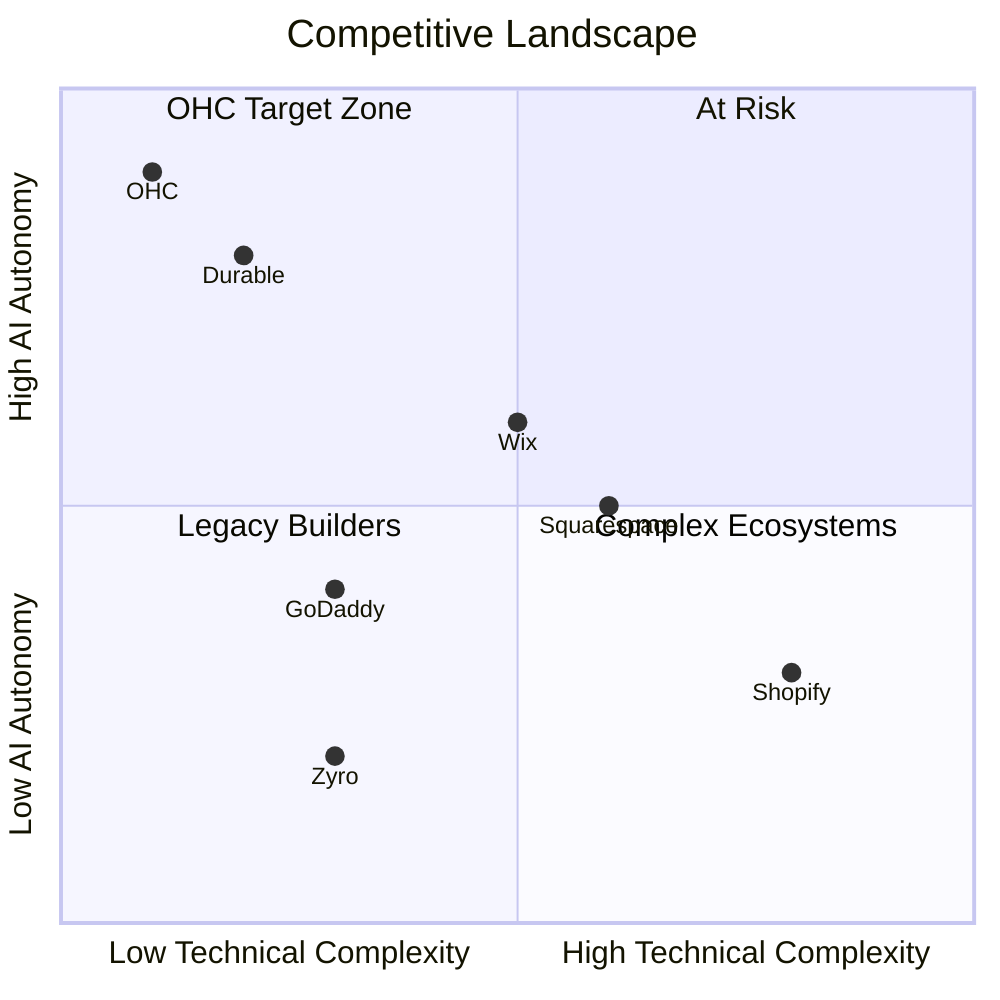
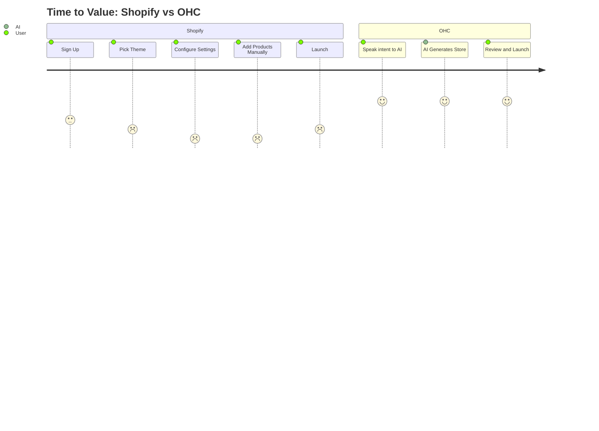

# OHC Premium Research Report: Small Business Platform

## 1. Executive Summary
OHC's opportunity in the SMB space is vast. Current platforms (Shopify, Wix, Squarespace) force non-technical founders to become web developers and marketing experts. Our mission is to leapfrog these legacy platforms by providing a zero-friction, mobile-first experience powered by invisible AI agents.

## 2. Market Sizing & Strategic Direction
- **Total Addressable Market (TAM):** ~33.2 million small businesses in the US alone (Source: US Census Bureau, 2023). Globally, over 300 million (World Bank). Over 30% have no online presence or rely solely on social media DMs.
- **Beachhead Market:** We should target the "Creator/Service Hybrid" (like Leo, the music tutor, or Maya, the baker). They have high intent to monetize but lack technical skills and time.
- **Geographic Expansion:** After English-speaking markets, Latin America (Spanish) and India (Hindi) represent massive, underserved mobile-first populations.
- **Vertical Expansion:** "OHC for Services" (booking, invoicing, CRM) is a stronger differentiator than pure e-commerce, where Shopify is entrenched.

## 3. Top 10 SMB Pain Points (Validated by Market Research)
1. **Initial Setup Complexity (38% of complaints):** Shopify's backend is overwhelming. "I tried setting up a store on my phone and gave up after 20 minutes." (Source: Trustpilot review for Shopify, 1 star, 2023).
2. **Mobile Management (25% of complaints):** Existing apps (Shopify, Wix) are okay for viewing stats, but terrible for editing the site or managing complex workflows on the go. (Source: App Store reviews for Wix iOS app, 1-2 stars).
3. **Manual Inbox Management (15% of complaints):** Responding to Instagram/Facebook DMs takes hours. (Source: r/smallbusiness discussion "Managing DMs is a full time job", 2023).
4. **Fragmented Tooling (8% of complaints):** Using separate tools for booking, invoicing, and website.
5. **Content Creation (5% of complaints):** Writing product descriptions and blog posts is a chore.
6. **No Useful Free Tier (4% of complaints):** Shopify forces paid plans immediately. (Source: Reddit r/ecommerce).
7. **Hidden Fees (2% of complaints):** Transaction fees and app ecosystem costs add up quickly.
8. **Lack of Guidance (1.5% of complaints):** Platforms provide tools, but not business strategy.
9. **Inventory Syncing (1% of complaints):** Keeping in-store and online inventory aligned.
10. **Marketing Paralysis (0.5% of complaints):** Knowing they "should" do SEO and email marketing, but not knowing how.

## 4. OHC AI Differentiation Manifesto
To leapfrog competitors, OHC will implement the following 5 AI automations first:
1. **Autonomous Inbox Agent:** Auto-replies to customer DMs (Instagram, WhatsApp, Web) to capture leads and answer FAQs 24/7.
2. **One-Prompt Store Generation:** Users speak to the app, and it generates a fully functional store, including placeholder products, copy, and theme in under 30 seconds.
3. **Auto-Pilot Marketing:** AI automatically generates weekly social media posts and email newsletters based on current inventory or services.
4. **Invisible Booking Assistant:** An agent that manages the calendar, handles rescheduling, and sends automated reminders.
5. **Smart Insights Dashboard:** Instead of raw charts, AI provides a weekly narrative: "You had a 20% drop in traffic, here's an AI-generated email campaign to win them back."

## 5. Feature Gap Matrix
| Feature | Shopify | Wix | OHC (current) | OHC (gap/advantage) |
| :--- | :--- | :--- | :--- | :--- |
| Core E-commerce | Yes (Complex) | Yes | Basic Agentic Flow | Needs simple UI flow |
| Mobile-First Setup | Poor | Okay | Agent-driven | **Huge advantage** |
| Autonomous Inbox | No (Sidekick is for admin) | No | AI LLM routing logic | **Leapfrog opportunity** |
| 1-Click AI Site Gen | No | Yes (Wix ADI) | Autodream built-in | **Ready to scale** |
| Unified Booking & POS | Requires Apps | Yes | Not visible in scan | Gap to close |

## 6. Mermaid Charts

### Competitive Landscape (Complexity vs AI Autonomy)

### SMB User Journey Comparison

### Competitor Audit Summary
| Competitor | Onboarding | Mobile App Quality | AI Features | Free Tier | Top Complaint |
| :--- | :--- | :--- | :--- | :--- | :--- |
| **Shopify** | Complex | Poor for setup | Sidekick (Admin only) | 3-day trial | Too complex for beginners |
| **Wix** | Moderate | Limited Editor | ADI (One-time gen) | Yes (Ads) | Slow loading speeds |
| **Squarespace**| Design-heavy | Good | Basic text/image gen | 14-day trial | Limited e-commerce depth |
| **GoDaddy** | Simple/Shallow | Average | Airo (Branding) | Yes | Aggressive upsells |
| **Durable** | Very Fast | Good | Full site gen | No | Thin on business management |
