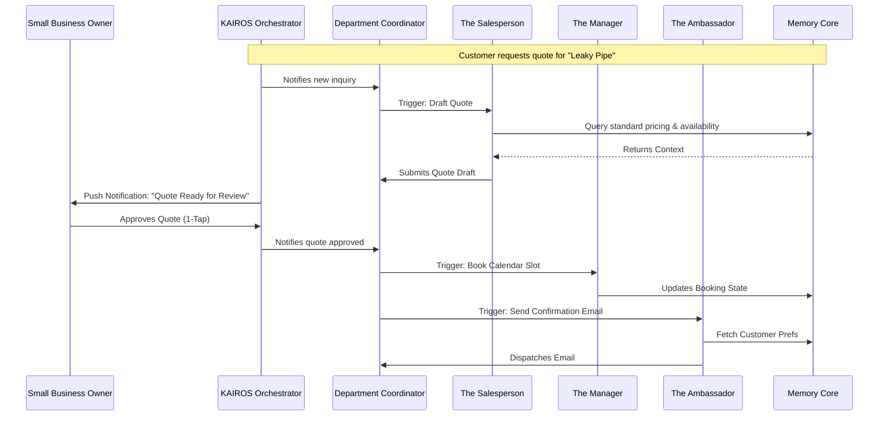

# [architecture] AI Agent Department Architecture

## Problem Statement
Small business owners—from bakers managing Instagram orders to handymen juggling quotes and scheduling—face immense cognitive overload managing the back-office complexity of running a business. While OneHumanCorp (OHC) enables them to launch a storefront in under 10 minutes, the ongoing daily operations require constant context switching. We need a cohesive architecture that organizes AI capabilities into familiar, plain-language "Departments" (like Operations, Marketing, or Finance) that invisibly manage these tasks in the background, minimizing friction while maintaining the owner's trust and oversight.

## Research Report

### Context
OHC's value proposition is extreme simplicity: a zero-code, zero-manual platform serving users across varied business types. We evaluate AI interventions against five core personas:
1. **Maya (The Baker)**: Needs help managing incoming custom order queries (DM) and syncing them to a production queue.
2. **Carlos (The Handyman)**: Needs an automated quoting process, converting inquiries into locked calendar slots with deposits.
3. **Priya (The Boutique Owner)**: Needs proactive inventory alerts and automated promotional campaigns when stock is stagnant.
4. **Leo (The Music Tutor)**: Needs automated meeting link generation, subscription billing management, and follow-ups for inactive students.
5. **Fatima (The Food Cart Operator)**: Needs low-latency, localized order processing and clear daily summaries.

### Competitive Gap
- Traditional tools (Shopify, Calendly) require manual configuration of complex integrations (Zapier) to achieve workflow automation.
- OHC's "Agent Departments" abstract this away, providing an instantly available "staff" that shares context via a unified multi-tenant platform.

### The 7 Departments
1. **Operations ("The Manager")**: Order processing, inventory, fulfillment, scheduling.
2. **Marketing & Advertising ("The Promoter")**: Content generation, website updates, SEO, link-in-bio management.
3. **Sales & Acquisition ("The Salesperson")**: Lead follow-up, quoting, upselling.
4. **Customer Success ("The Ambassador")**: Inbox replies, order updates, review generation.
5. **Finance & Payments ("The Accountant")**: Payment tracking, refund processing, financial reporting.
6. **Legal & Compliance ("The Protector")**: TOS generation, GDPR tracking, liability waivers.
7. **Business Advisory ("The Advisor")**: Weekly insights, next-action suggestions, health reports.

## Design Doc

### High-Level Architecture (Mermaid.js)

### UI Wireframes and Screen Flow (375px First)

**Screen 1: The Daily Briefing (Dashboard)**
- **Header**: Glassmorphism top bar with notification bell (shimmer loading state on slow networks).
- **Hero Area**: "Good morning, Maya. Here’s what your team is working on."
- **Task Cards (Touch Targets > 44px)**:
  - *Card 1*: "The Salesperson drafted 2 quotes for review." (Action: Review)
  - *Card 2*: "The Promoter suggests a weekend sale." (Action: View Details)

**Screen 2: 1-Tap Approval (Draft-for-Review)**
- **Content Area**: A clean, plain-language summary of the proposed action.
  - "The Salesperson wants to send a $150 quote to John Doe for a Leaky Pipe repair."
- **Actions (Sticky Bottom Bar)**:
  - "Approve & Send" (Primary CTA, distinct color).
  - "Edit" (Secondary CTA).
  - "Reject" (Tertiary).

### Mobile UX Flow
1. **Notification**: Owner receives a push notification on their device: "The Ambassador drafted a reply to a new inquiry."
2. **Review**: Tapping the notification opens a lightweight modal (optimized for <1.5s load on 4G) showing the drafted message.
3. **Approve**: A single tap on "Approve" closes the modal, showing a brief success animation.
4. **Offline Resilience**: If the owner is offline, the approval is queued locally and optimistic UI updates are shown. It syncs when connectivity returns.

### Key Architectural Decisions

#### 1. Trigger Mechanisms
Departments operate on three trigger types:
- **Event-Driven**: The Orchestrator routes domain events (e.g., new order) to relevant departments.
- **Scheduled (Cron)**: Agents execute periodic tasks, such as "The Advisor" generating a weekly plain-language health report.
- **On-Demand**: Direct user queries or 1-tap commands from the mobile UI.

#### 2. Cross-Department Coordination
- Departments are inherently decoupled. Hand-offs occur via the Orchestrator, ensuring that agents don't conflict when updating the same resources.
- The system must implement robust concurrency control so "The Manager" and "The Accountant" can safely operate in tandem.

#### 3. Agent Memory and Context
- All agents share a unified memory graph that persists historical interactions.
- When "The Ambassador" drafts a reply, it automatically retrieves past context, ensuring continuity and personalized responses without user intervention.

#### 4. The Approval Spectrum (Risk Mitigation)
To maintain the owner's trust, agent actions are categorized:
- **Auto-Execute (Low Risk)**: Internal tag updates, report generation, routine internal data syncs.
- **Draft-for-Review (High Risk)**: Sending emails, processing refunds, publishing social media posts. The Orchestrator intercepts these actions, placing them in a pending state and surfacing a plain-language prompt to the owner.

#### 5. Tier-Based Throttling
Agent activity is gated by the tenant's subscription tier:
- **Free**: 1 AI Department, 100 AI actions/month.
- **Starter**: 3 AI Departments, 1,000 AI actions/month.
- **Pro/Business**: 10+ Departments, Unlimited actions.
- The Orchestrator limits actions accordingly and prompts upgrades gently via "The Advisor".

## Implementation Prompt

**To Implementer Agent:**
Implement the foundational event-routing and approval pipeline for the "Draft-for-Review" workflow within the KAIROS Orchestrator.

1. Define the internal domain models for a pending action queue, ensuring each entry includes a clear, plain-language description and an assigned risk level.
2. Build the handlers that intercept high-risk tasks emitted by agents and route them into the pending queue rather than executing them immediately.
3. Implement the necessary service layer logic to allow the mobile frontend to fetch pending actions and process "Approved" or "Rejected" user decisions.
4. Ensure all operations are strictly scoped to the tenant to guarantee data isolation.

*Acceptance Criteria*: An integration test verifying that when an agent attempts a high-risk action (e.g., proposing an external email), the action is halted, queued, and successfully executes *only* after an explicit approval decision is processed by the orchestrator. Provide the necessary data models and service methods to support the 375px mobile approval flow.

**Priority**: P0
**Estimated Scope**: Large
