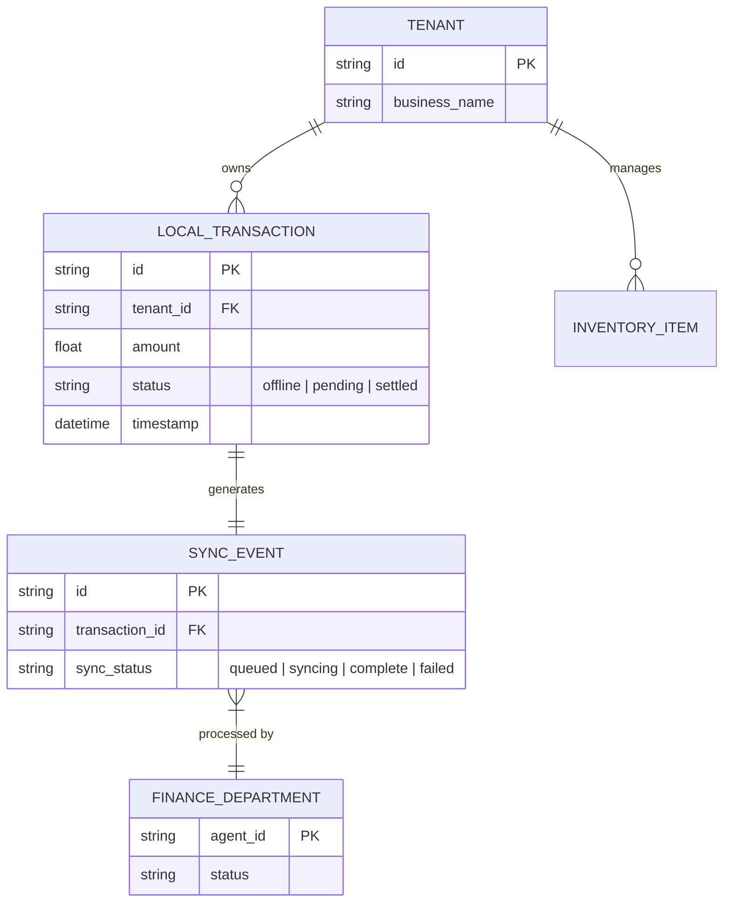

# Offline-First Mobile Tap-to-Pay & Ledger Engine

## Executive Summary
OneHumanCorp (OHC) currently lacks a robust, fully offline-capable tap-to-pay and localized ledger engine tailored for small business owners who operate in environments with spotty or zero connectivity (e.g., farmers' markets, pop-up shops, moving food carts). This document details an architectural strategy to provide instantaneous, offline-first transaction processing and background synchronization, guaranteeing multi-tenant isolation and a seamless, mobile-first experience.

## Business Journey Mapping
We trace the end-to-end user journey for Maya (Baker) and Fatima (Food Cart Operator), who frequently process in-person sales.
- **Acquisition & Onboarding**: Maya enables "Tap to Pay" via a 1-tap toggle in the OHC mobile app. No additional hardware needed.
- **Activation & Offline Use**: Fatima operates her cart at a crowded festival with zero cell service. She inputs an order, taps the customer's card to her Android phone, and the transaction is recorded instantly in the local ledger. The app displays a green checkmark immediately.
- **Retention & Synchronization**: When Fatima regains a stable connection, the background "Finance AI Department" automatically synchronizes the offline transactions with the central OHC server, settles payments, and sends receipts via SMS.

## Persona Pain Points Summary
| Persona | Current Pain Point | OHC Offline-First Solution |
| :--- | :--- | :--- |
| **Maya (Baker)** | Misses sales at artisan markets when Square readers fail due to bad Wi-Fi. | Instant tap-to-pay on iPhone using NFC, with offline queueing. |
| **Fatima (Food Cart)** | Complex card readers are intimidating and hard to pair over Bluetooth. | No extra hardware. Uses built-in phone NFC. "Grandmother test" passed: one big button. |
| **Priya (Boutique)** | Needs inventory to remain accurate even if the internet drops during a sale. | Local SQLite ledger decrements inventory immediately, syncs later. |

## Data Model & Invariants

The data model ensures strict isolation and offline integrity:
- **Local Ledger (SQLite)**: Stores encrypted, localized transactions and inventory updates on the device.
- **Sync Queue**: A background queue managing the synchronization state of offline events.
- **Tenant Isolation**: Every offline transaction payload is cryptographically signed and tagged with the derived tenant ID from the active session.

### Mermaid ER Diagram

## AI Department Coordination
- **Finance Agent**: Detects network availability. Processes the `Sync Queue` via secure endpoints, resolving transaction states from `offline` to `settled`.
- **Operations Agent**: Listens to the `Local Ledger` for inventory decrements and synchronizes them to the global store, triggering reorder alerts if needed.
- **Customer Success Agent**: Upon transaction settlement, automatically sends out digital receipts via SMS or Email based on customer preference.

## Mobile-First Integrity & Zero Trust
- **Viewport (375px)**: The interface consists of a single, massive "Tap to Pay" button centered on the screen, adhering to OHC's clean, Translucent Glass aesthetic (Dark Mode: `rgba(22, 22, 26, 0.7)`).
- **Performance targets**: Offline transaction capture in < 50ms.
- **Security**: Strict zero-trust. All local data is encrypted at rest. Synchronization payloads require device-attested JWTs. The central server verifies cryptographic signatures to guarantee idempotency and prevent replay attacks.

## Actionable Recommendations
1. Implement local SQLite ledger on the mobile client for offline queuing.
2. Develop a background Sync Agent (Finance Department) that polls for connectivity and processes the queue via idempotent server endpoints.
3. Integrate native device NFC capabilities (Apple Tap to Pay / Android NFC) wrapped in a unified, one-button React Native/Flutter UI.
4. Enforce strict multi-tenant isolation by deriving tenant IDs exclusively from the authenticated device session during sync.