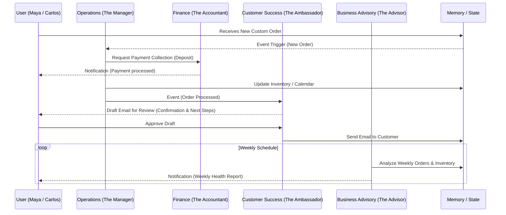

# [architecture] AI Agent Department Architecture

## Title
AI Agent Department Architecture and Coordination Matrix

## Problem Statement
Small business owners (like Maya the baker or Carlos the handyman) do not understand complex "AI Swarms" or "LLM chains." They understand business departments. Our platform needs a unified, non-technical mental model where AI agents are personified as functional departments (e.g., "The Manager," "The Promoter") that work invisibly in the background. We currently lack a comprehensive architecture detailing how these departments are triggered, how they coordinate seamlessly without stepping on each other, how they retain memory of past interactions, and how the user maintains control over their actions (auto-execute vs. draft-for-review).

## Research Report
- **Competitive Analysis**: Shopify's "Sidekick" is a reactive chatbot bolted onto the side of the screen. Wix AI only helps with initial site setup. OHC's approach is structurally different: AI *is* the infrastructure.
- **User Needs**: Users require an invisible operational layer. When an order is placed, "Operations" must process it, and "Customer Success" must communicate with the user, seamlessly.
- **Trigger Mechanisms**: Agents need to respond to three types of triggers:
  1. **Event-Driven**: e.g., "New Order Received" triggers Customer Success.
  2. **Schedule-Driven**: e.g., "Weekly Health Report" scheduled for Monday 9 AM by Business Advisory.
  3. **On-Demand**: e.g., "Draft a new Instagram post" requested explicitly by the user from Marketing.
- **Approvals & Trust**: Non-technical users are wary of AI making mistakes. "Draft-for-review" is mandatory for sensitive actions (e.g., sending quotes or legal contracts). "Auto-execute" is for safe, routine actions (e.g., order confirmations).
- **Resource Constraints**: Each tenant needs a budget/quota for AI usage to prevent runaway costs, requiring throttling and visibility.

## Design Doc

### Architecture Diagram


### UI Wireframes / Screen Flow Description (375px first)
1. **Department Dashboard Screen**: A 375px mobile view showing large, tap-friendly cards for each "Department." Each card displays an avatar, a status indicator (e.g., "Marketing: 2 Drafts Awaiting Review", "Operations: All clear").
2. **Review Inbox**: A unified inbox for all "Draft-for-review" actions. Example: "The Salesperson drafted a quote for John Doe." Swipe right to approve and send, swipe left to discard, tap to edit.
3. **Usage Settings Modal**: A simple progress bar showing AI Actions used this month (e.g., "850 / 1,000 tasks"). If nearing the limit, a prominent "Upgrade to Pro" button appears. No jargon about tokens.

### Mobile UX Flow
- Maya receives a push notification: "The Ambassador drafted a reply to an Instagram DM. Review now?"
- She taps the notification, opening the app directly to the Review Inbox.
- The screen shows the customer's DM and the AI's proposed response.
- Maya taps "Approve" (large 44x44px target). The app shows a brief checkmark animation (Glassmorphism success banner) and returns to the home dashboard.

### AI Agent Integration Points
- **Trigger Router**: A central event bus that maps business events to the appropriate department.
- **Shared Memory Layer**: A semantic memory store where each department logs its actions, allowing other departments to query "What did we tell this customer last week?".
- **Quota Enforcer**: A middleware layer that intercepts every agent action, checks the tenant's tier limits, and either allows the action, queues it, or alerts the user to upgrade.

### Key Design Decisions and Why
- **Personified Departments**: Naming agents "The Manager" or "The Promoter" builds trust and aligns with the user's mental model of growing a team.
- **Unified Review Inbox**: Rather than checking 7 different agent screens, business owners need one place to approve actions, saving time.
- **Shared Semantic Memory**: Essential for preventing departments from contradicting each other. "Customer Success" needs to know if "Sales" promised a discount.

## Implementation Prompt
"Implement the AI Agent Department coordination framework. Create the core `DepartmentRouter` that maps business events (e.g., 'OrderCreated', 'MessageReceived') to the correct functional department (Operations, Sales, Customer Success). Implement the 'Draft-for-review' vs 'Auto-execute' approval workflow, ensuring that all actions flagged as 'Draft' are routed to a unified approval queue. Integrate the tenant quota tracking system to intercept and throttle actions when monthly limits are reached. All UI endpoints serving the mobile app must return data structured for the unified Review Inbox."

## Priority
P0

## Estimated Scope
Large

```yaml
issue_id: ai-agent-department-architecture
status: defined
```
