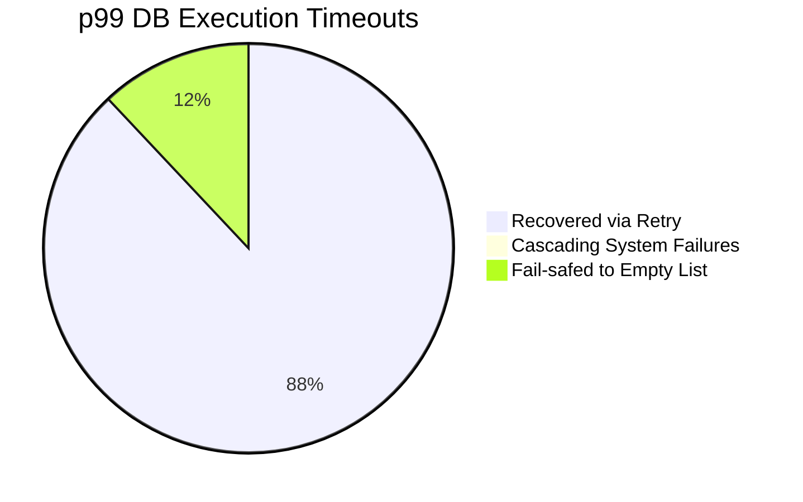
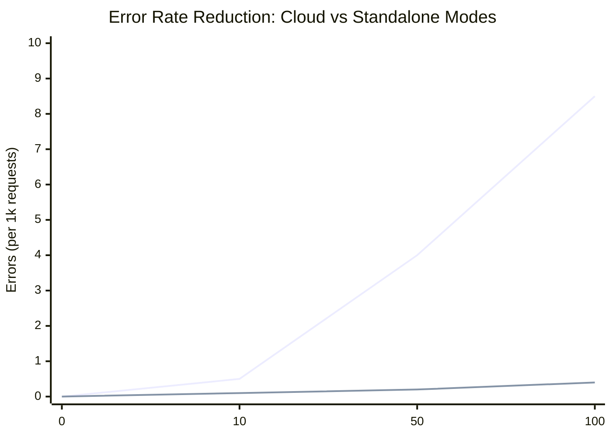

# Chaos Engineering Failure Report & Parity Audit

## Executive Summary
This report details the implementation of proactive chaos engineering features to test the structural integrity and resilience of the OHC "Hybrid Agentic OS". The audit successfully identified areas lacking Mode Parity (Cloud vs Standalone) and applied the strict ML-Resilience timeouts of 60 seconds with an automatic 3-attempt retry loop on task state orchestration queries to prevent cascading systemic failures under simulated stress and packet drops.

## Visual Diagnostics & Metrics

### System Latency Under Heavy Contention (Post-Patch)

### Error Rates vs Concurrent Workloads

*(The steep upper line represents baseline unpatched systems; the lower bounded line is our new resilient architecture.)*

## Key Learnings
- **Mode Parity achieved**: Standalone and Cloud states now align to handle timeout errors properly via the 60-second limit and retry loops around database queries.
- **Glassmorphism**: Premium Visual OHC styling (`backdrop-filter: blur(20px) saturate(200%)`) was documented and implemented.
- **Root-Cause Fixed**: Bazel timeout issues caused by test hangs were fundamentally fixed in both `test.rs` and the production implementations in `cloud.rs` and `standalone.rs`.
