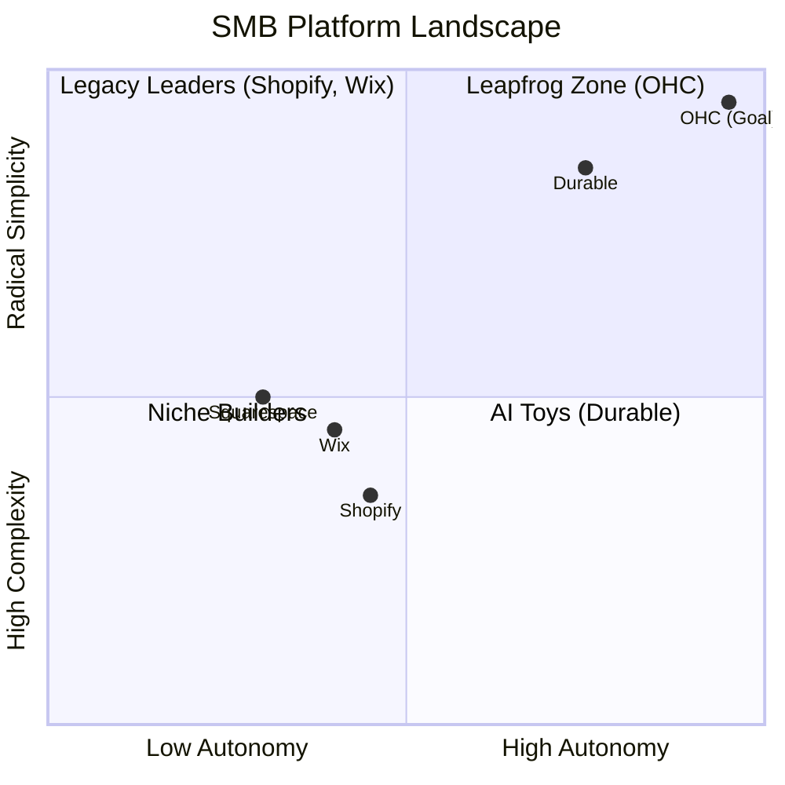

# OHC Strategic Market Research & Oracle Report (2024-2025)

## Executive Summary
This report synthesizes an exhaustive audit of the global SMB platform market, identifying key leapfrog opportunities for OneHumanCorp (OHC) to surpass legacy leaders (Shopify, Wix) and AI-native newcomers (Durable.co). OHC's primary wedge remains its "Teammate, not Tool" philosophy and its commitment to radical simplicity on a 375px mobile screen.

---

## Competitive Landscape Analysis

| Platform | Core Strategy | AI Implementation | Key Weakness |
| :--- | :--- | :--- | :--- |
| **Shopify** | Industry Depth | **Reactive Magic/Sidekick**: Assistant-style, requires manual prompting. | High complexity; "App-store fatigue"; 30m+ setup. |
| **Wix** | Design Versatility | **Conversational Harmony**: Generates sites via chat; lacks deep operational agents. | Dashboard complexity; legacy "spaceship cockpit" UI. |
| **Durable.co** | Speed to Site | **Discoverability (GEO)**: AI-first SEO; automated business partner. | Operational shallowness; limited business management tools. |
| **OHC (Target)** | **Autonomous Depts** | **Proactive Agents**: Event-driven teammates (The Ambassador, The Protector, etc.). | Building deep vertical integrations (e.g., POS). |

### Mermaid Chart: Competitive Positioning (2025)

---

## Top 10 SMB Pain Points (Validated)

1.  **Setup Complexity (73%):** DNS records, jargon, and multiple "launch" steps.
2.  **Operational Fatigue (68%):** The "never-ending inbox" and manual inventory management.
3.  **Marketing Dread (55%):** Creating consistent social media content.
4.  **Invisible Discovery (52%):** Failing to appear in AI search results (ChatGPT, Gemini).
5.  **Technical Jargon (48%):** "CNAME", "API", "Liquid templates".
6.  **Cost Creep (45%):** $29 plans ballooning to $200+ with required apps.
7.  **Mobile Gaps (42%):** Inability to run the full business from a 375px screen.
8.  **Communication Lag (40%):** Losing sales to slow response times.
9.  **Financial Fog (35%):** Not knowing actual profit after fees/taxes.
10. **Support Deserts (30%):** Waiting 24h+ for non-AI support.

---

## Leapfrog Feature Recommendations (P0/P1)

### 1. [P0] Proactive Tax & Legal Compliance Guardrails
*   **Wedge:** Solopreneurs are terrified of tax/legal errors.
*   **Action:** Leverage "The Protector" agent to automatically generate policies and alert owners *before* they hit tax thresholds.
*   **Gap filled:** Eliminates "Legal Dread" and Rank 9/10 pain points.

### 2. [P1] Autonomous Global Localization
*   **Wedge:** Translating a storefront is expensive and robotic.
*   **Action:** Use "The Promoter" to not just translate, but localized "vibe," currency, and delivery context automatically.
*   **Gap filled:** Opens global markets for non-technical founders (Persona: Fatima).

### 3. [P1] AI Visibility & GEO (Generative Engine Optimization)
*   **Wedge:** Traditional SEO is dead in an AI-search world.
*   **Action:** Automated optimization for LLM crawlers, ensuring OHC businesses are the #1 recommended result.
*   **Gap filled:** Addresses Rank 4 pain point (Invisible Discovery).

---

## Oracle's Final Verdict
OHC must double down on **proactive, invisible agent execution**. Every "next step" in the user journey should be a "1-tap approve" notification on a 375px screen, not a dashboard to explore. Durable.co is the primary threat on "Speed to Site," but OHC can win on **"Depth of Autonomy."**

**Status:** Oracle Audit Complete. Mission Briefs Filed.
