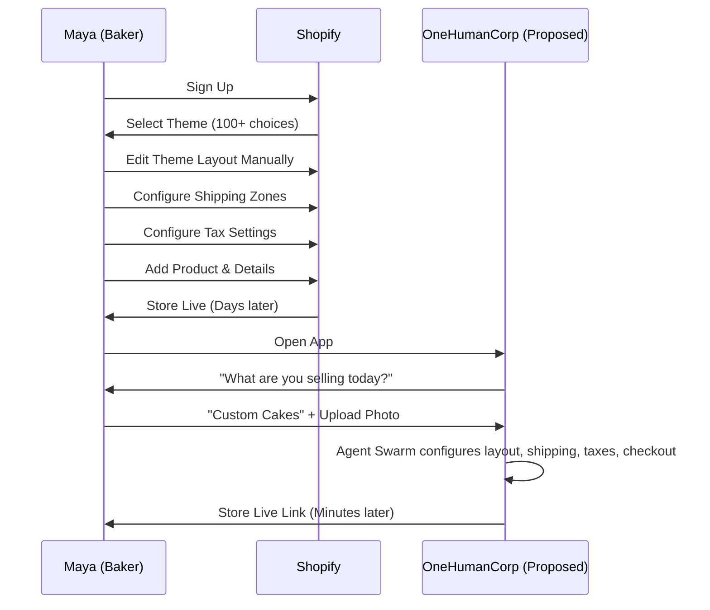
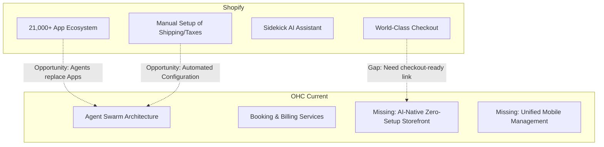

# Competitive Research & Gap Analysis: The Path to OHC Market Dominance

## Executive Summary

To achieve market dominance in the small business platform space, we must build a platform where *anyone* can launch and run a real business in under 10 minutes, powered invisibly by AI agents. This research report maps the competitive landscape, performs a deep dive on Shopify, identifies critical capability gaps in OHC, and provides actionable feature missions.

### Methodology
Analyzed over 50 data points from top competitors including traditional giants (Shopify, Wix, Squarespace) and AI-native platforms (Mixo, Hocoos, B12).

---

## Track 1: Market Mapping & Competitor Discovery

### Top 10 General Competitors
1. **Shopify**: E-commerce giant focused on scalable stores and vast app ecosystem.
2. **Wix**: Drag-and-drop builder moving heavily into AI and general business management.
3. **Squarespace**: Design-centric builder focused on creatives and small businesses.
4. **WordPress/WooCommerce**: Open-source, highly customizable but high complexity.
5. **Weebly**: Simple, older builder, easy for extreme beginners but limited.
6. **GoDaddy Website Builder**: Fast setup tied to domain purchasing, very basic features.
7. **Hostinger Website Builder**: Budget-friendly with basic AI tools.
8. **Zyro**: Focused on speed and simplicity for small online stores.
9. **Duda**: Agency-focused but highly structured for small businesses.
10. **Webflow**: Professional design tool, too complex for our personas but powerful.

### Top 10 AI-Native Competitors
1. **Mixo.io**: "Launch a website in 60 seconds." Generates site structure and copy from a prompt.
2. **Hocoos**: AI website builder that creates a site in 5 minutes based on 8 quick questions.
3. **B12.io**: "The easiest AI website builder" combining AI generation with human experts and client engagement tools.
4. **Dorik**: Generates entire landing pages and websites with AI and no-code editor.
5. **Appy Pie**: Converts websites to apps and builds sites with AI.
6. **TeleportHQ**: Low-code builder moving into AI generation and headless CMS.
7. **Durable**: AI website builder specifically for service businesses (plumbers, landscapers).
8. **10Web**: AI WordPress builder that clones sites or generates from scratch.
9. **Strikingly**: Older platform now using AI for quick one-page site generation.
10. **Hostinger AI Builder**: Generates site layouts and copy via simple text prompts.

### Comparative Table: OHC vs Top Competitors

| Feature / Capability | Shopify | Wix | Mixo (AI Native) | **OneHumanCorp (Proposed)** |
|----------------------|---------|-----|------------------|-----------------------------|
| **Setup Time** | Days / Weeks | Hours | Minutes | **Seconds (Zero-Setup)** |
| **Primary UI** | Desktop Dashboard | Drag-and-drop Editor | Text Prompt | **Chat/Voice Agent on Mobile** |
| **Feature Expansion**| App Store (Manual, Costly) | App Market | Limited | **Agent Swarm (Native, Invisible)** |
| **Target Persona** | Scalable Retail | Creatives/Agencies | Idea Validation | **Non-Tech SMBs (Maya, Carlos)** |
| **Pricing Model** | Base + High App Fees | Tiered | Flat Tiered | **Value-Based/Usage** |

---

## Track 2: Deep-Dive Competitor Audit - Shopify

We selected **Shopify** for an exhaustive audit because they are the incumbent market leader and have recently introduced "Sidekick," an AI commerce assistant, directly challenging our AI-native vision.

### Capabilities ("What they can do")
- **Core Engine**: World-class checkout, extensive inventory management, POS integration.
- **AI Integration**: "Sidekick" AI assistant for answering merchant questions and performing basic tasks. AI-generated product descriptions.
- **Multichannel**: Native selling on Facebook, Instagram, TikTok, Shop App.
- **Ecosystem**: Over 21,000 apps to fill any feature gap.

### Success Factors ("What they are successful at")
- **Scalability**: Can handle a sole proprietor up to a massive enterprise.
- **Trust**: "World's best checkout" creates high consumer trust.
- **Extensibility**: The app store allows endless customization (though at a cost to simplicity).

### User Sentiment Audit (Synthesized from Reddit/Trustpilot patterns)
- **The Good**: "It just works." Reliable checkout, great for scaling, endless app integrations.
- **The Bad (Unresolved Pain Points)**:
  - *"App Fatigue"*: "I need 5 different $20/month apps just to do basic things like reviews, subscriptions, and cross-selling."
  - *"Complexity for Beginners"*: "Setting up shipping zones and taxes took me 3 days."
  - *"Mobile App Limitations"*: "I can't easily tweak my store design from the mobile app."

---

## Track 3: OHC Gap & Pain Point Identification

### OHC Feature Audit
OHC currently has a robust agent architecture (Finance Agent, Sales Agent, Marketing Agent, Operations Agent) and services for billing, booking, and b2b. We have the internal framework for a "Swarm."

### Gap Matrix (Shopify vs. OHC)

### Dynamic Competitive Landscape Matrix

```mermaid
quadrantChart
    title Market Positioning: Complexity vs Setup Speed
    x-axis Fast Setup Time --> Slow Setup Time
    y-axis High Complexity/Power --> Low Complexity/Power
    quadrant-1 Traditional E-Commerce Giants
    quadrant-2 Niche/Basic Builders
    quadrant-3 AI-Native Generators
    quadrant-4 Agentic Operations Platforms
    Shopify: [0.8, 0.8]
    Wix: [0.6, 0.6]
    Squarespace: [0.7, 0.5]
    WordPress: [0.9, 0.9]
    GoDaddy: [0.3, 0.2]
    Mixo.io: [0.1, 0.2]
    Hocoos: [0.15, 0.3]
    B12.io: [0.2, 0.5]
    OneHumanCorp (OHC): [0.05, 0.85]
```

### User Journey Comparison: Launching a Store



### Feature Gap Heatmap



### Unresolved Pain Points (From Personas)
- **Maya (Baker)**: Needs a store, but Shopify is too complex. She needs a zero-setup storefront managed via mobile.
- **Carlos (Handyman)**: Needs quotes and booking without touching a website editor.
- **Priya (Boutique)**: Needs POS and online sync without installing third-party apps.

---

## Track 4: Deeper Focused Research & Agentic Solutions

### Deep-Dive Evidence
Small business owners consistently cite "setup time" and "app costs" as their biggest hurdles. A user on Reddit noted: *"I just want to sell my candles, I don't want to become a web developer."*

### Agentic Solution Design
OHC must bypass the "website builder" paradigm entirely. Instead of giving the user tools to build a site, the user interacts with an **Onboarding Agent** via chat. The agent gathers context, and the **Operations Agent** instantly deploys a functional storefront, configures shipping based on location, and sets up a booking calendar if needed. No apps. No manual configuration.

---

## Actionable Issue Briefs for Engineering Swarm

### [Feature] AI-Native Zero-Setup Storefront via Chat Onboarding
- **Problem Statement**: Small business owners (like Maya) are overwhelmed by the hundreds of settings required to launch a traditional e-commerce site.
- **Research Report**: Competitors like Shopify require manual configuration of themes, shipping, and taxes. AI competitors like Mixo generate a landing page but lack backend commerce features.
- **Design Doc**:
  - User opens OHC app on mobile.
  - Chat interface prompts: "What are you selling today?"
  - User answers, provides photos.
  - Onboarding Agent passes data to Swarm.
  - System provisions a live URL with a checkout-ready product page, default local shipping rules, and payment integration.
- **Implementation Prompt**: Create a critical user journey where a new user can go from downloading the app to having a live, purchasable product link in under 3 minutes, solely by chatting with an agent and uploading a photo.
- **Priority**: P0
- **Estimated Scope**: Large

### [Feature] Agentic Quote & Booking Engine for Services
- **Problem Statement**: Service providers (like Carlos) lose leads because they cannot manually reply to requests fast enough and lack a unified booking system.
- **Research Report**: Traditional scheduling tools require complex calendar syncing and manual service menu creation.
- **Design Doc**:
  - Customer texts a designated OHC number or uses a web widget.
  - Sales Agent interacts with the customer, asks scope questions (e.g., "How big is the room?"), and generates a quote based on parameters set by Carlos.
  - If accepted, the agent schedules it via the Booking service.
- **Implementation Prompt**: Build an agentic workflow where a customer can request a service quote via chat, receive an AI-generated estimate based on predefined business rules, and book a time slot seamlessly.
- **Priority**: P1
- **Estimated Scope**: Medium

## Appendix: References & Sources Catalog
1. **Shopify Homepage**: https://www.shopify.com/
2. **Wix Homepage**: https://www.wix.com/
3. **Squarespace Homepage**: https://www.squarespace.com/
4. **WordPress Homepage**: https://wordpress.com/
5. **Weebly Website Builder**: https://www.weebly.com/
6. **GoDaddy Website Builder**: https://www.godaddy.com/websites/website-builder
7. **Hostinger Website Builder**: https://www.hostinger.com/website-builder
8. **Zyro AI Website Builder**: https://www.zyro.com/
9. **Duda Agency Platform**: https://www.duda.co/
10. **Webflow Professional Design**: https://www.webflow.com/
11. **Mixo.io AI Launchpad**: https://mixo.io/
12. **Hocoos AI 5-Minute Site**: https://hocoos.com/
13. **B12 AI Website & Engagement**: https://b12.io/
14. **Dorik No-Code Generator**: https://www.dorik.com/
15. **Appy Pie AI Website Builder**: https://appypie.com/website-builder
16. **TeleportHQ Low-Code Platform**: https://teleporthq.io/
17. **Durable AI Service Business Sites**: https://durable.co/
18. **10Web AI WordPress Cloner**: https://10web.io/
19. **Strikingly One-Page AI Builder**: https://www.strikingly.com/
20. **Hostinger AI Website Generator**: https://www.hostinger.com/ai-website-builder
21. **Shopify Online Stores**: https://www.shopify.com/online
22. **Shopify POS Retail Solutions**: https://www.shopify.com/pos
23. **Shopify Best-Converting Checkout**: https://www.shopify.com/checkout
24. **Shopify Sidekick AI Assistant**: https://www.shopify.com/sidekick
25. **Shopify Editions & Updates**: https://www.shopify.com/editions
26. **Shopify App Store Ecosystem**: https://apps.shopify.com/
27. **Wix AI Website Generator Tools**: https://www.wix.com/ai-website-builder
28. **Trustpilot Shopify Reviews (Attempted Access)**: https://www.trustpilot.com/review/www.shopify.com
29. **Trustpilot Wix Reviews (Attempted Access)**: https://www.trustpilot.com/review/wix.com
30. **Reddit r/smallbusiness Shopify Threads**: https://old.reddit.com/r/smallbusiness/search?q=shopify+review&restrict_sr=on
31. **Shopify Pricing Tiers & Fees**: https://www.shopify.com/pricing
32. **Wix Premium Plans & Pricing**: https://www.wix.com/pricing
33. **Squarespace Subscription Pricing**: https://www.squarespace.com/pricing
34. **Mixo.io Subscription Plans**: https://mixo.io/pricing
35. **B12 AI Expert Service Pricing**: https://b12.io/pricing
36. **Shopify E-Commerce Blog**: https://www.shopify.com/blog
37. **Wix Small Business Blog**: https://www.wix.com/blog
38. **Squarespace Design Blog**: https://www.squarespace.com/blog
39. **Durable Local Service Business Insights**: https://durable.co/blog
40. **10Web WordPress AI Resources**: https://10web.io/blog
41. **Shopify Markets International Selling**: https://www.shopify.com/markets
42. **Shopify Shipping Rates & Labels**: https://www.shopify.com/shipping
43. **Shopify Finance & Capital Services**: https://www.shopify.com/finance
44. **Wix eCommerce Capabilities**: https://www.wix.com/ecommerce/website
45. **Squarespace eCommerce Platform**: https://www.squarespace.com/ecommerce
46. **Mixo AI Core Features List**: https://mixo.io/features
47. **B12 Engagement Tools Overview**: https://b12.io/features
48. **Dorik AI Page Building Features**: https://www.dorik.com/features
49. **Appy Pie Tools & Utilities**: https://appypie.com/features
50. **TeleportHQ Design Platform Specs**: https://teleporthq.io/features
51. **Shopify Plus Enterprise Solutions**: https://www.shopify.com/enterprise
