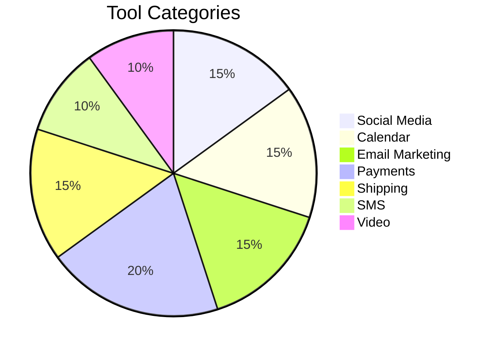
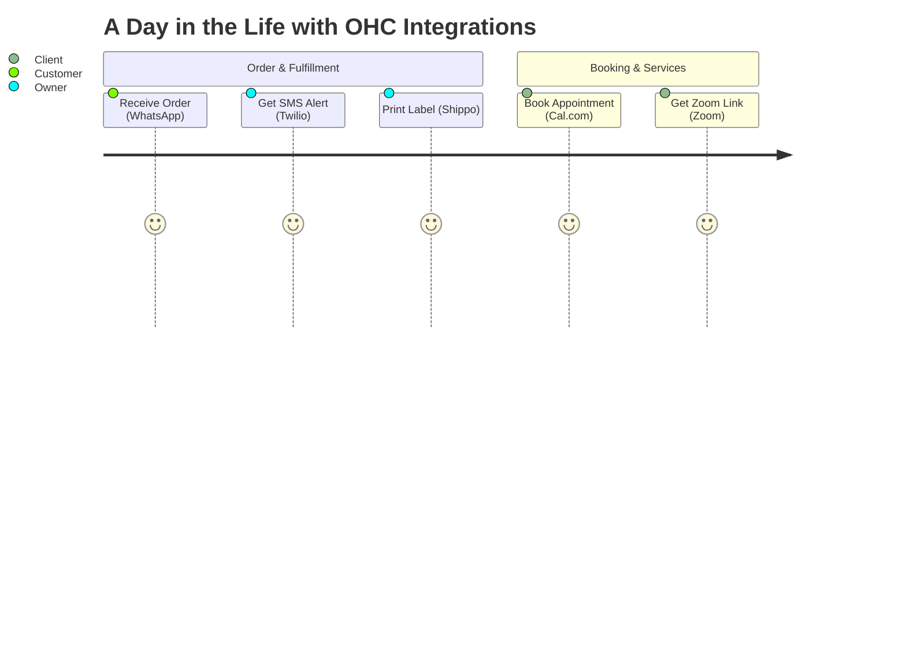

# Research Report: OHC Integrations & Tool Discovery

## Executive Summary
This report analyzes 7 key integrations that will empower non-technical small business owners using OHC.

## Issue Briefs

### 1. Social Media Integration
#### Title
Unified Inbox for Social Media (Meta Graph API)

#### Problem Statement
Owners like Priya need to manage messages from Instagram, Facebook, and WhatsApp without switching apps constantly. They are missing sales because conversations are fragmented across different platforms.

#### Research Report
- **Strategy**: Direct API integration with Meta Graph API for Instagram, WhatsApp, and Facebook Messenger.
- **Target Persona**: Priya (Boutique Owner), Fatima (Food Cart Operator)
- **Advantages**: Consolidates the majority of social interactions for small businesses. Centralized communication reduces missed sales and saves time.
- **Risks**: Meta's API policies and review processes are strict and frequently updated. Handling rich media (images/video) across different platforms can be complex.
- **Pricing**: The Meta Graph API itself is free, but WhatsApp Business API has per-conversation pricing.
- **Compatibility**: Cloud (Centralized OAuth). Standalone (User provides app credentials).

#### Design Doc
- User connects their Facebook Page, Instagram Professional account, and WhatsApp Business account via a single "Connect Meta" button in settings.
- All incoming DMs, comments, and replies are routed to a single "Inbox" view in the OHC platform.
- The business owner can reply directly from OHC, and the message is dispatched to the correct platform.
- **AI Integration**: The Customer Success Agent can draft replies based on previous conversations or suggest canned responses.

#### Implementation Prompt
Build a unified messaging inbox by integrating the Meta Graph API to receive and send messages across Facebook Messenger, Instagram Direct, and WhatsApp. Include an OAuth flow for users to connect their Meta accounts.
- **Acceptance Criteria**: Merchant can authenticate with Meta. Incoming messages from FB/IG/WA appear in a unified OHC inbox. Merchant can reply from OHC, and the message is delivered to the customer on the original platform.
- **Priority**: P1
- **Estimated Scope**: Large

### 2. Calendar & Scheduling
#### Title
Native Calendar Sync & Booking (Google Calendar / Cal.com)

#### Problem Statement
Service providers like Leo need seamless appointment booking without double-booking or manual scheduling ping-pong. Managing external booking pages breaks the Radical Simplicity rule.

#### Research Report
- **Strategy**: Leverage Cal.com's white-label API infrastructure for scheduling logic, combined with direct Google Calendar sync.
- **Target Persona**: Leo (Music Tutor), Carlos (Handyman)
- **Advantages**: Cal.com handles complex timezone logic, conflict resolution, and calendar connections natively. Eliminates friction for clients.
- **Risks**: Relying on a third-party for core scheduling logic requires a robust integration architecture.
- **Pricing**: Cal.com offers enterprise API pricing or open-source self-hosting.
- **Compatibility**: Cloud (OAuth / Cal.com API). Standalone (Direct Google Calendar API).

#### Design Doc
- Service providers configure their available hours and meeting lengths within OHC.
- OHC presents a native booking widget to customers.
- Behind the scenes, Cal.com manages the availability logic, checking for conflicts against the user's connected Google Calendar.
- Booked appointments automatically sync to the user's Google Calendar and appear in the OHC Operations dashboard.
- **AI Integration**: The Operations agent monitors the calendar and alerts the business owner if they have back-to-back appointments without buffer times.

#### Implementation Prompt
Integrate Cal.com's API to power the OHC native booking widget on the public profile page. Implement Google Calendar OAuth so availability is accurately reflected and new bookings sync back to the user's calendar.
- **Acceptance Criteria**: Merchant can connect Google Calendar. Customers can view real-time availability and book natively. Events sync to Google Calendar without conflicts.
- **Priority**: P1
- **Estimated Scope**: Medium

### 3. Email Marketing
#### Title
Native Email Campaign Manager (Twilio SendGrid)

#### Problem Statement
Priya (Boutique Owner) wants to email her past customers when new stock arrives. External tools like Mailchimp are too complex and violate the Radical Simplicity rule. She needs an automated way to email customers natively within the OHC app.

#### Research Report
- **Strategy**: Build a native email campaign manager utilizing a transactional email API like Twilio SendGrid or AWS SES.
- **Target Persona**: Priya (Boutique Owner), Leo (Music Tutor)
- **Advantages**: Keeps the user within the OHC ecosystem. SendGrid delivers 100B+ emails/month with proven deliverability.
- **Risks**: Requires building list management, bounce handling, and unsubscribe logic internally.
- **Pricing**: Included in OHC platform costs (transactional API costs scale predictably).
- **Compatibility**: Cloud (Centralized SendGrid account). Standalone (Centralized routing).

#### Design Doc
- Customers are automatically added to the native OHC customer list with tags upon purchase.
- The Marketing agent suggests campaigns natively in the UI.
- The user approves the AI-generated email, and OHC sends it via SendGrid.
- The user sees open rates and clicks in the OHC Marketing dashboard.
- **AI Integration**: The Marketing & Advertising Agent writes subject lines, generates copy, and tracks metrics to suggest optimal send times.

#### Implementation Prompt
Build a native email campaign management system utilizing Twilio SendGrid for delivery. Allow the AI Marketing agent to create and queue email campaigns directly from the OHC database.
- **Acceptance Criteria**: User can create an email campaign. AI can generate content. Emails are delivered. Unsubscribe links work. Open rates are tracked and displayed.
- **Priority**: P1
- **Estimated Scope**: Large

### 4. Payment Processing
#### Title
Native Integration of Local Payment Methods (Mercado Pago)

#### Problem Statement
Small business owners in Latin America cannot easily use Stripe and need a trusted local payment processor to accept credit cards and local methods like Pix or Pago Fácil natively within the OHC platform, avoiding complex third-party payment routing.

#### Research Report
- **Strategy**: Direct API integration with Mercado Pago for seamless LATAM coverage.
- **Target Persona**: Global users outside the US/EU (e.g., Carlos, if based in LATAM).
- **Advantages**: Mercado Libre is a dominant e-commerce and fintech player in 18 LATAM countries. Expanding payment options significantly reduces checkout abandonment.
- **Risks**: Settlement times can be longer. API is slightly less standardized than Stripe.
- **Pricing**: Standard transaction fees apply; merchants expect these.
- **Compatibility**: Cloud (Centralized routing/OAuth). Standalone (API Key).

#### Design Doc
- User selects their country during onboarding. If in a supported LATAM country, Mercado Pago is offered alongside Stripe.
- User connects their Mercado Pago account.
- Customers see a "Pay with Mercado Pago" button at checkout natively.
- Webhooks update the order status in OHC when payment succeeds.
- **AI Integration**: Finance & Payments Agent seamlessly aggregates revenue across providers into a unified native dashboard.

#### Implementation Prompt
Integrate Mercado Pago as an alternative native payment provider. The checkout flow must dynamically switch to the appropriate provider based on the merchant's settings. Webhooks must normalize into standard OHC order fulfillment events.
- **Acceptance Criteria**: Merchant in a supported region can connect Mercado Pago natively. Customers can checkout using local methods. Orders are marked paid upon successful webhook receipt.
- **Priority**: P1
- **Estimated Scope**: Large

### 5. Shipping & Logistics
#### Title
Native Shipping Rate Calculation and Label Generation (Shippo)

#### Problem Statement
Priya (Boutique Owner) spends hours copying and pasting addresses into carrier websites to print shipping labels. She needs to click one button natively in OHC to buy and print a label without relying on complex external logistics aggregators that break the Radical Simplicity rule.

#### Research Report
- **Strategy**: Build a native fulfillment interface powered by the Shippo API in the backend.
- **Target Persona**: Priya (Boutique Owner), Maya (Home Baker)
- **Advantages**: Shippo partners with over 40+ global carriers offering up to 90% savings. Very high convenience once configured natively. User just clicks 'Buy Label & Print'.
- **Risks**: International shipping requires complex customs declarations which might be hard to automate fully for non-technical users.
- **Pricing**: Free tier available, nominal fee per label thereafter.
- **Compatibility**: Cloud (OAuth). Standalone (API Key).

#### Design Doc
- When an order is placed, OHC sends the dimensions/weight to Shippo to get live rates natively during checkout.
- The Operations agent shows the cheapest shipping option.
- The user clicks a native 'Fulfill Order' button, and OHC purchases the label via Shippo and saves the tracking number.
- OHC automatically emails the customer the tracking number.
- **AI Integration**: The Customer Success Agent monitors tracking numbers natively and proactively notifies the customer if a delivery is delayed.

#### Implementation Prompt
Implement a native shipping and fulfillment module powered by Shippo. The checkout flow must query real-time shipping rates. The merchant dashboard must allow users to purchase and print shipping labels directly, and automatically attach the tracking number to the order and notify the customer.
- **Acceptance Criteria**: Live shipping rates appear at checkout. Merchant can click "Print Label" to generate a PDF label. Tracking number is automatically sent to the customer.
- **Priority**: P1
- **Estimated Scope**: Large

### 6. SMS & Notifications
#### Title
Native SMS Order Notifications (Twilio)

#### Problem Statement
Fatima (Food Cart Operator) relies on her phone for everything and might miss app push notifications in a noisy environment. She needs reliable native SMS alerts when a new pre-order arrives so she can start cooking, directly integrated into OHC's Operations department without a third-party notification service.

#### Research Report
- **Strategy**: Direct integration with the Twilio SDK for native outbound SMS.
- **Target Persona**: Fatima (Food Cart Operator), Carlos (Handyman)
- **Advantages**: Twilio's platform is highly scalable for enterprise communication channels. SMS is the most reliable channel for immediate alerts.
- **Risks**: A2P 10DLC compliance in the US is complex and requires business registration, which might be a barrier for informal businesses.
- **Pricing**: Pay-per-message. OHC will need to manage quotas or require merchants to buy "SMS Credits".
- **Compatibility**: Cloud (Centralized OHC Twilio account). Standalone (User provides API key).

#### Design Doc
- User goes to Settings and toggles "Send me SMS for new orders".
- When an order is paid, OHC dispatches async jobs to send SMS messages via Twilio API.
- The Operations Agent decides the optimal time to send the reminder.

#### Implementation Prompt
Integrate Twilio SMS to allow the platform to send order confirmations, pickup notifications, and appointment reminders via text message. Include a settings panel for merchants to toggle these notifications on or off. Ensure phone number formatting is handled correctly globally (E.164).
- **Acceptance Criteria**: Customer receives an SMS when their order is marked "Ready for Pickup". Customer receives a reminder SMS before a booked appointment.
- **Priority**: P2
- **Estimated Scope**: Medium

### 7. Video Conferencing
#### Title
Native Zoom Link Generation for Appointments

#### Problem Statement
Leo (Music Tutor) manually creates a Zoom link for every new lesson and emails it to the student. This is prone to error and looks unprofessional. He needs links to be generated automatically natively when a lesson is booked, avoiding external meeting scheduling workflows.

#### Research Report
- **Strategy**: Native OAuth integration with the Zoom API.
- **Target Persona**: Leo (Music Tutor)
- **Advantages**: Standard OAuth connection process. Highly intuitive. Zoom provides extensive APIs and SDKs to support native workflow integration.
- **Risks**: Zoom OAuth requires annual app review and compliance checks.
- **Pricing**: API is free for Zoom users, but requires the merchant to have a Zoom account.
- **Compatibility**: Cloud (OAuth). Standalone (Server-to-Server OAuth).

#### Design Doc
- In the service creation flow, the user selects "Online Meeting" as the location and clicks "Connect Zoom".
- Upon a successful booking, OHC calls the Zoom API to create a meeting, retrieves the join URL, and embeds it in the calendar invite and confirmation email.
- The Customer Success Agent can follow up after the Zoom call ends to ask for a review or suggest booking the next session.

#### Implementation Prompt
Build a Zoom integration that automatically creates meeting links for online service bookings. Users should be able to connect their Zoom account. When a customer books a service marked as "Online Meeting", the system must dynamically generate a Zoom link, store it with the booking, and share it with both the merchant and the customer.
- **Acceptance Criteria**: Merchant connects Zoom. Customer books online service. Unique Zoom link is generated and sent to both parties.
- **Priority**: P2
- **Estimated Scope**: Medium

## Competitive Landscape

## User Journey

## Comparative Analysis Table
| Integration | Category | OHC Cloud | OHC Standalone |
| :--- | :--- | :--- | :--- |
| Meta Graph API | Social | Yes | Yes |
| Google Calendar / Cal.com | Calendar | Yes | Yes |
| Twilio SendGrid | Email | Yes | Yes |
| Mercado Pago | Payment | Yes | Yes |
| Shippo | Shipping | Yes | Yes |
| Twilio | SMS | Yes | Yes |
| Zoom | Video | Yes | Yes |

## Persona Pain Points

*   **Maya (Home Baker):** Needs automated shipping labels to fulfill cake orders efficiently.
*   **Carlos (Handyman):** Needs simple SMS notifications for urgent job requests.
*   **Priya (Boutique Owner):** Wants to email past customers about new stock without learning complex tools like Mailchimp.
*   **Leo (Music Tutor):** Requires auto-generated Zoom links and calendar sync for lessons.
*   **Fatima (Food Cart Operator):** Relies entirely on SMS alerts to know when to start cooking an order.
