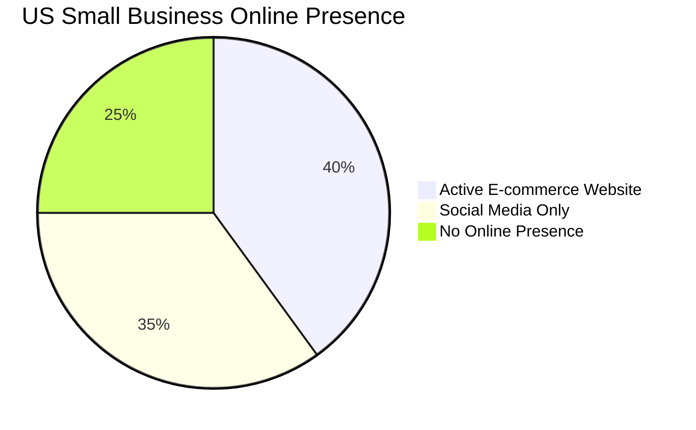
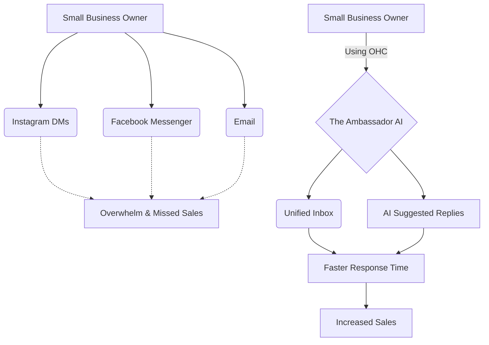

# OHC Small Business Platform Research Report

## 1. Deep Competitor Audit

### Shopify (https://shopify.com)
*   **Target:** E-commerce (mostly physical goods).
*   **Onboarding:** Extensive, overwhelming. Requires significant configuration before going live.
*   **Mobile App:** Excellent for managing an existing store (orders, inventory), poor for initial setup.
*   **AI Features:** "Shopify Sidekick" (chat-based assistant), AI product descriptions. It's a copilot, not an autonomous agent.
*   **Pricing:** Starts at $39/mo.
*   **Free Tier:** 3-day trial. No useful free tier.
*   **User Complaints:** Steep learning curve, expensive themes/apps, overwhelming interface for simple needs.

### Wix (https://wix.com)
*   **Target:** General websites, service businesses, basic e-commerce.
*   **Onboarding:** Easier than Shopify. Wix ADI (AI builder) helps create the initial site.
*   **Mobile App:** Limited editing capabilities.
*   **AI Features:** Wix ADI (generates site layout and text). Mostly focused on creation, not ongoing management.
*   **Pricing:** Starts at $16/mo.
*   **Free Tier:** Free tier available but with Wix ads and no custom domain.
*   **User Complaints:** Sluggish editor, can feel bloated, "too many options."

### Squarespace (https://squarespace.com)
*   **Target:** Creatives, portfolios, restaurants, basic e-commerce.
*   **Onboarding:** Template-driven. Requires manual customization.
*   **Mobile App:** Basic editing and management.
*   **AI Features:** Basic AI text generation. No strong autonomous features.
*   **Pricing:** Starts at $16/mo.
*   **Free Tier:** 14-day trial. No useful free tier.
*   **User Complaints:** Restrictive templates, limited flexibility, expensive for full e-commerce.

### GoDaddy / Airo (https://godaddy.com)
*   **Target:** Absolute beginners, domain buyers.
*   **Onboarding:** Extremely simple, but shallow. Airo helps with initial branding.
*   **Mobile App:** Basic.
*   **AI Features:** Airo (generates logo, tagline, basic site). Very limited post-launch AI.
*   **Pricing:** Starts around $10/mo (often with aggressive introductory discounts).
*   **Free Tier:** Basic free tier available.
*   **User Complaints:** Aggressive upselling, hidden fees, poor reputation, very basic features.

### Square Online (https://squareup.com/online-store)
*   **Target:** Retailers, restaurants, service businesses with physical presence.
*   **Onboarding:** Driven by item catalog setup.
*   **Mobile App:** Excellent for in-person sales (POS), basic for online store management.
*   **AI Features:** Generative AI for item descriptions, basic photo editing.
*   **Pricing:** Free tier available (pay only processing fees), paid plans start at $29/mo.
*   **Free Tier:** Strong free tier (pay per transaction).
*   **User Complaints:** Limited customization, less flexible than Shopify for pure e-commerce.

---

## 2. Top 10 SMB Pain Points

1.  **Setting up a website is too complex/technical.** (Source: Reddit `r/smallbusiness`, Trustpilot reviews for Shopify/Wix). Users get stuck on domains, DNS, and theme customization.
2.  **Managing inventory across multiple channels is a nightmare.** (Source: Reddit `r/ecommerce`). Keeping physical store and online store in sync is difficult.
3.  **Customer communication is scattered.** (Source: App Store reviews). DMs on Instagram, Facebook, emails, and SMS are hard to track.
4.  **Booking and scheduling is manual.** (Source: Reddit `r/smallbusiness`). Service businesses spend too much time going back and forth via text/email.
5.  **Writing product descriptions/copy takes too long.** (Source: General e-commerce forums).
6.  **Figuring out marketing/SEO is overwhelming.** (Source: Reddit `r/smallbusiness`). Owners don't know where to start or don't have the budget for ads.
7.  **Following up with leads/abandoned carts is forgotten.** (Source: Trustpilot reviews). Manual follow-ups are often missed when busy.
8.  **Understanding analytics/finances is confusing.** (Source: Reddit `r/smallbusiness`). Dashboards have too much data and not enough actionable insights.
9.  **Mobile management is limited.** (Source: App Store reviews). Owners want to do everything from their phone, but apps often lack desktop features.
10. **The cost of tools adds up quickly.** (Source: Reddit `r/smallbusiness`). Subscribing to a website builder, booking tool, email marketing tool, etc., is expensive.

---

## 3. OHC AI Differentiation Manifesto

**The 5 AI Automations OHC Will Implement First:**

1.  **Invisible Social Media Inbox (The Ambassador):** Automatically consolidate Instagram, Facebook, and email messages into one inbox and draft AI-suggested replies (or auto-reply for common questions like hours/location). Saves hours per day.
2.  **One-Click Product Creation (The Manager):** Users upload a photo from their phone. AI automatically writes the title, description, and suggests pricing based on market data. Saves 30 min per upload.
3.  **Auto-Pilot Follow-ups (The Salesperson):** AI automatically sends perfectly timed text/email follow-ups to inquiries or abandoned carts, maximizing conversion without manual effort.
4.  **Generative Social Marketing (The Promoter):** AI analyzes the product catalog and generates weekly social media posts (image + caption) ready to be published with one click. Removes the biggest marketing barrier.
5.  **Weekly Plain-English Business Insights (The Advisor):** Instead of complex dashboards, AI sends a weekly text/email: "You made $500 this week. Most of it came from [Product A]. Try promoting [Product B] next week." Makes owners feel smart and in control.

---

## 4. Market Sizing & Strategic Direction

*   **TAM:** Over 33 million small businesses in the US alone; globally, hundreds of millions. A significant percentage (estimated 30-40% of micro-businesses) have no real online presence beyond a social media page.
*   **Beachhead Market:** Service-based solopreneurs (tutors, handymen, consultants like Leo and Carlos). Highest density of underserved users. They don't need complex inventory; they need simple booking, invoicing, and lead capture.
*   **Geographic Expansion:** LATAM (Spanish/Portuguese). High rate of mobile-first entrepreneurship. OHC's mobile-first, AI-driven approach is perfect for regions skipping desktop entirely.
*   **Vertical Expansion:** Focus horizontally first (simple e-commerce + booking), then deepen booking features.

---

## 5. Feature Gap Matrix

| Feature | Shopify | Wix | OHC (current) | OHC (gap/advantage) |
| :--- | :--- | :--- | :--- | :--- |
| **Setup Speed** | Slow | Medium | Fast (AI) | Advantage: AI handles setup. |
| **Mobile App Setup** | Poor | Poor | Focus | Advantage: 10-minute mobile setup. |
| **AI Assistant** | Copilot (Sidekick) | Builder (ADI) | Autonomous Agents | Gap: Need to build out the autonomous agents (Ambassador, Manager, etc.). |
| **Booking/Scheduling** | Via App | Yes | Basic | Gap: Needs robust integrated booking (Cal.com integration). |
| **Unified Inbox** | Basic | Yes | Missing | Gap: Needs Meta Graph API integration. |
| **Automated Marketing** | Manual/Apps | Basic | Missing | Gap: Needs the "Promoter" agent for auto-social posts. |

---

## Proposed Next Steps (Issue Briefs)

Detailed issue briefs have been created in `docs/research/`.

