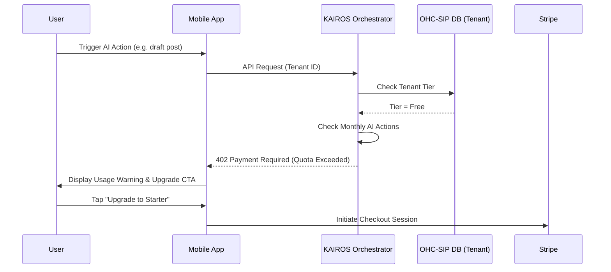

# OHC Multi-Tenant SaaS Tier Architecture Research Report

## Problem Statement
Small business owners—from a teenager with a side hustle to a growing boutique—need a straightforward, jargon-free way to understand what features they have access to and how much it costs. Competitors often bait-and-switch with limited free trials or hide essential features behind confusing paywalls. OHC needs a transparent tier system (Free, Starter, Pro, Business) that clearly defines product limits, AI usage quotas, and domain capabilities. The upgrade path must feel natural, occurring precisely when the business needs more capacity to grow.

## Research Report
An analysis of the SaaS tier structures for SMB platforms (Shopify, Wix, Squarespace, GoDaddy) reveals:
- **Shopify:** No permanent free tier (only trials). Starts at ~$39/mo, locking out casual side-hustlers.
- **Wix/Squarespace:** Free tiers exist but often include intrusive ads or restrict essential commerce features (like accepting payments).
- **GoDaddy:** Unpredictable renewal pricing and confusing add-ons for AI features.
- **Opportunity:** OHC can offer a **genuinely useful Free tier** (10 products, 1 AI department, 100 AI actions/mo, OHC subdomain) to eliminate the barrier to entry. As the user's business grows, clear usage meters (e.g., "You've used 95 of 100 AI actions") will naturally drive upgrades to Starter ($9/mo), Pro ($29/mo), or Business ($79/mo) without feeling punitive.

## Design Doc

### Architecture Diagram

### UI Wireframes / Screen Flow Description (375px First)
- **Settings / Billing Screen:** A simple list of current plan details with clear progress bars: "Products: 8/10", "AI Actions: 45/100".
- **Upgrade Modal:** A bottom-sheet that slides up displaying the tiers (Free, Starter, Pro, Business) in a side-by-side swipeable card format. Each card lists exactly what is included in plain language (e.g., "Unlimited products", "Custom domain").
- **Quota Warning:** When a user is at 90% of their limit, a non-intrusive banner appears on the home dashboard: "You're almost out of AI actions for the month. [Upgrade]".

### Mobile UX Flow
1. User navigates their daily dashboard.
2. If quota is near the limit, a friendly banner suggests upgrading to avoid interruption.
3. User taps "Upgrade" -> bottom sheet appears detailing the Starter tier ($9/mo).
4. User taps "Confirm Subscription" -> Native payment sheet (Apple Pay/Google Pay via Stripe) completes the transaction.
5. Immediate visual feedback: "You're now on the Starter tier! Your AI actions have been refilled to 1,000."

### AI Agent Integration Points
- **Budget Checking:** Every AI department (Operations, Customer Success, etc.) must check the tenant's remaining action quota before initiating a task.
- **Graceful Degradation:** If the quota is exceeded, the agent stops background processing and drafts a human-readable notification explaining that an upgrade is needed to continue background tasks.

### Key Design Decisions
- **Hard vs. Soft Limits:** AI actions are a hard limit to manage LLM API costs. Storage and product limits are soft-capped in UI but strictly enforced on new creations.
- **Tier Granularity:** Tiers are feature-gated (e.g., custom domains only on Starter+, multi-domain on Business) rather than purely usage-gated, providing clear value propositions for upgrading.

## Implementation Prompt
Implement the SaaS Tier enforcement engine. Build the mobile billing dashboard (ensuring perfect rendering at 375px) that displays usage progress bars and handles the upgrade flow via Stripe Checkout. Ensure that AI background workers gracefully handle `402 Payment Required` states by pausing tasks and alerting the user. Do not hardcode pricing; retrieve it from the database configuration.

## Priority
P1

## Estimated Scope
Medium
