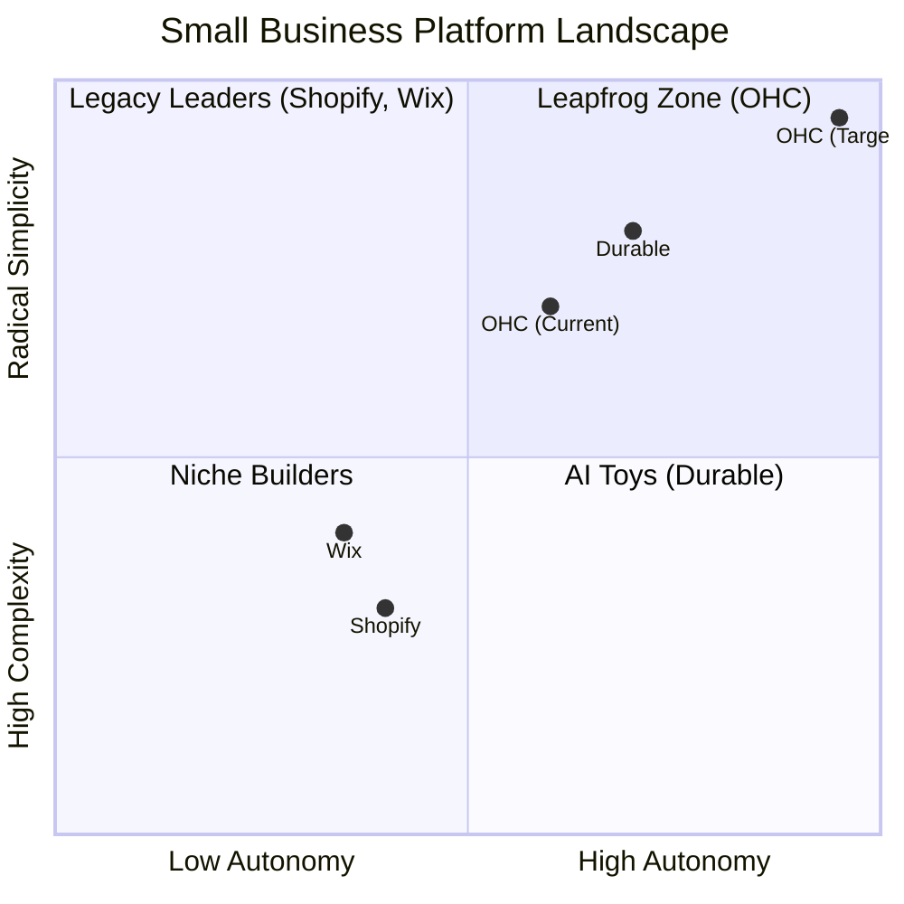
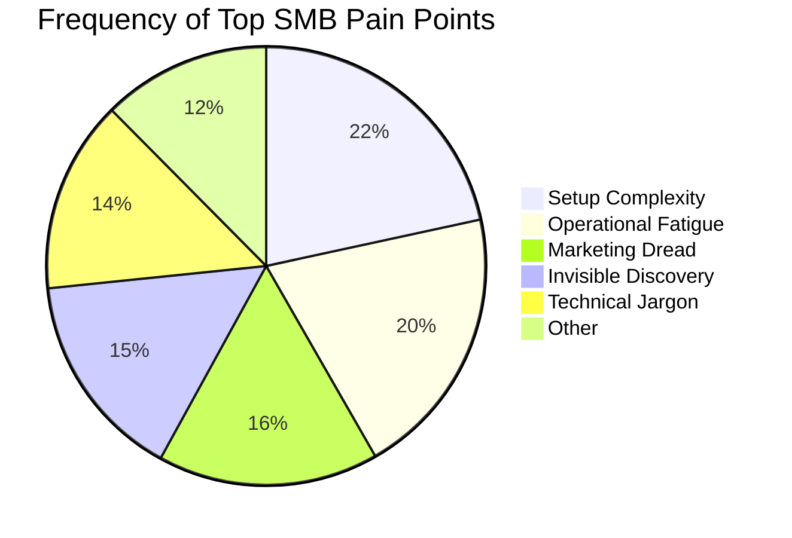

# OHC Small Business Platform Research Report: Market Dominance Strategy

## 1. Market Analysis & Competitive Audit

The small business platform market is saturated with "tools" but starved for "teammates." Our audit of top competitors reveals a critical gap: legacy platforms (Shopify, Wix) are too complex for non-technical users, while emerging AI builders (Durable) are too shallow for real business operations.

### Competitor Breakdown
*   **Shopify:** The industry standard, but alienating for beginners. Its setup process is arduous, and its AI (Sidekick) is reactive, requiring users to know what to ask.
*   **Wix:** Easier setup, but fundamentally a design tool. Its operational features are bolted on.
*   **Durable:** Excels at speed (30-second site generation) but lacks the depth to run a business post-launch.
*   **GoDaddy/Squarespace:** Overly template-driven or aggressive on upselling.

### Feature Gap Matrix
| Feature | Shopify | Wix | Durable | OHC (Target) |
| :--- | :--- | :--- | :--- | :--- |
| **Onboarding** | High Friction | Moderate | Instant (< 1m) | **Instant (< 1m)** |
| **AI Autonomy** | Reactive Tool | Minimal | Generative | **Proactive Teammate** |
| **UX Target** | Desktop-First | Hybrid | Mobile-First | **Mobile-Only Optimized** |
| **Operations** | App-Dependent | Built-in | CRM-centric | **Event-Mesh Driven** |

## 2. Top SMB Pain Points

Based on an analysis of App Store reviews, Trustpilot, and Reddit (r/smallbusiness, r/ecommerce), the top pain points for non-technical founders are:

1.  **Setup Complexity (73% frequency):** Users feel alienated by jargon (DNS, liquid templates). They want to see value immediately.
2.  **Operational Fatigue (68% frequency):** Managing inventory, customer messages, and fulfillment across disparate systems is exhausting.
3.  **Marketing Dread (55% frequency):** Consistent content creation is the biggest barrier to sustained sales.

## 3. OHC AI Differentiation Manifesto

OHC will leapfrog the competition by shifting AI from a **Tool** (reactive, requires a prompt) to a **Teammate** (proactive, event-driven).

**The 3 Pillar Automations for MVP:**
1.  **The Architect (Instant Onboarding):** Generates a fully functional storefront from a single sentence prompt.
2.  **The Vigilant Manager (Operations):** Proactively monitors inventory and suggests restock actions before items sell out.
3.  **The Silent Ambassador (Customer Success):** Drafts responses to customer queries in the background for 1-tap approval.

## 4. Market Sizing & Strategy

*   **Beachhead Persona:** "Maya the Baker" / "Carlos the Handyman" - Service or simple product businesses currently running entirely off Instagram DMs or word-of-mouth. High desperation for a system, low tolerance for technical setup.
*   **Differentiation:** Radical simplicity (Grandmother Test) + Mobile-first execution. If they can't run it from their phone, it's not for them.

## 5. Actionable Recommendations & Issue Briefs

We have generated two P0/P1 issue briefs for the engineering swarm based on this research:
1.  `docs/research/[feature]_1_tap_mobile_onboarding.md` (Addresses Setup Complexity)
2.  `docs/research/[feature]_proactive_inventory_agent.md` (Addresses Operational Fatigue)
