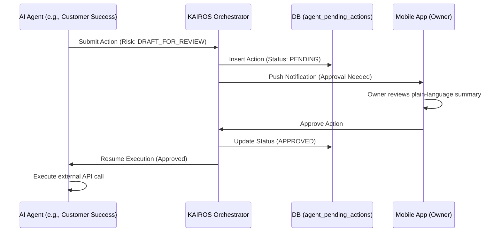

# AI Agent Department Approval Workflow Architecture

## 1. Problem Statement
The KAIROS Orchestrator currently routes events to various AI Agent Departments (Operations, Customer Success, Finance, etc.). However, high-risk actions (such as sending customer emails, publishing social media posts, or issuing refunds) are not gated by an approval mechanism. This poses a significant risk for small business owners who need to trust the system but also retain control over sensitive external communications and financial transactions. From the perspective of a non-technical small business owner, the lack of an approval step means the AI might "say something wrong" or "give away money" without their consent.

## 2. Research Report
### 2.1 Market Competitive Analysis
- **Shopify**: Offers "Sidekick" for chat, but it does not execute high-risk actions autonomously without explicit user confirmation.
- **Wix / Squarespace**: AI is used primarily for content generation (copywriting, design templates) which is inherently "draft-for-review" as the user must hit "Publish".
- **GoDaddy**: Basic AI features, but no autonomous agent workflows.
- **OHC Platform**: Aims to be fully autonomous, but must bridge the trust gap by introducing a transparent, mobile-first "Draft-for-Review" state for high-risk actions.

### 2.2 Technical Findings
- The KAIROS Orchestrator uses a multi-tenant Go+Bazel backend with PostgreSQL (`SKIP LOCKED` queues) and Redis Redlock for distributed coordination.
- Agent actions are currently executed immediately upon task completion.
- The platform uses `ohc:lock:{tenant_id}:{resource_type}:{resource_id}` for locking.
- A new mechanism is needed to intercept high-risk tasks, store them in a pending state, and notify the user via the mobile app (Flutter).

## 3. Design Doc
### 3.1 Key Decisions
- **Action Risk Levels**: Introduce a structured `ActionRisk` tiering system:
  - `AUTO_EXECUTE`: Low risk, internal updates (e.g., updating an inventory tag, recalculating a dashboard metric).
  - `DRAFT_FOR_REVIEW`: High risk, external or financial actions (e.g., sending an email, refunding a payment, publishing to a social network).
- **Pending Queue**: High-risk actions will be stored in a new PostgreSQL table (`agent_pending_actions`) with a `status` of `PENDING_APPROVAL`.
- **Mobile-First Approval Flow**: The business owner receives a push notification and sees a "Pending Approvals" inbox on their 375px mobile dashboard. A single tap approves or rejects the action.
- **Execution Resumption**: Upon approval, the KAIROS Orchestrator moves the action back to the execution queue with elevated privileges to complete the task.

### 3.2 Architecture Diagram

### 3.3 Mobile UX Flow (375px)
1. **Home Screen Badge**: The dashboard shows a red badge counter on the "Inbox" or "Pending" tab.
2. **Pending List**: A scrollable list of pending actions (e.g., "Review draft email to Maya").
3. **Detail View**: Tapping an item shows a plain-language summary:
   - "The Ambassador wants to send this email to John Doe regarding their missing order."
   - The proposed email content is displayed in a glassmorphic card.
4. **Action Buttons**: Two large, touch-friendly (≥ 44x44px) buttons at the bottom:
   - "Approve & Send" (Primary)
   - "Reject / Edit" (Secondary)

## 4. Implementation Prompt
**Objective:** Implement the backend approval engine and the corresponding Flutter mobile UI for the "Draft-for-Review" AI agent workflow.

**Backend Tasks (Go+Bazel):**
- Define the `ActionRisk` enum and add it to the agent mission payload.
- Create a new database table/schema to store pending actions with appropriate `tenant_id` RLS isolation.
- Implement the API endpoints for the mobile app to fetch pending actions and submit approval/rejection decisions.
- Modify the KAIROS Orchestrator to intercept `DRAFT_FOR_REVIEW` actions, enqueue them, and resume them upon approval.

**Frontend Tasks (Flutter):**
- Implement the "Pending Approvals" mobile UI flow as described in the Design Doc.
- Ensure all layouts are tested starting at 375px.
- Use the OHC Premium Token library (Glassmorphism, Outfit/Inter typography).

**Acceptance Criteria:**
- The end-to-end flow works: an agent proposes a high-risk action, it appears on the mobile dashboard, the user approves it, and the action is subsequently executed.
- RLS policies ensure users can only see their own tenant's pending actions.
- E2E tests must cover the complete flow starting from the UI login, including mocking the agent's initial proposal.

**Priority**: P1 (High)
**Estimated Scope**: Medium
