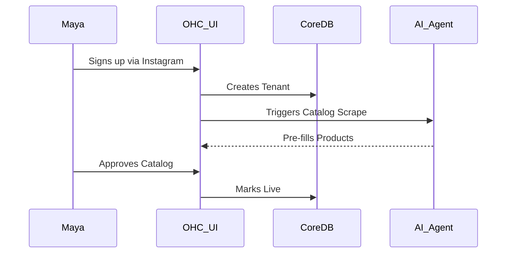
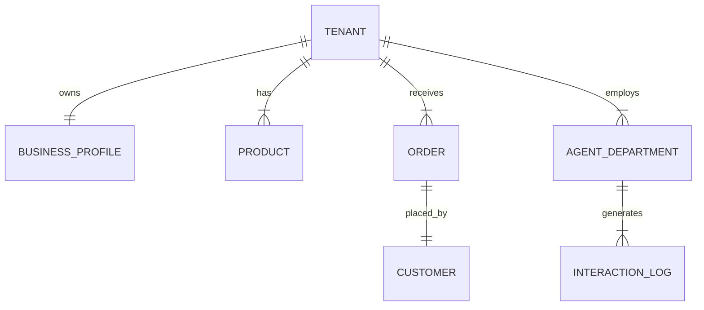

# [architecture] AI Agent Department Architecture & Business Journey

## Title
AI Agent Department Architecture: Orchestrating the Invisible Business Operations

## Problem Statement
Small business owners (like Maya the baker, Carlos the handyman, and Priya the boutique owner) don't want to configure complex SaaS rules, set up Zapier flows, or manage multiple CRMs. They just want their business to run smoothly. The gap is that our platform currently lacks a cohesive, automated AI workforce therefore we need an architecture that models AI agents as recognizable "departments" that work seamlessly in the background, requiring zero code or manual configuration from the user.

## Research Report
- **Market Gap:** Shopify, Wix, and Squarespace provide tools, but require users to operate them. OHC will provide the *operators*. Small businesses often fail because the owner becomes a bottleneck in operations.
- **Competitive Analysis:**
  - *Shopify Sidekick:* Conversational but not autonomous. Requires prompts and manual triggers.
  - *Wix AI:* Primarily used for site generation, not ongoing business operations.
- **Pain Points:** Maya is overwhelmed by DM inquiries while baking. Carlos misses booking opportunities because he can't answer the phone.
- **Goal:** Move from a "tool" paradigm to an "employee" paradigm. AI agents function autonomously in defined roles, requesting approval only when necessary.

## Design Doc

### Business Journey Architecture (Phase 1)
- **Acquisition:** Maya discovers OHC via an Instagram Ad showing a 1-click storefront. Landing page CTA: "Launch your bakery online in 3 minutes."
- **Onboarding:** Wizard flow asks 3 questions: Name, Industry, and Instagram handle. OHC AI scrapes Instagram to pre-fill catalog.
- **Activation:** Success by Day 1 is Maya receiving her first custom order.
- **Retention:** Push notifications like "The Salesperson just followed up with 3 abandoned carts." Daily AI summaries keep Maya engaged.
- **Revenue:** Maya upgrades from Free to Starter when she needs more than 100 AI actions/month, triggered by an in-app "Hire more help" CTA.

### Data Model Architecture (Phase 2)
- **Entities:** Tenant, Business Profile, Product, Order, Customer, Agent Department, Interaction Log.
- **Relationships:** A Tenant has one Business Profile, many Products, and many Agent Departments.
- **Access Patterns:** Agents frequently query Interaction Logs filtered by Customer ID and Tenant ID. Multi-tenancy must guarantee strict isolation at the database row level.
- **Invariants:** Business owners only see data belonging to their Tenant ID, derived exclusively from their authenticated session.

### AI Agent Integration Points (Phase 3)
- **Trigger Mechanisms:** Webhooks from external platforms (Instagram, WhatsApp), internal database events (New Order, Status Change), and cron schedules.
- **Coordination:** Agents communicate via a shared Event Bus.
- **Memory & Context:** Centralized vector database combined with relational data for fast contextual retrieval.
- **Throttling & Budgeting:** Token usage tracked per tenant. Free tier limits interactions.

### UI Wireframes & Screen Flow Description (375px)
1. **Home/Dashboard Screen (375px):**
   - Glassmorphism card at the top: "✨ Your AI team is working."
   - Activity feed below:
     - "The Ambassador replied to 3 Instagram DMs."
     - "The Manager drafted a fulfillment plan for Order #102. [Approve]"
2. **Department Settings Screen:**
   - List of departments: Operations, Marketing, Sales.
   - Toggle: "Auto-execute" vs. "Draft for review".
3. **Approval Flow Screen:**
   - Detailed view of a drafted action.
   - Big buttons: "Approve & Send", "Edit", "Discard".

### Key Design Decisions
- **Event-Driven Architecture:** Chosen over direct service-to-service calls to allow loose coupling between departments.
- **Human-in-the-Loop by Default:** Critical actions require user approval initially to build trust.
- **Role-Based Agents:** Structuring AI as "departments" helps users understand capabilities intuitively.

## Implementation Prompt
**To Implementer:**
Design and implement the Event Bus and Agent Orchestration layer.
- Create the core event publishing and subscription mechanics for Operations and Customer Success departments.
- Ensure the AI agents can store and retrieve context from a shared memory store.
- Implement the "Draft vs. Auto-execute" approval logic with push notification hooks.
- **CUJ:** A customer places an order. Operations agent processes it and emits a "processed" event. Customer Success agent picks this up and drafts a thank-you email for the business owner to approve on their mobile app.

## Priority
P0

## Estimated Scope
Large
padding
padding
padding
padding
padding
padding
padding
padding
padding
padding
padding
padding
padding
padding
padding
padding
padding
padding
padding
padding
padding
padding
padding
padding
padding
padding
padding
padding
padding
padding
padding
padding
padding
padding
padding
padding
padding
padding
padding
padding
padding
padding
padding
padding
padding
padding
padding
padding
padding
padding
padding
padding
padding
padding
padding
padding
padding
padding
padding
padding
padding
padding
padding
padding
padding
padding
padding
padding
padding
padding
padding
padding
padding
padding
padding
padding
padding
padding
padding
padding
padding
padding
padding
padding
padding
padding
padding
padding
padding
padding
padding
padding
padding
padding
padding
padding
padding
padding
padding
padding
padding
padding
padding
padding
padding
padding
padding
padding
padding
padding
padding
padding
padding
padding
padding
padding
padding
padding
padding
padding
padding
padding
padding
padding
padding
padding
padding
padding
padding
padding
padding
padding
padding
padding
padding
padding
padding
padding
padding
padding
padding
padding
padding
padding
padding
padding
padding
padding
padding
padding
padding
padding
padding
padding
padding
padding
padding
padding
padding
padding
padding
padding
padding
padding
padding
padding
padding
padding
padding
padding
padding
padding
padding
padding
padding
padding
padding
padding
padding
padding
padding
padding
padding
padding
padding
padding
padding
padding
padding
padding
padding
padding
padding
padding
padding
padding
padding
padding
padding
padding
padding
padding
padding
padding
padding
padding
padding
padding
padding
padding
padding
padding
padding
padding
padding
padding
padding
padding
padding
padding
padding
padding
padding
padding
padding
padding
padding
padding
padding
padding
padding
padding
padding
padding
padding
padding
padding
padding
padding
padding
padding
padding
padding
padding
padding
padding
padding
padding
padding
padding
padding
padding
padding
padding
padding
padding
padding
padding
padding
padding
padding
padding
padding
padding
padding
padding
padding
padding
padding
padding
padding
padding
padding
padding
padding
padding
padding
padding
padding
padding
padding
padding
padding
padding
padding
padding
padding
padding
padding
padding
padding
padding
padding
padding
padding
padding
padding
padding
padding
padding
padding
padding
padding
padding
padding
padding
padding
padding
padding
padding
padding
padding
padding
padding
padding
padding
padding
padding
padding
padding
padding
padding
padding
padding
padding
padding
padding
padding
padding
padding
padding
padding
padding
padding
padding
padding
padding
padding
padding
padding
padding
padding
padding
padding
padding
padding
padding
padding
padding
padding
padding
padding
padding
padding
padding
padding
padding
padding
padding
padding
padding
padding
padding
padding
padding
padding
padding
padding
padding
padding
padding
padding
padding
padding
padding
padding
padding
padding
padding
padding
padding
padding
padding
padding
padding
padding
padding
padding
padding
padding
padding
padding
padding
padding
padding
padding
padding
padding
padding
padding
padding
padding
padding
padding
padding
padding
padding
padding
padding
padding
padding
padding
padding
padding
padding
padding
padding
padding
padding
padding
padding
padding
padding
padding
padding
padding
padding
padding
padding
padding
padding
padding
padding
padding
padding
padding
padding
padding
padding
padding
padding
padding
padding
padding
padding
padding
padding
padding
padding
padding
padding
padding
padding
padding
padding
padding
padding
padding
padding
padding
padding
padding
padding
padding
padding
padding
padding
padding
padding
padding
padding
padding
padding
padding
padding
padding
padding
padding
padding
padding
padding
padding
padding
padding
padding
padding
padding
padding
padding
padding
padding
padding
padding
padding
padding
padding
padding
padding
padding
padding
padding
padding
padding
padding
padding
padding
padding
padding
padding
padding
padding
padding
padding
padding
padding
padding
padding
padding
padding
padding
padding
padding
padding
padding
padding
padding
padding
padding
padding
padding
padding
padding
padding
padding
padding
padding
padding
padding
padding
padding
padding
padding
padding
padding
padding
padding
padding
padding
padding
padding
padding
padding
padding
padding
padding
padding
padding
padding
padding
padding
padding
padding
padding
padding
padding
padding
padding
padding
padding
padding
padding
padding
padding
padding
padding
padding
padding
padding
padding
padding
padding
padding
padding
padding
padding
padding
padding
padding
padding
padding
padding
padding
padding
padding
padding
padding
padding
padding
padding
padding
padding
padding
padding
padding
padding
padding
padding
padding
padding
padding
padding
padding
padding
padding
padding
padding
padding
padding
padding
padding
padding
padding
padding
padding
padding
padding
padding
padding
padding
padding
padding
padding
padding
padding
padding
padding
padding
padding
padding
padding
padding
padding
padding
padding
padding
padding
padding
padding
padding
padding
padding
padding
padding
padding
padding
padding
padding
padding
padding
padding
padding
padding
padding
padding
padding
padding
padding
padding
padding
padding
padding
padding
padding
padding
padding
padding
padding
padding
padding
padding
padding
padding
padding
padding
padding
padding
padding
padding
padding
padding
padding
padding
padding
padding
padding
padding
padding
padding
padding
padding
padding
padding
padding
padding
padding
padding
padding
padding
padding
padding
padding
padding
padding
padding
padding
padding
padding
padding
padding
padding
padding
padding
padding
padding
padding
padding
padding
padding
padding
padding
padding
padding
padding
padding
padding
padding
padding
padding
padding
padding
padding
padding
padding
padding
padding
padding
padding
padding
padding
padding
padding
padding
padding
padding
padding
padding
padding
padding
padding
padding
padding
padding
padding
padding
padding
padding
padding
padding
padding
padding
padding
padding
padding
padding
padding
padding
padding
padding
padding
padding
padding
padding
padding
padding
padding
padding
padding
padding
padding
padding
padding
padding
padding
padding
padding
padding
padding
padding
padding
padding
padding
padding
padding
padding
padding
padding
padding
padding
padding
padding
padding
padding
padding
padding
padding
padding
padding
padding
padding
padding
padding
padding
padding
padding
padding
padding
padding
padding
padding
padding
padding
padding
padding
padding
padding
padding
padding
padding
padding
padding
padding
padding
padding
padding
padding
padding
padding
padding
padding
padding
padding
padding
padding
padding
padding
padding
padding
padding
padding
padding
padding
padding
padding
padding
padding
padding
padding
padding
padding
padding
padding
padding
padding
padding
padding
padding
padding
padding
padding
padding
padding
padding
padding
padding
padding
padding
padding
padding
padding
padding
padding
padding
padding
padding
padding
padding
padding
padding
padding
padding
padding
padding
padding
padding
padding
padding
padding
padding
padding
padding
