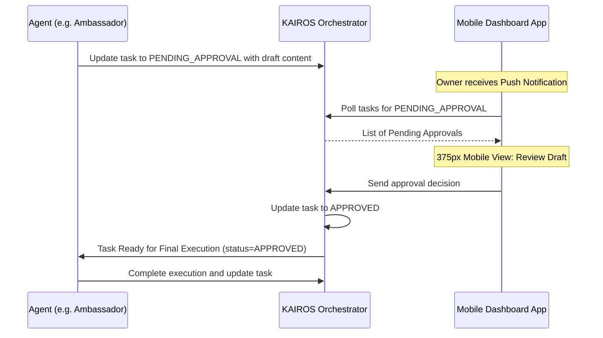

# Issue Brief: Implement AI Agent Approval Workflow Engine

## Title
[architecture] Implement AI Agent Approval Workflow Engine for Draft-for-Review Actions

## Problem Statement
Small business owners (like Maya the baker or Carlos the handyman) rely on OneHumanCorp (OHC) to handle complex operations seamlessly. However, some AI agent actions carry significant risk — such as sending emails to customers, posting to social media, or processing refunds. If an agent executes a poorly formulated email or issues an incorrect refund autonomously, it can directly damage the business owner's reputation and bottom line.

Currently, the orchestrator lacks a "Draft-for-Review" state. Business owners need a way to review and approve high-risk actions generated by AI agents with a single tap on their mobile devices before these actions are executed. Without this safety net, non-technical users cannot fully trust the AI to act as their "Promoter" or "Ambassador".

## Research Report
### Competitive Landscape
- **Shopify (Sidekick):** Mostly conversational and acts as an assistant that can draft emails, but the user must manually copy-paste or hit send within a specific marketing tool. It lacks a unified, system-wide approval inbox for autonomous tasks.
- **Wix (Wix AI):** AI is restricted to specific domains (like text generation on the site builder). It doesn't run asynchronously in the background.
- **OHC's Opportunity:** By implementing a system-wide "Draft-for-Review" workflow, OHC's AI agents can be truly autonomous (running in the background) while keeping the business owner safely in the loop for high-risk executions. This creates a "trust but verify" model essential for SMBs.

### Codebase Context
- The `SharedTask` struct in `src/server/tasks.rs` and `src/proto/hub.proto` already has fields for `action_risk` and `approval_status`.
- `UpdateTaskStatusRequest` exists and is handled in `src/server/main.rs`.
- `B2BService` has an `ApprovalRequest` mechanism, but that is specific to B2B handshakes and handoffs, not the internal task orchestrator.

## Design Doc

### Key Design Decisions
1. **Risk Levels:** Define `ActionRisk` explicitly in the `SharedTask` payload (e.g., `LOW` for auto-execute, `HIGH` for draft-for-review).
2. **Approval Status Flow:**
   - When a high-risk task completes its initial processing, the agent sets the task status to `PENDING_APPROVAL` with the `proposed_content` populated.
   - The task is locked/paused until the owner approves or rejects it.
   - Upon approval, the task status becomes `APPROVED` and the agent picks it up for final execution.
   - Upon rejection, the task is marked `REJECTED`, optionally prompting the agent to revise the draft based on a rejection reason.
3. **Approval Queue:** Leverage the existing `SharedTask` system to expose tasks filtered by `status == PENDING_APPROVAL`.

### Architecture Diagram

### Mobile UX Flow (375px First)
1. **Notification:** "Ambassador drafted a reply to Maya's customer. Tap to review."
2. **Approval Inbox:** A clean list view of pending actions. Each card shows the agent avatar, action type (e.g., "Email Reply"), and the proposed text.
3. **Detail View:** Shows the full draft context. Two large, thumb-friendly buttons at the bottom (44x44px minimum touch targets): "Approve & Send" (Green) and "Reject/Edit" (Red/Secondary).
4. **Action:** Tapping "Approve & Send" immediately shows an optimistic success state and triggers the backend update.

## Implementation Prompt
**For the Implementer Agent:**
Implement the "Draft-for-Review" workflow in the KAIROS Orchestrator.
1. Design and add the necessary RPCs for handling task approval decisions.
2. Update the internal task manager logic to support transitioning tasks into a `PENDING_APPROVAL` state, and correctly update their statuses upon an approval decision.
3. Ensure the task status correctly reflects `PENDING_APPROVAL` when an agent submits high-risk work for review.
4. Add comprehensive E2E tests validating the full task lifecycle from in-progress, to pending approval, through to approved and completed.

Do not create new standalone approval queues (like in B2BService); instead, leverage the existing `SharedTask` infrastructure and its `approval_status` and `proposed_content` fields.

## Priority
P1 (High)

## Estimated Scope
Medium
