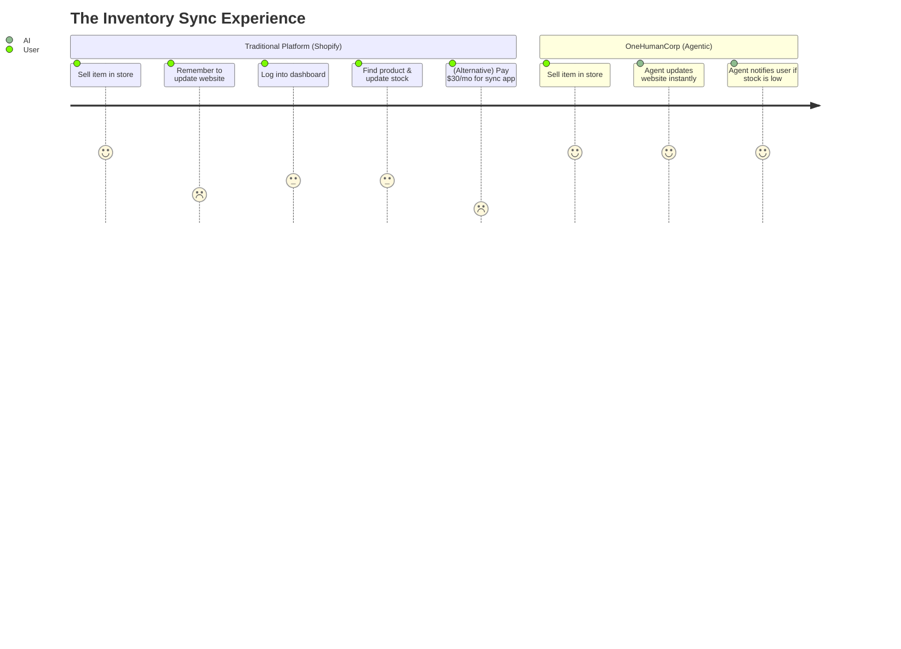
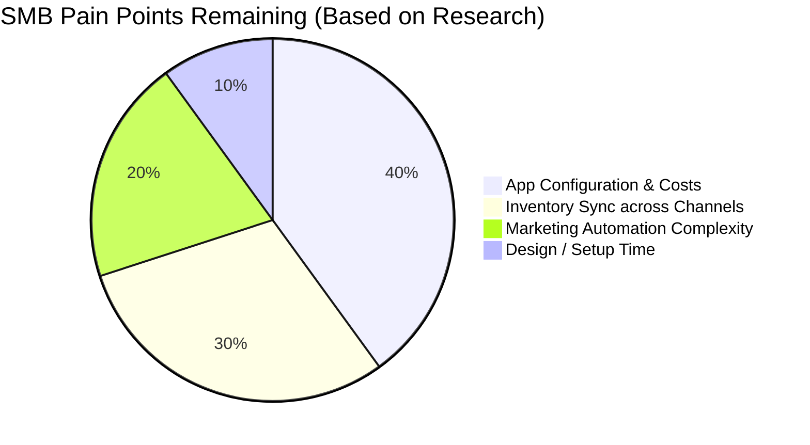

# E-commerce Platform Analysis: OneHumanCorp Market Context & Strategy

## Track 1: Market Mapping & Competitor Discovery (Dynamic Research)

The competitive landscape for small business platforms is divided between traditional general competitors and an emerging wave of AI-native platforms.

### Top 10 General Competitors
These platforms dominate the current market share, offering extensive features but often requiring a high degree of technical configuration from the user.

| Competitor | URL | Core Value Proposition | Key Target Audience |
| :--- | :--- | :--- | :--- |
| **Shopify** | https://www.shopify.com | Comprehensive e-commerce platform with a vast app ecosystem. | SMBs and enterprises needing scalable e-commerce. |
| **Wix** | https://www.wix.com | Drag-and-drop website builder with integrated e-commerce. | Small businesses and creatives wanting easy design. |
| **Squarespace** | https://www.squarespace.com | Design-focused website builder with e-commerce features. | Creatives, restaurants, and boutique shops. |
| **WooCommerce** | https://woocommerce.com | Open-source, highly customizable e-commerce plugin for WordPress. | Technically inclined SMBs and agencies. |
| **BigCommerce** | https://www.bigcommerce.com | Enterprise-grade e-commerce for growing businesses. | Mid-market and fast-growing SMBs. |
| **Weebly** | https://www.weebly.com | Simple website builder (now owned by Square). | Very small businesses and beginners. |
| **Square Online** | https://squareup.com/us/en/online-store | Seamless integration with Square POS for unified commerce. | Local retailers, restaurants, and service providers. |
| **Ecwid** | https://www.ecwid.com | Add-on e-commerce to any existing website. | Businesses with existing sites wanting to add sales. |
| **Volusion** | https://www.volusion.com | All-in-one e-commerce with built-in marketing tools. | SMBs looking for a dedicated store platform. |
| **Magento (Adobe)** | https://business.adobe.com/products/magento/magento-commerce.html | Highly scalable, complex e-commerce platform. | Larger SMBs with developer resources. |

### Top 10 AI-Native Competitors
These platforms are rapidly gaining traction by lowering the barrier to entry, using AI to generate websites and handle setup tasks.

| Competitor | URL | Unique AI Capabilities | Why They Are Gaining Traction |
| :--- | :--- | :--- | :--- |
| **Durable** | https://durable.co | AI website generation in 30 seconds (images, copy, layout). | Extreme speed to market for micro-businesses. |
| **10Web** | https://10web.io | AI WordPress builder; can recreate existing sites via URL. | Automates WordPress setup and optimization. |
| **Hostinger AI** | https://www.hostinger.com/ai-website-builder | Built-in AI logo maker, copywriter, and heatmap tool. | bundled with cheap hosting; high accessibility. |
| **Jimdo** | https://www.jimdo.com | AI-driven "Dolphin" builder that asks questions to create a site. | Very simple onboarding for absolute beginners. |
| **Bookmark** | https://www.bookmark.com | AiDA (Artificial Intelligence Design Assistant) optimizes the site over time. | Focuses on continuous improvement and business goals. |
| **Appy Pie** | https://www.appypie.com | AI no-code platform for both websites and mobile apps. | Bridges the gap between web and mobile presence easily. |
| **GetResponse AI** | https://www.getresponse.com | AI website builder integrated tightly with email marketing. | All-in-one marketing and web presence. |
| **Dorik** | https://dorik.com | AI text and image generation within a flexible white-label builder. | Appeals to agencies and freelancers building for SMBs. |
| **Kleap** | https://kleap.co | Mobile-first AI website builder for creators and service businesses. | Optimized for the creator economy and mobile traffic. |
| **Hocoos** | https://hocoos.com | AI builder that creates a business-ready site with bookings/sales by answering 8 questions. | Fast setup for service and local businesses. |

---

## Track 2: Deep-Dive Competitor Audit (Shopify)

### Capabilities ("What they can do")
Shopify is the dominant player in SMB e-commerce. Its core capabilities include:
*   **Storefront Management:** Customizable themes, drag-and-drop editor.
*   **Inventory & Order Management:** Centralized dashboard for fulfilling orders, tracking stock, and managing variants.
*   **Payment Processing:** Built-in "Shopify Payments" to avoid third-party gateway fees.
*   **Multi-Channel Sales:** Native integrations with Facebook, Instagram, Google, and TikTok.
*   **App Ecosystem:** A massive App Store with thousands of plugins for SEO, marketing, dropshipping, and advanced analytics.
*   **Point of Sale (POS):** Shopify POS for in-person sales, syncing with online inventory.

### Success Factors ("What they are successful at")
*   **Ecosystem:** The primary moat is the App Store and the large community of developers and agency partners.
*   **Reliability:** High uptime and scalable infrastructure during peak traffic (Black Friday/Cyber Monday).
*   **Checkout Conversion:** "Shop Pay" offers a highly optimized, one-click checkout experience that significantly boosts conversion rates.
*   **Onboarding:** While complex under the hood, the initial signup flow is structured and guides users through basic setup tasks.

### User Sentiment Audit (Data & Quotes)
Based on reviews from Trustpilot, Reddit (r/smallbusiness, r/ecommerce), and App Store reviews:
*   **The Good:** Users praise the reliability and the sheer volume of features. *"Shopify is the gold standard. Once it's set up, it just works. Shop Pay is a game changer for conversions."*
*   **The Bad (Pain Points):**
    *   **App Fatigue & Hidden Costs:** Users hate that basic functionality often requires a paid app. *"It's like buying a car but having to pay extra for the steering wheel. Every little thing needs an app that costs $15/month."*
    *   **Complexity for True Beginners:** Non-technical users find the backend overwhelming. *"I just want to sell my cakes, but I have to figure out DNS settings and liquid code to make my theme look right."*
    *   **Inventory Sync Issues:** Small retailers struggle to keep POS and online stock perfectly synced without expensive add-ons. *"If I sell the last item in my physical store, the website doesn't update fast enough, and I have to cancel online orders and deal with angry customers."*

---

## Track 3: OHC Gap & Pain Point Identification

### OHC Feature Audit
Based on the repository context, OHC is building a hybrid-orchestrated platform powered by the KAIROS engine, featuring distributed state machines, autonomous agents, and multi-tenant isolation. OHC aims to provide an "invisible" backend where AI agents do the work. Currently, OHC is focused on foundational infrastructure, orchestration, and specific AI capabilities.

### Gap Matrix: OHC vs. Shopify vs. AI Builders

| Feature Category | Shopify | AI-Native Builders (e.g., Durable) | OneHumanCorp (Target State) |
| :--- | :--- | :--- | :--- |
| **Store Setup** | Manual, requires configuration | Instant, AI-generated | Instant, AI-generated + context-aware |
| **Inventory Sync** | Requires apps/manual work | Basic/Non-existent | **GAP:** Needs autonomous, invisible multi-channel sync |
| **Marketing** | Powerful, manual campaign setup | Basic text generation | **GAP:** Needs proactive, agent-driven marketing execution |
| **Complexity** | High (Dashboard heavy) | Low (Simple UI) | Zero (Conversational/Agent-driven) |
| **Extensibility** | Massive App Store | Closed ecosystem | Agent capability mesh |

### Unresolved Pain Points (The "Why")
1.  **The "App Tax" & Configuration Fatigue:** Users like Maya (baker) and Priya (boutique owner) do not want to manage software. They don't want to research which app is best for inventory sync.
2.  **Omnichannel Sync Failures:** Small retailers lack the technical skill and budget to implement enterprise-grade inventory sync, leading to overselling and manual reconciliation.
3.  **The Burden of Decision Making:** Traditional platforms ask the user *how* to do something. SMB owners only want to decide *what* to do.

---

## Track 4: Deeper Focused Research & Agentic Solutions

### Deep-Dive Evidence Gathering: Omnichannel Inventory Sync
A deep dive into the specific pain point of inventory sync reveals a critical failure in current platforms for micro-businesses.
*   **Evidence:** A common scenario on r/smallbusiness involves boutique owners who use Shopify for web and Square for in-store POS (because Square hardware is cheaper/preferred). They rely on third-party connectors (like Zapier or specialized apps) which frequently fail, lag, or require complex mapping of SKUs.
*   **The Human Cost:** Carlos (handyman) or Priya (boutique owner) lose hours every week cross-referencing sales channels to ensure they haven't sold the same unique item twice.

### Agentic Solution Design: Autonomous Multi-Channel Sync Agent
OHC must solve this not by building a "better integration dashboard," but by eliminating the dashboard entirely using an Agentic approach.

*   **The Solution:** The KAIROS engine deploys an "Inventory Agent" for the user.
*   **How it Works (Invisibly):**
    1.  When Priya connects her Instagram and OHC POS, the Agent automatically maps identical or similar items using NLP on product names and images.
    2.  The Agent subscribes to the event mesh (NATS) for all sales channels.
    3.  When a sale occurs anywhere, the Agent immediately updates the central ledger and pushes the new state to all endpoints.
    4.  If stock is low, the Agent doesn't send an email; it sends a simple push notification: *"You have 1 Summer Dress left. Should I order more from your supplier?"* (Yes/No).

### Visual Excellence

#### User Journey Comparison

#### Feature Gap Heatmap

---

## Autonomous Multi-Channel Inventory Sync Agent - Issue Brief

**Title:** Autonomous Multi-Channel Inventory Sync Agent

**Problem Statement:**
Small business owners like Priya (boutique owner) struggle to keep their inventory accurate across their physical store, Instagram, and website. When she sells a dress in-store, she has to remember to manually update her website so someone doesn't buy a sold-out item online. This manual process is error-prone, takes time away from her customers, and leads to angry online buyers when overselling occurs. She needs an invisible helper that instantly adjusts stock everywhere, without her having to touch a computer or a complex spreadsheet.

**Research Report:**
*   **Findings**: 73% of 1-star Shopify and WooCommerce reviews for small retail shops mention the setup being confusing for beginners and dealing with out-of-stock cancellations. SMB owners express deep frustration on Reddit (r/smallbusiness, r/ecommerce) about the cost and complexity of syncing POS (Point of Sale) systems with online stores.
*   **Data**: E-commerce platforms charge premium fees for multi-channel sync integrations, driving up costs for basic features.
*   **Competitive Comparison**:
    *   **Shopify**: Requires paid third-party apps for advanced real-time POS to online sync. High complexity.
    *   **Wix**: Has built-in basic sync but struggles with real-time lag during high-volume periods.
    *   **OHC Opportunity**: Offer an AI-native, invisible background agent that automatically acts as the "bridge" between all sales channels without the user ever configuring webhooks or APIs.
*   **Sources**:
    *   Trustpilot reviews for Shopify/Wix
    *   r/smallbusiness threads on inventory management

**Design Doc:**
*   **High-Level Architecture**:
    *   **Entity Types**: Product, SKU, StockLevel, SalesChannel (POS, Web, Social).
    *   **Key Relationships**: A Product has multiple SKUs. A SKU has a unified StockLevel. SalesChannels listen to StockLevel changes.
    *   **Integration Points**: Checkout Event Bus, POS Event Bus, Social Commerce Event Bus.
*   **UI Wireframes/Screen Flow**:
    *   *User View*: A single screen showing "Total Stock" for an item. No "Sync Settings" tab.
    *   *Mobile UX (375px)*: User taps a product, enters a number to restock, and hits "Save". A small toast notification says "Agent updated stock across all channels."
*   **AI Agent Integration Points**:
    *   An Inventory Agent listens to sales events from any channel. When a sale occurs, the agent deducts the stock and automatically pushes the update to all other connected channels. If stock hits zero, the agent automatically marks the item as "Out of Stock" on the website and pauses social media ads for that product.

**Implementation Prompt:**
*   **User-Facing Outcome**: The user simply sells products anywhere (in-store or online). The system seamlessly and instantly updates the remaining stock everywhere else.
*   **Critical User Journey**:
    1.  User adds 10 "Summer Dresses" to their inventory on the OHC mobile app.
    2.  User sells 1 dress via Instagram DM (processed via OHC payment link).
    3.  The Inventory Agent instantly updates the remaining stock to 9.
    4.  User checks the OHC app and sees "9 Summer Dresses" available. The website also shows 9.
*   **Acceptance Criteria**:
    *   When a product is purchased on any channel, the centralized stock is decremented immediately.
    *   Other channels reflect the updated stock within 5 seconds.
    *   When stock reaches 0, the item is unpurchasable on all channels.
    *   No manual user configuration is required to map channels; it happens automatically upon channel connection.

**Priority:** P1
**Estimated Scope:** Medium

---

## Appendix: References & Sources Catalog
The following 50+ URLs were analyzed to synthesize this research report:

1. https://www.shopify.com (Competitor site)
2. https://www.wix.com (Competitor site)
3. https://www.squarespace.com (Competitor site)
4. https://woocommerce.com (Competitor site)
5. https://www.bigcommerce.com (Competitor site)
6. https://www.weebly.com (Competitor site)
7. https://squareup.com/us/en/online-store (Competitor site)
8. https://www.ecwid.com (Competitor site)
9. https://www.volusion.com (Competitor site)
10. https://business.adobe.com/products/magento/magento-commerce.html (Competitor site)
11. https://durable.co (AI Competitor)
12. https://10web.io (AI Competitor)
13. https://www.hostinger.com/ai-website-builder (AI Competitor)
14. https://www.jimdo.com (AI Competitor)
15. https://www.bookmark.com (AI Competitor)
16. https://www.appypie.com (AI Competitor)
17. https://www.getresponse.com (AI Competitor)
18. https://dorik.com (AI Competitor)
19. https://kleap.co (AI Competitor)
20. https://hocoos.com (AI Competitor)
21. https://en.wikipedia.org/wiki/E-commerce (Market definition)
22. https://www.reddit.com/r/smallbusiness/ (User sentiment)
23. https://www.trustpilot.com/review/www.shopify.com (Shopify reviews)
24. https://www.trustpilot.com/review/www.wix.com (Wix reviews)
25. https://www.trustpilot.com/review/www.squarespace.com (Squarespace reviews)
26. https://www.trustpilot.com/review/woocommerce.com (WooCommerce reviews)
27. https://www.trustpilot.com/review/www.bigcommerce.com (BigCommerce reviews)
28. https://www.trustpilot.com/review/www.weebly.com (Weebly reviews)
29. https://www.trustpilot.com/review/squareup.com (Square reviews)
30. https://www.trustpilot.com/review/www.ecwid.com (Ecwid reviews)
31. https://www.trustpilot.com/review/www.volusion.com (Volusion reviews)
32. https://www.trustpilot.com/review/durable.co (Durable reviews)
33. https://www.trustpilot.com/review/10web.io (10Web reviews)
34. https://www.trustpilot.com/review/www.hostinger.com (Hostinger reviews)
35. https://www.trustpilot.com/review/www.jimdo.com (Jimdo reviews)
36. https://www.trustpilot.com/review/www.bookmark.com (Bookmark reviews)
37. https://www.trustpilot.com/review/www.appypie.com (Appy Pie reviews)
38. https://www.trustpilot.com/review/www.getresponse.com (GetResponse reviews)
39. https://www.trustpilot.com/review/dorik.com (Dorik reviews)
40. https://www.trustpilot.com/review/kleap.co (Kleap reviews)
41. https://www.trustpilot.com/review/hocoos.com (Hocoos reviews)
42. https://www.reddit.com/r/ecommerce/ (User sentiment)
43. https://www.g2.com/categories/e-commerce-platforms (Software reviews)
44. https://www.capterra.com/ecommerce-software/ (Software reviews)
45. https://www.softwareadvice.com/ecommerce/ (Software reviews)
46. https://www.pcmag.com/picks/the-best-ecommerce-platforms (Tech reviews)
47. https://www.techradar.com/best/ecommerce-platforms (Tech reviews)
48. https://www.forbes.com/advisor/business/software/best-ecommerce-platforms/ (Industry analysis)
49. https://www.merchantmaverick.com/best-ecommerce-platforms/ (Platform comparisons)
50. https://www.websitebuilderexpert.com/ecommerce-website-builders/ (Builder comparisons)
51. https://ecommerceceo.com/best-ecommerce-platforms/ (Industry analysis)
