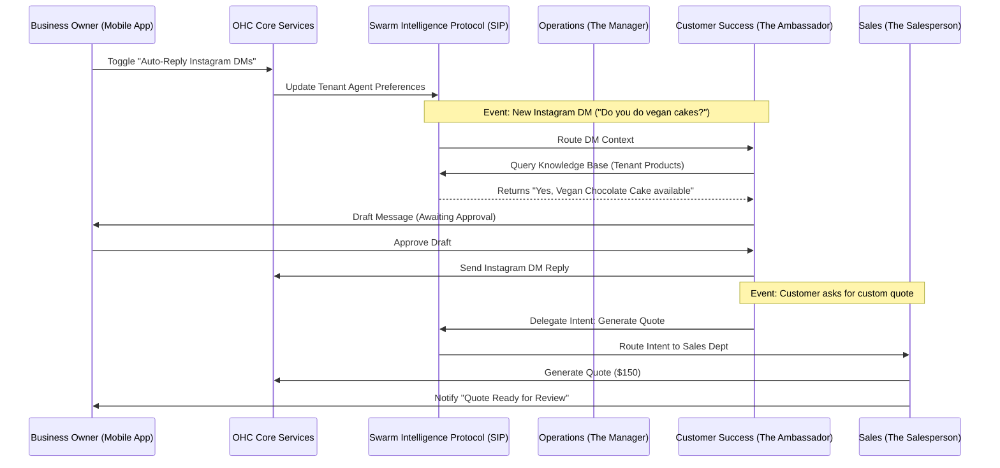

# AI Agent Department Architecture

## Problem Statement
Small business owners—whether a baker, handyman, or boutique owner—often wear too many hats. They struggle to manage operations, marketing, sales, customer service, finances, and legal compliance simultaneously. Most lack the technical expertise to configure complex SaaS tools or automation workflows. They need an invisible, integrated team of AI agents that automatically handles these domain-specific tasks in the background, allowing them to focus on their core business without needing to learn code, complex UI, or manual workflows.

## Research Report
Current platforms (Shopify, Wix, Squarespace) offer app stores and basic automations, but they require significant manual setup, fragmented subscriptions, and complex configuration screens. Small business owners typically abandon these setups or ignore them entirely.
- **Shopify Flow / Inbox:** Requires building manual logic flows and rules. Too complex for a 50-year-old food cart owner.
- **Wix Automations:** Basic triggers (e.g., email on cart abandon), but lacks conversational agency or cross-domain awareness.
- **Squarespace:** Focuses primarily on visual design, lacking deep operational AI integration.

The OneHumanCorp (OHC) difference is that the AI does not require a "setup flow." Instead, it is organized into familiar, human-like "Departments" that mimic a real business structure. The user simply toggles a department "on" or gives it high-level permission (e.g., "reply to my Instagram DMs about vegan cakes").

**Key Findings:**
- Users understand roles (e.g., "The Manager", "The Accountant") much better than technical concepts (e.g., "Webhooks", "Vector DBs").
- Users need visibility into what the AI did *after* the fact (activity feed) and the ability to review drafts before sending (approval queues) until trust is built.
- Cross-department coordination is essential: "The Salesperson" closing a quote must immediately notify "The Manager" to block off calendar time.

## Design Doc

### Architecture Diagram

### Mobile UX Flow (375px First)
1. **Dashboard Home:** Simple feed of recent activities. "The Manager just updated your inventory."
2. **Departments Tab:** A list of available departments with simple toggle switches and friendly avatars.
    - *The Manager* (Operations)
    - *The Promoter* (Marketing)
    - *The Ambassador* (Customer Success)
3. **Department Detail Screen:**
    - **Status:** Active / Paused.
    - **Recent Activity:** "Answered 4 DMs today", "Drafted 1 Quote".
    - **Settings (Simple Mode):** "Can this agent reply automatically or draft for review?" (Toggle: Auto-reply vs. Draft).
    - **Settings (Advanced Mode):** Revealed via sticky toggle. Shows raw JSON context rules and prompt modifiers.

### AI Agent Integration Points
- **Event Bus:** Core services publish events (e.g., `OrderPlaced`, `MessageReceived`). The Swarm Intelligence Protocol (SIP) routes these to the appropriate department's worker queue.
- **Memory Store:** Agents read from and write to a tenant-scoped `PersistentMemoryStore` and `VectorRepository`. This ensures "The Ambassador" remembers a customer's past orders processed by "The Manager".
- **Execution Engine:** Agents can execute tools via a sandboxed execution environment (e.g., generating PDFs, hitting external APIs) using the backend harness.
- **Resource Limits:** Agent actions are throttled based on the Tenant's SaaS Tier (e.g., Free tier: 100 actions/mo).

### Key Design Decisions
- **Familiar Naming:** Departments are named after human roles (The Manager, The Salesperson) to pass the grandmother test.
- **Progressive Trust:** All new agents default to "Draft Mode" (approval required) until the user explicitly toggles "Auto-Pilot".
- **Tenant Isolation:** All vector memories and state are strictly partitioned by Tenant ID.
- **Cross-Mode Parity:** The swarm architecture must work locally via IPC for Standalone Desktop and via Redis for Cloud deployments.

## Implementation Prompt
**Objective:** Implement the backend Swarm Intelligence Protocol (SIP) routing and the mobile-first UI for managing AI Agent Departments.
**User-Facing Outcome:** A business owner can navigate to the "Team" tab on their mobile app, see the 7 available AI departments, toggle "The Ambassador" on, and set it to "Draft Mode" for customer messages.
**Critical User Journey (CUJ):**
1. User opens the app and navigates to the "Team" (Departments) screen.
2. User selects "The Ambassador" (Customer Success).
3. User toggles the status to "Active" and selects "Draft Mode".
4. When a simulated inbound message arrives, the backend routes it via SIP to the Ambassador agent.
5. The agent generates a response draft and adds it to the user's approval queue.
6. The user receives a push notification, reviews the draft, and approves it.
**Acceptance Criteria:**
- The database schema supports tenant-scoped Agent configurations and an approval queue.
- The UI strictly adheres to the Visual Excellence Mandate (Glassmorphism, Outfit/Inter typography, 375px responsive).
- The Progressive Disclosure Pattern is implemented (Simple vs. Advanced toggle for agent settings).
- Multi-tier resource limits are enforced (e.g., decrementing the monthly action quota upon draft generation).

## Priority
P0

## Estimated Scope
Large
