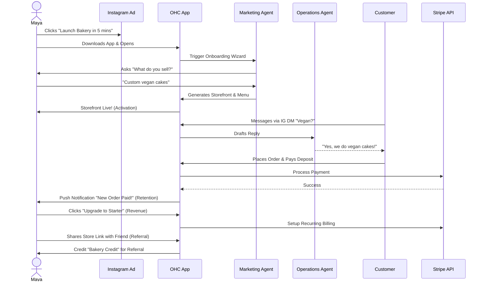
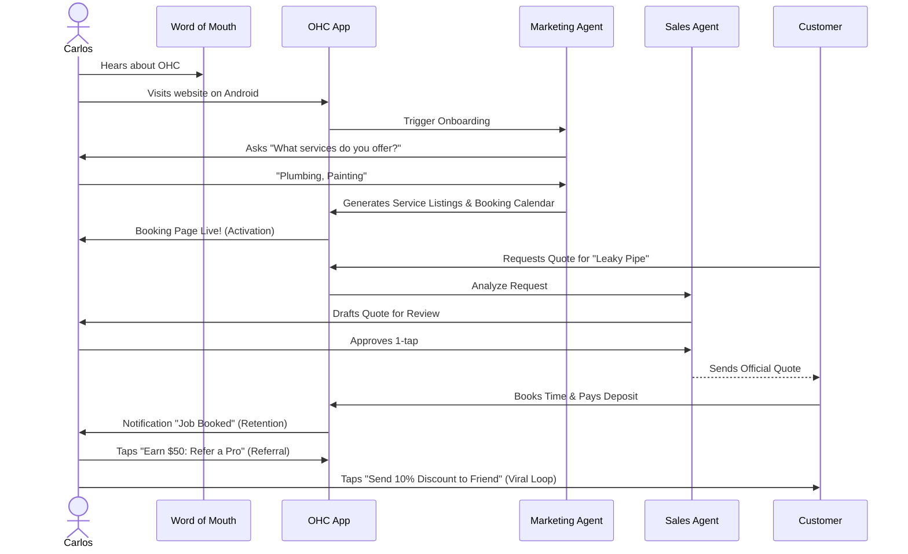
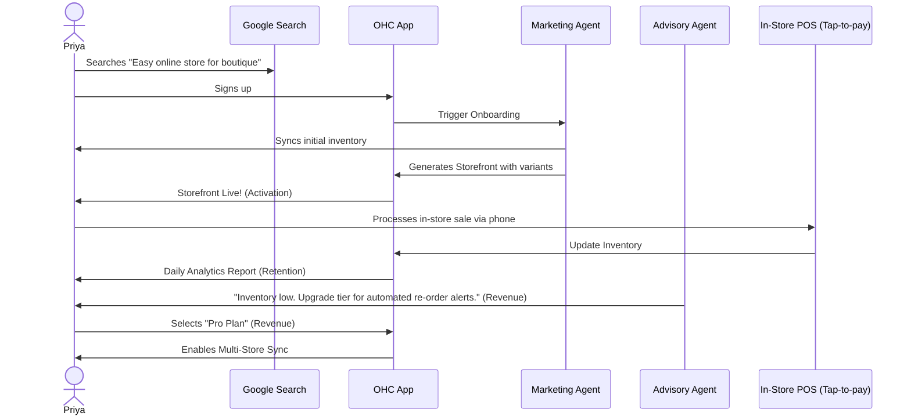
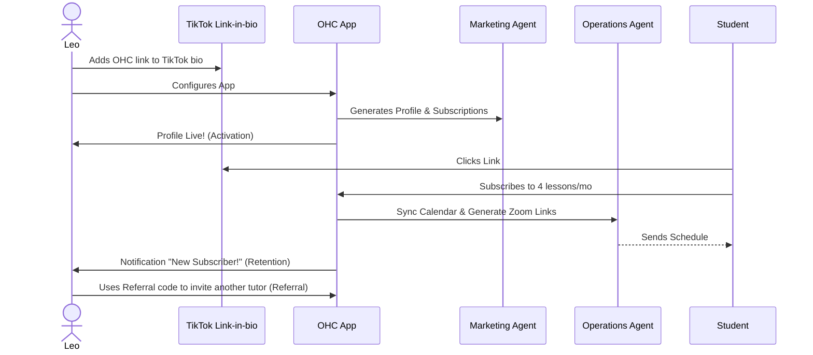
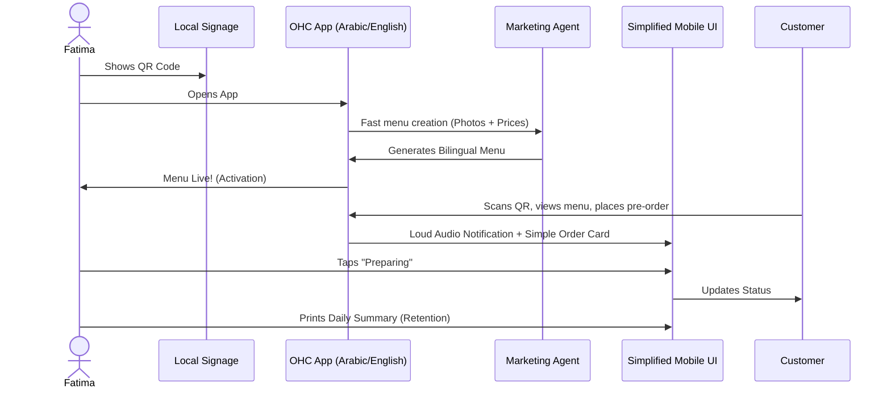

# Title
Business Journey Architecture

# Problem Statement
Non-technical small business owners (Maya, Carlos, Priya, Leo, and Fatima) often struggle to launch and grow their businesses due to fragmented, highly technical toolchains. The critical gap is the lack of a cohesive, mobile-first end-to-end journey—from initial acquisition and onboarding, through activation and retention, to revenue generation and referral. Without a unified business journey architecture, users face cognitive overload and abandon the platform, particularly at key friction points like payment gateway setup and calendar syncing. We must define a seamless path that allows any user to transition from zero to a live business in under 10 minutes.

# Research Report
Our competitive analysis of existing platforms reveals the following:
- **Shopify / Wix / Squarespace / GoDaddy comparison**: Shopify requires complex theme configuration; Wix and Squarespace overwhelm users with desktop-centric drag-and-drop builders; GoDaddy offers quick setups but lacks integrated AI agent operations. None provide a genuinely mobile-native, AI-first onboarding flow that achieves "Activation" (a live storefront) in minutes.
- **Findings & Data**: Most drop-offs occur during onboarding when users are prompted for detailed inventory or shipping rules.
- **Persona-specific pain point summaries**:
  - *Maya*: Needs simple deposit-based custom orders without complex product variant setup.
  - *Carlos*: Struggles with connecting a booking calendar to real-world availability.
  - *Priya*: Needs to sync in-store tap-to-pay with online inventory smoothly.
  - *Leo*: Requires automated subscription billing and meeting links without juggling multiple apps.
  - *Fatima*: Faces language barriers and requires a simple, bilingual interface for pre-orders.
- **Key advantages and risks**: The primary advantage is a frictionless, AI-guided onboarding experience that significantly increases activation rates. The main risk is over-simplification, where advanced users might feel restricted by the progressive profiling approach before reaching higher tiers.
- **Rough pricing**: The platform journey supports our tier system: Free ($0/mo), Starter ($9/mo), Pro ($29/mo), and Business ($79/mo).
- **Whether it works in both Cloud and Standalone modes**: The business journey architecture is fully supported in both Cloud (multi-tenant shared database) and Standalone modes (local SQLite file isolation with offline drafting capabilities).

# Design Doc

## Architecture Diagrams (Mermaid.js)

### 1. Maya (The Home Baker) Full Journey

### 2. Carlos (The Handyman) Full Journey

### 3. Priya (The Boutique Owner) Full Journey

### 4. Leo (The Music Tutor) Full Journey

### 5. Fatima (The Food Cart Operator) Full Journey

## UI Wireframes / Screen Flow Description (375px first)
1. **Acquisition / Landing**: A clean, mobile-optimized landing page with a single CTA: "Start your business".
2. **Onboarding Wizard**: A progressive chat-like interface utilizing native mobile keyboards. Requires only business name and category.
3. **Activation Screen**: A visually premium (Glassmorphism, Outfit/Inter typography) shimmer-loading screen that transitions into the live storefront preview.
4. **Dashboard**: Bottom navigation bar. The primary view shows actionable cards (e.g., "Review Quote Draft" or "New Order").

## Mobile UX Flow
- **Offline Drafting**: Critical inputs during onboarding and task management are saved locally to SQLite to ensure resilience against poor connectivity.
- **1-Tap Approvals**: Complex AI operations (e.g., sending a quote) are simplified to a single "Approve" button with large touch targets (≥ 44x44px).

## AI Agent Integration Points
- **The Marketing Agent** guides the initial onboarding flow and generates the initial storefront.
- **The Operations Agent** intercepts DMs and handles customer inquiries.
- **The Sales Agent** drafts service quotes for review.
- **The Advisory Agent** suggests tier upgrades when volume limits are approached.

## Key Design Decisions
- **Progressive Profiling**: We strictly limit initial onboarding questions to prevent drop-off.
- **Optimistic UI Updates**: Used throughout to make the app feel instantly responsive, with background syncing to the KAIROS Orchestrator.
- **AI-First Setup**: Eliminates the need for manual configuration of settings like CNAME or shipping zones initially.

## Comparative Table: Journey Analysis
| Persona | Key Need | Activation Trigger |
|---|---|---|
| Maya (Baker) | Custom Orders | First storefront live |
| Carlos (Handyman) | Booking/Quotes | First quote approved |
| Priya (Boutique) | Inventory Sync | POS integration |
| Leo (Tutor) | Subscriptions | Calendar sync |
| Fatima (Food Cart)| Pre-orders | Menu live |

# Implementation Prompt
Design and implement the foundational user onboarding flow that maps to the defined end-to-end business journey. You must create the data models required to capture minimal initial configurations (e.g., business type) and build a progressive, mobile-first (375px breakpoint) UI wizard. This wizard should defer advanced settings and conclude by generating a functional "Storefront/Booking Page" view to trigger the "Activation" stage. All UI elements must adhere to the Visual Excellence Mandate (Glassmorphism, Outfit/Inter typography, touch targets ≥ 44x44px) and support optimistic UI updates. Provide E2E Playwright/Slint tests verifying the complete flow from zero setup to live activation.

# Priority
P0

# Estimated Scope
Large