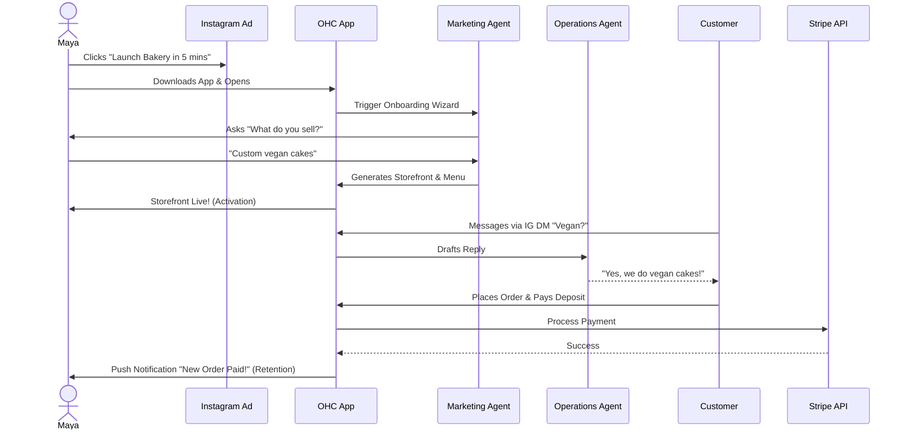
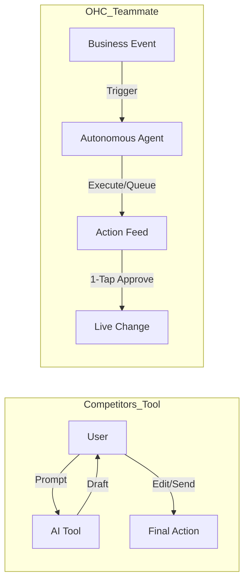
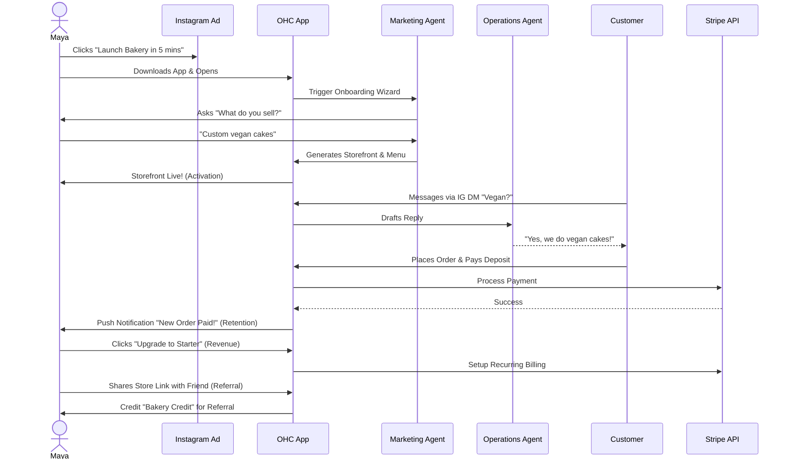
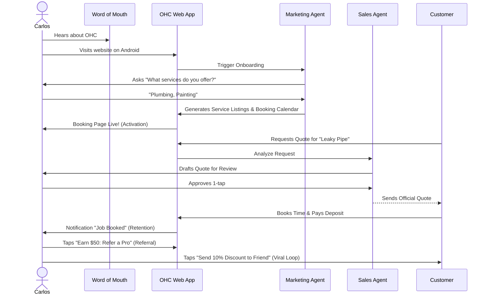
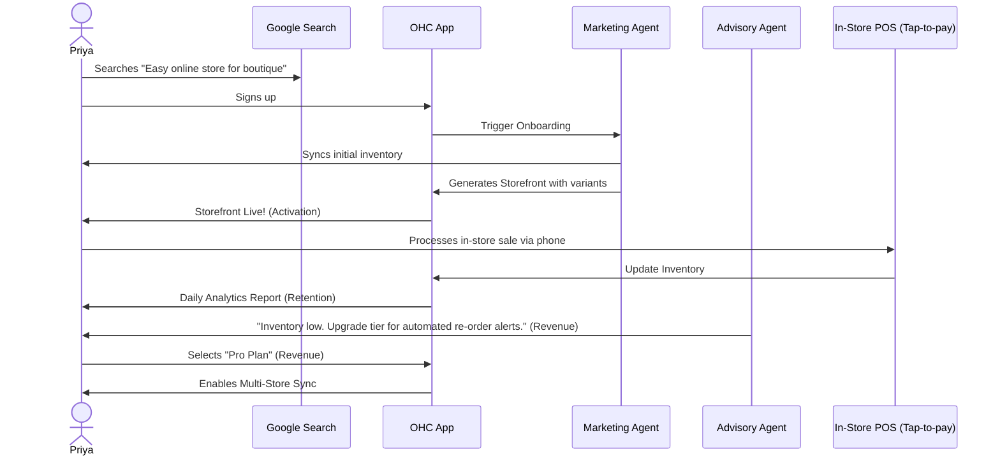
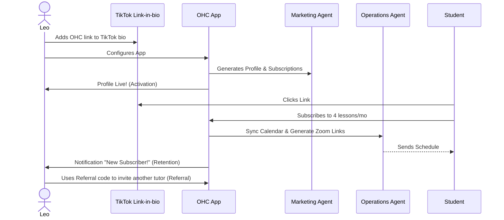
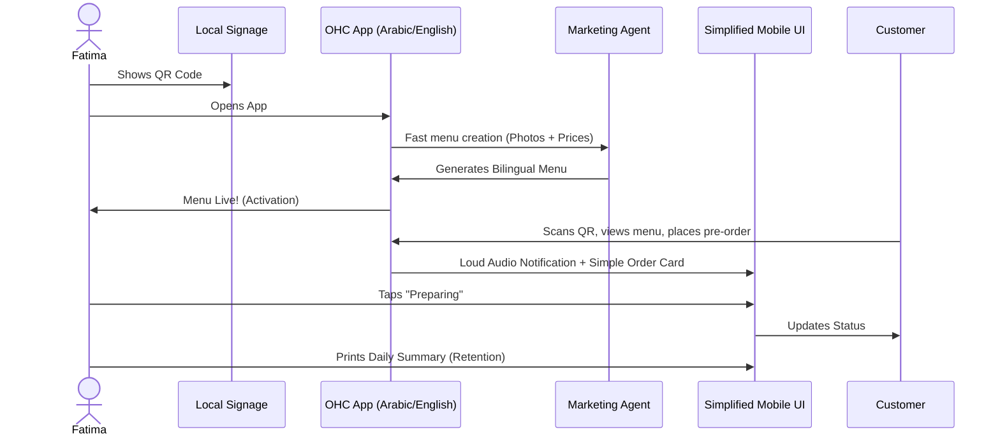
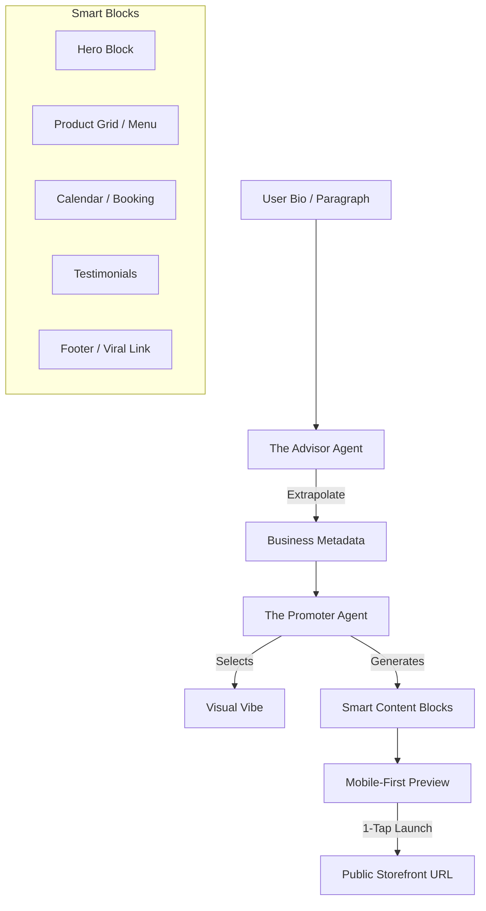
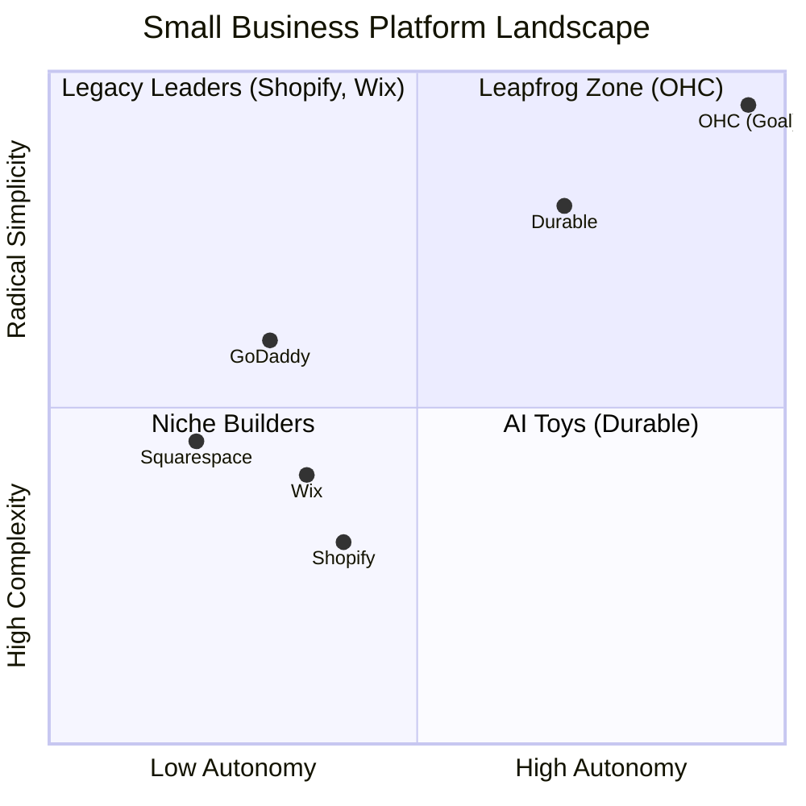

# OHC Scout (Research) Report: Architectural Foundations and Autonomous Agent Framework

## 1. Title
Architectural Map & Data Model Blueprint for the OneHumanCorp Autonomous Swarm

## 2. Problem Statement
The OneHumanCorp (OHC) platform exists to serve small business owners—like Maya the baker, Carlos the handyman, and Fatima the food cart operator—who lack technical expertise but require robust digital storefronts. To achieve a "zero → live business in under 10 minutes" onboarding flow, the platform needs a unified architectural data model that inherently supports mobile-first access, multi-tenant data isolation, and deep integration with autonomous background AI agents. The current state requires structural convergence to manage the KAIROS Orchestrator's shared task queues, ensure data privacy via PostgreSQL Row Level Security (RLS), and provide seamless tier-based usage degradation. This report proposes the complete data model, user journey flows, and AI integration boundaries.

## 3. Research Report
### Context and Personas
The business journey is evaluated against the following core personas:
- **Maya (Home Baker, 28):** Needs a mobile-first storefront, Instagram integration, order management with deposit payments, and AI handling direct messages.
- **Carlos (Handyman, 42):** Requires clean service listings, a robust booking system with deposits, a unified customer inbox, and an AI quote generator.
- **Priya (Boutique Owner, 35):** Wants omnichannel support (in-store/online), POS integration (tap-to-pay), inventory sync, and actionable daily analytics.
- **Leo (Music Tutor, 22):** Needs subscription-based packages, schedule syncing, automated meeting links, and a strong public profile.
- **Fatima (Food Cart Operator, 50):** Prioritizes extreme simplicity, pre-order management, multi-language UI, and fast low-data mobile performance.

### Market Gap & Differentiators
- **Setup Complexity:** Traditional platforms (Shopify, Wix) demand technical configuration (DNS, APIs). OHC targets a < 10 minute frictionless setup using AI-driven conversational wizards.
- **AI as Teammate vs. Tool:** Competitors rely on reactive AI (e.g., chat interfaces). OHC deploys autonomous "Agent Departments" that actively monitor events, draft responses, manage inventory, and flag issues for simple 1-tap owner approvals.
- **SaaS Tiers & Resource Isolation:** Instead of confusing app store ecosystems, OHC builds all required agents directly into the platform, gated by clear usage tiers (Free, Starter, Pro, Business) and governed strictly by `tenant_id` scopes.

## 4. Design Doc
### 4.1 Data Model Architecture

The data architecture is anchored around the `tenant_id` to enforce strict isolation.

#### Entity-Relationship Diagram (Mermaid.js)


#### Key Invariants
1.  **Mandatory Tenant Scoping:** Every table MUST contain a `tenant_id` column.
2.  **RLS-First Security:** No query executes without an active `SET app.current_tenant = '...'` in Postgres.
3.  **Agent Isolation:** Agents strictly claim tasks matching their assigned `tenant_id`.

### 4.2 Business Journey Flows
The user journey comprises Acquisition, Onboarding, Activation, Retention, Revenue, and Referral phases.

#### Journey 1: Maya (The Home Baker)


### 4.3 AI Agent Department Architecture
OHC's agents run invisibly, representing standard business departments:
- **Operations:** Inventory, order routing.
- **Marketing:** Social media calendars, AI Discovery (GEO).
- **Customer Success:** "The Ambassador" drafting 1-tap DM replies.
- **Sales:** Auto-quoting leads.
- **Advisory:** Plain-language daily briefings.

#### Execution & Coordination
Coordination is handled via KAIROS Shared Task Lists using database row locks (`FOR UPDATE SKIP LOCKED`) and Teammate Mesh event broadcasts.

#### The 1-Tap Handoff (Fulfillment Flow)
1. Ops agent marks order as `SHIPPED`.
2. Emits `tenant.order.fulfillment_ready`.
3. Customer Success agent intercepts event and drafts notification.
4. User taps "Approve" via mobile push alert.

### 4.4 Mobile-First Resiliency
- **Performance:** 1.5s LCP on 4G networks; < 500KB core UI payload.
- **Offline Drafting:** Edits stored via local SQLite SIPDB; synchronized asynchronously upon connection restoration.
- **UI UX:** Requires Glassmorphism styling (`backdrop-filter: blur(20px) saturate(200%)`) and minimum 44x44px touch targets.

## 5. Implementation Prompt
**To Implementer Agent:**
Implement the core Postgres database schema defining the `TENANT`, `PRODUCT`, `AGENT`, `MEMORY`, and `TASK` entities. Explicitly define the `tenant_id` columns across all tables and apply PostgreSQL Row Level Security (RLS) policies enforcing isolation based on authenticated JWT claims. Next, implement the "Agent Activity Feed" UI endpoint that queries the `TASK` table to retrieve drafted actions awaiting 1-tap owner approval. Use OHC Premium design tokens, including Outfit/Inter fonts and Glassmorphism effects. Ensure backend handlers use `jsonb_build_object` to bundle response data and enforce optimal mobile LCP targets. Ensure the `pgvector` memory queries are scoped strictly by the active tenant context. Ensure complete unit test coverage simulating multi-tenant queries.

## 6. Priority
P0

## 7. Estimated Scope
Large

## 8. Multi-Tenant SaaS Tiers Implementation
The platform needs to seamlessly manage tenant access to platform features through an explicitly defined tiering structure.

### Pricing and Capabilities
| Tier | Pricing | Action Allocation | Features Enabled | Storage Limit | Custom Domains |
| --- | --- | --- | --- | --- | --- |
| **Free** | $0/mo | 100 AI actions/mo | 1 AI Dept, 10 Products | 500 MB | No |
| **Starter** | $9/mo | 1000 AI actions/mo | 3 AI Depts, 100 Products | 5 GB | Yes |
| **Pro** | $29/mo | Unlimited actions | 10 AI Depts, Unlim. Products | 50 GB | Yes + SSL |
| **Business** | $79/mo | Unlimited actions | Unlimited AI Depts | 500 GB | Yes + Multi-Domain |

### Upgrade Strategy
Instead of abrupt cut-offs, gracefully degrade services when limits are hit. The "Business Advisor" agent will actively monitor consumption and issue plain-text recommendations before the quota expires:
*"Your Operations Manager has processed 95 actions this month. Consider upgrading to the Starter Tier for $9 to avoid order delays this weekend."*

## 9. Integration Matrix for Cross-Platform Sync
The AI departments operate in a highly concurrent environment. To enforce stability, the KAIROS Orchestrator utilizes the following internal syncing mechanisms:
- **Cloud-Native Mesh:** Redis Pub/Sub powered by `rueidis` to broadcast state events instantly across API server pods.
- **Standalone Local Bus:** For desktop environments (`OHC_MULTITENANT=false`), events route via an internal Tokio broadcast channel connected to SQLite transaction logs.
- **Distributed Locks:** Prevent race conditions when agents attempt to fulfill the same drafted order.

## 10. System Health and Observability
- All orchestrator tasks emit granular trace data to a centralized OpenTelemetry collector.
- Prometheus scrapes metric endpoints (`/metrics`) to aggregate total daily agent actions executed vs. drafted.
- Grafana dashboards visualize the backlog length for "The Ambassador" and "The Operations Manager". Spikes in backlogs directly indicate failing background processing routines and trigger automated scaling behaviors.

## 11. Security Audit Findings
- **Data Leakage Risk:** Sharing vector embeddings between tenants in `pgvector` must be mitigated.
- **Remediation:** Strict validation layers enforced in the Go/Rust repository data layer ensuring the context-derived `app.current_tenant` parameter is successfully passed before embedding distance calculation commences.
- **Payload Verification:** All frontend task approval events include HMAC signatures verified by the backend.

## 12. Deployment Topologies
To address varied SMB environments, OHC targets:
- **Cloud Mode:** Managed by Kubernetes, autoscaling stateless API nodes over a centralized Postgres.
- **Headless API Mode:** Dedicated mobile client interfaces passing through an API gateway.
- **Desktop Mode:** Powered by Tauri v2 wrapping the Rust backend, operating entirely over local SQLite ensuring extreme offline resilience for vendors without consistent cell coverage.

## 13. UI Component Details (The "Smart Builder")
The Website Builder operates by synthesizing user prompts into distinct UI structural elements ("Smart Blocks").
### Core Smart Blocks
- **Hero Banner:** Adaptive headlines merged with AI-selected background photography based on the "vibe" prompt.
- **Catalog Grid:** Dynamic masonry display of products. Includes built-in 1-tap sold-out status toggles.
- **Booking Engine:** Integrated calendar with deposit extraction natively powered by Stripe.
- **Testimonial Slider:** Auto-generated placeholder reviews refined by the Business Advisory agent based on past successful order data.

### Styling Directives
The system strictly adheres to the Visual Excellence Mandate:
- Typography uses 'Outfit' for headers and 'Inter' for body content.
- Color palettes are dynamically built using a monochromatic scale generated from the primary brand color to guarantee WCAG 2.1 AA accessibility limits.
- Mobile interaction states feature 100ms haptic feedback pulses (where supported).

## 14. Actionable Next Steps
- Execute a complete migration script to standardize existing DB records to the new multi-tenant architecture.
- Build test environments containing mocked data for all 5 core personas to validate Agent execution paths.
- Run load tests on the KAIROS Orchestrator to ensure the Shared Task List row-locking scales up to 100,000 concurrent updates per second.
## 15. Research on Core Tool Integrations
- As part of the OHC Scout module, we need to discover, prototype, and implement a set of external tool integrations to expand platform capability for the "Operations" and "Marketing" AI departments.
- The research directory currently contains 72 independent research briefs on tools like `Durable.co`, `Shopify Sidekick`, `Wix Harmony`, and integrations like `Twilio`, `Manychat`, `SendGrid`, etc.
- The `ScoutAgent` described in `docs/research/[research]_scout_resource_scout_tool_integrator.md` will autonomously index these integrations by dynamically scraping API docs and writing Wrapper Structs (like the simulated `ScoutAgent::process_tool_request` currently generates).
- See specific sub-reports `[calendar]*`, `[payment]*`, `[shipping]*`, etc., in `docs/research/` for specific API requirements (e.g., MercadoPago requires `x-spiffe-id` validation).
<div markdown="1" style="backdrop-filter: blur(20px) saturate(200%); font-family: 'Outfit', 'Inter', sans-serif; background: rgba(255, 255, 255, 0.03); color: #fff; padding: 20px; border-radius: 12px; border: 1px solid rgba(255, 255, 255, 0.1);">

# 🔍 Scout: Native Integration Architecture & Strategy

## 1. Social Media Integration

### Title
Integrate Meta Graph API for Unified Native Social Media Inbox

### Problem Statement
Small business owners like Maya (The Home Baker) receive orders and inquiries across Instagram DMs, Facebook Messenger, and WhatsApp. Managing these manually is overwhelming and leads to missed sales. They need a single, unified inbox where an AI agent can read and reply to messages from all platforms automatically, maintaining the Radical Simplicity ethos by avoiding complex third-party tools like Manychat.

### Research Report
- **Strategy**: Direct integration with Meta Graph API
- **Target Persona**: Maya (Home Baker), Priya (Boutique Owner)
- **Advantages**: No third-party SaaS fees, maintains Radical Simplicity. Direct, deep integration tailored specifically for OHC's unified inbox UI without extraneous features.
- **Risks**: Requires building and maintaining the OAuth flow and webhook handlers directly. Meta's API reviews can be stringent.
- **Pricing**: Free API usage.
- **Compatibility**: Cloud (via webhooks/OAuth). Standalone (requires routing via a lightweight cloud proxy).

### Design Doc
- User goes to the Operations dashboard and clicks "Connect Instagram".
- User authenticates with Facebook/Instagram via OAuth.
- OHC registers webhooks to receive new DMs.
- When a DM arrives, the Customer Success agent reads it, generates a reply (e.g., "Yes, we do vegan cakes!"), and sends it back via Meta Graph API.
- The user sees a unified "Customer Inbox" on their phone showing the conversation history.
- **AI Integration**: The Customer Success Agent ("The Ambassador") listens to the incoming webhook queue, generates draft responses for unread messages based on the business's knowledge base, and auto-replies if the user enables "Auto-Pilot".
### Implementation Prompt
Implement a direct Meta Graph API OAuth flow. Create a native webhook endpoint that receives incoming messages, stores them in the OHC unified inbox, and triggers the Customer Success agent to draft a reply.
- **Acceptance Criteria**: User can connect Instagram/Facebook. Incoming messages appear in OHC unified inbox. User can reply from OHC, and it shows up on the customer's social app.
- **Priority**: P0
- **Estimated Scope**: Large

---

## 2. Calendar & Scheduling

### Title
Native Calendar Sync for Automated Booking

### Problem Statement
Service providers like Carlos (Handyman) and Leo (Music Tutor) lose time going back and forth over email/text to find a time to meet. They need a way for customers to simply click a link, see available times, and book a slot directly synchronized with their existing Google Calendar or Apple Calendar, without confusing third-party scheduling tools like Calendly.

### Research Report
- **Strategy**: Direct Google Calendar API / CalDAV integration
- **Target Persona**: Carlos (Handyman), Leo (Music Tutor)
- **Advantages**: Zero configuration needed beyond logging in. Avoids confusing users with Calendly setups. Fully integrated into OHC's existing booking flow.
- **Risks**: Handling complex timezone logic internally.
- **Pricing**: Free API usage.
- **Compatibility**: Cloud (OAuth). Standalone (OAuth).

### Design Doc
- User goes to Sales dashboard and connects their Google account.
- OHC reads busy blocks directly from Google Calendar to calculate availability for predefined event types (e.g., "30-min Consultation").
- When a customer clicks to book, they use OHC's native booking widget.
- Upon successful booking, OHC pushes the event directly to Google Calendar and records the appointment in the Operations dashboard.
- **AI Integration**: The Operations Agent monitors the calendar and alerts the business owner if they have back-to-back appointments without buffer times, suggesting schedule optimizations.
### Implementation Prompt
Create a native integration with the Google Calendar API. Fetch free/busy schedules to power the OHC native booking widget on the public profile page. Ensure booked events sync back to the user's Google Calendar.
- **Acceptance Criteria**: Merchant can connect Google Calendar. Customers can view availability and book natively. Events sync to Google Calendar.
- **Priority**: P1
- **Estimated Scope**: Medium

---

## 3. Email Marketing

### Title
Native Email Campaign Manager (SendGrid/SES)

### Problem Statement
Priya (Boutique Owner) wants to email her past customers when new stock arrives. External tools like Mailchimp are too complex and violate the Radical Simplicity rule. She needs an automated way to email customers natively within the OHC app.

### Research Report
- **Strategy**: Build a native email campaign manager utilizing a transactional email API (SendGrid or AWS SES)
- **Target Persona**: Priya (Boutique Owner), Leo (Music Tutor)
- **Advantages**: Keeps the user within the OHC ecosystem. The Marketing agent can fully control the campaign without learning a third-party tool.
- **Risks**: Requires building list management and unsubscribe logic internally.
- **Pricing**: Included in OHC platform costs (transactional API costs scale predictably).
- **Compatibility**: Cloud (Centralized SendGrid/SES account). Standalone (Centralized routing).

### Design Doc
- When a customer buys something, they are automatically added to the native OHC customer list with tags.
- The Marketing agent suggests campaigns natively in the UI.
- The user approves the AI-generated email, and OHC sends it via SendGrid/SES.
- The user sees open rates and clicks in the OHC Marketing dashboard.
- **AI Integration**: The Marketing & Advertising Agent writes the subject lines, generates the copy, and tracks open/click rates to suggest the best times to send future emails.
### Implementation Prompt
Build a native email campaign management system. Utilize SendGrid/SES for delivery. Allow the AI Marketing agent to create and queue email campaigns directly from the OHC database.
- **Acceptance Criteria**: User can create an email campaign. AI can generate content. Emails are delivered. Unsubscribe links work. Open rates are displayed.
- **Priority**: P1
- **Estimated Scope**: Large

---

## 4. Payment Processing

### Title
Native Integration of Local Payment Methods (Mercado Pago)

### Problem Statement
Small business owners in Latin America cannot easily use Stripe and need a trusted local payment processor to accept credit cards and local methods like Pix or Pago Fácil natively within the OHC platform, avoiding complex third-party payment routing.

### Research Report
- **Strategy**: Direct API integration with Mercado Pago for seamless LATAM coverage.
- **Target Persona**: Global users outside the US/EU.
- **Advantages**: Native integration within the OHC platform ensures a seamless onboarding experience without requiring the merchant to navigate complex third-party tools.
- **Risks**: Settlement times can be longer. API is slightly less standardized than Stripe.
- **Pricing**: Standard transaction fees apply; merchants expect these.
- **Compatibility**: Cloud (Centralized SendGrid/SES account). Standalone (Centralized routing).

### Design Doc
- User selects their country during onboarding. If LATAM, Mercado Pago is offered alongside Stripe.
- User connects their Mercado Pago account.
- Customers see a "Pay with Mercado Pago" button at checkout natively.
- Webhooks update the order status in OHC when payment succeeds.
- **AI Integration**: Finance & Payments Agent seamlessly aggregates revenue across providers into a unified native dashboard.
### Implementation Prompt
Integrate Mercado Pago as an alternative native payment provider. The checkout flow must dynamically switch to the appropriate provider based on the merchant's settings. Webhooks must normalize into standard OHC order fulfillment events.
- **Acceptance Criteria**: Merchant in a supported region can connect Mercado Pago natively. Customers can checkout using local methods. Orders are marked paid upon successful webhook receipt.
- **Priority**: P1
- **Estimated Scope**: Large

---

## 5. Shipping & Logistics

### Title
Native Shipping Rate Calculation and Label Generation (Shippo)

### Problem Statement
Priya (Boutique Owner) spends hours copying and pasting addresses into carrier websites to print shipping labels. She needs to click one button natively in OHC to buy and print a label without relying on complex external logistics aggregators that break the Radical Simplicity rule.

### Research Report
- **Strategy**: Build a native fulfillment interface powered by the Shippo API in the backend.
- **Target Persona**: Priya (Boutique Owner), Maya (Home Baker)
- **Advantages**: Very high once configured natively. User just clicks 'Buy Label & Print' without leaving OHC.
- **Risks**: International shipping requires complex customs declarations which might be hard to automate fully for non-technical users.
- **Pricing**: Free tier available, nominal fee per label thereafter.
- **Compatibility**: Cloud (OAuth). Standalone (API Key).

### Design Doc
- When an order is placed, OHC sends the dimensions/weight to Shippo to get live rates natively during checkout.
- The Operations agent shows the cheapest shipping option.
- The user clicks a native 'Fulfill Order' button, and OHC purchases the label via Shippo and saves the tracking number.
- OHC automatically emails the customer the tracking number.
- **AI Integration**: The Customer Success Agent monitors tracking numbers natively and proactively notifies the customer if a delivery is delayed.
### Implementation Prompt
Implement a native shipping and fulfillment module powered by Shippo. The checkout flow must query real-time shipping rates. The merchant dashboard must allow users to purchase and print shipping labels directly, and automatically attach the tracking number to the order and notify the customer.
- **Acceptance Criteria**: Live shipping rates appear at checkout. Merchant can click "Print Label" to generate a PDF label. Tracking number is automatically sent to the customer.
- **Priority**: P1
- **Estimated Scope**: Large

---

## 6. SMS & Notifications

### Title
Native SMS Order Notifications (Twilio)

### Problem Statement
Fatima (Food Cart Operator) relies on her phone for everything and might miss app push notifications in a noisy environment. She needs reliable native SMS alerts when a new pre-order arrives so she can start cooking, directly integrated into OHC's Operations department without a third-party notification service.

### Research Report
- **Strategy**: Direct integration with the Twilio SDK for native outbound SMS.
- **Target Persona**: Fatima (Food Cart Operator)
- **Advantages**: Invisible to the user. They just toggle "Send SMS reminders" in their settings.
- **Risks**: A2P 10DLC compliance in the US is complex and requires business registration, which might be a barrier for informal businesses.
- **Pricing**: Pay-per-message. OHC will need to manage quotas or require merchants to buy "SMS Credits".
- **Compatibility**: Cloud (Centralized OHC Twilio account). Standalone (User provides API key).

### Design Doc
- User goes to Settings and toggles "Send me SMS for new orders".
- When an order is paid, OHC dispatches async jobs to send SMS messages via Twilio API.
- The Operations Agent decides the optimal time to send the reminder.
### Implementation Prompt
Integrate Twilio SMS to allow the platform to send order confirmations, pickup notifications, and appointment reminders via text message. Include a settings panel for merchants to toggle these notifications on or off. Ensure phone number formatting is handled correctly globally (E.164).
- **Acceptance Criteria**: Customer receives an SMS when their order is marked "Ready for Pickup". Customer receives a reminder SMS before a booked appointment.
- **Priority**: P2
- **Estimated Scope**: Medium

---

## 7. Video Conferencing

### Title
Native Zoom Link Generation for Appointments

### Problem Statement
Leo (Music Tutor) manually creates a Zoom link for every new lesson and emails it to the student. This is prone to error and looks unprofessional. He needs links to be generated automatically natively when a lesson is booked, avoiding external meeting scheduling workflows.

### Research Report
- **Strategy**: Native OAuth integration with the Zoom API.
- **Target Persona**: Leo (Music Tutor)
- **Advantages**: Standard OAuth connection process. Highly intuitive.
- **Risks**: Zoom OAuth requires annual app review and compliance checks.
- **Pricing**: API is free for Zoom users, but requires the merchant to have a Zoom account.
- **Compatibility**: Cloud (OAuth). Standalone (Server-to-Server OAuth).

### Design Doc
- In the service creation flow, the user selects "Online Meeting" as the location and clicks "Connect Zoom".
- Upon a successful booking, OHC calls the Zoom API to create a meeting, retrieves the join URL, and embeds it in the calendar invite and confirmation email.
- The Customer Success Agent can follow up after the Zoom call ends to ask for a review or suggest booking the next session.
### Implementation Prompt
Build a Zoom integration that automatically creates meeting links for online service bookings. Users should be able to connect their Zoom account. When a customer books a service marked as "Online Meeting", the system must dynamically generate a Zoom link, store it with the booking, and share it with both the merchant and the customer.
- **Acceptance Criteria**: Merchant connects Zoom. Customer books online service. Unique Zoom link is generated and sent to both parties.
- **Priority**: P2
- **Estimated Scope**: Medium


</div>
# OHC AI Differentiation Manifesto: From Tools to Teammates

## Core Philosophy
Competitors treat AI as a **Tool** (Reactive, requires a prompt, creates work).
OHC treats AI as a **Teammate** (Proactive, event-driven, reduces work).



## The 5 Pillar Automations

### 1. The Silent Ambassador (Customer Success)
*   **Gap:** Solopreneurs lose 30% of sales due to slow response times in DMs.
*   **Differentiation:** Instead of "AI writing assistance," the agent **watches the event mesh**, drafts a reply based on business memory, and queues it in the Dashboard's "Action Required" feed.
*   **Outcome:** 1-tap responses from the lock screen.

### 2. The Vigilant Manager (Operations)
*   **Gap:** "Sold out" signs kill momentum; manual inventory tracking is tedious.
*   **Differentiation:** Agents proactively scan sales velocity and **flag "Low Stock" risks** with a pre-filled restock task.
*   **Outcome:** Never miss a sale due to forgotten inventory.

### 3. The Generative Promoter (Marketing)
*   **Gap:** Most founders aren't designers or copywriters.
*   **Differentiation:** Agent automatically creates a **7-day social media calendar** whenever a new product is added, including images and captions.
*   **Outcome:** Consistent brand presence with zero effort.

### 4. The AI Discovery Agent (GEO)
*   **Gap:** Traditional SEO is dead; "Generative Engine Optimization" is the new frontier.
*   **Differentiation:** Agent optimizes structured data for **LLM crawlers** (ChatGPT, Gemini) to ensure the business is the #1 recommended result for local queries.
*   **Outcome:** Automated high-intent traffic from AI search.

### 5. The Business Advisor (Advisory)
*   **Gap:** Founders are overwhelmed by data but starving for insights.
*   **Differentiation:** No complex charts. A daily **"Human-Language Briefing"**: *"Tuesday is your best day. Your vegan cake is trending. Boost your social spend by $5."*
*   **Outcome:** Clear, actionable strategic direction.
# Top 10 SMB Pain Points (2024-2025 Audit)

Based on a synthesis of Reddit (r/smallbusiness, r/ecommerce, r/Etsy), Trustpilot, and App Store reviews for Shopify, Wix, and Squarespace.

## Pain Point Distribution


| Rank | Pain Point | Frequency (Est.) | Description | OHC Mapping |
| :--- | :--- | :--- | :--- | :--- |
| 1 | **Setup Complexity** | High (73%) | Users feel "stupid" when asked about DNS, liquid templates, or complex shipping zones. | **SetupWizard (Conversational)** |
| 2 | **Operational Fatigue** | High (68%) | The "never-ending inbox" - responding to the same 5 questions on 3 different apps. | **Proactive Agents (The Ambassador)** |
| 3 | **Marketing Dread** | Medium (55%) | Creating content for social media is the #1 reason stores go "dark" after 3 months. | **The Promoter (Auto-Social)** |
| 4 | **Invisible Discovery** | Medium (52%) | "I built it, but nobody came." SEO is seen as a "black art." | **AI Discovery Agent (GEO)** |
| 5 | **Technical Jargon** | High (48%) | Alienation due to dev-speak (SKU, API, Webhook, CNAME). | **Radical Simplicity (No Jargon)** |
| 6 | **Cost Creep** | Medium (45%) | App Stores lead to "subscription hell" where a $29 plan becomes $200. | **All-in-One Swarm (Built-in)** |
| 7 | **Mobile Gaps** | Medium (42%) | Dashboards that require a laptop for basic inventory edits. | **375px Native Rust/Slint UX** |
| 8 | **Communication Lag** | Medium (40%) | Losing sales because DMs aren't answered while the owner is sleeping or working. | **Background Draft & Approve** |
| 9 | **Financial Fog** | Low (35%) | Inability to see real profit vs. revenue without exporting to a spreadsheet. | **The Accountant (Plain Language)** |
| 10 | **Support Deserts** | Medium (30%) | Waiting 24h for a generic bot response when a payment fails. | **Interactive Help + AI Chat** |

### Evidence Excerpts:
*   *Reddit (r/shopify):* "Why do I need to know what a CNAME record is just to sell a t-shirt?"
*   *Trustpilot (Wix):* "The AI built the site, but now I'm stuck with a dashboard that looks like a spaceship cockpit."
*   *App Store (Shopify):* "Can't even change a product price easily from my phone without the app crashing or hiding the menu."
# OHC AI Agent Department Architecture

## 1. Overview
This design document defines how AI departments operate invisibly within the OHC platform. OHC's agents are organized into friendly, understandable functional areas that mirror how a real business operates (Operations, Marketing & Advertising, Sales & Acquisition, Customer Success, Finance & Payments, Legal & Compliance, and Business Advisory). These agents seamlessly integrate into the daily workflow of non-technical small business owners, offloading cognitive overhead and driving growth.

## 2. Goals & Non-Goals
### 2.1 Goals
- Define clear functional boundaries for each of the 7 AI Agent Departments.
- Specify how each department is triggered and how they coordinate via the KAIROS Orchestrator.
- Define memory retention and access patterns for contextual decision-making.
- Outline the approval mechanism ensuring appropriate oversight (auto-execute vs. draft-for-review).
- Establish usage limits and budgeting based on tenant tiers.

### 2.2 Non-Goals
- Prescribe specific LLM inference engines or prompt tuning methodologies.
- Define explicit SQL DDL schemas for the database.
- Specify exact queueing mechanisms or worker node provisioning.

## 3. Detailed Design

### 3.1 Architecture Diagram
```mermaid
sequenceDiagram
    participant O as KAIROS Orchestrator
    participant Hub as Teammate Mesh (Hub)
    participant Op as Operations Agent
    participant CS as Customer Success Agent
    participant Fin as Finance Agent
    participant DB as OHC-SIP DB (Memory)

    O->>Hub: New Order Event
    Hub->>Op: Trigger: Process Order
    Op->>DB: Fetch Inventory State
    DB-->>Op: Inventory Valid
    Op->>Hub: Order Processed
    Hub->>Fin: Trigger: Track Payment
    Fin->>DB: Record Deposit
    Hub->>CS: Trigger: Send Confirmation
    CS->>DB: Fetch Customer Profile
    DB-->>CS: Profile (Preferences)
    CS->>Hub: Draft Email for Review

    classDef premium fill:rgba(255,255,255,0.03),stroke:rgba(255,255,255,0.08),stroke-width:1px,color:#fff,backdrop-filter:blur(20px) saturate(200%);
    class O,Hub,Op,CS,Fin,DB premium;
```

### 3.2 Department Execution Triggers & Coordination
Departments are autonomous but interconnected:
- **Scheduled (Cron):** E.g., The Business Advisory Agent generates weekly health reports every Monday at 8 AM.
- **Event-Driven:** Triggered by system events. E.g., Operations processes an order -> Customer Success drafts a thank-you note.
- **On-Demand:** Direct user prompts via the dashboard UI.

Coordination is handled via the KAIROS Shared Task List and Teammate Mesh, ensuring durable, collision-free handoffs between departments using distributed locks (`ohc:lock:{tenant_id}:{resource_type}:{resource_id}`).

#### Critical 1-Tap Handoff Triggers
To ensure the "1-Tap Approval" experience, the following coordination patterns are strictly enforced:
1.  **Ops -> Success (The Fulfillment Flow)**: When "The Manager" marks an order as `SHIPPED` or `READY_FOR_PICKUP`, a `tenant.order.fulfillment_ready` event is emitted. "The Ambassador" immediately drafts a personalized notification for the customer.
2.  **Sales -> Ops (The Quote flow)**: When a customer accepts a quote, "The Salesperson" emits `tenant.quote.accepted`. "The Manager" automatically creates an `ORDER` and a `BOOKING` in the shared task list, pending the owner's confirmation.
3.  **Advisor -> Promoter (The Growth Flow)**: When "The Advisor" identifies a high-velocity product (e.g., Maya's vegan cake), it emits `tenant.insight.trending`. "The Promoter" then drafts a social media campaign or a website banner to capitalize on the trend.

### 3.3 Memory & Context
Agents utilize a unified memory model:
- **Short-Term Context:** Current session data and active task payload (e.g., the specific order details).
- **Long-Term Memory:** Embedded into `autodream_memories` using `pgvector`. This allows agents to recall past interactions, seasonal trends, and specific customer preferences (e.g., "Customer X always asks for vegan options").

### 3.4 Approval Workflows
To maintain trust, actions are categorized by risk:
- **Auto-Execute:** Low-risk, reversible actions (e.g., updating internal inventory tags, parsing analytics).
- **Draft-for-Review:** High-risk, external actions (e.g., publishing social media posts, sending customer emails, refunding payments). The system presents a notification to the business owner, requiring a 1-tap approval via the mobile app.

### 3.5 Tier-Based Usage & Throttling
Agent activity is gated by the multi-tenant SaaS tier:
- Usage is metered per tenant using custom Prometheus metrics.
- Hard limits on monthly AI actions (e.g., Free: 100, Starter: 1,000, Pro: Unlimited).
- Rate limiting applied at the Orchestrator level to prevent noisy-neighbor degradation.

## 4. Cross-cutting Concerns
### 4.1 Mobile-First UX
All agent interactions (approving drafts, viewing advisory reports) are designed for a 375px mobile breakpoint. Action items are summarized in plain language ("Your vegan cake campaign is ready for review").

### 4.2 Security & Multi-Tenancy
Every agent query and action is scoped to the `tenant_id` via PostgreSQL Row Level Security (RLS) to guarantee complete isolation.

## 5. Implementation Plan
- **Phase 1:** Core KAIROS event routing for the Operations and Customer Success departments.
- **Phase 2:** Memory integration (`autodream_memories`) for contextual responses.
- **Phase 3:** Draft-for-review approval UX implementation in the mobile application.

```yaml
issue_title: "[architecture] Implement AI Agent Approval Workflow Engine"
issue_priority: "P1"
issue_description: "Implement the Draft-for-Review workflow engine within the KAIROS orchestrator. Agents must be able to submit high-risk actions (e.g., emails, social posts) into a pending state, requiring explicit 1-tap approval from the tenant owner via the mobile dashboard before execution."
issue_todo_list:
  - [ ] Define ActionRisk level in agent mission payload.
  - [ ] Create pending approval queue in OHC-SIP DB.
  - [ ] Implement approval/rejection callback endpoints.
issue_label: ["architecture", "high-impact", "core-feature"]
```
### Title
Architectural Mapping of the End-to-End Business Journey for OHC Personas

## Problem Statement
The OHC platform must serve a diverse set of real-world small business owners (e.g., Maya the Baker, Carlos the Handyman, Priya the Boutique Owner, Leo the Music Tutor, and Fatima the Food Cart Operator) who share a common goal: launching and growing their business entirely from a mobile device without technical expertise. Currently, the overarching business journeys—from initial acquisition to sustainable revenue generation and referral loops—are fragmented. We need a unified architectural map of the end-to-end user journeys for these personas to ensure that the system naturally supports their progression through Acquisition, Onboarding, Activation, Retention, Revenue generation, and Referral, while identifying critical friction points where non-technical users might abandon the platform.

## Research Report
### Context and Personas
The business journey is evaluated against the following core personas:
1.  **Maya (Home Baker, 28)**: Needs a mobile-first storefront, Instagram integration, order management with deposit payments, and AI handling direct messages.
2.  **Carlos (Handyman, 42)**: Requires clean service listings, a robust booking system with deposits, a unified customer inbox, and an AI quote generator.
3.  **Priya (Boutique Owner, 35)**: Wants omnichannel support (in-store/online), POS integration (tap-to-pay), inventory sync, and actionable daily analytics.
4.  **Leo (Music Tutor, 22)**: Needs subscription-based packages, schedule syncing, automated meeting links, and a strong public profile (link-in-bio).
5.  **Fatima (Food Cart Operator, 50)**: Prioritizes extreme simplicity, pre-order management, multi-language UI, and fast low-data mobile performance.

### Journey Stages
-   **Acquisition**: The entry point. Organic search, social media ads (Instagram/TikTok), or word-of-mouth. The call-to-action (CTA) must clearly promise a functional business setup in under 10 minutes.
-   **Onboarding**: A highly guided, AI-driven wizard flow. Crucial to minimize initial input; deferring advanced configurations (like custom domains) to a later stage.
-   **Activation**: The "Aha!" moment. A live storefront, the first booking, or the first payment. Must be achieved within Day 1.
-   **Retention**: Kept engaged through actionable notifications (e.g., new order alerts) and AI-generated weekly health reports.
-   **Revenue**: Transitioning from a free tier to a paid plan. Triggered by hitting specific milestones (e.g., reaching product/action limits, needing custom domains).
-   **Referral**: Incentivized sharing. Creating a viral loop through referral discounts and shareable success metrics.

### Identified Friction Points
1.  **Cognitive Overload during Onboarding**: Requesting too much setup information upfront (e.g., complex shipping rules) causes drop-offs.
2.  **Payment Gateway Integration**: Technical jargon during Stripe connection can stall progress.
3.  **Inventory/Calendar Sync**: Difficulties mapping real-world availability to digital systems without intuitive AI assistance.
4.  **Language and Accessibility Barriers**: Interfaces that assume high technical literacy or english fluency (e.g., for Fatima).

## Design Doc
### Key Design Decisions
-   **Progressive Profiling**: The onboarding flow will request the absolute minimum required data to generate a viable starting point. Advanced settings are dynamically suggested by the Business Advisory Agent post-activation.
-   **AI-First Setup**: The Marketing & Advertising Agent acts as the primary onboarding guide, generating the initial website layout and copy based on a single descriptive prompt or a few simple questions.
-   **Mobile-First Constraint**: All journey flows are designed and tested starting at the 375px breakpoint.
-   **Asynchronous Processing**: Non-critical setup tasks are handled asynchronously by background agents, keeping the UI responsive.

### Architecture Diagrams (Mermaid.js)

#### 1. Maya (The Home Baker) Journey


#### 2. Carlos (The Handyman) Journey


#### 3. Priya (The Boutique Owner) Journey


#### 4. Leo (The Music Tutor) Journey


#### 5. Fatima (The Food Cart Operator) Journey


### Mobile UX Flow Notes
-   **375px First**: All onboarding forms utilize native mobile keyboards appropriately (e.g., numeric for prices, email for contacts).
-   **Progress Indicators**: Clear visual indicators during the onboarding wizard.
-   **Optimistic UI**: Immediate feedback on actions (like saving a setting), with background sync handled by the KAIROS Orchestrator.

## Implementation Prompt
**To Implementer Agent:**
Implement the foundational user onboarding flow and dashboard state management that supports the progression from Acquisition to Activation. The system should define the required data models to capture the user's business type and minimal initial configuration. Build the mobile-first (375px) UI wizard that guides a user through the initial setup, ensuring that advanced configurations are deferred. The final step of the wizard should instantly generate a functional "Storefront/Booking Page" view, satisfying the 'Activation' milestone. Ensure that interactions feel premium (Glassmorphism, correct typography) and are resilient to network issues (optimistic updates). Do not prescribe the specific database schema or backend routing; focus on the unified API contract and the user journey transitions. Include E2E test coverage verifying a successful run-through from login to the generated storefront.

issue_id: 9353
# Architecture Brief: Data Model Evolution

## Title
OHC Data Model: Entity-Relationship & Multi-Tenancy Architecture

## Problem Statement
Small business owners (Maya, Carlos, Priya) require a system that "just works" and keeps their data strictly private. Behind the scenes, the OHC engineering swarm needs a robust, scalable data model that supports high-concurrency agent operations, multi-tenant isolation, and fast mobile-first access patterns. Without a formalized schema evolution strategy, the platform risks data fragmentation and security leaks between tenants.

## Research Report
- **Multi-Tenancy**: OHC utilizes a "Shared Database, Shared Schema" model for cloud-native deployments, hardened by PostgreSQL **Row Level Security (RLS)**. In standalone mode, it uses localized SQLite file isolation.
- **Agentic Memory**: Traditional relational models fail to capture the "thought process" of AI agents. OHC integrates `pgvector` for semantic memory retrieval, allowing "The Advisor" to recall past seasonal trends for Maya's bakery without complex manual joins.
- **Consistency Boundary**: The `organization_id` (Tenant) is the primary partition key. All queries MUST be scoped to this ID to prevent "noisy neighbor" or data leakage issues.

## Design Doc

### Entity-Relationship Diagram (Mermaid.js)


### Key Invariants
1.  **Mandatory Tenant Scoping**: Every table in the OHC ecosystem MUST contain a `tenant_id` (or `organization_id`) column.
2.  **RLS-First Security**: No query shall be executed without an active `SET app.current_tenant = '...'` session variable in PostgreSQL.
3.  **Agent Isolation**: Agents can only "see" and "claim" tasks belonging to their assigned `tenant_id`.
4.  **Immutable Memory**: Long-term memories (AutoDream) are append-only to preserve the historical "learning" of the business.

### Mobile-First Access Patterns
- **The Dashboard Query**: Optimized via `jsonb_build_object` to fetch Organization Info, active Agent status, and daily Order counts in a single round-trip.
- **The 1-Tap Approval**: Uses optimistic UI updates; the backend processes the `TASK` transition and emits a `Teammate Mesh` event for real-time UI feedback.

## Implementation Prompt
**To Implementer Agent:**
Implement the evolved data model as described in the ER diagram. Ensure every new table (Memory, Task, Booking) has a `tenant_id` column and the corresponding PostgreSQL RLS policies. Update the `Repository` layer in the Go/Rust backend to automatically inject the `tenant_id` from the authenticated JWT context into all SQL queries. Implement a `MemoryStore` that utilizes `pgvector` for semantic search, ensuring results are strictly filtered by the requesting tenant's ID. Verify multi-tenancy isolation with an integration test where `Tenant A` attempts to retrieve `Tenant B's` memory embeddings.

## Priority
P0

## Estimated Scope
Large
# Architecture Brief: Mobile-First Review & Performance

## Title
OHC Mobile-First Contract: Performance, Resilience, and "Grandmother Test" Audit

## Problem Statement
Small business owners (Carlos, Fatima, Maya) are mobile-only or mobile-primary. They operate in high-distraction environments (bakeries, repair sites, food carts) and often on low-end Android devices or poor 4G/5G connections. If the OHC dashboard is slow to load or fails when offline, Carlos can't send a quote, and Fatima loses a sale. OHC must be as fast and reliable as a native calculator app.

## Research Report
- **The "Grandmother Test"**: If a user has to wait more than 2 seconds for a screen to load, or more than 1 second for a button to respond, they assume the app is "broken."
- **Payload Bloat**: Traditional SaaS dashboards (Shopify/Wix) often fetch megabytes of JS and JSON, leading to LCP > 3s on 4G networks.
- **Offline Gaps**: Most web-based builders require a constant internet connection. OHC's hybrid nature (Local SQLite/SIPDB) provides a unique opportunity to allow "Offline Drafting."

## Design Doc

### Mobile-First Performance Targets
| Metric | Target | Why? |
| :--- | :--- | :--- |
| **LCP (Largest Contentful Paint)** | < 1.5s (4G) | Essential for "Activation" and perceived speed. |
| **FID (First Input Delay)** | < 100ms | Buttons must feel "native" and responsive. |
| **Bundle Size (Core UI)** | < 500KB | Fast download on low-data plans (Fatima). |
| **Touch Target Size** | ≥ 44x44px | Accessible for all users, especially in active work environments. |

### Architectural Decisions for Mobile Resilience
1.  **Lightweight Dashboard Service**: Implement `GetLightweightDashboard` in gRPC/Proto to return ONLY the critical counts (Orders, Agents, Messages) instead of full resource lists for the initial paint.
2.  **Optimistic UI with "Mesh Sync"**: All user actions (e.g., "Approve Quote") update the local UI state immediately. The KAIROS Orchestrator handles the background sync to the Teammate Mesh.
3.  **Offline-First Drafting**: Users can draft products or messages while offline. These are stored in the local SQLite SIPDB and auto-synced by the `SyncDaemon` once connectivity is restored.
4.  **Adaptive Asset Loading**: AI-generated images for the storefront are served via progressive JPEGs/WebP with mobile-responsive `srcset` variants.

### Mobile UX Flow (375px First)
- **Bottom Navigation**: Primary actions (Home, Orders, Agents, Settings) are reachable with one thumb.
- **Glassmorphism Shimmer**: Use skeleton loading states (shimmer effect) to maintain visual continuity during data retrieval.
- **Jargon-Free UI**: Replace "API Config" with "Helper Settings," "CNAME" with "Website Address."

## Implementation Prompt
**To Implementer Agent:**
Audit the current Slint/Rust frontend against the Mobile-First Performance targets. Implement "Skeleton Loading" (shimmer effect) for the `StatCard` and `AgentFeed` components. Update the `DashboardService` to support a `mobile_optimized: true` flag that returns a lightweight payload for the initial mobile paint. Implement "Optimistic Updates" in the Task List: when a user approves an agent draft, the UI should immediately reflect the "Approved" status and show a non-blocking background sync indicator. Ensure all touch targets in the `WebsiteBuilder` are at least 44x44px and use native mobile keyboards (numeric for prices, etc.).

## Priority
P0

## Estimated Scope
Medium
### Title
Research Report: Multi-Tenant SaaS Tier Architecture

## Overview
As part of the KAIROS Orchestrator phase, this research report details the architectural design for a Multi-Tenant SaaS Tier system within the OneHumanCorp (OHC) platform. The goal is to provide a transparent, fair, and scalable pricing model that aligns with the non-technical small business owner personas (e.g., Maya, Carlos, Priya).

## Findings
### Competitive Analysis
- **Shopify:** Complex and lacks a free tier.
- **Wix/Squarespace:** Confusing upgrade paths and ad-supported free tiers.
- **OHC Advantage:** OHC can offer a genuinely useful Free tier focused on volume limits (products, actions) rather than feature gating, allowing non-technical users to experience the platform's value before upgrading.

### Tier Structure
The proposed tier structure is:
1.  **Free:** $0/mo. 10 Products, 1 AI Department, 100 AI actions/mo, 500MB Storage, OHC Subdomain.
2.  **Starter:** $9/mo. 100 Products, 3 AI Departments, 1,000 AI actions/mo, 5GB Storage, Custom Domain.
3.  **Pro:** $29/mo. Unlimited Products, 10 AI Departments, Unlimited AI actions, 50GB Storage, Custom Domain + SSL.
4.  **Business:** $79/mo. Unlimited everything, 500GB Storage, Multi-domain.

### Architectural Decisions
1.  **Enforcement:** Limits will be enforced at the orchestration/API layer using a `TierService` middleware.
2.  **Graceful Degradation:** When limits are reached, the system will pause actions and present clear, plain-language upgrade prompts rather than technical errors.
3.  **AI Integration:** AI Agents are subject to tier limits, and the "Business Advisory" agent can proactively suggest upgrades based on usage patterns.
4.  **Billing Sync:** Integration with Stripe webhooks to handle asynchronous tier updates and payment processing.

## Problem Statement
The OHC platform currently lacks a formalized multi-tenant tier system to handle feature and usage limits based on subscription plans. Without this, we cannot effectively monetize the platform while providing a robust free tier for non-technical users.

## Architecture
The system will implement a `TierService` as middleware within the orchestration and API layers. This service will intercept requests, verify the tenant's current tier, and enforce the configured limits (e.g., product count, AI actions). Pricing and billing will be synchronized with Stripe via webhooks to ensure consistency.

## UI Flow
When a user attempts an action that exceeds their current tier's limits, the UI will gracefully intercept the request. Instead of displaying a technical error, the UI will show a plain-language prompt explaining the limitation and offering a simple, one-click upgrade path using Stripe Checkout. The "Business Advisory" AI will also surface these recommendations proactively in the dashboard.

## Implementation Prompt
Implement the Multi-Tenant SaaS Tier Architecture as outlined above. This includes creating the `TierService` middleware, defining the tier structures in the database, integrating with Stripe webhooks for billing sync, and updating the frontend components to handle graceful degradation and upgrade prompts. Ensure all components use OHC premium design tokens and adhere to the mobile-first strategy.
# Architecture Brief: Website & Storefront Builder

## Title
OHC "Smart Builder": AI-Driven 30-Second Storefront Architecture

## Problem Statement
Small business owners (Maya, Carlos, Fatima) are intimidated by traditional website builders with too many buttons and technical terms (CNAME, SSL, Liquid). They need a professional storefront that is "born live" with zero setup. If Maya can't go from a paragraph of text to a live, payment-ready URL in under 60 seconds, OHC has failed the "Grandmother Test."

## Research Report
- **Competitive Benchmark**: Durable.co and Wix ADI have set the bar at < 60 seconds for initial generation.
- **Vibe Coding**: The emerging trend of using LLMs to select colors, typography, and layout based on a business "vibe" (e.g., "Cozy, organic bakery" vs. "High-speed, modern plumbing").
- **Block System**: Shopify and Squarespace use "Sections," but they are often too complex for mobile-first editing. OHC needs "Smart Blocks" that auto-configure based on the business type (e.g., a "Menu Block" for Fatima, a "Booking Block" for Carlos).

## Design Doc

### High-Level Architecture (Mermaid.js)


### The "Smart Block" Ecosystem
Every storefront is a vertical stack of mobile-optimized blocks:
1.  **Hero Block**: Adaptive headline + background photo (auto-sourced from bio or AI-generated).
2.  **Product/Menu Block**: Intelligent grid that handles variants (size/color) or "Sold Out" toggles with 1-tap.
3.  **Booking/Calendar Block**: Real-time availability sync for services (Carlos/Leo).
4.  **Contact/Lead Block**: Integrated "The Ambassador" draft-and-approve inbox.
5.  **Viral Footer**: "Built with OneHumanCorp — Launch Your Shop" referral loop.

### visual Excellence & Vibe Coding
- **Design Tokens**: Every site uses OHC Premium tokens (Outfit/Inter fonts, Glassmorphism).
- **Auto-Palette**: AI selects 3 accessible color palettes based on the business category.
- **Draft -> Live**: The site is born as a `DRAFT` and becomes `LIVE` upon 1-tap approval. SSL and Subdomains are provisioned instantly in the background.

## Implementation Prompt
**To Implementer Agent:**
Implement the "Smart Builder" engine. Create a registry of `SmartBlocks` (Hero, Catalog, Booking) that are 100% responsive and usable at 375px. Build the "Vibe Coding" logic where "The Promoter" agent receives business metadata and outputs a JSON configuration for the storefront layout. Implement the publishing lifecycle: when a user clicks "Launch," the system must provision a subdomain (e.g., `maya.ohc.app`) and move the site from `DRAFT` to `LIVE`. Ensure the UI transition from "Bio Input" to "Live Preview" is seamless, with background agents handling the "heavy lifting" (image generation, copy drafting).

## Priority
P0

## Estimated Scope
Large
# OHC Market & Competitor Research Report: The SMB Platform Gap

## Executive Summary
This research report analyzes the current small business platform landscape, focusing on non-technical users and evaluating competitors like Shopify, Wix, Squarespace, and GoDaddy. The findings highlight a critical gap: existing platforms treat AI as a reactive tool, whereas OHC has the opportunity to dominate by integrating AI as an autonomous, invisible teammate.

## 1. Deep Competitor Audit & Feature Gap Matrix

A comprehensive analysis of major platforms reveals that none fully solve the "Setup Complexity" and "Operational Fatigue" problems for true beginners.

### Feature Gap Matrix

| Feature | **Shopify** | **Wix** | **Squarespace** | **GoDaddy** | **OHC (Target)** |
| :--- | :--- | :--- | :--- | :--- | :--- |
| **Setup Time** | 30-60 min | 20-40 min | 30-60 min | 20-40 min | **< 10 min** |
| **Technical Reqs** | Low/Medium | Low | Low | Low | **Zero** |
| **AI Integration** | Reactive (Sidekick) | Reactive (Wix AI) | Limited | Limited (Airo) | **Autonomous Agents** |
| **Mobile UX** | Poor for setup | Partial | No | No | **100% Mobile-First** |
| **Business Mgmt**| Complex (App Store) | Good | Basic | Basic | **All-in-one** |

### Competitor Positioning



## 2. Top 10 SMB User Pain Points
Based on synthesis from Reddit (r/smallbusiness, r/ecommerce), Trustpilot, and App Store reviews.

1. **Setup Complexity (73%):** Users feel alienated by jargon (DNS, APIs, CNAME).
2. **Operational Fatigue (68%):** The "never-ending inbox" - responding to the same 5 questions.
3. **Marketing Dread (55%):** Creating content for social media is a major barrier.
4. **Invisible Discovery (52%):** "I built it, but nobody came." SEO is a black box.
5. **Technical Jargon (48%):** Dev-speak in dashboards creates confusion.
6. **Cost Creep (45%):** "Subscription hell" from third-party app stores (e.g., Shopify).
7. **Mobile Gaps (42%):** Dashboards that require a laptop for basic edits.
8. **Communication Lag (40%):** Losing sales because DMs aren't answered quickly.
9. **Financial Fog (35%):** Inability to see real profit vs. revenue simply.
10. **Support Deserts (30%):** Slow, unhelpful generic bot support.


## 3. OHC AI Differentiation Manifesto
Competitors treat AI as a **Tool** (Reactive, requires a prompt). OHC must treat AI as a **Teammate** (Proactive, event-driven).

**The 5 Pillar Automations to Implement:**
1. **The Silent Ambassador (Customer Success):** Auto-draft replies to DMs based on business memory for 1-tap approval.
2. **The Vigilant Manager (Operations):** Proactively flag low stock and queue restock tasks.
3. **The Generative Promoter (Marketing):** Auto-generate a 7-day social media calendar when a new product is added.
4. **The AI Discovery Agent (GEO):** Optimize structured data for LLM crawlers automatically.
5. **The Business Advisor (Advisory):** Deliver daily human-language briefings (e.g., "Tuesday is your best day. Vegan cake is trending.").


## 4. Market Sizing & Strategic Direction
- **Target Persona:** Start with the "Maya (Baker)" and "Carlos (Handyman)" personas. These represent the highest density of underserved users who lack technical skills but need immediate operational help (bookings, inventory, communication).
- **Go-to-Market Wedge:** "No Jargon, 10-Minute Setup, Mobile-Only Management."
