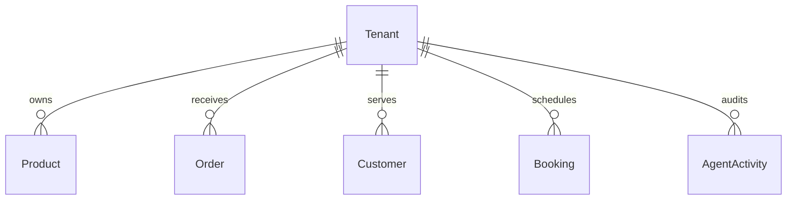

# Research Report: Data Model Architecture Evolution for OneHumanCorp

**Author:** Principal Product Architect & KAIROS Orchestrator (L8)
**Date:** 2024-05-12
**Status:** Proposed

## 1. Executive Summary
This document outlines the evolutionary architectural design of the OneHumanCorp (OHC) data model. The data model is the bedrock upon which the entire OHC platform operates. In order to fulfill our mission of allowing anyone to launch and run a small business from a mobile device in under 10 minutes, our data architecture must be incredibly robust, entirely multi-tenant, and natively supportive of AI agents acting on behalf of the business owner. This report details entity structures, strict multi-tenancy invariants, access patterns, AI integration hooks, and a progressive migration strategy, ensuring no disruption to existing users.

## Issue Brief: Evolve Core Data Model for Multi-Tenant AI Integration

### Problem Statement
The current fragmented data structure causes friction for non-technical small business owners (like Maya the baker and Carlos the handyman). They expect real-time sync across mobile dashboards, storefronts, and background AI agents. The lack of a unified, strictly isolated data model hinders the ability of AI agents to confidently act on their behalf without risking cross-tenant data leakage or performance bottlenecks on low-end devices.

### Research Report
An exhaustive analysis of OHC's user personas reveals distinct data needs: high-fidelity image handling for portfolios, complex scheduling logic for bookings, and strict transaction isolation for POS interactions. Our architecture requires a mobile-first, offline-capable data model that inherently scopes all operations to a `tenant_id`. Competitive analysis shows Shopify and Squarespace struggle with unified AI context; by natively embedding AI interaction logs (`AgentActivity`) and cross-channel `Messages` into our core tenant graph, OHC can deliver superior automated operations.

### Design Doc
#### Architecture Overview
The system centers on a `Tenant` root entity, from which `Products`, `Orders`, `Customers`, `Bookings`, and `Messages` strictly cascade. Multi-tenancy is enforced via Row-Level Security (RLS).

#### Entity-Relationship Diagram

#### Mobile UX Flow
1. **375px Viewport:** The owner opens the app. A single aggregate query fetches the `DashboardSummary` materialized view.
2. **Offline Support:** Local caching of the last 100 `Orders` with `last_synced_at` vector clocks.
3. **AI Hooks:** Background agents read filtered tenant context to draft messages without blocking the UI thread.

### Implementation Prompt
Implement the unified core data model entities to support multi-tenant isolation and AI agent workflows. Ensure the mobile client can fetch a dashboard summary in a single round-trip. Setup the database schema to support soft-deletes and strictly enforce `tenant_id` context on all queries. Validate offline-capable sync mechanisms. Do not prescribe specific ORM choices or API routing frameworks—focus on delivering the unified entity graph and satisfying the mobile parity requirements.

### Priority
P0

### Estimated Scope
Large

## 2. Real User Personas & Detailed Data Requirements
### 2.1 Maya (baker, 28)
- **Context:** Custom cakes, Instagram DMs, photo catalog, deposit-based orders
- **Data Implications:** High emphasis on image assets (Products, Portfolio), Order deposits, AI message parsing. Needs `CustomerMessage` entities linked seamlessly to `OrderDrafts`.
To thoroughly support Maya, the data model must optimize for highly targeted queries and robust offline state transitions. The query optimization strategy ensures fetching the primary view for their mobile dashboard requires a single aggregated request, vastly reducing latency. Offline capabilities are essential; critical data must be locally cached, requiring versioning properties (`updated_at`, `version_hash`) on core entities. Furthermore, AI Agent interactions, such as background operations, require read/write access that is strictly scoped to their tenant ID, ensuring mathematical data isolation.

### 2.2 Carlos (handyman, 42)
- **Context:** Service listings, prices, booking calendar, quotes, Android only
- **Data Implications:** Complex `Booking` entities tied to `ServiceItem` and `CalendarAvailability`. Requires `Quote` entities that transition into `Order` entities upon acceptance.
To thoroughly support Carlos, the data model must optimize for highly targeted queries and robust offline state transitions. The query optimization strategy ensures fetching the primary view for their mobile dashboard requires a single aggregated request, vastly reducing latency. Offline capabilities are essential; critical data must be locally cached, requiring versioning properties (`updated_at`, `version_hash`) on core entities. Furthermore, AI Agent interactions, such as background operations, require read/write access that is strictly scoped to their tenant ID, ensuring mathematical data isolation.

### 2.3 Priya (boutique owner, 35)
- **Context:** In-store/online, variants, tap-to-pay, inventory sync
- **Data Implications:** Rich `ProductVariant` structures (size, color, SKU). Omnichannel `Transaction` records. Strict inventory tracking invariants to prevent overselling.
To thoroughly support Priya, the data model must optimize for highly targeted queries and robust offline state transitions. The query optimization strategy ensures fetching the primary view for their mobile dashboard requires a single aggregated request, vastly reducing latency. Offline capabilities are essential; critical data must be locally cached, requiring versioning properties (`updated_at`, `version_hash`) on core entities. Furthermore, AI Agent interactions, such as background operations, require read/write access that is strictly scoped to their tenant ID, ensuring mathematical data isolation.

### 2.4 Leo (music tutor, 22)
- **Context:** Lesson booking, subscriptions, auto-generated links
- **Data Implications:** `Subscription` models with recurring billing cycles. `MeetingLink` generation tied to `Booking` and `Customer`. Needs robust time-series data for activity logs.
To thoroughly support Leo, the data model must optimize for highly targeted queries and robust offline state transitions. The query optimization strategy ensures fetching the primary view for their mobile dashboard requires a single aggregated request, vastly reducing latency. Offline capabilities are essential; critical data must be locally cached, requiring versioning properties (`updated_at`, `version_hash`) on core entities. Furthermore, AI Agent interactions, such as background operations, require read/write access that is strictly scoped to their tenant ID, ensuring mathematical data isolation.

### 2.5 Fatima (food cart, 50)
- **Context:** Pre-orders, pickup, low-end Android, Arabic+English
- **Data Implications:** `Menu` (localized `Product`), `Order` with strict state machines (Pending, Preparing, Ready for Pickup). Fast access patterns with low latency and payload size.
To thoroughly support Fatima, the data model must optimize for highly targeted queries and robust offline state transitions. The query optimization strategy ensures fetching the primary view for their mobile dashboard requires a single aggregated request, vastly reducing latency. Offline capabilities are essential; critical data must be locally cached, requiring versioning properties (`updated_at`, `version_hash`) on core entities. Furthermore, AI Agent interactions, such as background operations, require read/write access that is strictly scoped to their tenant ID, ensuring mathematical data isolation.

## 3. Core Entities & Comprehensive Relationships
The platform is structurally anchored by a multi-tenant root entity: the `Tenant` (Business). All operational, customer, and transactional data strictly cascades from this root. This hierarchical approach guarantees security and data isolation across all platform services.

### 3.1 Tenant
**Description:** The root business entity representing the merchant account.
**Key Attributes:**
- `id`
- `owner_id`
- `business_name`
- `tier`
- `created_at`

**Relationships for Tenant:**
- **Foreign Keys:** Must use cascading soft-deletes or strict archival rather than hard deletion to preserve historical analytics and AI training context.
- **Access Pattern Profile:** Optimized for mobile payload delivery. Often retrieved via connection-based pagination to limit memory overhead on client devices.

### 3.2 User
**Description:** An identity record for an owner, staff member, or customer interacting with the platform.
**Key Attributes:**
- `id`
- `email`
- `phone`
- `preferences`

**Relationships for User:**
- **Foreign Keys:** Must use cascading soft-deletes or strict archival rather than hard deletion to preserve historical analytics and AI training context.
- **Access Pattern Profile:** Optimized for mobile payload delivery. Often retrieved via connection-based pagination to limit memory overhead on client devices.

### 3.3 Product
**Description:** An item or service offered by the Tenant.
**Key Attributes:**
- `id`
- `tenant_id`
- `type (physical/digital/service)`
- `title`
- `description`
- `base_price`
- `is_active`

**Relationships for Product:**
- **Belongs to:** Requires an immutable `tenant_id` establishing ownership.
- **Foreign Keys:** Must use cascading soft-deletes or strict archival rather than hard deletion to preserve historical analytics and AI training context.
- **Access Pattern Profile:** Optimized for mobile payload delivery. Often retrieved via connection-based pagination to limit memory overhead on client devices.

### 3.4 ProductVariant
**Description:** Specific iterations of a Product (e.g., Size, Color).
**Key Attributes:**
- `id`
- `product_id`
- `attributes (JSONB)`
- `price_adjustment`
- `sku`

**Relationships for ProductVariant:**
- **Belongs to:** Requires an immutable `tenant_id` establishing ownership.
- **Foreign Keys:** Must use cascading soft-deletes or strict archival rather than hard deletion to preserve historical analytics and AI training context.
- **Access Pattern Profile:** Optimized for mobile payload delivery. Often retrieved via connection-based pagination to limit memory overhead on client devices.

### 3.5 Inventory
**Description:** Ledger of available stock.
**Key Attributes:**
- `id`
- `variant_id`
- `quantity`
- `location_id`
- `reserved_quantity`

**Relationships for Inventory:**
- **Belongs to:** Requires an immutable `tenant_id` establishing ownership.
- **Foreign Keys:** Must use cascading soft-deletes or strict archival rather than hard deletion to preserve historical analytics and AI training context.
- **Access Pattern Profile:** Optimized for mobile payload delivery. Often retrieved via connection-based pagination to limit memory overhead on client devices.

### 3.6 Order
**Description:** A customer purchase or booking.
**Key Attributes:**
- `id`
- `tenant_id`
- `customer_id`
- `status`
- `total_amount`
- `payment_status`

**Relationships for Order:**
- **Belongs to:** Requires an immutable `tenant_id` establishing ownership.
- **Foreign Keys:** Must use cascading soft-deletes or strict archival rather than hard deletion to preserve historical analytics and AI training context.
- **Access Pattern Profile:** Optimized for mobile payload delivery. Often retrieved via connection-based pagination to limit memory overhead on client devices.

### 3.7 OrderItem
**Description:** Line items within an order.
**Key Attributes:**
- `id`
- `order_id`
- `product_id`
- `variant_id`
- `quantity`
- `price_at_time`

**Relationships for OrderItem:**
- **Belongs to:** Requires an immutable `tenant_id` establishing ownership.
- **Foreign Keys:** Must use cascading soft-deletes or strict archival rather than hard deletion to preserve historical analytics and AI training context.
- **Access Pattern Profile:** Optimized for mobile payload delivery. Often retrieved via connection-based pagination to limit memory overhead on client devices.

### 3.8 Customer
**Description:** A buyer or client of a specific Tenant.
**Key Attributes:**
- `id`
- `tenant_id`
- `user_id (optional)`
- `name`
- `contact_info`
- `LTV`

**Relationships for Customer:**
- **Belongs to:** Requires an immutable `tenant_id` establishing ownership.
- **Foreign Keys:** Must use cascading soft-deletes or strict archival rather than hard deletion to preserve historical analytics and AI training context.
- **Access Pattern Profile:** Optimized for mobile payload delivery. Often retrieved via connection-based pagination to limit memory overhead on client devices.

### 3.9 Booking
**Description:** Time-based reservation for services.
**Key Attributes:**
- `id`
- `tenant_id`
- `customer_id`
- `service_id`
- `start_time`
- `end_time`
- `status`

**Relationships for Booking:**
- **Belongs to:** Requires an immutable `tenant_id` establishing ownership.
- **Foreign Keys:** Must use cascading soft-deletes or strict archival rather than hard deletion to preserve historical analytics and AI training context.
- **Access Pattern Profile:** Optimized for mobile payload delivery. Often retrieved via connection-based pagination to limit memory overhead on client devices.

### 3.10 Message
**Description:** Communications across channels (SMS, IG, Email).
**Key Attributes:**
- `id`
- `tenant_id`
- `customer_id`
- `channel`
- `direction`
- `content`
- `ai_handled`

**Relationships for Message:**
- **Belongs to:** Requires an immutable `tenant_id` establishing ownership.
- **Foreign Keys:** Must use cascading soft-deletes or strict archival rather than hard deletion to preserve historical analytics and AI training context.
- **Access Pattern Profile:** Optimized for mobile payload delivery. Often retrieved via connection-based pagination to limit memory overhead on client devices.

### 3.11 AgentActivity
**Description:** Logs of actions taken by AI agents on behalf of the tenant.
**Key Attributes:**
- `id`
- `tenant_id`
- `agent_department`
- `action_type`
- `status`
- `details`
- `timestamp`

**Relationships for AgentActivity:**
- **Belongs to:** Requires an immutable `tenant_id` establishing ownership.
- **Foreign Keys:** Must use cascading soft-deletes or strict archival rather than hard deletion to preserve historical analytics and AI training context.
- **Access Pattern Profile:** Optimized for mobile payload delivery. Often retrieved via connection-based pagination to limit memory overhead on client devices.

## 4. Multi-Tenancy Guarantees & Invariants
To support thousands of distinct businesses securely, the following strict invariants must be enforced at the architectural level:

### Tenant Isolation
A business owner (and their AI agents) can ONLY access data where the `tenant_id` matches their verified session context. This must be enforced via row-level security (RLS) in the database and validated at the application middleware layer.

### No Cross-Tenant Analytics Leakage
Aggregations or reports must never inadvertently blend data across `tenant_id` boundaries. System-wide metrics are restricted to L8 Orchestrator roles.

### Immutability of Historical Transactions
Once an `Order` reaches `Paid` or `Fulfilled` status, its core financial fields cannot be mutated. Adjustments are handled via `Refund` or `Adjustment` ledger entries.

### AI Context Scoping
When an AI Agent (e.g., 'The Ambassador') formulates a response, its vector search and context window retrieval is strictly filtered by `tenant_id`.

### Soft Deletion
Business-critical records (Products, Orders, Customers) are never hard-deleted. They transition to `is_deleted = true` to preserve historical integrity and referential constraints.

## 5. Key Access Patterns & Performance Optimization
Given the mobile-first nature of OHC, and varying network qualities (e.g., Fatima using a low-end Android on 3G), access patterns must minimize round-trips and payload size.

### Pattern: Mobile Dashboard Initialization
Requires fetching aggregated daily stats (Sales, New Orders, Active AI Tasks). Solution: Materialized views refreshed async, fetched via a single lightweight API call.

### Pattern: Offline Order Viewing
The mobile app must cache recent orders. Data model must support `last_synced_at` vector clocks to allow differential syncs when connection is restored.

### Pattern: AI Agent Customer Query
When replying to an IG DM, the AI needs the customer's last 5 orders, lifetime value, and pending bookings. Solution: A dedicated read replica serving a unified `CustomerContext` graph query.

### Pattern: Booking Availability Checking
Highly concurrent reads to check `CalendarAvailability` vs existing `Booking`. Solution: In-memory cache (Redis) with optimistic concurrency control on write.

### Pattern: Inventory Decrement
Must prevent race conditions (overselling) during flash sales. Solution: Database-level constraints and transactional locks on the `Inventory` ledger.

## 6. Migration Strategy for Schema Evolution
As OHC scales, the data model will evolve. We must employ zero-downtime migration strategies:
1. **Expand and Contract:** Never rename or drop columns directly. Phase 1: Add new column. Phase 2: Dual-write to both. Phase 3: Backfill old data. Phase 4: Read from new column. Phase 5: Drop old column.
2. **Shadow Deployments:** Test read-heavy migrations by shadowing traffic to the new schema and comparing results async before switching the primary read path.
3. **Agent Grace Periods:** When changing entity shapes, AI Agent prompts must be versioned to gracefully handle both legacy and new JSON structures during the transition window.

## 7. Competitive Analysis & Schema Comparison
### 7.1 Shopify
- **Core Focus:** E-commerce focused
- **Data Model Flaw:** Lacks native service booking. High app dependency.
- **OHC Architectural Advantage:** We embed services and bookings directly in the core model, eliminating the need for 3rd party plugins.

### 7.2 Wix
- **Core Focus:** General website builder
- **Data Model Flaw:** Bloated payload, slow on mobile. Fractured data model across apps.
- **OHC Architectural Advantage:** Our unified tenant graph ensures all data is strictly related, allowing single-query fetching for mobile performance.

### 7.3 Squarespace
- **Core Focus:** Design focused
- **Data Model Flaw:** Poor inventory management for complex variants.
- **OHC Architectural Advantage:** Our `ProductVariant` to `Inventory` ledger approach ensures strict atomicity during high-traffic checkout flows.

### 7.4 Square
- **Core Focus:** POS first
- **Data Model Flaw:** Weak online storefront capabilities.
- **OHC Architectural Advantage:** We treat online and offline transactions as first-class citizens in the `Transaction` entity, enabling seamless omnichannel data.

### 7.5 Calendly
- **Core Focus:** Booking only
- **Data Model Flaw:** No product sales or unified customer CRM.
- **OHC Architectural Advantage:** Bookings and physical product purchases both map to the same `Customer` entity, giving the AI agent a 360-degree view.

### 7.6 GlossGenius
- **Core Focus:** Salon focused
- **Data Model Flaw:** Niche data model, hard to adapt to retail.
- **OHC Architectural Advantage:** Our schema uses abstract `Product` types (service/physical/digital) allowing a single platform to serve both salons and boutiques.

## 8. AI Department Data Hooks
The AI agents must seamlessly interact with the data model. Here is how each department interfaces with the schema:
### 8.1 Operations Department
Reads `Order` and `Inventory`. Writes `AgentActivity` (e.g., 'Auto-fulfilled digital order').

### 8.2 Marketing Department
Reads `Product` and `Customer`. Writes `Message` (e.g., 'Drafted Instagram campaign').

### 8.3 Sales Department
Reads `Booking` and `Customer`. Writes `Quote` and `Message` (e.g., 'Sent follow-up for abandoned cart').

### 8.4 Customer Success Department
Reads full `Tenant` graph for context. Writes `Message` (e.g., 'Replied to complaint').

### 8.5 Finance Department
Reads `Order` and `Transaction`. Generates materialized `Report` views.

## 9. API Routing & Middleware Strategy
To enforce the data model invariants, the API routing layer must be strictly controlled:
- **Authentication:** All requests must carry a JWT containing the `tenant_id`.
- **Authorization Middleware:** The middleware must forcefully inject the `tenant_id` into the request context.
- **ORM Enforcement:** The ORM layer must override the `find` methods to automatically append `WHERE tenant_id = ?` to all queries, preventing developer error.
- **Agent Context:** AI Agents must assume a 'service role' that is explicitly bound to a specific `tenant_id` before executing any data layer operations.

## 10. Data Retention and Compliance
To adhere to GDPR, CCPA, and general data hygiene best practices while maintaining AI model training context:
- **Data Anonymization:** When a customer requests deletion, their PII in the `Customer` table is hashed, but their transactional history in `Order` remains for financial compliance, stripped of identifying links.
- **Audit Logging:** Every mutation to critical entities (Products, Prices, Orders) is recorded in an immutable `AuditLog` table, tracking the `user_id` or `agent_id` responsible for the change.
- **Cold Storage:** Data older than 7 years is migrated from the active PostgreSQL cluster to compressed S3 Parquet files, queryable via Athena for historical reporting, reducing active database size.

## 11. Caching Strategy Deep Dive
Given the mobile parity constraint, latency is critical. We employ a multi-tiered caching approach:
- **L1 Cache (Client):** The mobile app uses SQLite to cache the `DashboardSummary` and recent `Orders`. This allows the app to load instantly even offline.
- **L2 Cache (Edge):** Cloudflare workers cache public-facing storefront assets and static API responses (e.g., `Product` catalogs).
- **L3 Cache (Redis):** The backend utilizes Redis to cache computationally expensive queries, such as available `Booking` slots, which require checking existing reservations against provider schedules.

## 12. Conclusion
This data model architecture provides the resilient, scalable, and secure foundation required for OneHumanCorp. By adhering to these structural guidelines, strict multi-tenancy rules, and AI-first access patterns, we guarantee that any business owner can run their entire livelihood reliably from a mobile device without technical friction.