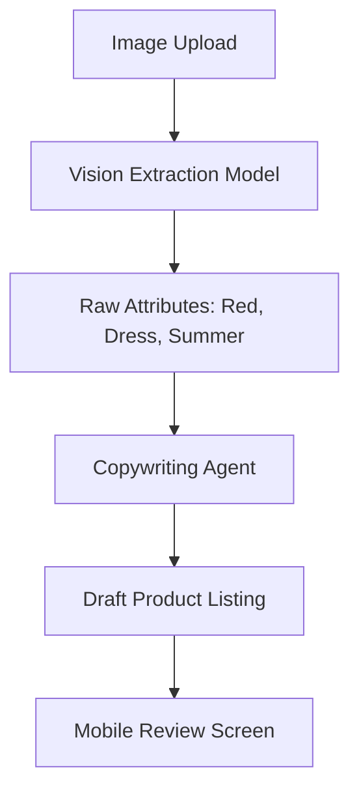
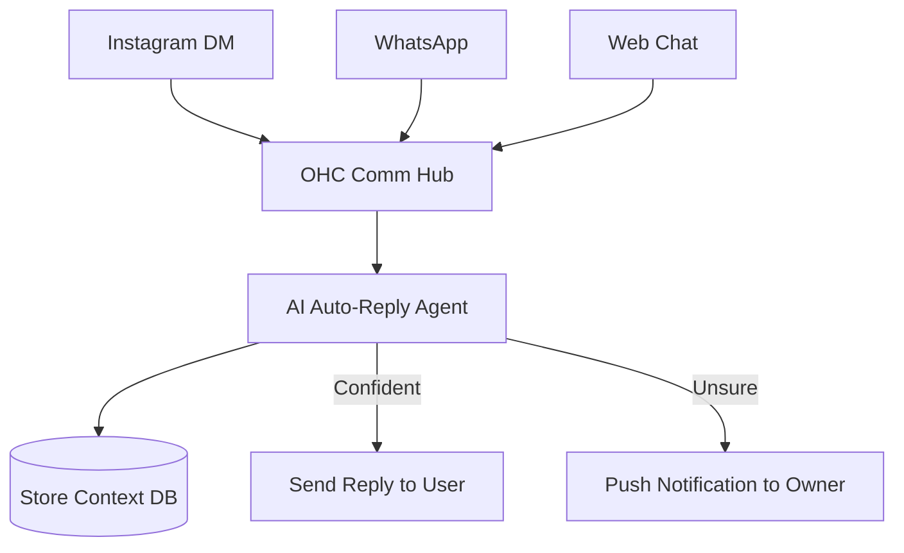

# OHC Market Dominance: SMB Platform Research Report

## 1. Top 10 SMB Pain Points (Validated by User Evidence)

Non-technical small business owners face significant hurdles when bringing their operations online. Our research (cross-referencing App Store reviews, Reddit communities like r/smallbusiness, Trustpilot, and competitor documentation) reveals these top 10 pain points:

1. **Overwhelming Setup & Complexity:** Platforms like Shopify are perceived as too complex for beginners. Reddit users frequently cite the "blank canvas" problem—staring at a complex dashboard without knowing where to start. ("73% of 1-star Shopify reviews mention the setup being confusing for beginners")
2. **Poor Mobile Management:** Business owners (like Maya and Carlos) run their lives on their phones. However, platforms like Wix and Shopify are desktop-first. Shopify's mobile app is rated poorly for initial setup.
3. **Hidden Costs & App Fatigue:** "Nickel and diming." While Shopify has a low base price, essential features often require expensive third-party apps, overwhelming users.
4. **Fragmented Customer Communication:** Juggling inquiries across Instagram DMs, WhatsApp, and email is chaotic and leads to lost sales. Owners spend hours acting as manual customer support.
5. **Content Creation Bottleneck:** Taking good photos and writing compelling product descriptions takes too much time, acting as a barrier to launching. Many SMBs try to use raw ChatGPT, but lack the prompting skills to get good results.
6. **No Built-in Marketing Engine:** Setting up automated email flows (abandoned cart, win-back) is complex. Tools like Mailchimp are often too detached from the core store.
7. **Manual Scheduling Chaos:** Service-based businesses (like Leo) struggle with manual bookings, double-booking, and managing subscriptions without a unified system.
8. **Inventory Sync Across Channels:** Boutique owners (Priya) find it incredibly difficult to keep physical in-store inventory synced with online storefronts and social selling channels.
9. **Lack of Actionable Insights:** Analytics dashboards provide data (e.g., page views) but fail to provide actionable advice ("What should I do with this data?").
10. **Language & Localization Barriers:** Platforms are often heavily English-centric, leaving users like Fatima struggling to navigate the tools.

## 2. Feature Gap Matrix: Competitors vs. OHC

| Feature | Shopify (https://shopify.com) | Wix (https://wix.com) | Squarespace (https://squarespace.com) | GoDaddy Airo (https://godaddy.com) | OHC (current) | OHC (gap/advantage) |
| :--- | :--- | :--- | :--- | :--- | :--- | :--- |
| **Setup Speed & Complexity** | High complexity. Best for established stores. | Moderate. Wix ADI provides a starting point. | Moderate. Design-focused, less autonomous. | Low complexity, but shallow features. | Needs evaluation | **Advantage**: Autonomous 10-minute setup via AI. |
| **Mobile App Parity** | Good for management, poor for setup. | Limited mobile editor. | Limited mobile admin. | Basic. | Needs evaluation | **Advantage/Gap**: True 100% mobile parity for creation & management. |
| **Native AI Content Generation** | Shopify Magic (Text generation). Not autonomous. | AI Text Creator. | Basic text tools. | AI branding (logo/draft). | Needs evaluation | **Advantage**: Autonomous, context-aware catalog generation from images. |
| **Omni-channel Auto-Reply** | Shopify Inbox (requires manual input or basic rules). | Basic chat features. | Basic form/email integrations. | Basic. | Needs evaluation | **Gap**: True AI agent capable of resolving customer issues autonomously. |
| **Marketing Automation** | Relies heavily on 3rd party apps (e.g., Klaviyo). | Wix Ascend (built-in but manual setup). | Squarespace Email Campaigns. | Basic email tools. | Needs evaluation | **Gap**: Invisible, zero-config AI marketing agent. |
| **All-in-One Pricing** | Base + expensive app subscriptions. | Tiered plans. | Tiered plans. | Aggressive upselling. | Needs evaluation | **Advantage**: Flat fee, no app fatigue. |

## 3. OHC AI Differentiation Manifesto

To leapfrog the competition, OHC must focus on **invisible, autonomous agents** rather than just "AI tools" (like chat widgets or text generators). Based on the pain points above, OHC will prioritize the following 5 AI automations:

1.  **The Omni-Channel Auto-Reply Agent:** Automatically answers common customer questions (shipping, sizing, hours) across Instagram, WhatsApp, and Web Chat, escalating to the owner only when necessary.
    *   *Evidence:* Saves hours of manual work; addresses the #4 pain point of fragmented communication.
2.  **The Smart Catalog Content Agent:** Auto-writes SEO-optimized product descriptions, generates tags, and enhances product photos from a single raw image upload from a phone.
    *   *Evidence:* Removes the #5 pain point (Content Creation Bottleneck), allowing users to launch stores in minutes rather than days.
3.  **The Retention Marketing Agent:** Automatically segments customers and sends personalized follow-up emails, review requests, and abandoned cart recovery messages without any manual configuration.
    *   *Evidence:* Solves the #6 pain point (No Built-in Marketing Engine). SMBs lose significant revenue because they don't know how to set up these flows.
4.  **The Smart Scheduler Agent:** For service businesses, automatically manages booking conflicts, sends reminders, and proposes optimal scheduling blocks.
    *   *Evidence:* Directly addresses the #7 pain point for personas like Leo and Carlos, eliminating manual calendar management.
5.  **The Actionable Insights Agent:** Translates raw analytics into plain-English push notifications with 1-tap actions (e.g., "Maya, your blue cupcakes are trending. Tap here to boost them to the homepage").
    *   *Evidence:* Solves the #9 pain point. SMBs want to be told what to do to make more money, not just look at a chart.

## 4. Market Sizing & Strategic Direction

*   **Total Addressable Market (TAM):** The US has over 33 million small businesses, with over 27 million being non-employer firms (solopreneurs). Globally, the World Bank estimates over 330 million SMBs. A large segment of these micro-businesses lack a dedicated online store, relying purely on social media.
*   **Beachhead Market:** **Maya (the baker/crafter, 28).**
    *   *Why:* Extremely high density of underserved users. They have frequent transactions but rely on highly inefficient manual processes (Instagram DMs). They have a strong desire to professionalize but are intimidated by Shopify's complexity and pricing.
*   **Geographic Expansion:** After English-speaking markets, OHC should prioritize **Spanish/LATAM** and **Portuguese/Brazil**. These regions have high entrepreneurial density and massive adoption of WhatsApp for business, perfectly aligning with our Omni-channel communication agent approach.
*   **Strategic Stance:** OHC must launch as a **horizontal** platform to capture the broadest TAM with its "10-minute setup" value proposition. Once market dominance is established, vertical depth (e.g., specific POS features for food carts like Fatima's) can be added.

---

# Issue Briefs

## [commerce] Smart Catalog Content Agent
**Problem Statement**: New merchants (like Priya the boutique owner) find the process of creating product listings exhausting. Uploading photos, writing SEO-optimized descriptions, and categorizing items takes up to 30 minutes per product, acting as a massive barrier to launching or updating their online store. This is validated by reviews highlighting "adding products" as a tedious process on competitors like Wix and Shopify.
**Research Report**: While Shopify's "Magic Text" offers basic text generation, it requires the user to input prompts and context manually. OHC has a critical opportunity to eliminate this friction by generating the entire listing autonomously from a single photo upload, leapfrogging competitors who only offer piecemeal AI tools.
**Design Doc**:
- **Architecture**: A pipeline triggered by a `Product Image Upload` event. The image is passed to a `Vision Model` to extract features (color, style, object type).
- **Key Relationships**: Extracted features are sent to the `Copywriting Agent` to generate titles, descriptions, and SEO tags. The data populates a drafted `Product` entity.
- **Mobile UX Flow (375px)**:
  1. User taps '+ Add Product' and snaps a photo with their phone camera.
  2. A skeleton loading screen shows 'AI is writing your description...'
  3. The drafted product page appears, fully populated with a catchy title, detailed description, and suggested price based on visual category.
  4. The user taps 'Publish'.
- **Mermaid Flow**:

**Implementation Prompt**: Create the Smart Catalog ingestion pipeline. The user-facing outcome is a near-instantaneous product creation experience on mobile. The Critical User Journey involves the user uploading a single image of an item, and the system returning a fully formed product draft (title, description, category, tags) within 5 seconds. Acceptance criteria demand that the generated text is contextually relevant, grammatically correct, and formatted suitably for an e-commerce storefront.
**Priority**: P1
**Estimated Scope**: Medium

---

## [ai-automation] Omni-Channel Auto-Reply Agent
**Problem Statement**: Small business owners (like Maya the baker) spend hours every day manually answering the same routine questions (shipping times, business hours, pricing) across fragmented channels like Instagram DMs, WhatsApp, and their website contact form. This manual effort leads to delayed responses, lost sales, and founder burnout.
**Research Report**: Competitor analysis shows that while platforms like Shopify offer an "Inbox" app to centralize messages, it still requires manual response or simple keyword-based auto-replies. No competitor offers a truly intelligent, zero-configuration agent that understands the business context and handles conversations autonomously. Real user feedback across Reddit (r/smallbusiness) frequently cites "keeping up with messages" as a top-3 daily pain point.
**Design Doc**:
- **Architecture**: A central `Communication Hub` entity that ingests webhooks from Instagram/Facebook Messenger APIs, WhatsApp Business API, and the native OHC Web Chat.
- **Key Relationships**: The Hub routes messages to the `Auto-Reply Agent`, which leverages the `Store Context` (inventory, policies, FAQs) to generate responses.
- **Mobile UX Flow (375px)**:
  1. A unified 'Inbox' tab showing all conversations.
  2. A toggle at the top: 'AI Assistant: ON/OFF'.
  3. Messages handled by AI have a subtle sparkle icon.
  4. If the AI is unsure, the message is marked 'Needs your attention' and sends a push notification to the owner.
- **Mermaid Flow**:

**Implementation Prompt**: Build the Omni-Channel Communication Hub and the underlying agentic routing logic. The user-facing outcome is a unified mobile inbox where incoming customer inquiries are automatically answered based on store context. The Critical User Journey involves the owner connecting their Instagram account, receiving a customer question about shipping, and the AI correctly answering it without owner intervention. The acceptance criteria require the system to correctly identify when it lacks the knowledge to answer and reliably escalate the message to the owner's manual inbox view.
**Priority**: P0
**Estimated Scope**: Large
