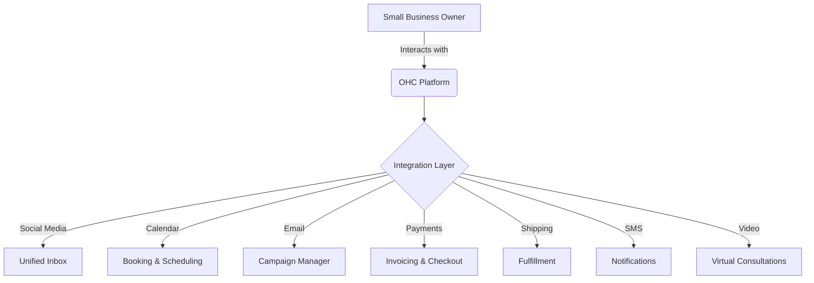

# OHC Integrations Research Report

## Executive Summary
This report evaluates third-party tool integrations to expand OneHumanCorp's (OHC) capabilities for small business owners across 7 key categories. The goal is to provide a comprehensive, unified experience in both Cloud and Standalone environments, ensuring ease of use without technical overhead.

## Comparative Analysis

| Category | Recommended Tool | Pricing Estimate | Cloud / Standalone Support | Key Advantage |
|----------|------------------|------------------|----------------------------|---------------|
| Social Media | Meta Graph API | Pay-as-you-go | Cloud & Standalone | Native access to FB/IG/WhatsApp |
| Calendar | Cal.com | $12/user/mo | Cloud & Standalone | Open-source, self-hostable |
| Email Marketing | Listmonk | Free (OSS) | Standalone (best) / Cloud | High scale, zero vendor lock-in |
| Payment Processing | Mercado Pago | % per transaction | Cloud & Standalone | Dominant in LATAM, high approval |
| Shipping & Logistics | Shippo | Pay-as-you-go | Cloud & Standalone | Huge carrier network, easy API |
| SMS & Notifications | Twilio | Pay-as-you-go | Cloud & Standalone | Global reach, high deliverability |
| Video Conferencing | Jitsi | Free (OSS) | Standalone / Cloud | No login required, highly embeddable |

## Architecture Overview

## Detailed Category Breakdown

### 1. Social Media Integration
- **Problem**: Business owners struggle to manage messages across Facebook, Instagram, WhatsApp, and TikTok.
- **Evaluation**: Meta Graph API provides direct access to the Meta ecosystem, allowing a unified inbox.
- **Risk**: API rate limits and strict approval processes.

### 2. Calendar & Scheduling
- **Problem**: Back-and-forth emails to schedule meetings are time-consuming.
- **Evaluation**: Cal.com is open-source, integrates with Google/Outlook, and can run completely standalone.
- **Risk**: Complex calendar state synchronization.

### 3. Email Marketing
- **Problem**: Disconnected customer lists and campaign tools.
- **Evaluation**: Listmonk is a self-hosted alternative that fits perfectly into the Standalone deployment model while scaling in the Cloud.
- **Risk**: Email deliverability depends on the SMTP provider configured.

### 4. Payment Processing
- **Problem**: Stripe is not available or preferred everywhere (e.g., LATAM).
- **Evaluation**: Mercado Pago serves LATAM specifically, providing local payment methods.
- **Risk**: Regional lock-in and varying API documentation quality.

### 5. Shipping & Logistics
- **Problem**: Calculating accurate rates and generating labels manually.
- **Evaluation**: Shippo aggregates carriers, making it easy to generate labels globally.
- **Risk**: Carrier API downtimes affecting label generation.

### 6. SMS & Notifications
- **Problem**: Reaching customers without smartphones or internet access.
- **Evaluation**: Twilio provides unparalleled global reach for SMS.
- **Risk**: Carrier filtering and compliance (e.g., A2P 10DLC).

### 7. Video Conferencing
- **Problem**: Friction in generating and joining video calls.
- **Evaluation**: Jitsi allows embedded, frictionless video calls without accounts.
- **Risk**: Video quality scaling in pure Standalone mode depending on server bandwidth.

## Conclusion
The proposed integrations balance the needs of Cloud scalability and Standalone sovereignty, providing non-technical small business owners with powerful enterprise-grade tools in a simple UI.
