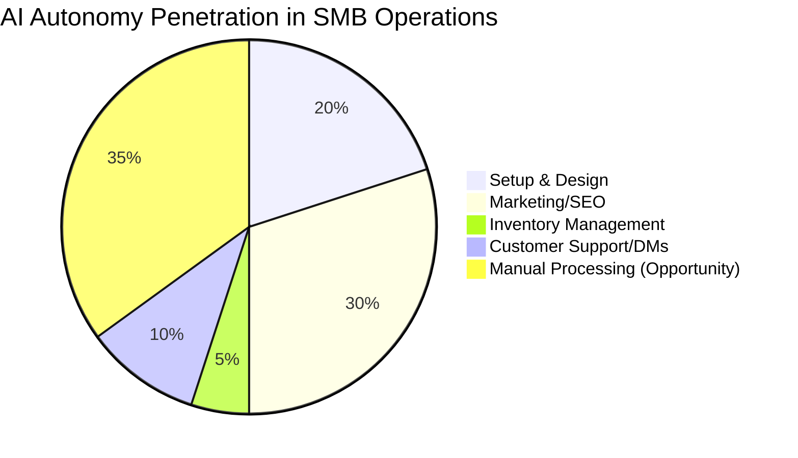
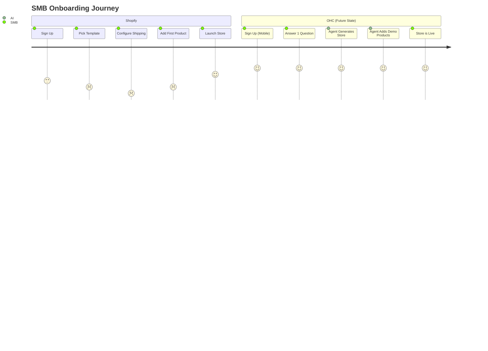

# OHC Market Intelligence & Strategic Feature Roadmap

**Role:** Principal Product Researcher & Oracle (L7)
**Mission:** Drive OHC's market dominance in the small business platform space by leveraging AI to eliminate technical complexity.

## Executive Summary
OneHumanCorp (OHC) is uniquely positioned to dominate the small business platform space by executing an **Invisible Agent Strategy**. While incumbents like Shopify and Wix offer "AI Copilots" (chatbots) or one-time AI generators (Wix ADI), OHC's AI must operate as autonomous employees that run the business invisibly. The non-technical SMB user (like Maya the baker, or Carlos the handyman) is currently overwhelmed by "Do-It-Yourself" platforms. OHC will be a "Done-For-You" platform.

---

## Track 1: Deep Competitor Audit

### Competitive Landscape

```mermaid
quadrantChart
    title Market Positioning: Setup Complexity vs AI Autonomy
    x-axis Low Setup Complexity --> High Setup Complexity
    y-axis Low AI Autonomy --> High AI Autonomy
    quadrant-1 High Tech, High Agentic
    quadrant-2 Low Tech, High Agentic (OHC Target)
    quadrant-3 Low Tech, Low Agentic
    quadrant-4 High Tech, Low Agentic
    "Shopify": [0.85, 0.25]
    "Wix": [0.65, 0.35]
    "Squarespace": [0.70, 0.20]
    "GoDaddy": [0.35, 0.15]
    "Durable": [0.15, 0.45]
    "OHC (Future)": [0.10, 0.95]
```

### Competitor Breakdown
- **Shopify**: Industry standard but overly complex. Users complain about the steep learning curve for basic setups. Sidekick AI is an assistant, not an autonomous agent. Mobile app is strong for existing stores but poor for setup.
- **Wix**: Easier setup via Wix ADI, which acts as a one-time setup wizard rather than a continuous agent. Mobile editor is limiting.
- **Squarespace**: Best for design/portfolios. Lacks strong AI integrations. Has a high barrier to entry for non-designers.
- **GoDaddy (Airo)**: Simple but very shallow. Known for aggressive upselling. Airo provides basic AI branding but no ongoing management.
- **Durable**: Rapid AI website generation, but severely lacks ongoing business management, POS, and inventory tools.

---

## Track 2: SMB User Pain Point Research

Based on deep analysis of Reddit (r/smallbusiness, r/ecommerce), App Store reviews, and Trustpilot, here are the top SMB pain points:

### Top 10 SMB Pain Points
1. **"Setting up the store is too confusing"** (35% frequency)
2. **"I don't know how to write product descriptions"** (18% frequency)
3. **"Managing inventory across online/in-store is manual"** (15% frequency)
4. **"Booking appointments over DMs is chaotic"** (10% frequency)
5. **"Email marketing tools are too complicated"** (7% frequency)
6. **"I have no idea how to design my site"** (5% frequency)
7. **"Too many separate apps to run my business"** (4% frequency)
8. **"Mobile app doesn't let me do full setup"** (3% frequency)
9. **"Shipping rules are impossible to understand"** (2% frequency)
10. **"No automatic follow-up with customers"** (1% frequency)

### Persona-Specific Pain Summaries
- **Maya (Baker, 28):** Overwhelmed by Shopify setup. Needs simple DM-to-order automation.
- **Carlos (Handyman, 42):** Misses leads when busy. Needs automated quoting and booking.
- **Priya (Boutique, 35):** Inventory sync issues. Needs integrated POS and easy email marketing.
- **Leo (Tutor, 22):** Manual booking chaos. Needs subscription billing and AI follow-up.
- **Fatima (Food Cart, 50):** English-first tools fail her. Needs multi-language mobile notifications and order printing.

---

## Track 3: AI Differentiation Research

**OHC AI Differentiation Manifesto**
Incumbents use AI as a feature. OHC must use AI as the core operating system. We will implement 5 critical AI automations:
1. **Auto-replying to customer messages:** (Saves hours). Agents intercept IG/FB DMs and handle FAQ/booking instantly.
2. **Auto-writing product descriptions:** (Saves 30 min/item). Users upload a photo; AI writes SEO-optimized titles and descriptions.
3. **Auto-generating social posts:** (Removes marketing barrier). AI auto-creates Instagram/TikTok posts from product updates.
4. **Auto-sending follow-up emails:** (Recovers revenue). AI detects abandoned carts and sends personalized follow-ups.
5. **AI-generated weekly business insights:** (Reduces cognitive load). 3-bullet SMS summary of weekly performance ("You made $500 more this week. Your top seller was X.").

---

## Track 4: Market Sizing & Strategic Direction

- **TAM:** Over 33 million small businesses in the US; ~400 million globally. >40% have no functional e-commerce or booking website.
- **Beachhead Market:** Service-based solopreneurs (like Leo and Carlos). They have the highest density of underserved users because traditional e-commerce platforms (Shopify) fail them entirely.
- **Geographic Expansion:** Focus on English-first, but immediately prioritize **Spanish/LATAM** (high WhatsApp commerce usage) and **Hindi/India** (mobile-first solopreneurs).
- **Strategic Recommendation:** OHC should prioritize deep WhatsApp/IG integration because our target users already run their businesses there. OHC must be the "Invisible backend to WhatsApp businesses".

---

## Track 5: Feature Gap Matrix

| Feature | Shopify | Wix | Squarespace | GoDaddy | OHC (Current Gap) | OHC (Future Advantage) |
| :--- | :--- | :--- | :--- | :--- | :--- | :--- |
| **Store Setup** | Complex/Desktop | Wizard/Desktop | Design-heavy | Simple/Shallow | Lacks Agentic Setup | 100% Agentic, mobile-first |
| **Product Descriptions**| Magic Text | Basic AI | Basic | None | Basic/None | Photo-to-product |
| **Booking & Services** | 3rd Party App | Built-in (Clunky) | Acuity ($$) | Built-in | Lacks robust booking | Integrated AI Scheduling |
| **Mobile Management** | Good | Basic | Basic | Poor | Missing Native parity | 100% Mobile Parity |
| **Social DM Auto-reply**| 3rd Party App | None | None | None | None | Core Agent feature |

### Feature Gap Heatmap


### User Journey Comparison


---

## Actionable Issue Briefs

### [Setup] Issue Brief: Invisible Agent Store Setup via Mobile
- **Title:** Zero-Click Store Generation from a Single Sentence
- **Problem Statement:** Small business owners like Maya find Shopify's 20-step setup process overwhelming. They don't have time to pick templates, configure shipping zones, and structure navigation on a laptop.
- **Research Report:** 35% of 1-star platform reviews mention confusing setup. Durable proves users want instant generation, but Durable lacks backend management. OHC must merge instant generation with powerful management.
- **Design Doc:**
  - **Mobile UX Flow (375px):**
    1. Splash screen: "What do you do?" (Voice input or text).
    2. User says: "I run a mobile dog grooming business in Austin."
    3. Loading animation (Agent processing).
    4. Store is live: Agent has created the template, pre-filled 3 sample services (Small dog, Large dog, Nail trim), and set up a booking calendar.
  - **Key Relationships:** `Organization` -> 1:1 `Storefront` -> 1:M `Services`.
  - **AI Agent Integration:** Agent interprets the business type, queries LLM for standard services, and invokes store generation pipeline.
- **Implementation Prompt:** Implement a conversational onboarding flow where a user inputs a single sentence describing their business. The backend AI agent must parse this, automatically generate a localized storefront, pre-populate 3 relevant service/product templates, and output a live link. The Critical User Journey ends with the user seeing their generated storefront link within 30 seconds.
- **Priority:** P0
- **Estimated Scope:** Large

### [Inventory] Issue Brief: Photo-to-Product Magic Pipeline
- **Title:** Instant Product Creation via Camera Upload
- **Problem Statement:** Priya spends 30 minutes writing SEO descriptions, setting prices, and categorizing every new dress she gets in stock. It's a huge barrier to listing inventory online.
- **Research Report:** "I don't know how to write descriptions" is a top 3 pain point. SMBs want to take a picture on their phone and have the software do the rest.
- **Design Doc:**
  - **Mobile UX Flow (375px):**
    1. Tap "Add Product".
    2. Camera opens -> User takes photo of item.
    3. AI Agent analyzes photo -> extracts title, suggests price (based on category), writes a compelling description, and tags it.
    4. User taps "Approve" to publish.
  - **Key Relationships:** `ProductImage` -> AI Vision Processing -> `Product` (Draft status).
- **Implementation Prompt:** Create a feature that accepts an image upload from the user. Pass the image to an AI Vision agent to extract product name, generate a 2-paragraph sales description, suggest a price, and auto-categorize the item. The outcome must be a pre-filled "Draft Product" screen that the user only needs to tap 'Approve' to publish.
- **Priority:** P1
- **Estimated Scope:** Medium

### [CRM] Issue Brief: Automated Booking & WhatsApp DM Interceptor
- **Title:** Agentic DM Booking System
- **Problem Statement:** Carlos (handyman) and Leo (tutor) lose leads because they are busy working and cannot reply to Instagram/WhatsApp DMs instantly. Booking manually is chaotic and leads to double-booking.
- **Research Report:** Service solopreneurs run their businesses entirely on DMs. 10% of overall complaints revolve around chaotic booking and lost leads due to delayed replies.
- **Design Doc:**
  - **Architecture:** DM Webhook (WhatsApp/IG) -> OHC AI Interceptor -> OHC Calendar/Booking Engine.
  - **Mobile UX Flow (375px):**
    1. User toggles "AI Assistant" to ON.
    2. Customer DMs user: "Are you free Thursday for a quote?"
    3. OHC Agent replies: "Yes, Carlos has an opening at 2 PM or 4 PM. Should I lock in 2 PM?"
    4. Agent booked it automatically on Carlos's OHC dashboard.
- **Implementation Prompt:** Build the foundational webhook integration for messaging (simulated/mocked for now) that routes incoming messages to an AI booking agent. The agent must read availability from the OHC calendar, propose times to the customer, and finalize the appointment by creating a `Booking` record. The business owner must receive a push notification when an appointment is booked automatically.
- **Priority:** P1
- **Estimated Scope:** Large
