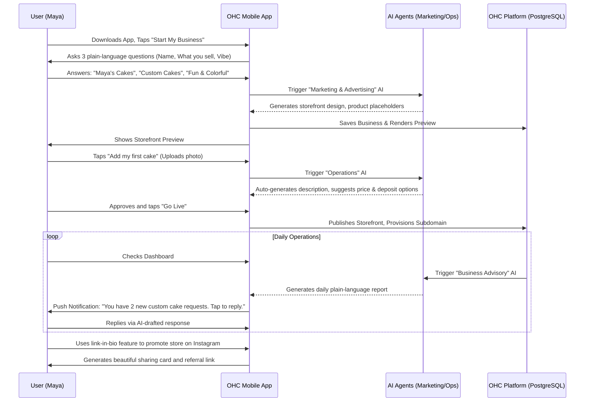
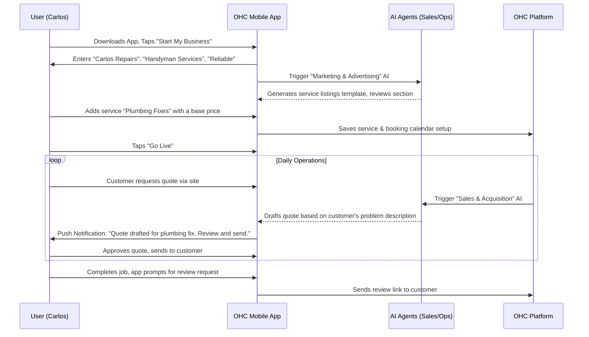
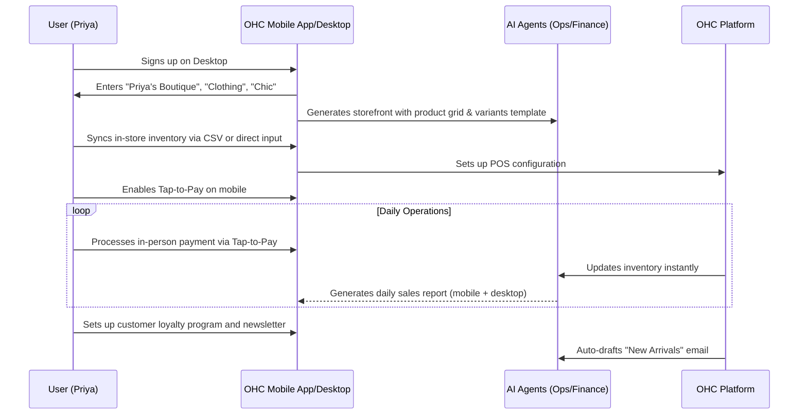
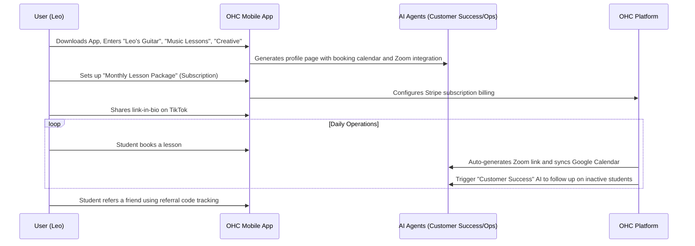
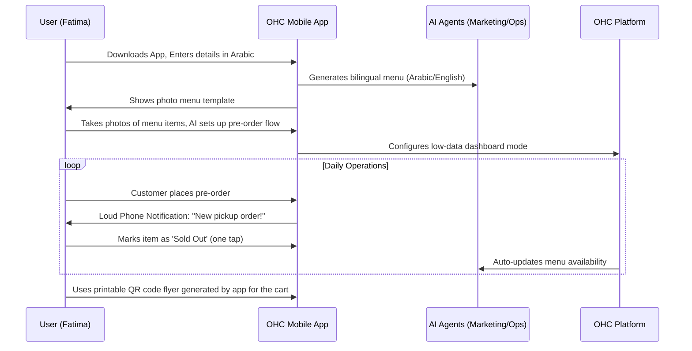

# [business] End-to-End Business Journey Architecture

## Title
Design the Complete End-to-End User Journey for Real Small Business Owners

## Problem Statement
Small business owners, especially those who are non-technical (e.g., Maya the Baker, Carlos the Handyman), experience significant friction when onboarding to existing platforms like Shopify, Wix, or Squarespace. These platforms often require hours of setup, technical configuration, and manual data entry. Our users need a platform where they can go from "zero" to a "live business" in under 10 minutes, entirely from a mobile phone, with AI agents invisibly handling the complexity. The current flow lacks a seamless, mobile-first, zero-jargon journey that natively integrates AI from the moment of onboarding through continuous business growth.

## Research Report
### Competitive Analysis
- **Shopify:** Powerful but overwhelming for non-technical users. Setup takes 30-60 minutes minimum. Requires understanding of "Themes," "Liquid," and various plugin integrations. Mobile app is functional for management, but onboarding is heavily desktop-oriented.
- **Wix:** Easier drag-and-drop, but still requires 20-40 minutes and design sensibility. The AI features (Wix ADI) often feel like a starting point that still needs manual tweaking rather than an invisible, autonomous agent.
- **Squarespace:** Beautiful templates, but geared towards creative professionals. Lacks specialized tools for local services or simple food pre-orders out of the box.

### Pain Points for OHC Personas
- **Maya (Baker):** Overwhelmed by "inventory management" jargon. Needs simple deposit flows and Instagram DM automation.
- **Carlos (Handyman):** Has no website and uses an Android phone. Needs instant service listings, deposit booking, and quote generation without navigating complex dashboards.
- **Priya (Boutique):** Needs storefront and inventory sync. Also needs in-person tap-to-pay functionality to smoothly integrate physical and online spaces.
- **Leo (Music Tutor):** Needs seamless lesson booking synchronized with Google Calendar, Zoom link generation, and subscription models.
- **Fatima (Food Cart):** Needs a low-data, multi-lingual, extremely simplified pickup/pre-order flow.

### Key Opportunities
The primary opportunity is to shift the paradigm from a "Software Dashboard" to an "AI Business Partner." The journey must feel less like configuring a software tool and more like answering a few simple questions from a business consultant (the AI).

## Design Doc

### User Journey Sequence Diagrams (Mermaid.js)

#### 1. Maya (The Home Baker)

#### 2. Carlos (The Freelance Handyman)

#### 3. Priya (The Boutique Owner)

#### 4. Leo (The Music Tutor)

#### 5. Fatima (The Food Cart Operator)

### UI Wireframes & Screen Flow (375px Mobile-First)

#### Screen 1: Welcome & Onboarding
- **Header:** "Welcome to OneHumanCorp."
- **Content:** Three large, tap-friendly input fields.
    1. "What is the name of your business?"
    2. "What do you sell or do?" (Dropdown/Free-text: Baked Goods, Handyman, etc.)
    3. "Describe your style in one word." (Visual chips: Elegant, Playful, Professional)
- **Action:** A prominent "Create My Business" button spanning the width (minus padding), ensuring touch target >= 44x44px.

#### Screen 2: The "Magic" Loading Screen
- **Content:** Delightful micro-animations showing AI agents "building" the store. "The Promoter is designing your site...", "The Accountant is setting up payments...".
- **Design:** Glassmorphism overlay (backdrop-filter: blur(20px)).

#### Screen 3: First Product & Activation
- **Header:** "Let's add your first item."
- **Content:** Native camera integration. User takes a photo. The screen displays the photo with an AI-generated title and price suggestion.
- **Action:** "Looks Good! Go Live."

### Mobile UX Flow
- **Input Strategy:** Rely on native mobile keyboards exclusively (e.g., numeric keypad for price).
- **Navigation:** Bottom navigation bar for core areas: Home (Dashboard), Inbox (Customer Success), Store (Products/Services), AI Advisor.
- **Feedback:** Optimistic UI updates. When Maya taps "Save Cake," it instantly appears saved, while network requests process in the background. If a network failure occurs, a subtle toast notifies the user to retry.

### AI Agent Integration Points
- **Onboarding:** "Marketing & Advertising" AI builds the initial site draft from 3 inputs.
- **Product Creation:** "Operations" AI suggests pricing, descriptions, and categories based on a single image upload.
- **Ongoing Engagement:** "Customer Success" AI drafts replies to customer inquiries; "Business Advisory" AI pushes plain-language weekly health reports.

### Key Design Decisions
1. **Zero-Jargon Promise:** Terms like "SKU", "SEO", or "Webhook" are completely hidden. Instead, we use "Product Code", "Getting Found on Google", and "Automatic Updates".
2. **AI as Default:** The user never "writes" a full product description from scratch unless they want to. The AI drafts it first.
3. **Optimistic Rendering:** To ensure a snappy feel on mobile, all UI actions assume success while the backend queues the job.
4. **Agent Departments:** Features are conceptually grouped into friendly departments ("The Promoter", "The Accountant") rather than technical modules, aligning with how small business owners think.

## Implementation Prompt
**Context:** We need to implement the onboarding and activation flow for a non-technical small business owner. The goal is to collect minimal initial data and use AI to generate the rest of the storefront and settings.

**User Journey (CUJ):**
1. User opens the app on a mobile device (375px width).
2. User enters their business name, type, and aesthetic preference.
3. The app displays a loading screen while AI agents generate the initial storefront and business settings.
4. User uploads one photo to create their first product/service.
5. AI generates the product description and suggests a price.
6. User confirms, and the business goes "Live."

**Acceptance Criteria:**
- The flow must be entirely mobile-responsive (tested at 375px width).
- Touch targets for all buttons and inputs must be at least 44x44px.
- The UI must use native mobile keyboards appropriately.
- The UI must replace all technical jargon with plain language (e.g., "Publish Store" -> "Go Live").
- Provide 100% E2E test coverage using Playwright starting from login, navigating the entire flow, and asserting the storefront is created with the AI-generated content. Mock the AI model responses during testing.

## Priority
P0

## Estimated Scope
Large
