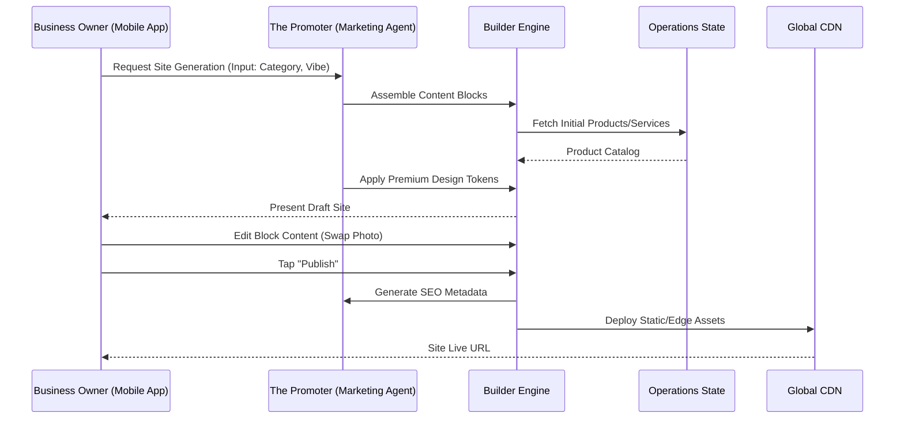

# Website & Storefront Builder Architecture

## Problem Statement
Small business owners, such as bakers, handymen, and boutique owners, often find existing website builders (like Shopify, Wix, or Squarespace) overwhelming. They require a significant time investment, technical jargon comprehension, and design sensibility that many non-technical users lack. Our users need a platform where they can launch a premium, fully functional, mobile-first storefront in under 10 minutes from their phone, with the AI handling the heavy lifting of design, layout, and SEO automatically.

## Research Report
Based on user personas and competitive analysis:
- **Competitors (Shopify, Wix, Squarespace)**: Offer highly customizable but complex builders. They assume a desktop-first approach to building and often require an understanding of padding, margins, and grid systems.
- **OHC's Differentiation**: A truly mobile-first creation experience (375px baseline) where the user focuses on *content* (photos, prices, descriptions) while the AI handles the *presentation*. The builder relies on semantic "Content Blocks" rather than absolute positioning, and defaults to the Premium Token library (Glassmorphism, Outfit/Inter typography).

## Design Doc

### High-Level Architecture
The Website & Storefront Builder is not a free-form canvas but a structured, block-based composition engine driven by the Marketing & Advertising Agent ("The Promoter").

- **Content Blocks**: The core primitives of a page. Users arrange predefined blocks such as:
  - **Hero**: Main banner with an AI-generated call-to-action (CTA).
  - **Product Grid**: Synchronized automatically with the Operations Agent's inventory state.
  - **Text & Media**: Plain text sections, image galleries, and videos.
  - **Testimonials**: Auto-populated from the Customer Success Agent's review requests.
  - **Booking Calendar**: Synchronized with the user's availability and pricing.
  - **Contact Form**: Direct routing to the customer inbox.
- **Templates & Customization**: Users select a "Vibe" (e.g., Minimal, Playful, Elegant) rather than a rigid template. The AI dynamically applies the design system tokens (colors, blur radius, typography) across all blocks to maintain aesthetic excellence.
- **Publishing Lifecycle**: Changes are made in a "Draft" state. When the user taps "Publish", the site is statically generated or edge-rendered, ensuring near-instant load times globally.
- **Automated SEO**: The AI automatically generates meta tags, structured data (JSON-LD), and alt text for images based on the business context and product catalog, making the site discoverable without manual SEO configuration.
- **Domains & SSL**: Free tiers receive an `ohc.page/businessname` subdomain. Paid tiers can attach a custom domain. The platform handles DNS verification, SSL certificate provisioning, and renewals invisibly.

### Mobile UX Flow (375px First)
1. **Initial Setup**: The user answers 3 simple questions (Business Name, Category, Vibe).
2. **AI Generation**: "The Promoter" generates the first draft of the site in seconds.
3. **Block Management**: The user sees a list of blocks. Tapping a block opens a full-screen editor focused purely on the content (e.g., swapping a photo or changing text).
4. **Reordering**: Users can long-press and drag blocks to reorder them on the page.
5. **Publish**: A persistent "Publish" button at the top makes the site live instantly.

### Architecture Diagram

## Implementation Prompt
Implement the Website & Storefront Builder backend engine and mobile-first UI. The system must provide a set of standard Content Blocks (Hero, Product Grid, Testimonials, etc.) that users can reorder and customize. The user experience must be optimized for a 375px mobile screen. Do not expose margin, padding, or CSS-level controls to the user; instead, expose high-level "Vibe" settings that map to the OHC Premium Design System tokens. Ensure that the AI Agent ("The Promoter") can programmatically assemble and update these blocks. Upon publishing, the engine must auto-generate SEO metadata and deploy the site.

## Priority
P0

## Estimated Scope
Large
