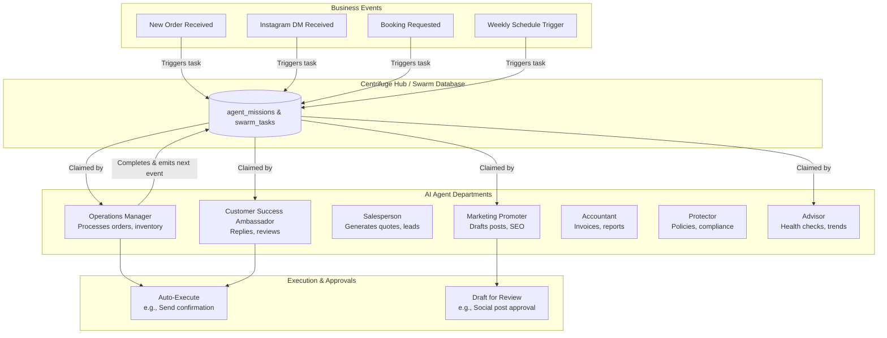

# 🔍 Scout: AI Agent Department Architecture

## Title
AI Agent Department Architecture

## Problem Statement
Small business owners (like Maya the baker, or Carlos the handyman) are overwhelmed by the operational complexity of running a business—managing orders, updating social media, following up on leads, and handling customer inquiries. They do not have the time, budget, or expertise to hire staff or configure complex automation tools. They need an invisible, zero-configuration system that acts like a real team of employees to handle these tasks automatically.

## Research Report
### Market Findings & Competitor Analysis
- **Shopify/Wix/Squarespace:** Offer limited, rigid automation (e.g., Shopify Flow) that requires manual rule configuration (If X then Y) and does not adapt to unstructured data like Instagram DMs or email inquiries.
- **GoDaddy:** Provides basic AI text generation for websites but lacks autonomous operational execution.
- **SMB AI Trends:** There is a strong demand for open, AI-native operating systems for SMBs that act autonomously rather than just as chat interfaces.
- **OHC Distinction:** OHC replaces static automation rules with autonomous "Departments" (Operations, Marketing, Sales, Customer Success, Finance, Legal, Advisory) that coordinate via a shared database swarm (e.g., `agent_missions`, `swarm_memory`). This allows a single business owner to run an enterprise-grade operation natively.

## Design Doc

### Architecture Diagram (Mermaid.js)

### Mobile UX Flow (375px First)
1. **Home Screen (The Dashboard):** Clean, Glassmorphism UI showing a "Daily Briefing" from The Advisor (e.g., "3 new orders processed, 1 draft Instagram post needs your approval").
2. **Action Required Tab:** A swipeable list of drafted actions (e.g., The Promoter drafted a post: "New vegan cakes available!"). User swipes right to approve/publish, left to edit/reject.
3. **Department Settings:** Simple toggles for each department (e.g., "Allow The Ambassador to auto-reply to FAQs", "Allow The Operations Manager to auto-refund delayed orders"). No complex prompt engineering required.
4. **Agent Activity Log:** A visually appealing feed showing what the agents did while the user was sleeping.

### AI Agent Integration Points
- **Triggering:** Departments are triggered asynchronously via PostgreSQL row-level locks on a shared `swarm_tasks` table. Triggers can be event-based (webhook from Stripe), scheduled (cron), or on-demand (user request).
- **Coordination:** Agents communicate via the OHC-SIP Teammate Mesh and emit new sub-tasks to the `swarm_tasks` table upon completing a task (e.g., Ops completes order fulfillment -> emits event -> CS agent claims task to send tracking email).
- **Memory & Context:** Agents query `autodream_memories` and user configuration using vector search (cosine similarity) to ensure responses match the brand voice and historical context.
- **Budgeting & Throttling:** Token usage and task execution frequency are tracked per tenant in the DB to enforce SaaS tier limits and prevent runaway costs.

### Key Design Decisions
- **Asynchronous Database Swarm:** We use a database-driven task queue rather than synchronous API calls between agents. This ensures durability, prevents race conditions, and allows for pausing/resuming workflows.
- **Role-Based Avatars:** Abstracting AI complexity into human-relatable roles (The Manager, The Promoter, etc.) drastically lowers the cognitive load for non-technical users.
- **Draft-for-Review Default:** High-risk actions (e.g., spending ad money, posting publicly) default to "Draft" mode requiring mobile swipe approval to build user trust.

## Implementation Prompt
**Objective:** Implement the backend database structure and the backend core orchestration loop for the AI Agent Departments based on the architecture doc.
**Acceptance Criteria:**
1. Support multi-tenant isolation for AI agent tasks.
2. Implement a unified task queue mechanism that allows different "Departments" (e.g., Operations, Marketing) to claim, process, and complete tasks asynchronously.
3. Provide a mechanism for an agent task to be flagged as "Requires Human Approval" (draft state) vs. "Auto-Executed".
4. Ensure tasks can trigger subsequent tasks (chaining) upon completion.
5. All backend operations must be covered by comprehensive unit and E2E tests, including a dummy Slint UI component to verify the End-to-End Critical User Journey (CUJ).

## Priority
P0

## Estimated Scope
Large
