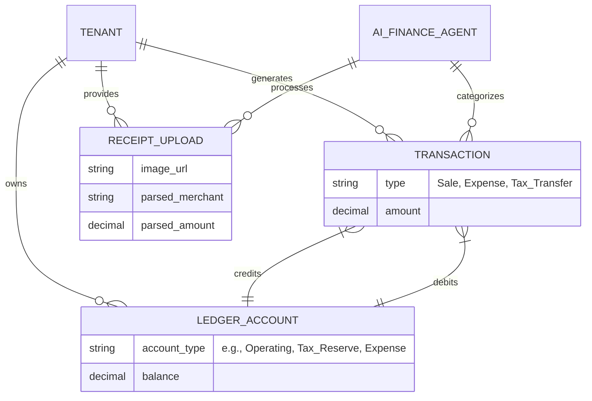
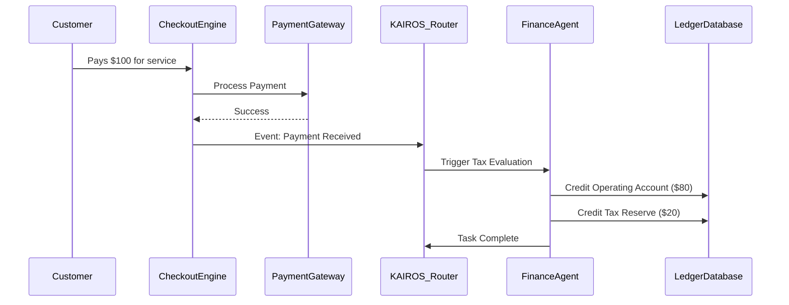

# [finance]_autonomous_micro_accounting_tax_reserve_ledger.md

## Title
Autonomous Micro-Accounting & Tax Reserve Ledger

## Problem Statement
For non-technical small business owners like Maya (the baker) and Carlos (the handyman), managing finances is often a chaotic mix of personal and business bank accounts. The biggest sources of anxiety are:
1.  **The End-of-Year Tax Surprise:** They don't know how much they owe until tax season, often resulting in massive, unexpected bills they cannot pay.
2.  **Missing Deductions:** They forget to log business expenses (like gas for deliveries or supplies bought at a local store) because tracking requires manually opening an app and categorizing receipts.
3.  **"Accounting Speak":** Tools like QuickBooks or Xero require understanding concepts like "Chart of Accounts," "Reconciliation," and "Accounts Payable"—terms that alienate the average solopreneur.

They don't want to become accountants; they just want to know how much money they *actually* made, how much they can safely spend, and that their taxes are handled.

## Research Report

### Competitive Analysis
*   **QuickBooks / Xero:** Built for accountants, not micro-businesses. High learning curve, heavy reliance on manual reconciliation, and expensive monthly tiers. They report what *has* happened, but don't actively manage the money.
*   **Shopify:** Focuses strictly on revenue (gross merchandise value). It lacks deep expense tracking and provides only rudimentary tax calculation at checkout, without setting those funds aside automatically.
*   **Wix / Squarespace:** No native bookkeeping. Relies on third-party integrations (App Fatigue) leading to fragmented financial views.
*   **OHC Autonomous Advantage:** Instead of just *reporting* taxes, OHC actively intercepts revenue, routes tax obligations to a holding ledger (or partner banking API), and uses an AI Finance Agent to auto-categorize expenses via SMS/WhatsApp photo receipts, speaking entirely in plain language.

### Data & Findings
*   Industry data shows that up to 30% of small businesses fail due to cash flow mismanagement, specifically failing to reserve for tax obligations.
*   Solopreneurs spend an average of 15 hours a month on bookkeeping tasks—time better spent serving customers or growing the business.

## Design Doc

### Key Design Decisions & Why
1.  **Invisible Tax Reserving:** For every inbound transaction, the system automatically calculates estimated tax and routes it to a "Tax Vault" ledger entry. This ensures the "Available Balance" shown to the user is *safe to spend*.
2.  **Conversational Expense Logging:** Users snap a picture of a receipt and text it to their OHC Finance Agent. The agent parses the receipt, logs the deduction, and replies: "Got it! Logged $45.20 for baking supplies." Zero form-filling.
3.  **Plain Language Profit Briefing:** Traditional Profit & Loss statements are replaced with a conversational, mobile-first weekly brief: "You brought in $800 this week and spent $150. We've set aside $160 for taxes, leaving you $490 in pure profit."

### Architecture Diagram (Mermaid.js)

### Mobile UX Flow (375px First)
1.  **Dashboard Hub:** A clean card titled "Money Safe to Spend" showing the post-tax balance. Below it, a smaller card reads "Tax Vault" with the accrued tax amount safely locked away.
2.  **Expense Capture Flow:** A floating "+" action button prioritizes "Snap Receipt." Camera opens > Photo taken > Auto-closes to dashboard with a toast notification: "Finance Agent is categorizing your receipt..."
3.  **Weekly Brief Screen:** A story-like full-screen view (similar to Instagram Stories) summarizing the week's financial health in 3 plain-English slides: Income, Expenses, and Tax Saved.

### AI Agent Integration Points
*   **Finance Department Agent:** Hooks into the global event mesh (NATS) listening for `payment.succeeded` events to perform micro-ledger splits.
*   **Operations Department Agent (OCR):** Processes incoming receipt images via webhook or unified inbox, extracting merchant, date, and amount to auto-create expense transactions.

### Security & Multi-Tenancy (Zero Trust)
*   **Strict Isolation:** Ledger entries are strictly bounded by `organization_id`. The Ledger API must enforce row-level security or explicit tenant validation on every write/read.
*   **Idempotency:** All ledger operations initiated by the Finance Agent must utilize idempotency keys to prevent double-counting during network retries.

## Implementation Prompt
**To the Implementer Swarm:**
Your objective is to build the Universal AI Financial Autopilot & Tax Ledger backend and user interface.
*   **User Outcome:** Maya should see her "Safe to Spend" balance minus automated tax withholdings. She should be able to upload a receipt image, have it parsed by the system, and see it reflected as a business expense without filling out any accounting forms.
*   **Core User Journey (CUJ):**
    1. A transaction occurs via the checkout engine.
    2. The system invisibly splits the funds into an Operating ledger and a Tax Reserve ledger based on the user's configured tax rate (default 20%).
    3. The mobile dashboard updates instantly to reflect these two distinct balances using the macOS-style Translucent Glass UI.
*   **Acceptance Criteria:**
    *   A multi-tenant ledger service is deployed that can handle atomic, double-entry transfers (Operating vs. Tax Reserve).
    *   An AI Finance Agent workflow is created that intercepts payments and automates the split.
    *   A mobile-first (375px) dashboard component displays "Safe to Spend" and "Tax Vault" balances, passing the grandmother test (Zero accounting jargon).
    *   Complete testing demonstrating ledger consistency and multi-tenant data isolation.

## Priority
**P0** (Critical for Business Viability & Trust)

## Estimated Scope
**Large** (Requires precise ledger engineering, agent workflow integration, and a new UI dashboard view)
