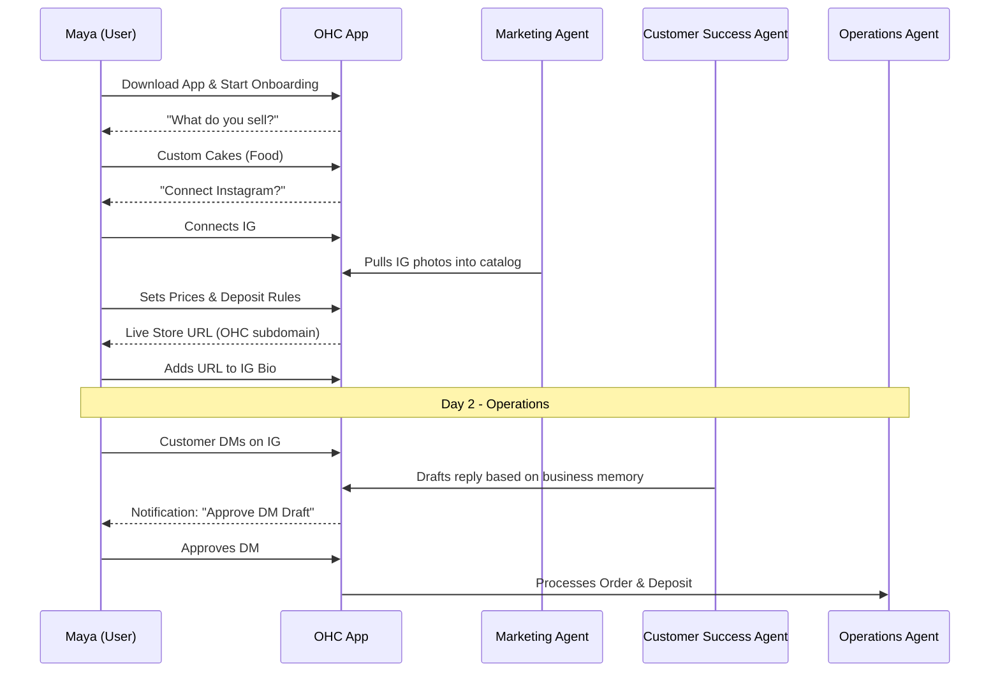
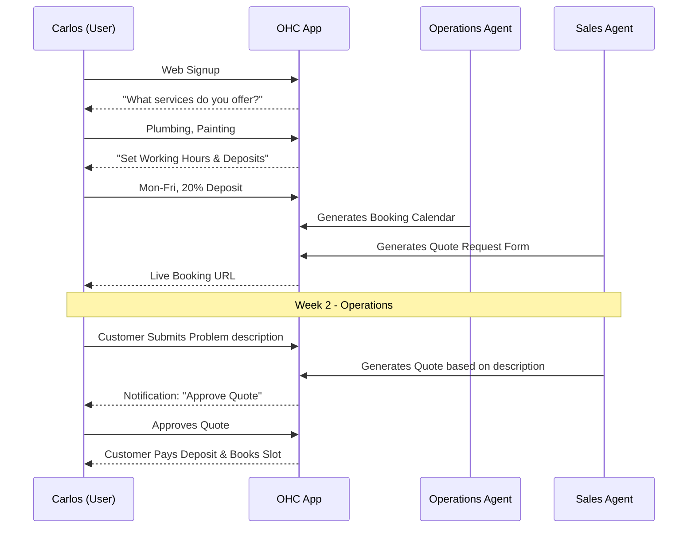
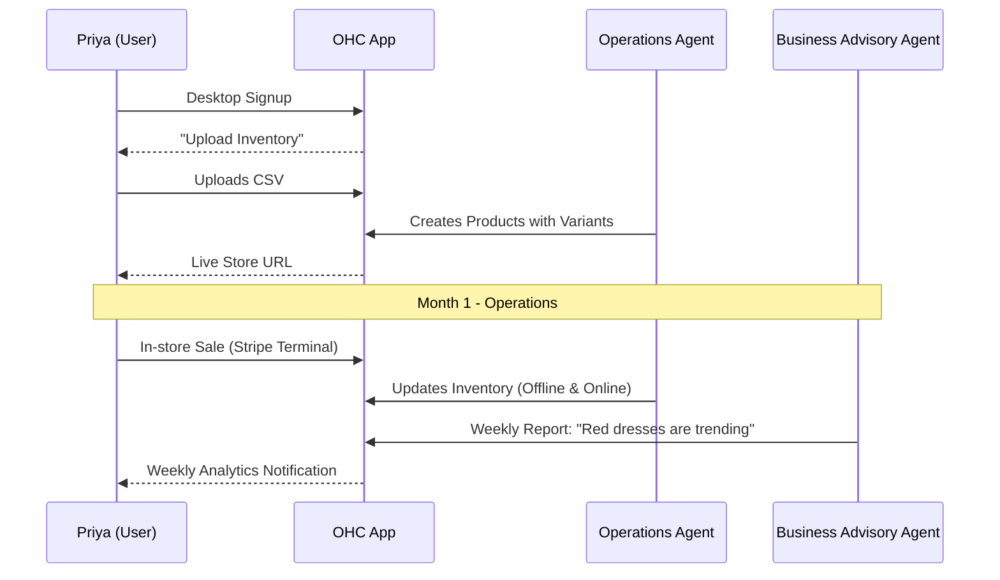
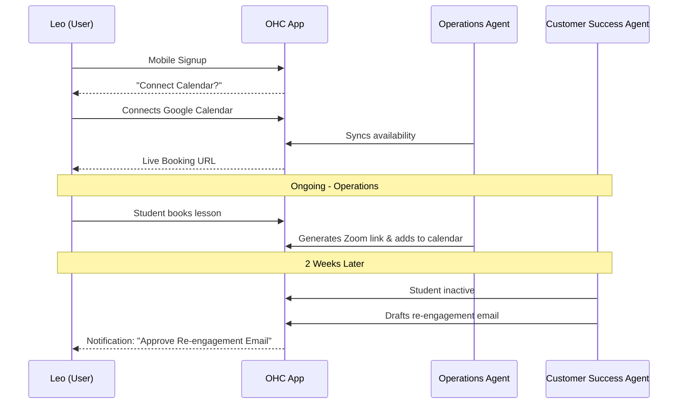
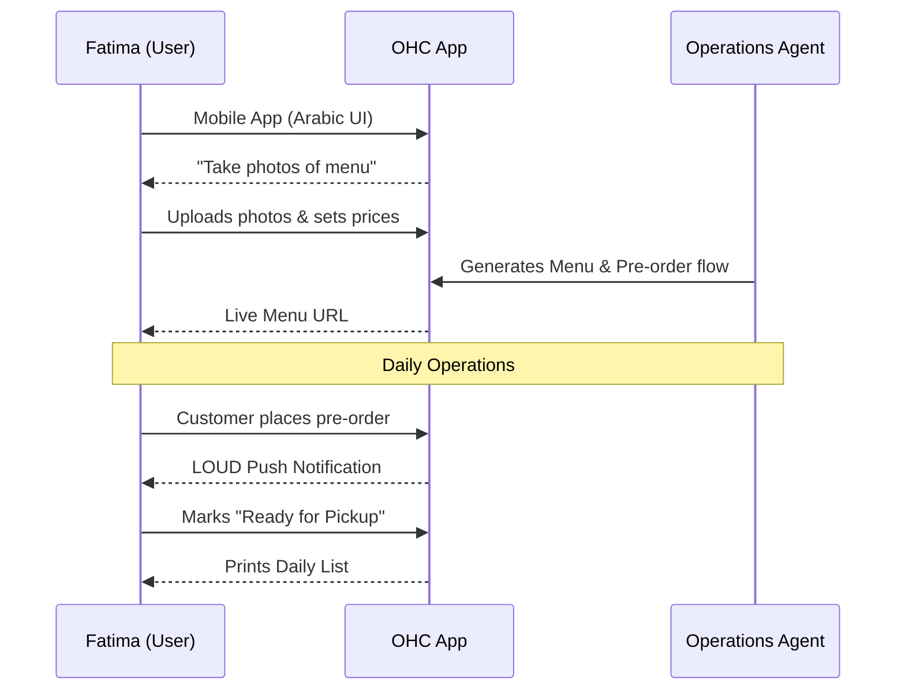

# OHC Business Journey Architecture

## Overview
This document outlines the end-to-end user journeys for the key personas utilizing the OneHumanCorp (OHC) platform. OHC's goal is to enable anyone, regardless of technical ability, to launch a fully functional business in under 10 minutes.

## Personas & Journeys

### 1. Maya (The Home Baker)
**Profile:** 28, non-technical, sells custom cakes via Instagram DMs. Relies entirely on an iPhone.
**Goal:** Automate order intake, collect deposits, and manage DMs while sleeping.

**Journey:**
1.  **Acquisition:** Discovers OHC via an Instagram ad highlighting "Turn Instagram DMs into Paid Orders." CTA: "Launch Your Store on Your Phone in 5 Mins."
2.  **Onboarding:** Downloads the OHC app. Answers simple questions: "What do you sell?" (Cakes/Food), "How do you want to get paid?" (Deposits via Stripe). Connects her Instagram account.
3.  **Activation:** The **Operations** agent sets up a basic photo catalog layout. The **Marketing** agent pulls her existing Instagram photos into the catalog. Maya sets her prices and deposit requirements. Success on Day 1 is receiving her first custom order via her new bio link.
4.  **Retention:** Push notifications alert her to new deposit payments. The **Customer Success** agent drafts replies to DMs (e.g., "Yes, we do vegan cakes! [Link to order]").
5.  **Revenue:** Starts on the Free tier. Upgrades to Starter ($9/mo) when she exceeds 10 products or wants a custom domain (e.g., `mayascakes.com`). The upgrade CTA appears when she tries to add her 11th product.
6.  **Referral:** Shares a discount code for OHC with her friend who runs a local catering business.

### 2. Carlos (The Freelance Handyman)
**Profile:** 42, non-technical, relies on word-of-mouth. Uses an Android phone.
**Goal:** Professionalize service listings, accept bookings, and manage a customer inbox.

**Journey:**
1.  **Acquisition:** Hears about OHC from a fellow contractor at Home Depot. CTA: "Get a Booking Site That Works."
2.  **Onboarding:** Web signup. Selects "Services/Bookings". Inputs his service list (Plumbing, Painting). Sets his working hours and deposit amounts.
3.  **Activation:** The **Operations** agent creates a booking calendar. The **Sales** agent sets up a quote request form. Success on Week 1 is receiving his first online booking deposit.
4.  **Retention:** Uses the mobile app (Android) daily to check his schedule and customer messages. The **Sales** agent auto-sends quotes based on customer problem descriptions.
5.  **Revenue:** Upgrades to Starter when he needs more than 100 actions per month from his AI agents.
6.  **Referral:** Word of mouth to other contractors.

### 3. Priya (The Boutique Owner)
**Profile:** 35, semi-technical. Sells in-store and wants online expansion. Uses both iPhone and MacBook.
**Goal:** Unified inventory (online/offline), point-of-sale (POS) capability, and mobile analytics.

**Journey:**
1.  **Acquisition:** Searching Google for "easy POS and online store sync."
2.  **Onboarding:** Desktop signup. Selects "Physical Products". Connects Stripe for payments.
3.  **Activation:** Uses the bulk upload feature for her inventory. The **Operations** agent sets up variant tracking (size/color). Success on Month 1 is successfully processing an in-store payment via OHC while simultaneously updating her online stock.
4.  **Retention:** Relies on the daily analytics dashboard on her mobile app. The **Business Advisory** agent sends a weekly text message summarizing sales and trending items.
5.  **Revenue:** Subscribes to the Pro tier ($29/mo) immediately for unlimited products and advanced analytics.
6.  **Referral:** Leaves a positive review on software recommendation sites.

### 4. Leo (The Music Tutor)
**Profile:** 22, non-technical. Teaches online/in-person.
**Goal:** Subscription lesson packages and automated scheduling.

**Journey:**
1.  **Acquisition:** Sees a TikTok video about "The best link-in-bio for creators."
2.  **Onboarding:** Mobile signup. Selects "Services & Subscriptions". Connects Google Calendar.
3.  **Activation:** The **Operations** agent syncs his calendar and sets up Zoom link generation. Success is his first student signing up for a monthly package.
4.  **Retention:** The **Customer Success** agent automatically emails students who miss a lesson to reschedule or those who haven't booked in 2 weeks.
5.  **Revenue:** Starts Free. Upgrades to Pro when he wants to use a custom domain.

### 5. Fatima (The Food Cart Operator)
**Profile:** 50, non-technical, limited English.
**Goal:** Simple pre-order/pickup flow.

**Journey:**
1.  **Acquisition:** Local community outreach or a flyer.
2.  **Onboarding:** Mobile app (Arabic). Selects "Food & Beverage". Takes photos of her menu items.
3.  **Activation:** The **Operations** agent creates a simple menu with pre-order capabilities. Success is her first pre-order pickup.
4.  **Retention:** Uses the daily printable order list feature on a low-end Android tablet. Relies heavily on loud push notifications for new orders.
5.  **Revenue:** Remains on the Starter tier.

