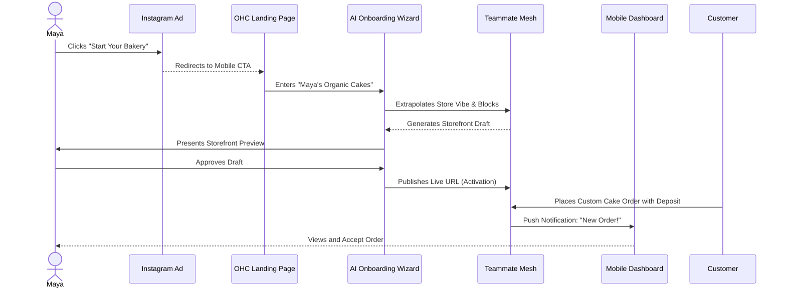
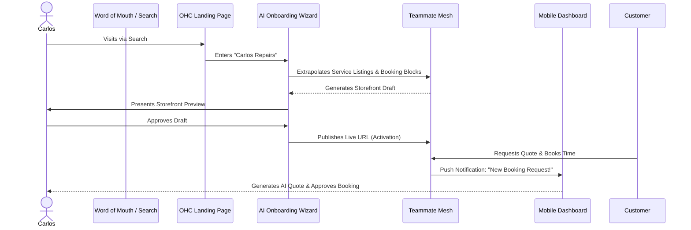
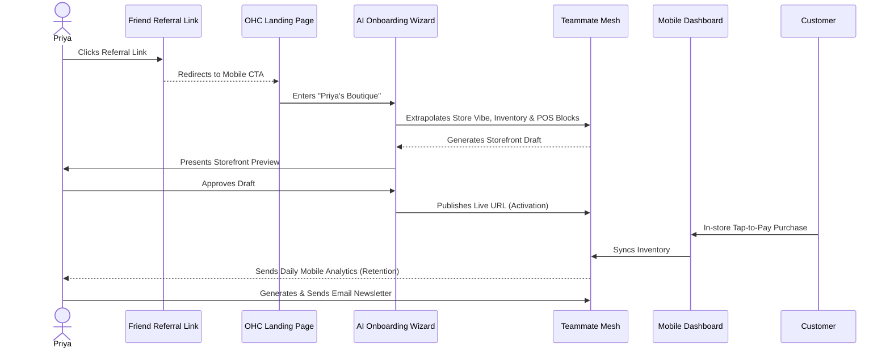
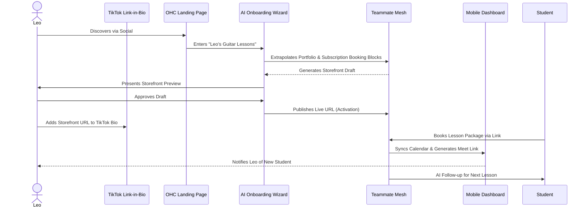
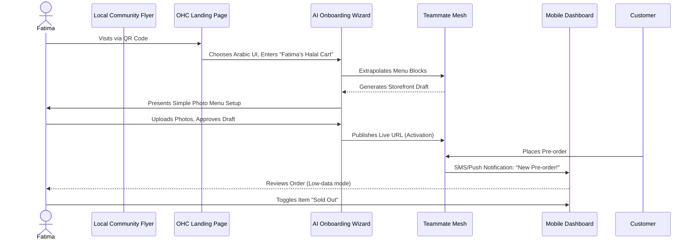

# 🔍 Scout: Business Journey Architecture

## Title
End-to-End Business Journey Mapping

## Problem Statement
The OHC platform must guide a diverse set of real-world small business owners (e.g., Maya the Baker, Carlos the Handyman, Priya the Boutique Owner, Leo the Music Tutor, and Fatima the Food Cart Operator) from zero to a live business in under 10 minutes from a mobile device without technical expertise. The current lack of a unified architectural map for the end-to-end user journeys (Acquisition, Onboarding, Activation, Retention, Revenue, and Referral) leads to fragmented user experiences and friction points where non-technical users might abandon the platform.

## Research Report
The business journey is evaluated against core personas who primarily or entirely operate their businesses from their smartphones:
*   **Maya (Home Baker, 28):** Sells custom cakes via Instagram DMs. Needs a mobile-first storefront, photo catalog, deposit-based custom orders, and an AI agent that handles direct messages while she sleeps.
*   **Carlos (Handyman, 42):** Relies on word of mouth, no website. Needs service listings with prices, a robust booking calendar with deposit payments, a unified customer inbox, and an AI quote generator.
*   **Priya (Boutique Owner, 35):** Sells clothing in-store and wants an online presence. Needs a storefront with inventory sync, product variants (size/color), in-person tap-to-pay, email newsletters, and daily mobile analytics.
*   **Leo (Music Tutor, 22):** Teaches online and in-person. Needs lesson booking with calendar sync, auto-generated meeting links, subscription lesson packages, AI follow-up for inactive students, and a portfolio page for TikTok link-in-bio.
*   **Fatima (Food Cart Operator, 50, limited English):** Takes halal food pre-orders. Needs a photo menu with sold-out toggles, pre-order/pickup with payment, phone notifications on new orders, a printable daily order list, an Arabic + English UI, and compatibility with a low-end Android phone.

The journey stages are:
1.  **Acquisition:** Maya sees an Instagram ad demonstrating a bakery site setup in 60 seconds. The landing page CTA is a simple "Start Your Bakery."
2.  **Onboarding:** A highly guided, AI-driven wizard flow minimizing initial input. The AI extrapolates a store design from a single paragraph describing the business (e.g., "Cozy, organic bakery").
3.  **Activation:** The "Aha!" moment. A live storefront generated, the first product added, or the first order/booking received. Must occur within Day 1 (ideally minute 10).
4.  **Retention:** Kept engaged through push notifications (e.g., new order alerts) and AI-generated weekly health reports.
5.  **Revenue:** Transitioning from the Free tier to a paid plan. Triggered seamlessly by reaching limits (e.g., storage or custom domain need). The upgrade CTA is presented as a business growth enabler.
6.  **Referral:** Priya shares a referral link with a fellow boutique owner, creating a viral loop with shared incentives.

**Identified Friction Points:**
*   **Cognitive Overload during Onboarding:** Requesting complex shipping rules upfront causes drop-offs.
*   **Payment Gateway Integration:** Technical jargon during Stripe connection stalls progress.
*   **Inventory/Calendar Sync:** Difficulties mapping real-world availability to digital systems.
*   **Language and Accessibility Barriers:** Interfaces assuming high technical literacy or English fluency.

## Design Doc

### Business Journey Architecture - Maya (Baker)

### Business Journey Architecture - Carlos (Handyman)

### Business Journey Architecture - Priya (Boutique Owner)

### Business Journey Architecture - Leo (Music Tutor)

### Business Journey Architecture - Fatima (Food Cart Operator)

### Key Design Decisions
*   **Grandmother Test & Mobile-First Contract:** The entire onboarding flow must be completable on a 375px wide screen with one thumb in under 10 minutes. Use large touch targets (≥ 44x44px) and clear, jargon-free language.
*   **Progressive Disclosure:** Start with simple mode (plain language) and provide an advanced mode toggle for complex configurations (e.g., raw API settings), sticky per session.
*   **Optimistic UI:** All user actions (e.g., adding a product) must update the local UI state immediately, with background sync to the Teammate Mesh to ensure a fast, "native" feel.

## Implementation Prompt
Implement a Progressive Disclosure Onboarding Wizard for the OHC mobile app. The wizard should guide a user through creating their business profile by asking for a single descriptive paragraph. Use the AI Orchestrator to generate a draft storefront based on this input. The wizard must default to a "Simple Mode" with plain language, offering an "Advanced Mode" toggle for detailed configuration. Ensure the UI updates optimistically and syncs in the background. The flow must be fully functional on a 375px wide screen with 44x44px minimum touch targets.

## Priority
P0

## Estimated Scope
Medium
